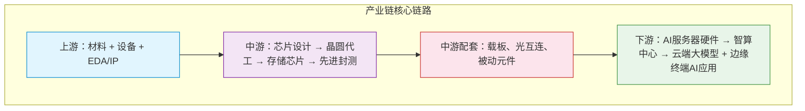

# AI半导体产业链知识库

> AI半导体全产业链（上下游完整版）—— 从原材料到终端应用的深度调研文档

本知识库系统梳理了AI半导体产业链的完整层次结构，覆盖**上游（原材料与设备）**、**中游（芯片设计、晶圆代工、存储芯片、封装测试）**、**下游（算力硬件、基础设施、终端AI、软件配套）**及**细分配套产业链**四大板块，共32个核心概念详情页。

每个概念详情包含：技术原理（Mermaid流程图）、分类与技术路线、市场格局、国内外代表企业、发展趋势及与AI产业链的关联分析。

---

## 产业链全景架构图

```mermaid
graph LR
    subgraph 上游["🔗 上游：原材料与设备"]
        direction TB
        A1["半导体原材料"]
        A2["半导体生产设备"]
        A3["配套辅料"]
        
        A1 --> A1a["硅片/SiC/GaN"]
        A1 --> A1b["光刻胶"]
        A1 --> A1c["电子特气"]
        A1 --> A1d["湿化学品"]
        A1 --> A1e["靶材"]
        A1 --> A1f["抛光材料"]
        
        A2 --> A2a["光刻设备"]
        A2 --> A2b["刻蚀设备"]
        A2 --> A2c["薄膜沉积"]
        A2 --> A2d["离子注入/清洗"]
        A2 --> A2e["CMP/量检测"]
        A2 --> A2f["封装设备"]
    end

    subgraph 中游["🏭 中游：设计+制造+封测"]
        direction TB
        B1["芯片设计"]
        B2["晶圆代工"]
        B3["存储芯片"]
        B4["封装测试"]
        
        B1 --> B1a["通用AI算力芯片"]
        B1 --> B1b["专用芯片"]
        B1 --> B1c["配套芯片"]
        B1 --> B1d["EDA与IP"]
        
        B3 --> B3a["内存 GDDR6X/HBM"]
        B3 --> B3b["闪存 NAND"]
        B3 --> B3c["新型存储"]
        
        B4 --> B4a["先进封装"]
        B4 --> B4b["常规封测"]
    end

    subgraph 下游["💻 下游：硬件+集群+应用"]
        direction TB
        C1["算力硬件产品"]
        C2["算力基础设施"]
        C3["终端AI硬件"]
        C4["软件配套"]
    end

    subgraph 细分["⚙️ 细分配套产业链"]
        direction TB
        D1["高速互连"]
        D2["基板材料"]
        D3["散热"]
        D4["被动元器件"]
        D5["洁净工程"]
    end

    上游 -->|材料+设备供应| 中游
    中游 -->|芯片成品| 下游
    细分 -.->|贯穿全链配套| 上游
    细分 -.->|贯穿全链配套| 中游
    细分 -.->|贯穿全链配套| 下游

    style 上游 fill:#e1f5fe,stroke:#0288d1
    style 中游 fill:#f3e5f5,stroke:#7b1fa2
    style 下游 fill:#e8f5e9,stroke:#388e3c
    style 细分 fill:#fff3e0,stroke:#f57c00
```

---

## 📋 目录导航

### 一、上游：原材料与设备（卡脖子核心环节）

#### 1. 半导体原材料

| 概念 | 说明 | 详情链接 |
|------|------|---------|
| 硅片 | 12英寸大硅片、碳化硅SiC、氮化镓GaN（第三代半导体） | [📄 查看详情](上游/原材料/硅片.md) |
| 光刻胶 | EUV/ArF高端光刻胶、配套显影液 | [📄 查看详情](上游/原材料/光刻胶.md) |
| 电子特气 | 氟化氢、氨气、刻蚀气体、高纯气源 | [📄 查看详情](上游/原材料/电子特气.md) |
| 湿化学品 | 超高纯硫酸、双氧水、剥离液 | [📄 查看详情](上游/原材料/湿化学品.md) |
| 靶材 | 铜、铝、钛高纯金属靶材 | [📄 查看详情](上游/原材料/靶材.md) |
| 抛光材料 | CMP研磨液、抛光垫 | [📄 查看详情](上游/原材料/抛光材料.md) |

#### 2. 半导体生产设备（晶圆制造设备）

| 概念 | 说明 | 详情链接 |
|------|------|---------|
| 光刻设备 | EUV光刻机、ArF浸没式光刻机 | [📄 查看详情](上游/设备/光刻设备.md) |
| 刻蚀设备 | 干法刻蚀、等离子刻蚀（AI芯片用量最大） | [📄 查看详情](上游/设备/刻蚀设备.md) |
| 薄膜沉积设备 | PVD、CVD、ALD设备 | [📄 查看详情](上游/设备/薄膜沉积设备.md) |
| 离子注入与清洗设备 | 离子注入机、清洗设备、氧化扩散炉 | [📄 查看详情](上游/设备/离子注入与清洗设备.md) |
| CMP与量检测设备 | CMP抛光设备、量检测试设备 | [📄 查看详情](上游/设备/CMP与量检测设备.md) |
| 封装设备 | 划片、键合、塑封、探针台 | [📄 查看详情](上游/设备/封装设备.md) |

#### 3. 配套辅料

| 概念 | 说明 | 详情链接 |
|------|------|---------|
| 配套辅料 | 真空零部件、射频电源、精密阀门、陶瓷零部件、洁净室耗材 | [📄 查看详情](上游/配套辅料.md) |

---

### 二、中游：晶圆制造+芯片设计+封测（AI芯片核心制造环节）

#### （一）芯片设计（AI算力核心）

| 概念 | 说明 | 详情链接 |
|------|------|---------|
| 通用AI算力芯片 | GPU、AI加速卡、TPU、NPU、GPGPU | [📄 查看详情](中游/芯片设计/通用AI算力芯片.md) |
| 专用芯片 | FPGA可编程芯片、ASIC定制大模型芯片、存算一体芯片 | [📄 查看详情](中游/芯片设计/专用芯片.md) |
| 配套芯片 | CPU（主控）、高速接口芯片、电源管理PMIC、SerDes | [📄 查看详情](中游/芯片设计/配套芯片.md) |
| 设计工具EDA与IP | EDA设计软件、IP核（高速接口IP、内存IP、PCIe IP） | [📄 查看详情](中游/芯片设计/设计工具EDA与IP.md) |

#### （二）晶圆代工（Foundry）

| 概念 | 说明 | 详情链接 |
|------|------|---------|
| 晶圆代工 | 先进制程(3nm/2nm/1.4nm)、成熟制程(7nm/14nm/28nm)、特色工艺 | [📄 查看详情](中游/晶圆代工.md) |

#### （三）存储芯片（AI产业链刚需）

| 概念 | 说明 | 详情链接 |
|------|------|---------|
| 内存 | GDDR6X、HBM高带宽内存（GPU标配） | [📄 查看详情](中游/存储芯片/内存.md) |
| 闪存 | SSD NAND Flash | [📄 查看详情](中游/存储芯片/闪存.md) |
| 新型存储 | MRAM、存算一体存储 | [📄 查看详情](中游/存储芯片/新型存储.md) |

#### （四）封装测试

| 概念 | 说明 | 详情链接 |
|------|------|---------|
| 先进封装 | 2.5D封装、3D堆叠、Chiplet芯粒封装、FCBGA倒装封装 | [📄 查看详情](中游/封装测试/先进封装.md) |
| 常规封测 | 常规封测+老化测试、可靠性测试、探针测试 | [📄 查看详情](中游/封装测试/常规封测.md) |

---

### 三、下游：硬件整机+AI算力集群+应用端

| 概念 | 说明 | 详情链接 |
|------|------|---------|
| 算力硬件产品 | AI服务器、训练/推理服务器、加速卡、光模块、液冷散热 | [📄 查看详情](下游/算力硬件产品.md) |
| 算力基础设施 | IDC数据中心、智算中心、超算中心及配套 | [📄 查看详情](下游/算力基础设施.md) |
| 终端AI硬件 | 云端大模型集群、边缘AI芯片、终端手机/PC/座舱AI芯片 | [📄 查看详情](下游/终端AI硬件.md) |
| 软件配套 | 驱动固件、编译框架、算力调度软件、芯片测试程序 | [📄 查看详情](下游/软件配套.md) |

---

### 四、细分配套产业链（容易被忽略的关键环节）

| 概念 | 说明 | 详情链接 |
|------|------|---------|
| 高速互连 | 光芯片、光模块、Co-packaged共封装光学器件 | [📄 查看详情](细分配套/高速互连.md) |
| 基板材料 | FCBGA载板、ABF树脂基板（大芯片刚需） | [📄 查看详情](细分配套/基板材料.md) |
| 散热 | 均热板、水冷板、导热材料、液冷设备 | [📄 查看详情](细分配套/散热.md) |
| 被动元器件 | 高端电容、电阻、高频电感 | [📄 查看详情](细分配套/被动元器件.md) |
| 洁净工程 | 半导体洁净厂房、中央空调、废气废水处理 | [📄 查看详情](细分配套/洁净工程.md) |

---

## 精简分层总结构

---

## 📖 使用说明

1. **浏览方式**：点击上方目录表格中的"📄 查看详情"链接，可跳转到对应概念的详情页
2. **返回导航**：每个详情页底部均有 `[← 返回总目录]` 链接，可返回本页
3. **图表查看**：所有 Mermaid 图表支持在 GitHub、VS Code、GitLab 等平台直接渲染预览
4. **内容结构**：每个详情页统一包含：概述 → 技术原理 → 分类与技术路线 → 市场格局 → 代表企业 → 发展趋势 → 产业链关联

---

## 📊 2025年AI半导体市场数据速览

| 细分领域 | 2024年规模 | 2025年规模 | 同比增长 | 2027E预测 | 关键驱动 |
|---------|-----------|-----------|---------|----------|---------|
| AI芯片 | ~1000亿美元 | ~2032亿美元 | +103% | ~2720亿美元 | AI大模型训练/推理需求爆发 |
| 半导体设备 | ~1130亿美元 | ~1255亿美元 | +11% | ~1546亿美元 | 先进制程扩产+AI芯片产能 |
| 先进封装 | ~513亿美元 | ~556亿美元 | +8.3% | ~652亿美元 | HBM/Chiplet/CoWoS需求 |
| 晶圆代工 | ~1350亿美元 | ~1500-1600亿美元 | +11-19% | ~2000亿美元 | AI芯片产能扩张 |
| HBM内存 | — | ~300-350亿美元 | — | — | AI GPU标配，需求爆发 |
| AI服务器 | ~1280亿美元 | ~1672亿美元 | +31% | ~3160亿美元 | AI数据中心扩容 |

> 数据来源：MarketsandMarkets、SEMI、TrendForce、USDAnalytics等（2025-2026年）

---

> 📅 文档创建时间：2026年7月  
> 📝 数据来源：公开行业报告、企业财报、证券研究等  
> ⚠️ 市场数据具有时效性，请以最新公开信息为准
