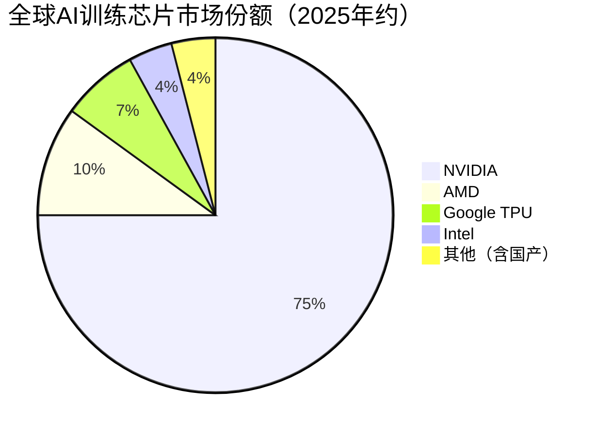
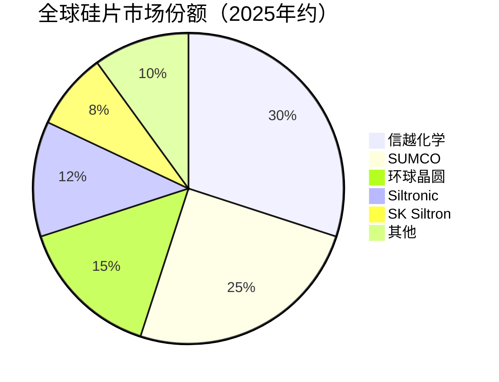
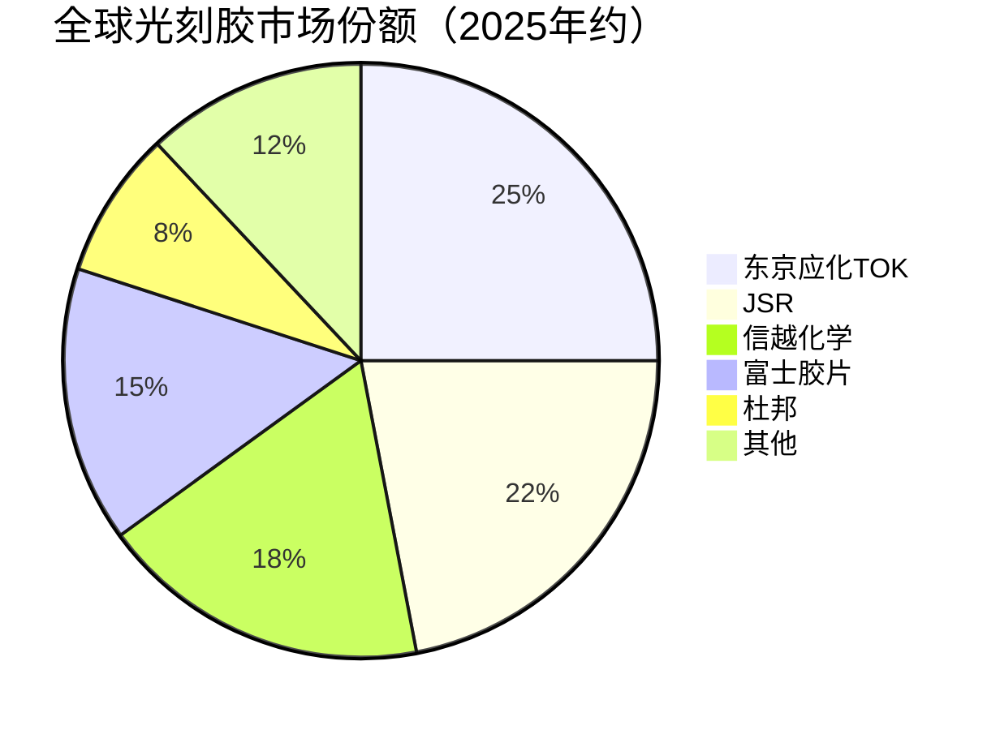
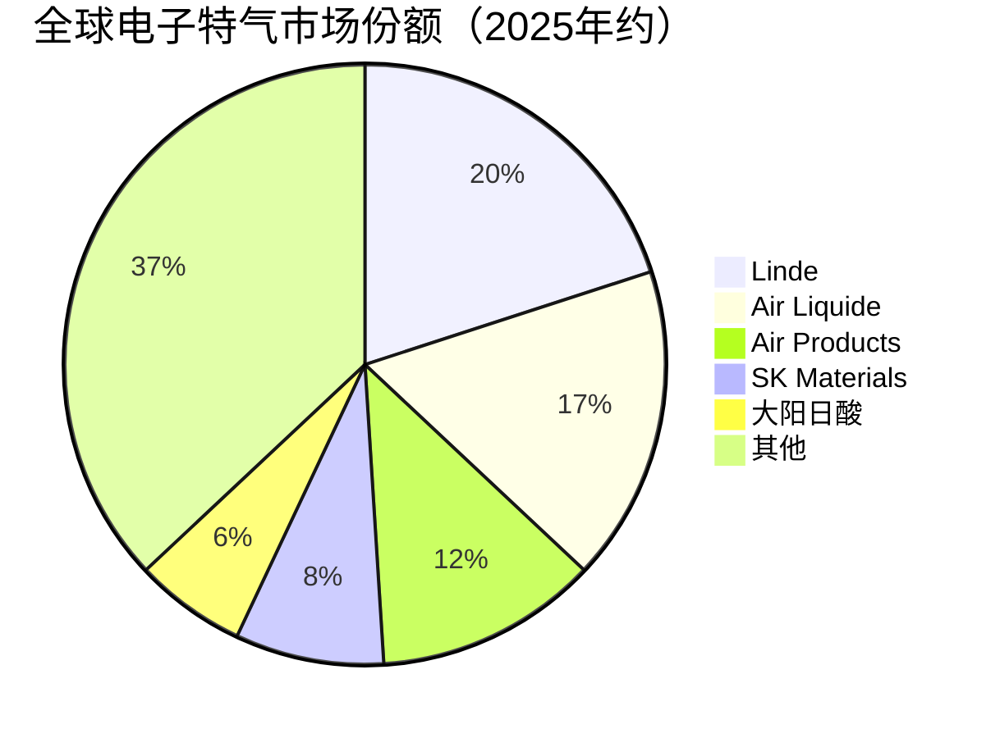
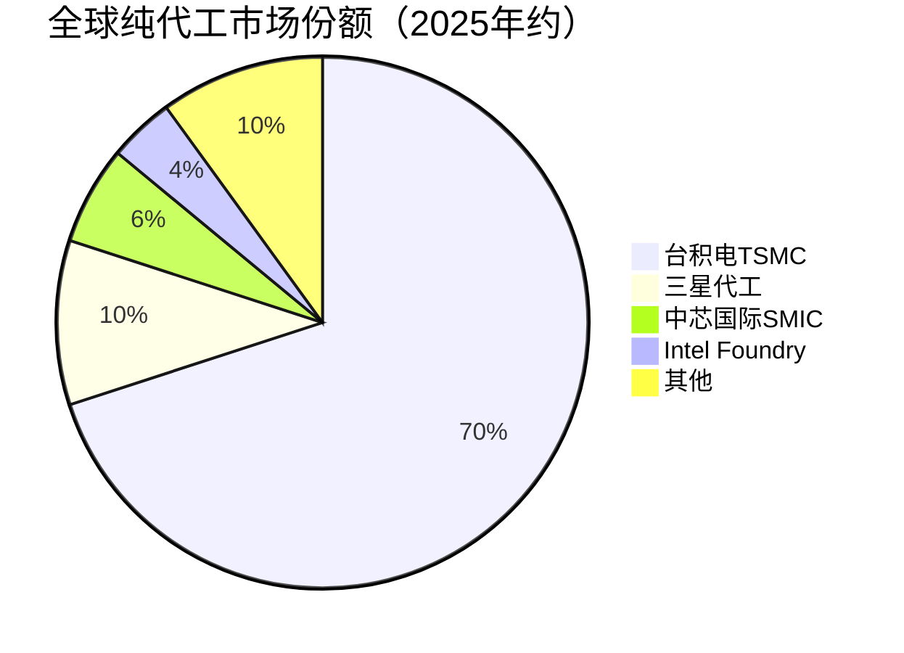

# AI产业链2025年市场数据参考

> 本文件汇总AI半导体产业链各细分领域2025年最新市场数据，供更新各详情页时引用。
> 数据来源：MarketsandMarkets、TrendForce、SEMI、Statista、各公司财报等公开信息（2025-2026年）

---

## 一、AI芯片（通用AI算力芯片）

### 市场规模
- **2025全球AI芯片市场**：约2032亿美元（MarketsandMarkets），CAGR 15.7%至2032年5648.7亿美元
- **2024基准**：约1000亿美元
- **2026E**：约2350亿美元（+15.7%）
- **2027E**：约2720亿美元（+15.7%）
- GPU占AI芯片市场约46-60%份额

### 公司份额（2025）

### 代表企业营收（2025自然年/FY2025）
| 企业 | 2025营收 | 关键产品 | 市场地位 |
|------|---------|---------|---------|
| NVIDIA | ~2159亿美元（FY2025为1305亿，+114%） | Blackwell B200/B300、Rubin | AI训练芯片绝对领导者，份额70-80% |
| AMD | ~346亿美元 | Instinct MI300X/MI350 | 全球第二大AI GPU供应商 |
| Google | —（内部部署） | TPU v5/v6 | 专用AI芯片先驱 |
| Intel | — | Gaudi 2/3 | 传统巨头转型AI |

### 关键趋势
- Blackwell架构2025年占NVIDIA高端GPU出货80%+，已开始交付Rubin架构
- Hopper向Blackwell跨越，B200/B300成主力
- Chiplet架构成为主流（B200双芯片、MI300X多芯粒）
- FP4/FP8超低精度计算普及
- 推理算力需求开始超越训练

---

## 二、半导体设备（整体）

### 市场规模
- **2025全球半导体设备市场**：约1255亿美元（SEMI），另有预测1663.5亿美元（MarketsandMarkets）
- **2024基准**：约1130亿美元
- **2026E**：约1393亿美元（+11%）
- **2027E**：约1546亿美元（+11%）
- CAGR 11%至2032年3443.6亿美元

### 设备厂商Top5营收（2025）
| 排名 | 企业 | 2025营收 | 国家 |
|------|------|---------|------|
| 1 | ASML | ~372亿美元 | 荷兰 |
| 2 | 应用材料(AMAT) | ~270亿美元 | 美国 |
| 3 | 泛林半导体(Lam) | ~150亿美元 | 美国 |
| 4 | 东京电子(TEL) | ~140亿美元 | 日本 |
| 5 | 科磊(KLA) | ~110亿美元 | 美国 |

- 前五合计占前端设备收入显著份额
- 中国设备国产化率从11.3%升至25%

### 光刻设备
- ASML 2025年EUV光刻机需求旺盛，High-NA EUV开始交付
- ASML份额：光刻设备领域~90%（EUV 100%）
- 2025 ASML营收约372亿美元

### 刻蚀设备
- 泛林+东京电子+应用材料垄断80%+
- 泛林#1，东京电子#2，应用材料#3
- 3D NAND堆叠层数增加推动刻蚀设备需求

### 薄膜沉积设备
- 应用材料#1，泛林#2，东京电子#3
- ALD设备需求随先进制程增长

### CMP与量检测设备
- 应用材料#1（CMP），科磊#1（量检测）
- CMP抛光设备+量检测设备市场随先进制程扩容

### 封装设备
- ASM Pacific、Besi、K&S等
- 先进封装设备需求随HBM/Chiplet爆发

---

## 三、半导体原材料

### 硅片
- **2025全球半导体硅片市场**：约146-160亿美元
- **2024基准**：约145亿美元
- **2026E**：约158亿美元（+8.3%）
- **2027E**：约171亿美元（+8.3%）
- CAGR 8.3%至2032年263.8亿美元
- 12英寸（300mm）占比75%+，出货面积70%+
- 前五：信越化学、SUMCO、环球晶圆、Siltronic、SK Siltron，合计90%+
- 日本信越化学~30%、SUMCO~25%

### 光刻胶
- **2025全球光刻胶市场**：约66.7亿美元
- **2024基准**：约62亿美元
- **2026E**：约71.2亿美元（+6.7%）
- **2027E**：约76亿美元（+6.7%）
- CAGR至2034年102亿美元
- 日本企业合计91%份额，EUV光刻胶日本100%
- 核心厂商：东京应化TOK、JSR、信越化学、富士胶片、杜邦

### 电子特气
- **2025全球电子特气市场**：约63-64亿美元（半导体占70%+）
- **2024基准**：约58亿美元
- **2026E**：约68亿美元（+7.6%）
- **2027E**：约73亿美元（+7.6%）
- CAGR 7.63%至2034年
- 前五垄断62%+：Linde、Air Liquide、Air Products、SK Materials、大阳日酸

### 湿化学品
- **2025半导体湿化学品市场**：前五占60%+，Entegris、BASF、Avantor、Honeywell
- **2025半导体化学品整体市场**：约161.9亿美元，CAGR 12.6%至2030年292.5亿美元
- **2024基准**：约144亿美元
- **2026E**：约182亿美元（+12.6%）
- **2027E**：约205亿美元（+12.6%）

### 靶材
- **2025全球溅射靶材市场**：约41.2-44.8亿美元
- **2024基准**：约44.2亿美元
- **2026E**：约47亿美元（+5.6%）
- **2027E**：约50亿美元（+5.6%）
- CAGR 5.63%至2032年60.4亿美元
- JX Advanced Metals（日本，IPO后强化领导地位）、Honeywell(已更名Solstice Advanced Materials)、KFMI(有研)

### 抛光材料（CMP）
- **2025 CMP抛光液+抛光垫市场**：约35亿美元
- **2024基准**：约32.7亿美元
- **2026E**：约38亿美元（+8.6%）
- **2027E**：约41亿美元（+8.6%）
- 预计2031年58.7亿美元
- 抛光液：CMC、Ferro、DuPont、Entegris；抛光垫：陶氏为主

---

## 四、晶圆代工

### 市场规模
- **2025Q2全球晶圆代工收入**：417亿美元（记录新高，+14.6% QoQ）
- **2025全年全球纯代工市场**：约1500-1600亿美元
- **2024基准**：约1350亿美元
- **2026E**：约1800亿美元（+15%）
- **2027E**：约2000亿美元（+11%）

### 公司份额（2025）

- TSMC 2025Q2收入302.4亿美元（+18.5% QoQ），份额创纪录70.2%
- TSMC先进制程（N3/N4）需求旺盛，AI芯片为主要驱动力
- 2030年TSMC预计60-65%份额，sub-2nm可升至70%
- 3nm/2nm制程量产，1.4nm开发中

---

## 五、先进封装

### 市场规模
- **2025全球先进封装市场**：约556亿美元（USDAnalytics），CAGR 8.3%至2034年1140亿美元
- **2024基准**：约513亿美元
- **2026E**：约602亿美元（+8.3%）
- **2027E**：约652亿美元（+8.3%）
- 另有预测2025年48亿美元（SNS），CAGR 8.31%至2035年1067亿美元

### CoWoS封装
- **2025 CoWoS市场**：38亿美元，CAGR 19.4%至2034年189亿美元
- TSMC CoWoS产能翻倍但仍供不应求，2025年订单满载
- AI GPU需求驱动CoWoS产能扩张

### 封装平台份额
- flip-chip（倒装）占先进封装41.37%
- 面板级封装增长最快

### 常规封测
- 2025全球封测市场：随AI芯片量产持续增长
- 日月光、安靠、长电科技等领先

---

## 六、EDA与IP

### 市场规模
- **2025全球EDA市场**：约213.6亿美元，CAGR 9.36%
- **2024基准**：约195亿美元
- **2026E**：约234亿美元（+9.4%）
- **2027E**：约256亿美元（+9.4%）

### 代表企业营收
| 企业 | 2025营收 | 地位 |
|------|---------|------|
| Synopsys | 70.54亿美元（+15.1%） | EDA全球#1 |
| Cadence | ~52亿美元（+13.5%） | EDA全球#2 |
| Siemens EDA | — | EDA全球#3 |
| Arm | — | IP核龙头 |

- EDA三巨头：Synopsys、Cadence、Siemens EDA
- IP核：Arm垄断移动端，Synopsys IP收入17亿美元，Cadence IP 7亿美元+
- 2025Q3 EDA各领域：CAE 20.98亿美元（+9.1%）、SIP 19.16亿美元

---

## 七、存储芯片（AI产业链相关）

### 内存（HBM/GDDR）
- **2025全球DRAM市场**：约1290亿美元
- **2025 HBM市场**：约300-350亿美元，占DRAM市场25%+
- HBM份额：SK海力士~62%、美光第二（首超三星）、三星~20-30%
- GDDR7开始配套新一代AI推理GPU
- HBM3E主力供应，HBM4开发中

### 闪存（NAND/SSD）
- **2025全球NAND市场**：约650-925亿美元
- NAND份额：三星27.0%、SK海力士22.1%、铠侠~14-15%、长江存储9%→13%
- 企业级SSD：QLC放量，AI推理大容量需求

### 新型存储
- **2025全球新兴存储市场**：约94亿美元，CAGR 18.6%
- MRAM、PCM、ReRAM等，存算一体基础技术

---

## 八、下游算力硬件与基础设施

### AI服务器
- **2025全球AI服务器市场**：约1672亿美元（GMI），另有预测2450亿美元（ABI）
- **2024基准**：约1280亿美元
- **2026E**：约2300亿美元（+37.5%）
- **2027E**：约3160亿美元（+37.5%）
- CAGR 37.5%至2032年1.6万亿美元
- 厂商：Dell、HPE、Inspur、Lenovo、Supermicro领先
- Dell AI服务器营收增757%，HPE增30%+

### 算力基础设施（IDC/智算中心）
- **2025全球数据中心市场**：约2500-3000亿美元
- AI数据中心投资爆发，超大规模数据中心扩容
- 电力供应成为瓶颈

### 终端AI硬件
- AI PC、AI手机、智能座舱AI芯片
- 2025全球AI PC出货占比快速提升
- 端侧NPU渗透率提升

### 软件配套
- CUDA生态主导，ROCm/oneAPI追赶
- 国产软件栈：CANN、Neuware等
- 算力调度与编排软件需求增长

---

## 九、细分配套产业链

### 高速互连（光模块）
- **2025全球光收发器市场**：约134亿美元，CAGR 13.5%至2035年481亿美元
- **2024基准**：约118亿美元
- **2026E**：约152亿美元（+13.5%）
- **2027E**：约172亿美元（+13.5%）
- 800G光模块2025年需求1800万支，出货同比翻倍
- 1.6T光模块2025年出货约270万支，量产元年
- 中国企业掌握800G至1.6T光模块全球23.4%份额

### 基板材料（ABF载板）
- **2025 ABF载板市场**：约48.9-58亿美元
- **2024基准**：约48.9亿美元
- **2026E**：约54.2亿美元（+10.9%）
- **2027E**：约60.1亿美元（+10.9%）
- CAGR至2033年95.5亿美元
- 味之素垄断ABF膜95%
- AI芯片封装推动ABF载板需求

### 散热（液冷）
- **2025数据中心液冷市场**：约49-55亿美元
- **2024基准**：约41亿美元
- **2026E**：约58.5亿美元（+19.5%）
- **2027E**：约70亿美元（+19.5%）
- CAGR 19.5-20.5%至2032年170亿美元
- 直接触芯片液冷(D2C)占42.85%，浸没式液冷增长最快
- AI服务器功耗飙升推动散热需求

### 被动元器件
- MLCC、电感、电阻
- AI服务器被动元器件用量大幅增加
- 村田、TDK、太阳诱电等领先

### 洁净工程
- 半导体洁净厂房建设
- 随晶圆厂扩产需求增长
- 中国晶圆厂建设带动洁净工程市场

---

## 十、配套辅料

- 真空零部件、射频电源、精密阀门、陶瓷零部件、洁净室耗材
- 2025随半导体设备市场扩容而增长
- 日本企业主导真空零部件和精密阀门

---

## 数据使用说明
1. 各详情页更新时，从对应细分领域取数据
2. 市场规模预测表格格式：2024基准 / 2025实际 / 2026E / 2027E
3. 份额饼图更新为2025年最新数据
4. 企业营收表格更新为2025年最新数据
5. AI基建拉动分析补充2025年量化数据
6. 如某细分领域无直接数据，用相关上下游数据合理推断并标注"约"
