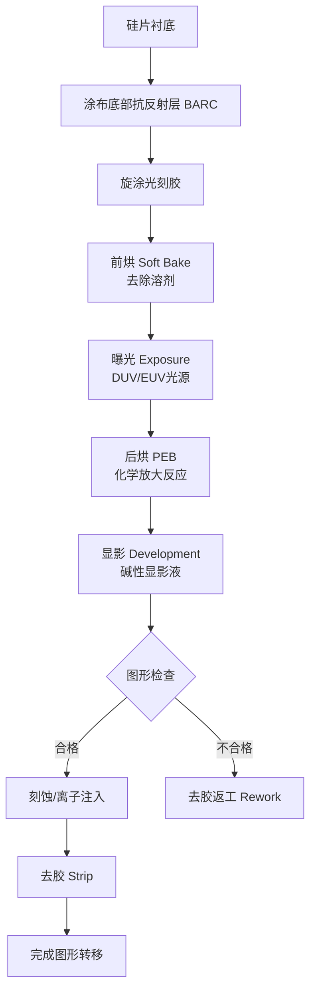
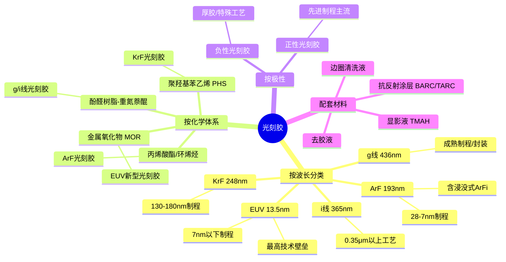
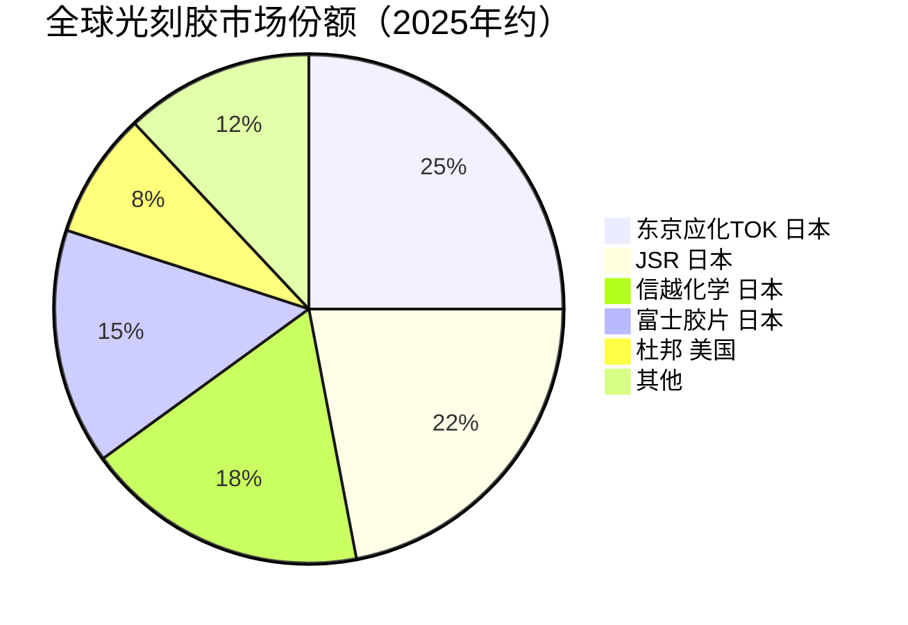

# 光刻胶

> 半导体光刻工艺中的核心感光材料，决定芯片图形转移的精度与分辨率。

## 概述

光刻胶（Photoresist）又称光致抗蚀剂，是半导体制造中用于图形转移的关键高分子材料。在光刻工艺中，光刻胶涂布在硅片表面，通过紫外光（DUV）、深紫外光（EUV）或电子束曝光后发生化学反应，经显影液处理后形成微纳图形，再经刻蚀或离子注入将图形转移到衬底上。光刻胶的性能直接决定了芯片的最小特征尺寸（CD）、线宽均匀性和图形良率，是半导体材料中技术壁垒最高、国产化率最低的领域之一。

在AI产业链中，光刻技术是芯片制程微缩的核心瓶颈。AI大模型的训练和推理需要超高算力，而算力的增长依赖于芯片晶体管密度的持续提升。从7nm到3nm再到2nm制程，每一代技术节点都需要更先进的光刻胶材料。特别是EUV光刻胶，作为3nm及以下制程的必需材料，其研发难度极高，全球仅有少数企业能够供应。光刻胶被业界称为"半导体材料皇冠上的明珠"，其配方设计涉及高分子化学、光化学、界面科学等多学科交叉。

光刻胶配套材料同样至关重要，包括显影液（Developer）、抗反射涂层（BARC/TARC）、底部抗反射层、边圈清洗液等，这些材料与光刻胶共同构成完整的光刻材料体系，缺一不可。

## 技术原理

光刻胶的基本组成包括聚合物树脂（Resin）、光活性化合物（PAC或PAG）、溶剂和各种添加剂。其工作原理基于光化学反应：当特定波长的光照射光刻胶后，光活性化合物发生光解或光致产酸反应，改变光刻胶在显影液中的溶解度，从而形成正性或负性图形。

**正性光刻胶（Positive Resist）**：曝光区域的光活性化合物（PAC）分解为茚酮酸，使该区域光刻胶在碱性显影液中可溶，形成与掩膜版相同的图形。正性光刻胶是先进制程的主流选择。

**负性光刻胶（Negative Resist）**：曝光区域发生交联反应，变为不溶性，形成与掩膜版相反的图形。负性光刻胶分辨率相对较低，但在厚胶工艺中有优势。

**化学放大光刻胶（CAR）**：针对DUV（248nm KrF、193nm ArF）和EUV（13.5nm）波长开发。光致产酸剂（PAG）在曝光时产生酸，在后烘（PEB）过程中酸作为催化剂引发聚合物去保护反应，一个酸分子可催化数百个反应，实现"化学放大"，大幅降低曝光剂量需求。CAR是目前先进制程的主流技术。

**EUV光刻胶的挑战**：13.5nm EUV光子能量高达92eV，远高于DUV，导致光刻胶发生严重的化学反应和物理损伤。传统CAR在EUV下面临分辨率-线边缘粗糙度-灵敏度（RLS trade-off）的矛盾。新一代EUV光刻胶技术包括：金属氧化物光刻胶（MOR，如Inpria的HfO₂基光刻胶）、干法光刻胶（Dry Resist，如IMEC的方案）、以及纳米颗粒光刻胶，这些新型材料在分辨率和图案质量上优于传统CAR。

## 分类与技术路线

光刻胶按光源波长可分为多个技术代际，每一代对应不同的制程节点：

- **g线/i线光刻胶（436nm/365nm）**：宽谱紫外光刻胶，适用于14μm以上工艺，主要用于成熟制程、封装和PCB领域。
- **KrF光刻胶（248nm）**：深紫外光刻胶，用于130nm-180nm制程。
- **ArF光刻胶（193nm）**：深紫外光刻胶，配合浸没式技术（ArFi）用于28nm-7nm制程，是目前出货量最大的高端光刻胶。
- **EUV光刻胶（13.5nm）**：极紫外光刻胶，用于7nm以下制程（3nm/2nm），是光刻胶技术的最高壁垒。

按化学体系可分为：酚醛树脂-重氮萘醌体系（g/i线）、聚羟基苯乙烯体系（KrF）、丙烯酸酯/环烯烃体系（ArF）、金属氧化物体系（EUV新型）等。

## 市场格局

全球半导体光刻胶市场规模约66.7亿美元（2025年），其中日本企业占据绝对主导地位。东京应化（TOK）、JSR、信越化学、富士胶片四家日本企业合计占据全球约80%的高端光刻胶市场份额，日本企业整体合计份额约91%。在EUV光刻胶领域，日本企业份额达100%，TOK和Inpria（已被JSR收购）是主要供应商，竞争格局更加集中。CAGR预计至2034年达102亿美元。

ArF浸没式光刻胶市场中，JSR、TOK、信越化学和住友化学占据约90%份额。KrF光刻胶市场同样由日企主导，但中国企业在KrF领域已实现部分突破。g/i线光刻胶国产化率相对较高，国内企业如北京科华、徐州博康、南大光电等已有成熟产品。

光刻胶的供应链安全是各国关注焦点。日本曾在2019年对韩国限制出口三种半导体材料（含光刻胶），暴露了供应链的脆弱性。美国、韩国和中国均在加速光刻胶国产化。中国将光刻胶列为"卡脖子"关键材料，在政策扶持下，国内企业在ArF光刻胶研发上取得显著进展，但EUV光刻胶仍处于早期阶段。

## 代表企业

| 企业 | 国家/地区 | 主要产品/技术 | 市场地位 |
|------|----------|-------------|---------|
| JSR Corporation | 日本 | ArF/KrF/EUV光刻胶、金属氧化物EUV光刻胶 | 全球最大光刻胶供应商之一 |
| 东京应化 TOK | 日本 | EUV光刻胶、ArF光刻胶、电子束光刻胶 | EUV光刻胶技术领先者 |
| 信越化学 Shin-Etsu | 日本 | ArF/KrF光刻胶、封装光刻胶 | 光刻胶+硅片双龙头 |
| 住友化学 Sumitomo | 日本 | ArF光刻胶、彩色光刻胶 | 面板与半导体光刻胶并重 |
| Dupont（杜邦） | 美国 | ArF/KrF光刻胶、封装光刻胶 | 全球主要光刻胶供应商之一 |
| Inpria | 美国（被JSR收购） | 金属氧化物EUV光刻胶 | EUV新型光刻胶先驱 |
| 北京科华 | 中国 | KrF/ArF光刻胶、面板光刻胶 | 国内光刻胶龙头 |
| 徐州博康 | 中国 | ArF光刻胶、KrF光刻胶 | 国产ArF光刻胶领先企业 |
| 南大光电 | 中国 | ArF光刻胶、前驱体材料 | 国内首家ArF光刻胶量产企业 |
| 上海新阳 | 中国 | ArF光刻胶、配套化学品 | 光刻胶+电镀液协同布局 |
| 容大感光 | 中国 | g/i线光刻胶、PCB光刻胶 | PCB光刻胶国产化主力 |

## 发展趋势

### 市场规模预测

| 年份 | 市场规模 | 同比增长 | 备注 |
|------|---------|---------|------|
| 2024 | 约62亿美元 | — | 基准年 |
| 2025 | 约66.7亿美元 | +7.6% | EUV光刻胶需求增长，CAGR至2034年102亿美元 |
| 2026E | 约71.2亿美元 | +6.7% | 3nm/2nm制程扩产拉动 |
| 2027E | 约76亿美元 | +6.7% | High-NA EUV导入推动高端光刻胶需求 |

**EUV光刻胶加速迭代**：随着3nm及以下制程量产，EUV光刻胶需求快速增长。金属氧化物光刻胶（MOR）因其高分辨率和低粗糙度特性，正在逐步替代传统化学放大光刻胶，成为EUV光刻胶的发展方向。High-NA EUV光刻机（0.55 NA）的应用将进一步推动光刻胶技术升级。

**多重图形化对光刻胶提出新要求**：在EUV光刻成本高企的背景下，SAQP（自对准四重图形）等多次图形化工艺被用于扩展DUV制程能力，这对光刻胶的厚度均匀性、选择比和缺陷控制提出更高要求。

**国产化进程加速**：在美国出口管制和供应链安全驱动下，中国光刻胶国产化进程显著加速。ArF光刻胶已实现28nm制程验证，KrF光刻胶已进入主流产线。预计未来3-5年，国产ArF光刻胶在成熟制程中的渗透率将快速提升。

**绿色环保趋势**：传统光刻胶使用的PGMEA（丙二醇甲醚醋酸酯）等溶剂存在环保问题，行业正开发水性光刻胶和环保型溶剂，降低VOC排放和废水处理压力。

**配套材料协同发展**：光刻胶与显影液、抗反射涂层等配套材料需协同优化。国内企业在配套材料领域也在同步布局，形成完整的光刻材料国产化体系。

## 与AI产业链的关联

光刻胶直接决定了AI芯片的制程节点和晶体管密度。NVIDIA H100采用4nm工艺、B200/B300采用4nm增强工艺并逐步向3nm推进，2025年NVIDIA AI芯片营收超2159亿美元（FY2025为1305亿，+114%），这些都离不开先进光刻胶材料的支撑。EUV光刻胶是3nm及以下制程的必要条件，没有EUV光刻胶就无法实现先进AI芯片的制造。2025年全球AI芯片市场约2032亿美元，同比翻倍增长，直接拉动EUV光刻胶需求。

AI芯片的高密度互连结构（如台积电CoWoS封装中的硅中介层）也需要光刻胶支持高精度图形化。HBM（高带宽存储器）的TSV（硅通孔）工艺和微缩化互连也依赖光刻胶材料。此外，AI芯片的制造过程中需要数十次光刻循环，每一次都消耗大量光刻胶和配套材料，光刻材料的成本和质量直接影响AI芯片的制造成本和良率。

---
[← 返回总目录](../../README.md)
