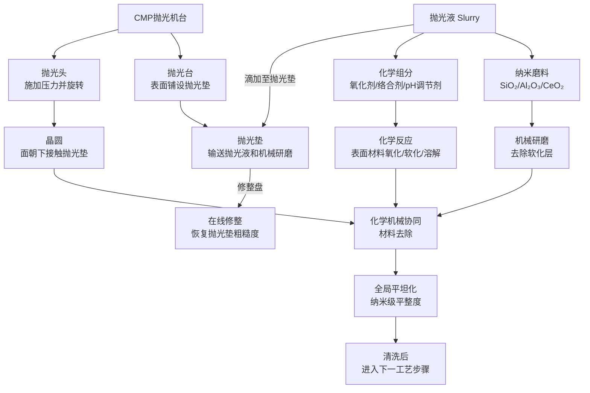
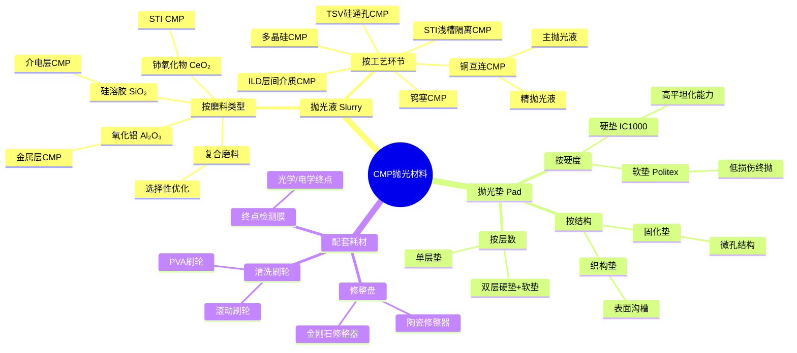
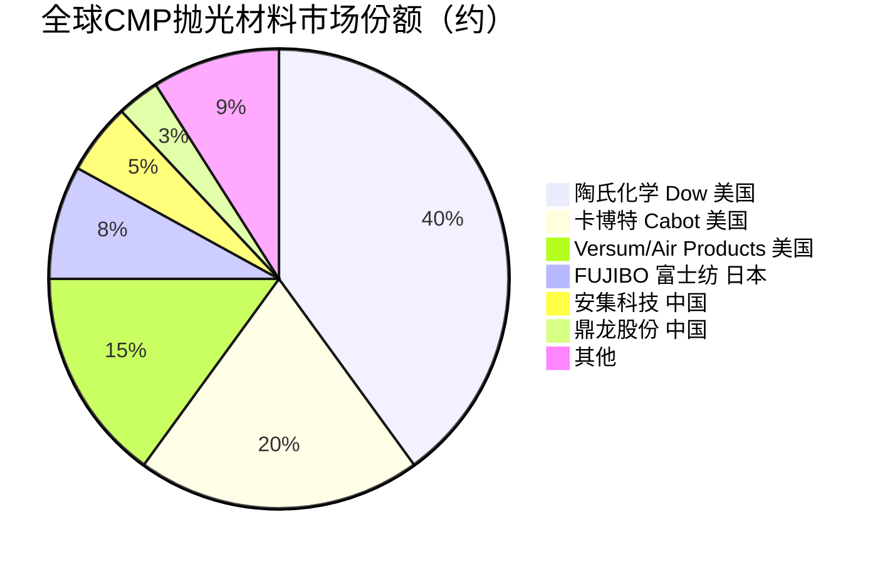

# 抛光材料

> 化学机械抛光（CMP）工艺中用于实现晶圆表面全局平坦化的研磨液和抛光垫。

## 概述

抛光材料是半导体制造中化学机械抛光/平坦化（CMP, Chemical Mechanical Polishing/Planarization）工艺所消耗的关键消耗材料，主要包括抛光液（Slurry）和抛光垫（Polishing Pad）两大类，此外还包括修整盘、清洗刷轮等配套耗材。CMP工艺是先进制程中实现多层互连结构全局平坦化的唯一有效手段，抛光材料的性能直接决定了晶圆表面的平整度、材料去除速率和缺陷水平，是芯片制程微缩不可或缺的基础材料。

在AI产业链中，CMP工艺的地位愈发重要。AI芯片具有15-20层以上的复杂金属互连结构，每一层互连都需要通过CMP实现平坦化，才能进行下一层的光刻和沉积工艺。没有CMP平坦化，多层互连结构的堆叠就无法实现，先进制程的晶体管密度就无法达到AI算力芯片的要求。此外，AI芯片的先进封装（如TSV硅通孔、铜柱凸块）也需要CMP工艺进行平坦化处理。

CMP抛光液是技术壁垒最高的半导体材料之一，其配方涉及纳米颗粒分散、表面化学、流变学等多学科交叉。抛光液中的纳米磨料颗粒（如硅溶胶、氧化铝、铈氧化物）尺寸需精确控制在20-100nm，并保持高度分散稳定性，同时化学组分需精确调控以实现不同材料的选择性去除。全球CMP抛光材料市场规模约25-30亿美元，由少数国际企业垄断。

## 技术原理

CMP工艺的基本原理是化学腐蚀与机械研磨的协同作用。在抛光过程中，抛光液中的化学组分与晶圆表面材料发生化学反应，生成易于机械去除的软化层，抛光垫通过携带纳米磨料颗粒对软化层进行机械研磨去除，实现材料抛光。

**化学作用**：抛光液中的氧化剂（如H₂O₂、KIO₃）、络合剂（如甘氨酸、柠檬酸）和pH调节剂与晶圆表面材料发生化学反应。例如，铜CMP中，H₂O₂将Cu氧化为CuO/Cu₂O，络合剂与Cu²⁺形成可溶性络合物，促进铜的化学溶解。氧化层CMP中，碱性抛光液（KOH调节pH至10-11）使SiO₂表面水合生成易去除的硅酸凝胶层。

**机械作用**：抛光液中的纳米磨料颗粒（SiO₂、Al₂O₃、CeO₂等）在抛光垫的压力和旋转作用下，对化学反应软化层进行机械磨削。磨料颗粒的硬度、尺寸、形状和浓度直接影响材料去除速率（MRR）和表面损伤。硅溶胶（SiO₂）硬度与SiO₂介质层相近，适合介电层CMP；氧化铝（Al₂O₃）硬度高，适合金属层CMP；铈氧化物（CeO₂）兼具化学机械协同作用，用于浅槽隔离（STI）CMP。

** Preston方程**：CMP材料去除速率遵循Preston方程：MRR = Kp × P × V，其中MRR为材料去除速率，P为施加压力，V为相对速度，Kp为Preston系数（与化学环境、材料性质和磨料特性相关）。通过调控抛光液化学组分和磨料参数，可改变Kp值，实现不同材料的选择性去除。

**抛光垫（Polishing Pad）**：通常由聚氨酯（Polyurethane）材料制成，分为硬垫（IC1000等）和软垫（Politex等）。硬垫提供高平坦化能力，用于介电层和金属层平坦化；软垫提供低损伤表面，用于最终抛光。抛光垫的微孔结构负责输送抛光液和携带磨料，随着使用会逐渐光滑，需通过修整盘（Conditioner）上的金刚石颗粒定期修整以恢复表面粗糙度。

## 分类与技术路线

CMP抛光材料按功能和工艺环节可分为以下几类：

**按抛光液类型分类**：
- **硅溶胶基（SiO₂）抛光液**：用于介电层（SiO₂/低k介质）CMP，纳米硅溶胶磨料，pH 10-11
- **氧化铝基（Al₂O₃）抛光液**：用于金属层（Cu、W、Al）CMP，高硬度磨料
- **铈氧化物基（CeO₂）抛光液**：用于STI（浅槽隔离）CMP，兼具化学-机械协同
- **复合磨料抛光液**：混合多种磨料，优化选择比和去除速率

**按CMP工艺环节分类**：
- **STI CMP抛光液**：浅槽隔离平坦化，Si₃N₄/SiO₂高选择比
- **ILD CMP抛光液**：层间介电层平坦化，硅溶胶基
- **铜CMP抛光液**：铜及阻挡层平坦化，分为主抛光液和精抛光液
- **钨CMP抛光液**：钨塞平坦化，氧化铝基
- **多晶硅CMP抛光液**：栅极多晶硅平坦化
- **TSV CMP抛光液**：硅通孔铜填充后的平坦化

## 市场格局

全球CMP抛光材料市场规模约25-30亿美元，市场集中度极高。美国企业占据绝对主导地位。陶氏化学（Dow Chemical，现Dow Inc.）是全球最大的CMP抛光液供应商，占据全球约35-40%的市场份额，其硅溶胶和铜抛光液产品线全面。美国卡博特（Cabot Corporation）是第二大抛光液供应商，在金属CMP抛光液领域具有优势。

抛光垫市场则几乎由美国陶氏化学独家垄断，其IC系列抛光垫（IC1000、IC1010等）占据全球约80%的市场份额，是全球CMP工艺的标杆产品。日本FUJIBO（富士纺）和中国鼎龙股份也在布局抛光垫产品，但市场份额较小。

中国CMP抛光材料市场规模约50亿元人民币，国产化率约20%。安集科技（Anji Microelectronics）在铜CMP抛光液和阻挡层抛光液方面已实现国产替代，进入主流晶圆厂供应链。鼎龙股份在抛光垫领域打破国际垄断，产品已通过14nm制程验证。上海新安、华海清科等也在布局抛光材料。但先进制程（7nm以下）用高端抛光液和抛光垫仍主要依赖进口。

## 代表企业

| 企业 | 国家/地区 | 主要产品/技术 | 市场地位 |
|------|----------|-------------|---------|
| 陶氏化学 Dow Chemical | 美国 | CMP抛光液全品类、IC系列抛光垫 | 全球最大抛光材料供应商 |
| 卡博特 Cabot | 美国 | 铜CMP抛光液、钨CMP抛光液 | 全球第二大抛光液供应商 |
| Versum Materials | 美国 | CMP抛光液、电子特气 | 美国高端抛光液企业（属Air Products） |
| CMC Materials（原Cabot Microelectronics） | 美国 | 铜CMP抛光液、抛光垫 | 美国抛光材料综合供应商 |
| FUJIBO 富士纺 | 日本 | 抛光垫、研磨材料 | 日本抛光垫领先企业 |
| Thomas West | 日本 | CMP抛光液、研磨材料 | 日本抛光液供应商 |
| 安集科技 Anji | 中国 | 铜CMP抛光液、阻挡层抛光液 | 国内抛光液龙头 |
| 鼎龙股份 | 中国 | CMP抛光垫、抛光液 | 国内抛光垫龙头 |
| 华海清科 | 中国 | CMP设备+抛光材料 | 国内CMP设备+材料协同布局 |
| 上海新安 | 中国 | CMP抛光液、清洗液 | 国内抛光液新锐 |
| 万华化学 | 中国 | 抛光垫原材料、聚氨酯材料 | 抛光垫上游材料布局 |

## 发展趋势

**多材料选择性抛光**：随着互连结构复杂化，CMP需在同一抛光步骤中精确控制多种材料（Cu/TaN/Ta/SiO₂）的去除速率和选择比。新型抛光液通过精确调控络合剂和抑制剂配方，实现大于50:1的选择比，满足先进制程要求。

**纳米磨料精细化**：先进制程要求磨料颗粒尺寸从100nm向20-30nm细化，分散稳定性要求更高。溶胶-凝胶法和等离子体合成等新型纳米颗粒制备技术正在应用，以获得更窄的粒径分布和更优的表面形貌。

**绿色环保抛光液**：传统抛光液中的部分组分（如强碱、含氮络合剂）存在废液处理难度大和环境风险。行业正开发低pH抛光液、无胺络合剂和可生物降解配方，降低CMP废液的COD和氮排放。

**先进封装驱动新需求**：2.5D/3D封装、TSV和混合键合等先进封装技术推动TSV CMP抛光液和铜柱凸块CMP抛光液需求快速增长。先进封装CMP抛光材料市场增速远超整体市场。

**国产化向高端延伸**：中国CMP抛光材料国产化正从成熟制程向先进制程延伸。安集科技的铜CMP抛光液已进入14nm制程，鼎龙股份的抛光垫已通过28nm验证。预计未来3-5年，国产抛光材料在7nm制程中的渗透率将显著提升。

## 与AI产业链的关联

CMP抛光材料是AI芯片多层互连结构堆叠的关键使能材料。AI GPU（如NVIDIA H100/B200）具有15层以上的铜互连结构，每一层互连都需要通过CMP工艺实现全局平坦化，才能进行下一层的光刻和沉积。没有高质量的CMP平坦化，多层互连堆叠就无法实现，先进制程的晶体管密度也就无法达到AI算力芯片的要求。

AI芯片的互连层平坦化质量直接影响光刻对准精度和图形分辨率。CMP后的表面高低差需控制在纳米级以内，否则会影响后续光刻的焦深和线宽均匀性，导致良率下降。抛光液的磨料粒径均匀性和抛光垫的表面状态是决定平坦化质量的关键因素。

AI芯片的先进封装（如台积电CoWoS中的TSV硅通孔、硅中介层）也需要大量CMP工艺。TSV铜填充后的CMP去除多余铜、硅中介层的介电层平坦化等都依赖专用CMP抛光材料。HBM存储器的3D堆叠结构中，TSV和微凸块的形成也需要CMP工艺支撑。抛光材料的性能和稳定性直接影响AI芯片的制造成本和产品良率。

---
[← 返回总目录](../../README.md)
