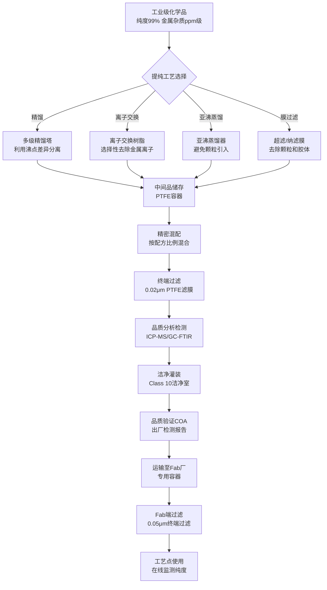
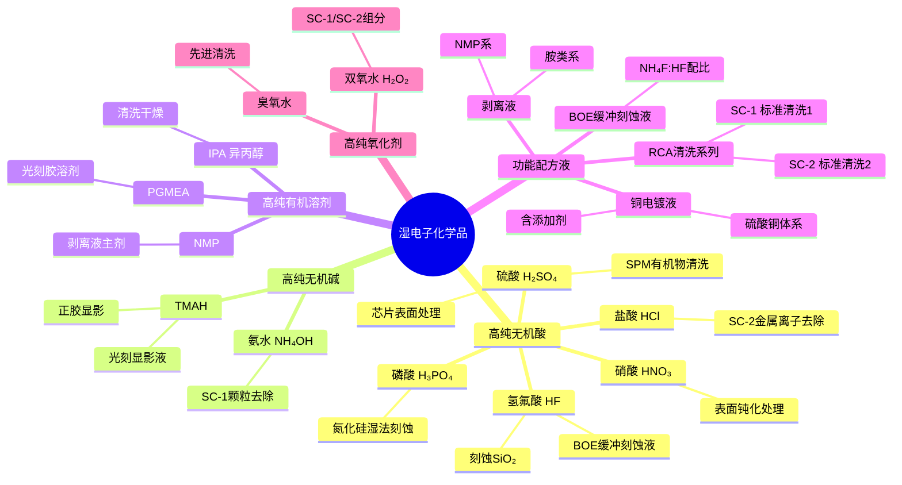
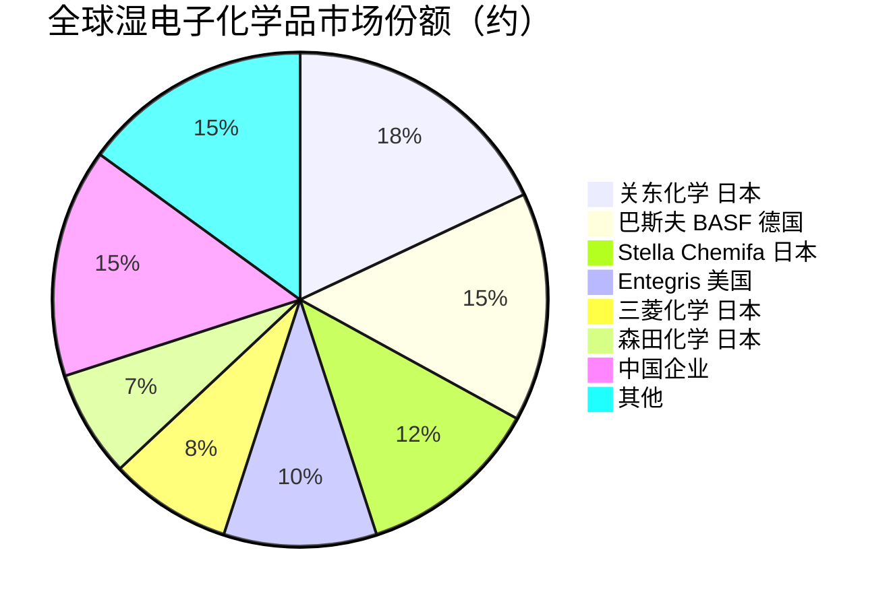

# 湿化学品

> 半导体制造中用于清洗、刻蚀、显影和电镀的超高纯液态化学材料。

## 概述

湿电子化学品（Wet Electronic Chemicals）是半导体制造中广泛使用的液态高纯化学材料，主要包括各类无机酸、无机碱、有机溶剂及其混合配方液。在芯片制造的上百道工序中，湿法清洗（Cleaning）、湿法刻蚀（Wet Etching）、光刻显影（Developing）、电镀（Plating）和剥离（Stripping）等工艺环节都大量使用湿化学品。这些化学品的纯度要求通常达到ppt级金属离子控制和0.1μm以上颗粒过滤标准，是半导体材料体系中的重要组成部分。

湿化学品在AI产业链中扮演着"清洁工"和"雕刻师"的双重角色。一方面，每一次关键工艺步骤前后都需要进行超纯清洗，去除颗粒、有机物和金属离子污染，确保晶圆表面洁净度，这是维持先进制程高良率的基础。另一方面，湿法刻蚀用于去除特定材料层、形成特定图形结构，是干法刻蚀的重要补充。在AI芯片的先进互连工艺中，电镀液用于铜互连线的沉积，剥离液用于光刻胶去除，这些湿化学品的性能直接影响互连电阻和信号传输性能。

随着芯片制程从7nm向3nm演进，对湿化学品的纯度要求进一步提高。金属离子（如Na⁺、K⁺、Fe³⁺）污染会导致芯片阈值电压漂移和漏电流增大，在先进制程中即使是ppt级的污染也会导致良率显著下降。同时，AI芯片产量的快速增长也推动了湿化学品市场规模的持续扩张，全球湿电子化学品市场规模已超过50亿美元。

## 技术原理

湿电子化学品的核心技术在于超高纯化，即将工业级化学品提纯至半导体级标准。主要的纯化技术包括：

**蒸馏提纯**：利用不同组分沸点差异进行分离，是获得超高纯酸（如硫酸、盐酸、氢氟酸）的主要方法。通过多级精馏，可将金属杂质从ppm级降至ppt级，颗粒物控制在Class 1（每毫升≤1个≥0.2μm颗粒）标准。

**离子交换提纯**：利用离子交换树脂选择性去除金属离子杂质，常用于氨水、双氧水和TMAH（四甲基氢氧化铵）的提纯。离子交换可高效去除Na⁺、K⁺等碱金属离子至ppt级以下。

** sub-boiling distillation（亚沸蒸馏）**：在低于沸点的温度下进行缓慢蒸馏，避免沸腾产生的液滴飞溅引入颗粒污染，可获得极高纯度（金属杂质<10 ppt）的超高纯试剂，用于最先进制程。

**湿法清洗原理**：RCA清洗是半导体制造中最经典的清洗流程，包括SC-1（NH₄OH:H₂O₂:H₂O = 1:1:5）去除颗粒和有机物，SC-2（HCl:H₂O₂:H₂O = 1:1:6）去除金属离子。SPM（H₂SO₄:H₂O₂）用于去除有机物，DHF（稀释氢氟酸）用于去除自然氧化层。先进制程中发展了单晶片清洗、臭氧清洗和超临界CO₂清洗等新技术。

**湿法刻蚀原理**：利用化学溶液选择性溶解特定材料。例如，缓冲氧化物刻蚀液（BOE = NH₄F:HF）用于刻蚀SiO₂；磷酸（H₃PO₄）用于刻蚀氮化硅；铜刻蚀液用于去除多余铜层。湿法刻蚀具有高选择比和低损伤优势，但各向同性特征限制了其在先进制程图形化中的应用。

**电镀原理**：在铜互连工艺中，使用硫酸铜电镀液，通过电化学沉积在TSV和沟槽中填充铜。电镀液的添加剂（加速剂、抑制剂、整平剂）配方是核心机密，直接影响铜填充质量和互连电阻。

## 分类与技术路线

湿电子化学品按化学类型和功能可分为以下几大类：

- **高纯无机酸**：氢氟酸（HF）、硫酸（H₂SO₄）、盐酸（HCl）、硝酸（HNO₃）、磷酸（H₃PO₄）、硼酸（H₃BO₃）等
- **高纯无机碱**：氨水（NH₄OH）、氢氧化钠（NaOH）、氢氧化钾（KOH）、TMAH（四甲基氢氧化铵）
- **高纯有机溶剂**：丙二醇甲醚醋酸酯（PGMEA）、N-甲基吡咯烷酮（NMP）、异丙醇（IPA）、丙酮、甲醇等
- **功能配方液**：SC-1/SC-2清洗液、BOE缓冲氧化物刻蚀液、SPM piranha清洗液、铜电镀液、剥离液（NMP/DMSO系）、显影液（TMAH水溶液）
- **高纯氧化剂**：过氧化氢（H₂O₂）、臭氧（O₃）水溶液
- **特种湿化学品**：铜电镀液添加剂、cmp抛光液、光刻胶稀释剂等

## 市场格局

全球湿电子化学品市场规模约50-60亿美元，市场格局相对分散，由日本、美国、欧洲和中国企业共同参与。日本企业在高端湿化学品领域占据主导地位，尤其是超高纯酸和功能配方液领域。关东化学（Kanto Chemical，属Resonac/昭和电工）、Stella Chemifa（施特拉化学）、森田化学、三菱化学等日本企业在超高纯氢氟酸、超高纯硫酸、超高纯双氧水等品类中处于全球领先地位。

美国企业方面，Entegris（英特林）、BASF（巴斯夫，德国）、Mitsubishi Gas Chemical（三菱瓦斯化学）在功能配方液和特种湿化学品领域占据重要份额。尤其是铜电镀液市场，Entegris和德国安美特（Atotech，已被Mitsubishi Electric收购）占据领先地位。

中国湿电子化学品市场规模约150亿元人民币，国产化率约35%。江化微、晶瑞股份、上海新阳、格林达、中巨芯等国内企业在部分品类已实现国产替代，但在最高等级（G5级，先进制程用）湿化学品方面仍主要依赖进口。目前国内企业已能稳定供应G3-G4级产品，部分品种已通过G5级验证。

## 代表企业

| 企业 | 国家/地区 | 主要产品/技术 | 市场地位 |
|------|----------|-------------|---------|
| 关东化学 Kanto Chemical | 日本 | 超高纯HF、H₂SO₄、功能配方液 | 全球最大湿电子化学品供应商 |
| Stella Chemifa 施特拉化学 | 日本 | 超高纯氢氟酸、含氟配方液 | 全球超高纯HF龙头 |
| 巴斯夫 BASF | 德国 | 高纯酸/碱、电子级溶剂 | 欧洲最大湿化学品供应商 |
| Entegris 英特林 | 美国 | 铜电镀液、特种配方液、前驱体 | 铜电镀液与配方液领先者 |
| 三菱化学 Mitsubishi Chemical | 日本 | 高纯溶剂、功能性配方液 | 日本湿化学品综合供应商 |
| 森田化学 Morita | 日本 | 超高纯磷酸、刻蚀配方液 | 高纯磷酸全球领先 |
| 安美特 Atotech | 德国（被三菱电机收购） | 铜电镀液、电镀添加剂 | 铜互连电镀液龙头 |
| 江化微 | 中国 | 超净高纯试剂、清洗液/刻蚀液 | 国内湿化学品领先企业 |
| 晶瑞股份 | 中国 | 超高纯双氧水、光刻胶配套 | 国内双氧水领先企业 |
| 上海新阳 | 中国 | 电镀液及添加剂、清洗液 | 国内电镀液领先企业 |
| 中巨芯 | 中国 | 超高纯酸/碱、电子级氟化物 | 国内湿化学品新星 |
| 格林达 | 中国 | 显影液、清洗液、剥离液 | 国内显影液领先企业 |

## 发展趋势

**纯度等级持续提升**：先进制程对湿化学品纯度的要求从G4（ppt级）向G5（sub-ppt级）演进。3nm制程要求金属杂质控制在0.1ppt以下，颗粒控制在0.05μm以下。亚沸蒸馏和在线离子交换等新技术正在推动超高纯化技术的进步。

**单晶片清洗替代批量清洗**：先进制程中，单晶片清洗（Single Wafer Clean）正逐步替代传统的批量清洗（Batch Clean），以减少交叉污染和提高清洗一致性。这推动了配套清洗化学品配方和喷射式清洗设备的协同发展。

**功能配方液高附加值化**：铜电镀液、先进CMP抛光液、特殊剥离液等功能配方液具有更高的技术壁垒和利润率，成为湿化学品企业差异化竞争的重点方向。尤其是铜电镀液的添加剂配方，是互连工艺核心机密。

**绿色环保替代**：传统湿化学品中部分组分存在环境和安全风险，行业正开发水性替代方案（如水基清洗替代硫酸清洗）、低毒有机溶剂和可回收配方，降低废液处理压力和碳排放。

**国产化向高端延伸**：中国湿电子化学品国产化正从G3-G4级向G5级延伸。国内企业已实现28nm制程用湿化学品的批量供应，14nm及以下制程验证加速推进。预计未来3-5年，国产G5级湿化学品将进入先进制程量产线。

## 与AI产业链的关联

湿化学品是AI芯片制造过程中保障良率和性能的关键材料。AI GPU（如NVIDIA H100/B200）采用先进制程制造，对表面洁净度和缺陷控制的要求极高。每一次薄膜沉积、刻蚀和光刻前后都需要超纯清洗，湿化学品的纯度直接决定了芯片缺陷密度和良率。

AI芯片的铜互连层是信号传输的关键路径。铜电镀液的配方质量决定了互连线的填充质量、电阻和可靠性，直接影响AI芯片的信号传输速度和功耗。互连线中的微小空洞或杂质会导致电阻增大、信号延迟增加，影响AI芯片的计算性能。

AI芯片的高密度封装（如台积电CoWoS）中的TSV工艺也大量使用湿化学品进行硅通孔刻蚀、清洗和电镀铜填充。HBM存储器的3D堆叠结构同样需要精密的湿法工艺支撑。此外，AI芯片的光刻工艺中使用的显影液（TMAH）也是湿化学品的重要品类，直接影响光刻图形质量。

---
[← 返回总目录](../../README.md)
