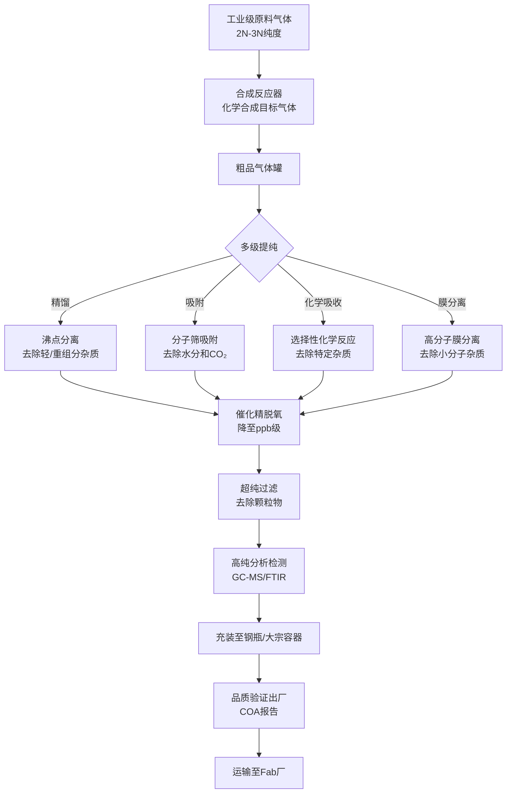
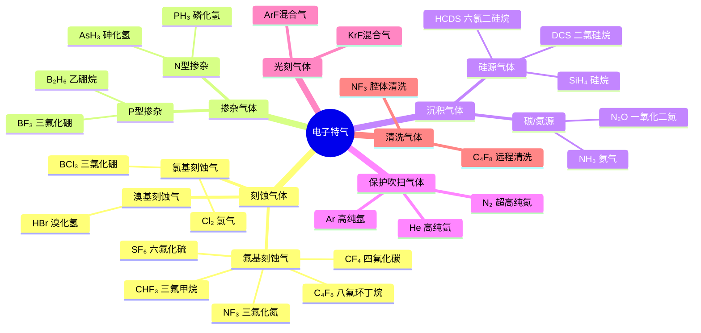
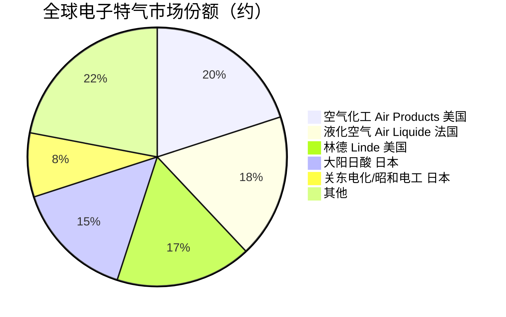

# 电子特气

> 半导体制造中用于薄膜沉积、刻蚀、掺杂和清洗的高纯度气体材料。

## 概述

电子特气（Electronic Specialty Gas）是半导体制造过程中不可或缺的关键功能材料，广泛应用于薄膜沉积（CVD/PVD/ALD）、刻蚀、掺杂（离子注入）、光刻、清洗等核心工艺环节。在芯片制造的数百道工序中，超过80%的工序需要使用电子特气。电子特气的纯度通常要求达到99.999%（5N）至99.999999%（7N-8N），其中的杂质含量（如水分、氧气、金属离子、颗粒物）需控制在ppb甚至ppt级别，是半导体材料中规格最严苛的品类之一。

电子特气种类繁多，在AI产业链中扮演着将元素原子精准输送到芯片内部的关键角色。AI芯片中的晶体管结构（FinFET、GAA）、存储单元电容、金属互连线等都需要通过气体前驱体来精确构建。例如，刻蚀气体（如氟化氢、SF₆）用于精准雕刻纳米级沟槽；掺杂气体（如磷化氢PH₃、乙硼烷B₂H₆）用于改变硅的电学性质；沉积气体（如硅烷SiH₄、TEOS）用于构建绝缘层和导电层。

随着制程从7nm向3nm推进，先进制程中ALD（原子层沉积）工艺大量使用新型高k前驱体气体和刻蚀气体，对电子特气的种类和纯度提出了更高要求。同时，AI芯片产量的大规模扩张也推动了电子特气市场的快速增长，全球电子特气市场规模已超过50亿美元。

## 技术原理

电子特气的核心技术包括气体的合成提纯、分析检测、包装运输和安全使用等环节，其中超高纯提纯是最关键的技术壁垒。

**气体提纯技术**：电子特气的原料气体通常为工业级（2N-3N），需通过多级提纯达到电子级标准。主要提纯方法包括：精馏（利用沸点差异分离）、吸附（利用分子筛选择性吸附杂质）、化学吸收（利用化学反应去除特定杂质）、膜分离（利用高分子膜的选择透过性）和催化转化（将杂质催化转化为易去除物质）。对于腐蚀性气体（如HF、HCl），还需解决材料的耐腐蚀和污染控制问题。

**刻蚀气体原理**：等离子体刻蚀中，特气在射频电场作用下电离为等离子体，产生的活性自由基（如F·、Cl·）与硅、二氧化硅等材料发生化学反应，生成挥发性产物被抽走。常见的刻蚀气体包括：
- **氟基刻蚀气体**：CF₄、SF₆、C₄F₈、CHF₃、NF₃等，用于硅和二氧化硅刻蚀
- **氯基刻蚀气体**：Cl₂、BCl₃、CCl₄等，用于铝和多晶硅刻蚀
- **溴基刻蚀气体**：HBr、Br₂等，用于先进制程刻蚀
- **氢基气体**：H₂用于改善刻蚀选择比

**掺杂气体原理**：在离子注入工艺中，掺杂气体（如PH₃、AsH₃、B₂H₆、BF₃）在离子源中被电离为离子，经质量分析器筛选出目标离子（如P⁺、As⁺、B⁺），经加速电场注入硅片表面，改变硅的电学性质。掺杂气体的纯度直接决定芯片的电学性能一致性。

**CVD/ALD前驱体**：硅烷（SiH₄）和TEOS用于沉积二氧化硅绝缘层；HCDS（六氯二硅烷）等新型前驱体用于ALD工艺沉积高k介质层。前驱体的热稳定性和蒸气压特性是选型关键。

## 分类与技术路线

电子特气按功能可分为以下几大类：

- **刻蚀气体**：CF₄、SF₆、C₄F₈、CHF₃、NF₃、Cl₂、BCl₃、HBr等，是用量最大的品类之一
- **掺杂气体**：PH₃、AsH₃、B₂H₆、BF₃、SiH₄等，用于离子注入和扩散
- **沉积气体**：SiH₄、DCS、HCDS、TEOS（液态）等，用于CVD/ALD薄膜生长
- **保护/吹扫气体**：N₂、Ar、He等超高纯气体
- **反应气体**：O₂、O₃、H₂、NH₃等，用于氧化、氮化和还原反应
- **光刻气体**：ArF/KrF准分子激光混合气（Ar/Ne/F₂、Ar/Ne/F₂等）
- **清洗气体**：NF₃、C₄F₈（用于腔体清洗）、HCl（原位清洗）

## 市场格局

全球电子特气市场规模约50-60亿美元，市场集中度较高。美国空气化工（Air Products）、法国液化空气（Air Liquide）、美国林德（Linde，含原普莱克斯Praxair）、日本大阳日酸（Taiyo Nippon Sanso）四大国际气体巨头占据全球约70%的市场份额。这些企业不仅提供气体产品，还拥有完善的现场供气（On-site）、管道输送和气体管理系统服务能力。

在高端特气品种方面，日本企业优势明显。大阳日酸、关东电化（Resonac/昭和电工）、中央硝子、三井化学等在刻蚀气体、掺杂气体和前驱体领域占据重要地位。美国霍尼韦尔和英特林（Entegris）在部分高纯特气方面也有布局。

中国电子特气市场规模约100亿元人民币，是全球增长最快的市场。国内企业如中船重工718所（派瑞特气）、南大光电、金宏气体、华特气体、雅克科技等已在部分品类实现国产替代。氟化氢、氟化铵、高纯氨气等已实现规模化供应，但在ArF光刻混合气、HCDS等高端前驱体领域仍依赖进口。

## 代表企业

| 企业 | 国家/地区 | 主要产品/技术 | 市场地位 |
|------|----------|-------------|---------|
| Air Products 空气化工 | 美国 | 电子特气全品类、现场供气系统 | 全球最大工业气体供应商 |
| Air Liquide 液化空气 | 法国 | 电子特气、高纯气体、ALD前驱体 | 全球工业气体龙头之一 |
| Linde（含Praxair） | 美国 | 电子特气全品类、气体管理系统 | 全球工业气体巨头 |
| 大阳日酸 TNSC | 日本 | 刻蚀气体、掺杂气体、前驱体 | 日本最大、全球第四大气体公司 |
| 关东电化/Resonac | 日本 | NF₃、SF₆、高纯氟化物 | 全球氟系特气龙头 |
| 霍尼韦尔 Honeywell | 美国 | 电子级氟化物、特种气体 | 美国高端特气供应商 |
| Entegris 英特林 | 美国 | 前驱体材料、超高纯化学品 | 前驱体材料领域领先 |
| 中船718所/派瑞特气 | 中国 | 三氟化氮、六氟化钨、高纯氟化物 | 国内电子特气龙头 |
| 南大光电 | 中国 | 磷烷、砷烷、光刻混合气 | 国内掺杂气体领先企业 |
| 华特气体 | 中国 | 超高纯六氟乙烷、含氟气体 | 国内含氟特气主力 |
| 金宏气体 | 中国 | 超纯氨、笑气、电子特气 | 国内超纯氨领先 |

## 发展趋势

**高k前驱体需求爆发**：随着3nm及以下制程和先进存储（HBM）的发展，ALD工艺大量使用新型高k前驱体材料（如HCDS、TMA、TEMAH等），这些前驱体材料具有更高的附加值和技术壁垒，成为电子特气领域增长最快的品类之一。

**含氟刻蚀气体升级**：先进制程对刻蚀选择比和各向异性的要求提升，C₄F₈、C₄F₆等高碳氟比刻蚀气体需求增长，同时NF₃作为腔体清洗气体的用量也大幅增加，全球NF₃市场规模持续扩大。

**超高纯化技术突破**：7nm以下制程要求电子特气纯度达7N-8N，金属杂质控制在ppt级。提纯技术和分析检测技术是核心竞争力，痕量杂质分析（如GC-ICP-MS）能力成为门槛。

**国产化率加速提升**：在美国出口管制和供应链安全驱动下，中国电子特气国产化率快速提升。目前国内KrF光刻混合气、高纯氨、部分含氟气体已实现国产替代，ArF光刻混合气和高端前驱体正在加速验证。预计未来3-5年国产化率从30%提升至50%以上。

**绿色低碳趋势**：部分传统特气（如SF₆）具有高GWP（全球变暖潜势），行业正开发低GWP替代气体和循环利用技术，降低环境影响。同时，现场制气和就地提纯技术也在减少运输碳排放。

## 与AI产业链的关联

电子特气是AI芯片制造过程中使用频率最高、用量最大的材料之一。一颗AI GPU（如NVIDIA H100）需要经过数百道工艺步骤，每一步几乎都需要使用特气。刻蚀气体用于雕刻晶体管Fin结构、金属互连沟槽和TSV通孔；掺杂气体用于精确控制晶体管源漏区的掺杂浓度和分布；沉积气体用于构建高k栅介质层和金属互连层。

AI芯片的先进互连结构（如台积电CoWoS中的硅中介层和TSV）需要大量使用刻蚀气体来形成深宽比超过10:1的微小通孔。HBM存储器中的3D堆叠结构也需要精密的刻蚀和沉积工艺，这些都需要高纯度的电子特气支撑。

此外，AI数据中心的光通信器件（如硅光芯片、光模块）在制造过程中也大量使用电子特气，支撑AI所需的超高速数据传输。电子特气的纯度和稳定性直接决定了AI芯片的良率和性能一致性，是AI产业链中不可替代的基础材料。

---
[← 返回总目录](../../README.md)
