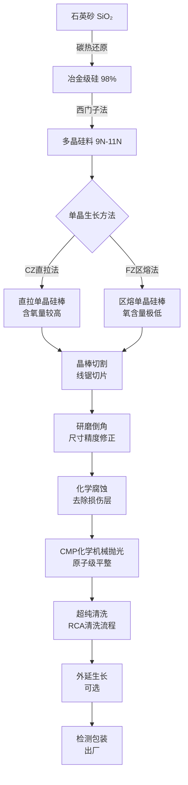
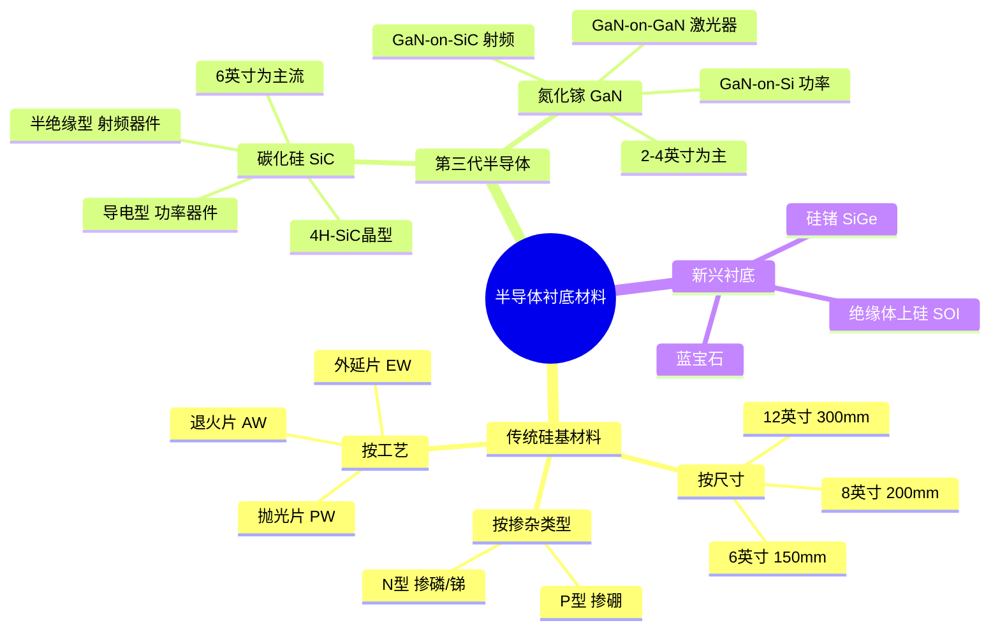
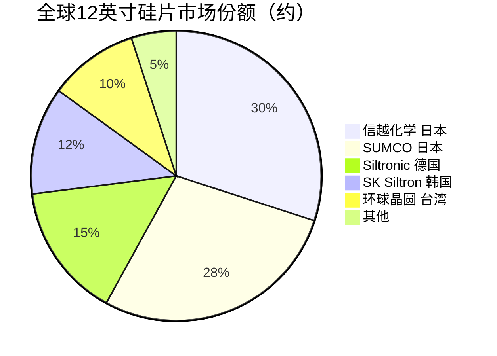

# 硅片

> 半导体制造的核心基础衬底材料，是所有芯片制造的起点。

## 概述

硅片（Silicon Wafer）是半导体产业中最基础、最重要的衬底材料，占据了半导体材料市场约35%的份额。从上游的多晶硅原料提纯、单晶硅棒拉制，到中游的切割、研磨、抛光，最终形成符合芯片制造要求的硅片，整个产业链技术壁垒极高。硅片的纯度需达到99.9999999%（9N）以上，其晶体结构的完美性、表面平整度、微观缺陷控制等指标直接决定了下游芯片的良率和性能。

在AI产业链中，硅片是算力芯片（CPU、GPU、TPU、NPU等）的物理载体。AI大模型训练和推理对算力的指数级需求，推动芯片制程从7nm向3nm甚至2nm演进，这也对硅片质量提出了前所未有的要求。12英寸（300mm）大硅片是当前先进制程的主流规格，而AI芯片的高密度集成进一步推动了对外延层质量和缺陷控制标准的提升。

第三代半导体材料——碳化硅（SiC）和氮化镓（GaN），因其宽禁带特性，在功率器件、射频器件和光电子领域具有独特优势，正成为AI数据中心电源管理、5G通信和高功率场景的关键衬底材料。SiC功率器件在AI服务器电源、充电桩等领域可显著提升能效，GaN则在射频前端和高频功率转换中不可替代。

## 技术原理

硅片制造的核心流程包括多晶硅提纯、单晶硅棒生长（直拉法CZ或悬浮区熔法FZ）、晶棒切割、研磨、化学腐蚀、抛光（CMP）和清洗等环节。其中单晶硅棒生长是核心技术环节。

**直拉法（Czochralski, CZ法）**：将多晶硅料在石英坩埚中加热至熔融状态（约1420°C），用籽晶提拉，通过精确控制拉速和温度梯度，使硅原子在籽晶上按晶格排列结晶，形成单晶硅棒。CZ法可生长大直径晶棒，是目前300mm硅片的主流方法，但坩埚中的氧会溶入晶棒，氧含量约10-18 ppma。

**悬浮区熔法（Floating Zone, FZ法）**：不使用坩埚，通过高频感应线圈在多晶硅棒上形成熔区，熔区自下而上移动，实现提纯和单晶生长。FZ法氧含量极低（<1 ppma），电阻率高，适合功率器件，但难以生长大直径晶棒。

对于碳化硅（SiC），其晶体生长主要采用物理气相传输法（PVT），在2500°C高温下使SiC粉末升华并在籽晶上沉积结晶，生长速率远低于硅（约0.1-0.3 mm/h vs 硅的~100 mm/h），且缺陷密度高，导致SiC衬底价格昂贵。氮化镓（GaN）则主要采用氢化物气相外延法（HVPE）在蓝宝石、SiC或硅衬底上生长，器件应用多基于GaN-on-SiC（射频）和GaN-on-Si（功率）方案。

## 分类与技术路线

硅片按直径可分为6英寸（150mm）、8英寸（200mm）和12英寸（300mm），其中12英寸是先进制程主流，AI芯片几乎全部使用12英寸硅片。按掺杂类型分为N型（掺磷/锑）和P型（掺硼），N型硅片因迁移率高、少子寿命长，在先进逻辑芯片和存储芯片中应用增长。按工艺可分为抛光片（PW）、外延片（EW）和退火片（AW），先进制程中更多采用外延硅片以降低缺陷。

第三代半导体按材料体系分为SiC和GaN两大类。SiC衬底按导电类型分为半绝缘型（用于射频器件）和导电型（N型，用于功率器件）；按晶型分为4H-SiC（主流）和6H-SiC。GaN衬底则分为同质衬底（GaN-on-GaN，成本高，主要用于激光器）和异质衬底（GaN-on-SiC、GaN-on-Si，成本低，用于射频和功率器件）。

## 市场格局

全球硅片市场长期由日本企业主导，形成高度集中的寡头格局。SUMCO（日本）和信越化学（日本）两家合计占据全球约60%的市场份额。德国世创（Siltronic）、韩国SK Siltron、台湾环球晶圆（GlobalWafers）紧随其后。12英寸硅片的价格在近年因需求旺盛而持续上涨，单片价格已达200-300美元以上。

中国在硅片领域正在快速追赶。沪硅产业、立昂微、中环半导体等企业已实现12英寸硅片的量产，但在良率和高端产品占比上与国际先进水平仍有差距。国内产品主要面向28nm及以上成熟制程，14nm及以下制程所需的高端硅片仍部分依赖进口。

SiC衬底市场则由美国Wolfspeed（原CREE）主导，占全球约60%的产能份额，其次是II-VI（现为Coherent）和日本昭和电工（SKC/Resonac）。中国天岳先进、天科合达、南砂晶圆等企业正在加速SiC衬底国产化，在6英寸产品上已实现突破，8英寸样品已下线。GaN衬底方面，日本住友电工和日本日立电线占据主要份额，中国苏州纳维、东莞市中镓半导体等也在布局。

## 代表企业

| 企业 | 国家/地区 | 主要产品/技术 | 市场地位 |
|------|----------|-------------|---------|
| 信越化学 Shin-Etsu | 日本 | 12英寸抛光片/外延片、SOI硅片 | 全球最大硅片供应商 |
| SUMCO | 日本 | 12英寸硅片、区熔硅片 | 全球第二大硅片供应商 |
| Siltronic（世创） | 德国 | 12英寸硅片、超薄硅片 | 欧洲最大硅片制造商 |
| SK Siltron | 韩国 | 12英寸存储芯片用硅片 | 韩国唯一硅片制造商 |
| 环球晶圆 GlobalWafers | 中国台湾 | 12英寸/8英寸硅片、外延片 | 全球最大3C电子硅片供应商 |
| Wolfspeed | 美国 | 6/8英寸SiC衬底、SiC外延片 | 全球SiC衬底龙头 |
| Coherent（原II-VI） | 美国 | SiC衬底、GaN衬底 | SiC衬底全球第二 |
| 天岳先进 | 中国 | 6英寸SiC衬底、半绝缘SiC | 国内SiC衬底领先企业 |
| 沪硅产业 | 中国 | 12英寸硅片、SOI硅片 | 国内12英寸硅片主力供应商 |
| 立昂微 | 中国 | 12英寸/8英寸硅片 | 国内硅片+化合物半导体布局 |

## 发展趋势

**12英寸硅片需求持续增长**：AI芯片、高性能计算和汽车电子推动12英寸硅片需求持续攀升，预计2024-2028年复合增长率约7-8%。信越和SUMCO均启动了扩产计划，供需有望逐步平衡。

**N型硅片渗透率提升**：随着先进制程和先进存储（DDR5、HBM）的普及，N型硅片因低杂质、高迁移率优势，市场份额逐步提升，外延硅片在7nm以下制程中已成为标配。

**8英寸SiC衬底加速推进**：为降低SiC器件成本，行业正从6英寸向8英寸迁移。Wolfspeed已率先量产8英寸SiC衬底，国内天科合达、天岳先进也在推进8英寸产品，预计2026-2027年实现规模化量产。

**GaN-on-Si功率器件放量**：650V GaN-on-Si功率器件在快充、数据中心电源、车载充电领域渗透加速，带动GaN外延片需求增长。6英寸GaN-on-Si外延片成为主流方向。

**衬底国产化加速**：在贸易摩擦和供应链安全驱动下，中国硅片和第三代半导体衬底国产化进程加速。国内企业在12英寸硅片良率提升、8英寸SiC研发等方面取得突破，预计未来3-5年国产化率显著提升。

## 与AI产业链的关联

硅片是AI算力芯片的物理基础。每一颗GPU（如NVIDIA H100/B200）、AI加速器、HBM存储芯片都制造在12英寸大硅片之上。AI算力的持续提升依赖于芯片制程微缩和晶体管密度增长，这直接推动了对更高质量、更低缺陷密度硅片的需求。

在AI数据中心中，SiC功率器件在电源模块、PFC（功率因数校正）和DC-DC转换中发挥着提升能效、降低损耗的关键作用。一个大型AI数据中心的电力消耗可达数百兆瓦，SiC器件可帮助将电源转换效率从96%提升至99%以上，显著降低运营成本和碳排放。

GaN射频器件则是5G基站和高速通信链路的核心组件，支撑AI所需的超高速数据传输。GaN功率器件在数据中心服务器电源中也因其高频特性而逐渐替代传统硅基方案，实现更小体积、更高功率密度。

---
[← 返回总目录](../../README.md)
