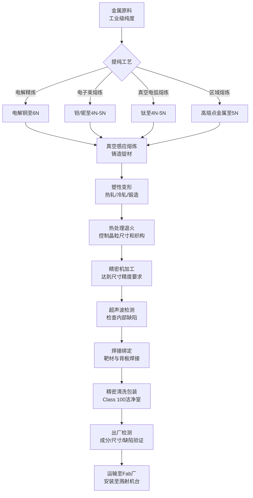
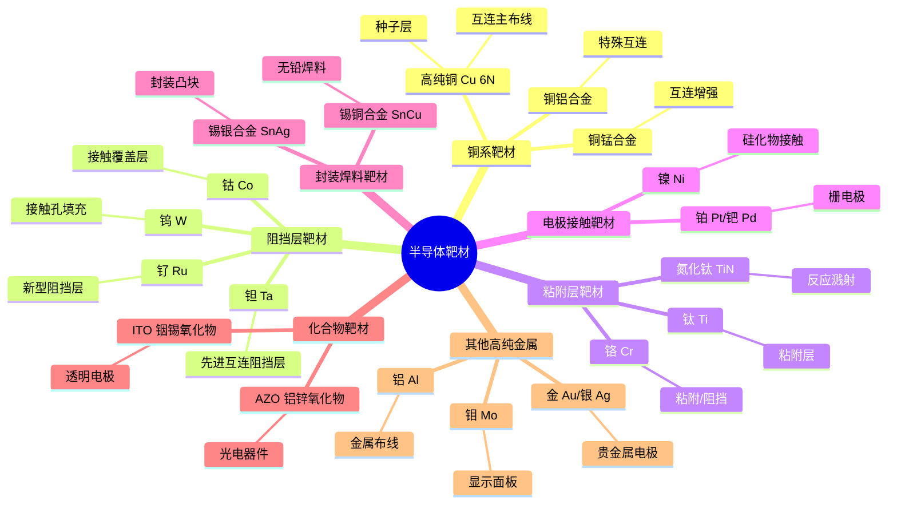
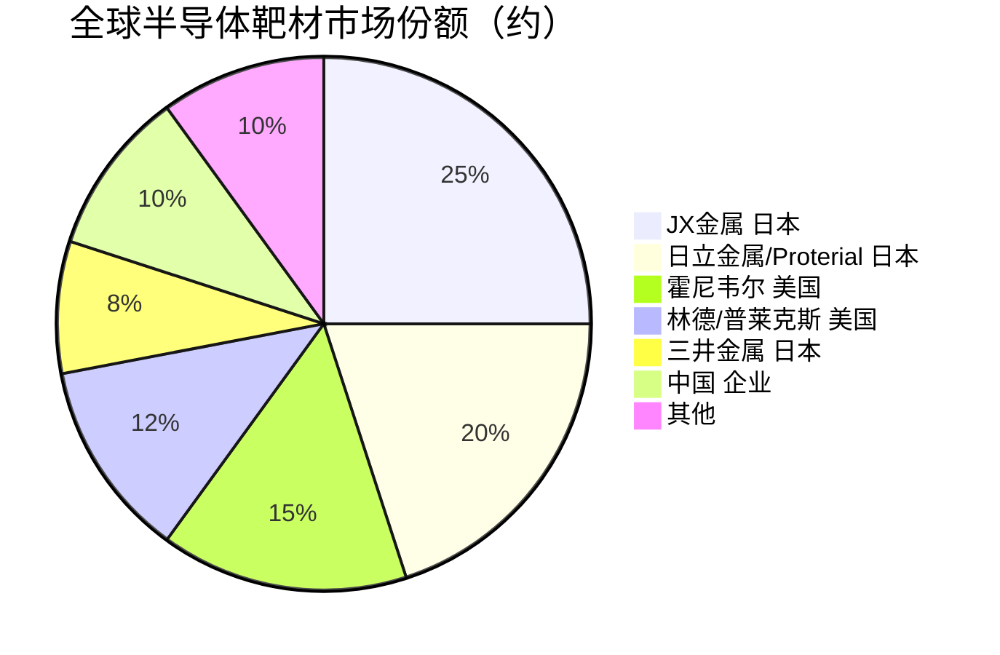

# 靶材

> 物理气相沉积（PVD）工艺中用于沉积金属薄膜的高纯固体材料源。

## 概述

靶材（Sputtering Target）是半导体制造中物理气相沉积（PVD，主要为磁控溅射）工艺使用的源材料，通过将高纯金属或合金材料制成特定形状（板状、圆柱状等），在真空溅射设备中经Ar⁺离子轰击后，靶材原子被溅射出来沉积到硅片表面形成薄膜。靶材是构建芯片金属互连层、阻挡层、粘附层和电极结构的关键材料，其纯度、密度、晶粒尺寸和均匀性直接决定了薄膜质量和芯片性能。

在AI产业链中，靶材是芯片互连和封装材料的核心来源。AI芯片具有高密度的多层金属互连结构，每一层都需要通过溅射工艺沉积不同的金属薄膜。例如，铜互连工艺中的铜种子层（Cu Seed Layer）、钽/氮化钽阻挡层（Ta/TaN Barrier Layer）、钛/氮化钛粘附层（Ti/TiN Adhesion Layer）等都通过靶材溅射沉积形成。随着AI芯片晶体管数量达到千亿级以上，互连层数也从10层增加到15-20层，靶材的用量和种类需求持续增长。

此外，AI芯片的先进封装（如2.5D/3D封装）需要大量的金属凸块（Bump）、重布线层（RDL）和硅通孔（TSV）填充，这些都依赖高纯铜、锡银合金、镍等靶材材料。靶材的纯度通常要求达到99.999%（5N）以上，部分高端品种要求99.9999%（6N），金属杂质需控制在ppm以下，氧含量控制在10ppm以下。

## 技术原理

磁控溅射（Magnetron Sputtering）是靶材应用的核心工艺技术。其基本原理是在真空腔室中充入Ar气，施加直流或射频电压形成等离子体，Ar⁺离子在电场加速下轰击靶材表面（阴极），通过动量转移使靶材原子脱离表面，沉积到对面的硅片上形成薄膜。

**溅射过程**：Ar⁺离子轰击靶材时，靶材原子获得足够的能量克服表面结合能（约4-8 eV），从靶材表面溅射逸出。溅射产额（一个Ar⁺离子溅射出的靶材原子数）通常在0.5-3之间，取决于靶材种类和Ar⁺能量。磁控方式通过在靶材背面放置磁场，约束电子运动路径，增加等离子体密度，提高溅射速率和薄膜均匀性。

**靶材制造工艺**：高纯靶材的制造包括原料提纯、熔炼铸造、塑性变形、热处理和精密加工等环节。不同的金属需要不同的工艺路线：
- **铜靶材**：电解精炼提纯至6N → 真空熔炼 → 热轧/冷轧 → 退火 → 精密机加工 → 焊接绑定 → 清洗包装
- **钽靶材**：电子束熔炼提纯至4N-5N → 真空电弧熔炼 → 锻造/轧制 → 退火处理 → 机加工 → 绑定
- **钛靶材**：海绵钛 → 真空电弧熔炼（VAR）→ 锻造 → 轧制 → 退火 → 机加工

**晶粒尺寸控制**：靶材的晶粒尺寸和晶体学取向（织构）对溅射薄膜的均匀性和性能有重要影响。细晶等轴晶（晶粒尺寸<100μm）可提高溅射速率均匀性，特定的晶体取向（如铜的(111)取向）可改善薄膜电迁移特性。通过精密控制熔炼、变形和热处理参数，可获得理想的微观组织。

**绑定工艺（Bonding）**：高纯靶材通常与铜或钼铜合金背板焊接在一起，以提供足够的机械强度和散热能力。焊接质量（焊料层均匀性、界面结合强度）直接影响靶材使用寿命和溅射稳定性。铟焊料焊接是常用工艺，焊接界面热阻需控制在0.05°C·W/cm²以下。

## 分类与技术路线

靶材按材料类型可分为以下几大类：

- **铜及铜合金靶材**：高纯铜（6N）、铜锰合金、铜铝合金，用于互连主布线和种子层
- **阻挡层靶材**：钽（Ta）、氮化钽（TaN，通过反应溅射）、钨（W）、钌（Ru），用于阻挡铜扩散
- **粘附层靶材**：钛（Ti）、氮化钛（TiN，反应溅射）、铬（Cr），用于改善薄膜附着力
- **电极/接触靶材**：镍（Ni）、铂（Pt）、钯（Pd）、钴（Co），用于接触和电极结构
- **焊料靶材**：锡银合金（SnAg）、锡铜合金（SnCu），用于封装凸块
- **化合物半导体靶材**：ITO（铟锡氧化物）、AZO（铝锌氧化物），用于光电器件
- **超高纯金属靶材**：铝（Al）、钨（W）、钼（Mo）、金（Au）、银（Ag）等

## 市场格局

全球半导体靶材市场规模约25-30亿美元，市场集中度较高。日本和美国企业占据主导地位。日本日矿金属（Nichia Metals/Nippon Mining & Metals，现JX金属子公司）、日立金属（现Proterial）、三井金属等日本企业在高纯铜靶材、钽靶材、钛靶材领域处于全球领先地位。美国霍尼韦尔（Honeywell）和普莱克斯（Praxair，现属林德Linde）在铝靶材、铜靶材和焊接绑定技术方面具有优势。

在钽靶材领域，由于钽是稀缺金属资源，供应链集中度更高。全球钽靶材主要由H.C. Starck（德国，现属JX金属）、Global Advanced Metals（澳大利亚）等少数企业提供原料，JX金属和日立金属在靶材制造端占据主要份额。

中国靶材市场近年来快速发展，有研新材、江丰电子、阿石创、隆华科技等企业已在部分品类实现国产替代。江丰电子在高纯钽靶材、铜靶材和钛靶材方面已进入国际主流供应链，供应给台积电、中芯国际等晶圆厂。有研新材在铜靶材和合金靶材方面也有较强实力。但在部分超高纯品种（如6N铜、钌靶材）和先进绑定工艺方面与国际先进水平仍有差距。

## 代表企业

| 企业 | 国家/地区 | 主要产品/技术 | 市场地位 |
|------|----------|-------------|---------|
| JX金属 JX Nippon Mining & Metals | 日本 | 高纯铜、钽、钛靶材 | 全球最大靶材供应商 |
| 日立金属/Proterial | 日本 | 铜靶材、钽靶材、合金靶材 | 全球靶材龙头之一 |
| 霍尼韦尔 Honeywell | 美国 | 铝靶材、铜靶材、焊接绑定技术 | 美国靶材领先企业 |
| Linde/Praxair | 美国 | 铝靶材、陶瓷靶材 | 美国靶材主要供应商 |
| 三井金属 Mitsui Kinzoku | 日本 | 铜靶材、铜合金靶材 | 日本靶材综合供应商 |
| H.C. Starck/JX | 德国/日本 | 钽原料、钽靶材 | 钽原料及靶材领先 |
| 有研新材 | 中国 | 高纯铜靶材、合金靶材、稀土材料 | 国内靶材龙头 |
| 江丰电子 | 中国 | 高纯钽靶材、铜靶材、钛靶材 | 进入国际主流供应链 |
| 阿石创 | 中国 | ITO靶材、氧化物靶材 | 国内化合物靶材领先 |
| 隆华科技 | 中国 | 钼靶材、合金靶材 | 面板靶材+半导体靶材 |
| 有研亿金 | 中国 | 铜靶材、贵金属靶材 | 国内靶材专业企业 |

## 发展趋势

**高纯化和微晶化**：先进制程对靶材纯度的要求持续提升，6N铜靶材、5N钽靶材成为先进制程标配。晶粒尺寸细化至50μm以下，微观均匀性要求提高，推动熔炼和热处理工艺技术升级。

**新型阻挡层材料兴起**：随着互连节距缩小至20nm以下，传统Ta/TaN阻挡层厚度需降至2nm以下，阻挡效率不足。钌（Ru）和钴（Co）作为新型阻挡层/粘附层材料正在兴起，带动相关靶材需求增长。

**大尺寸靶材需求增长**：12英寸晶圆制造推动靶材尺寸向大型化发展，铜靶材尺寸已达300mm×400mm以上。大尺寸靶材的均匀性控制和绑定工艺是技术挑战，高价值产品占比提升。

**先进封装驱动新需求**：2.5D/3D封装、Chiplet等先进封装技术推动铜凸块、锡银焊料凸块、镍阻挡层等靶材需求快速增长。封装用靶材占靶材市场比例将从目前约15%提升至25%以上。

**国产化替代加速**：中国靶材国产化率已从10年前的不足10%提升至约30%。江丰电子的钽靶材已进入台积电7nm以下制程供应链，有研新材的铜靶材已在国内主流晶圆厂量产。预计未来3-5年，国产靶材在高端市场的渗透率将持续提升。

## 与AI产业链的关联

靶材是AI芯片互连结构的核心材料来源。AI GPU（如NVIDIA H100）具有15层以上的铜互连结构，每一层互连的种子层、阻挡层和粘附层都通过靶材溅射沉积形成。互连层的质量直接影响AI芯片的信号传输速度和功耗，互连电阻每降低1%，可显著改善芯片性能和能效比。

AI芯片的先进封装（如台积电CoWoS、InFO）大量使用铜凸块和重布线层（RDL），这些金属结构通过靶材溅射或电镀形成。锡银合金焊料靶材用于封装凸块，提供芯片与基板之间的电气和机械连接。先进封装中靶材的用量远大于传统封装。

AI芯片中的高k金属栅极（HKMG）结构也使用靶材沉积金属栅电极。此外，AI光通信器件（如硅光芯片的金属电极）和传感器也依赖靶材材料。靶材的纯度和均匀性直接关系到AI芯片的良率、可靠性和长期稳定性，是AI产业链不可或缺的关键基础材料。

---
[← 返回总目录](../../README.md)
