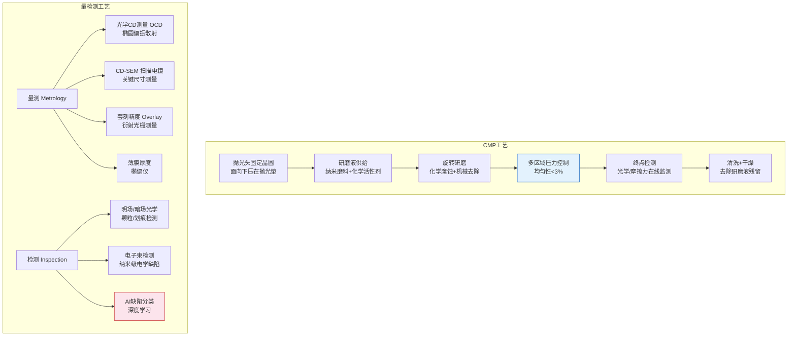
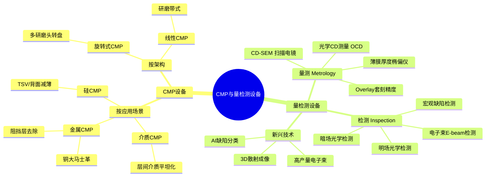
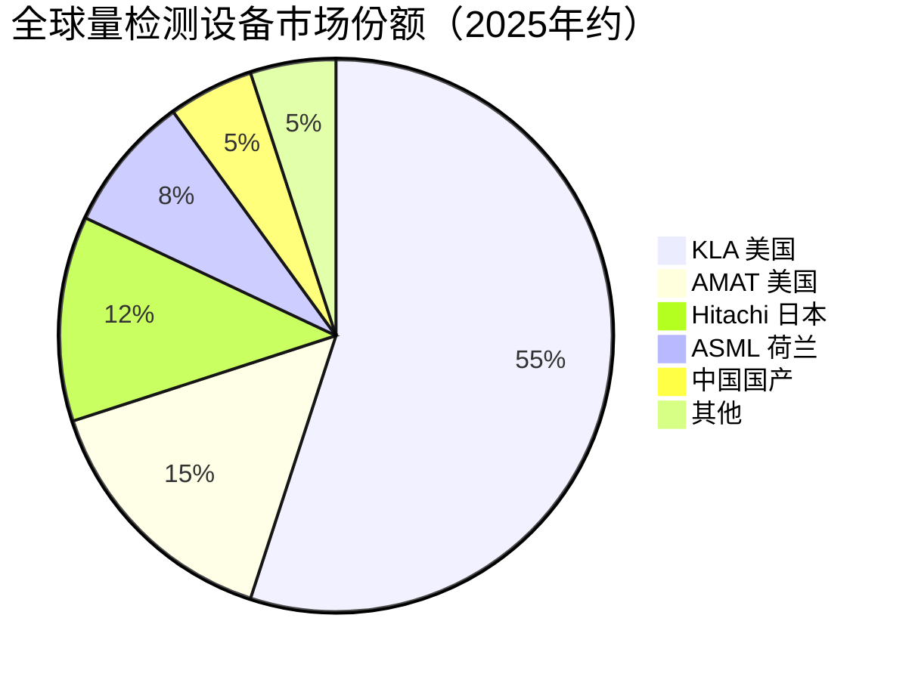

# CMP与量检测设备

> 化学机械抛光（CMP）实现晶圆表面全局平坦化，量检测设备保障每步工艺的精度与缺陷控制，两者共同支撑先进制程的多层堆叠良率。

## 概述

CMP（Chemical Mechanical Polishing，化学机械抛光）与量检测设备是先进制程实现多层堆叠的"守护者"。CMP通过化学腐蚀与机械研磨的协同作用，实现晶圆表面的全局平坦化（Global Planarization），是多层金属互连、铜大马士革工艺、3D NAND堆叠不可或缺的工序。量检测设备则贯穿晶圆制造全过程，对关键尺寸（CD）、套刻精度（Overlay）、薄膜厚度、表面缺陷进行在线监控，是良率提升的"眼睛"。

在AI芯片制造中，CMP和量检测的作用随制程微缩急剧放大。先进AI GPU采用14层以上金属互连，每层都需要CMP平坦化以承接后续光刻——若平坦化不足，光刻焦深将无法覆盖全片，导致图形精度恶化。7nm以下制程的铜互连需要精确控制研磨深度（±1nm级），研磨过深导致铜线变薄电阻升高，过浅导致短路。3D NAND的层间介质平坦化、GAA纳米片释放后的选择比刻蚀后表面处理，都依赖先进CMP能力。

量检测方面，5nm以下制程要求缺陷尺寸检测能力低于10nm，套刻精度测量精度<0.5nm，对检测设备分辨率和算法提出极限挑战。一颗AI芯片在制造过程中需经过200-300步量检测工序。CMP设备占晶圆厂投资约5-7%，量检测设备约8-10%，合计价值量超20亿美元/年。

## 技术原理

**CMP原理**：在CMP设备中，晶圆被倒扣固定于抛光头上，面向下压在旋转的抛光垫上。研磨液（Slurry）含有纳米级磨料颗粒（如SiO₂、Al₂O₃、CeO₂）和化学活性成分，在晶圆与抛光垫之间流动。磨料的机械研磨去除表面材料，化学成分与材料反应生成易去除的化合物，两者协同实现平坦化。CMP的独特优势在于可同时实现全局平坦化（消除大范围高低差）和高选择比（对不同材料差异化去除）。

CMP关键参数包括：去除速率（Removal Rate，nm/min）、均匀性（Within-Wafer Non-Uniformity，<3%）、选择比（对停止层材料的选择性刻蚀比）、研磨终点检测（Endpoint，通过摩擦力或光学在线监测）。先进CMP设备配备多区域压力控制（Multi-Zone）和实时终点检测，实现纳米级厚度控制。

**量检测原理**：半导体量检测分为量测（Metrology，无接触测量尺寸/厚度参数）和检测（Inspection，发现缺陷）。量测技术包括：光学CD测量（OCD，基于椭圆偏振散射光分析）、扫描电镜CD测量（CD-SEM）、原子力显微镜（AFM）、薄膜厚度测量（椭偏仪）、套刻精度测量（基于衍射光栅的衍射成像）。缺陷检测技术包括：明场/暗场光学检测（Bright/Dark Field Inspection）、电子束检测（E-beam Inspection）、宏观缺陷检测（Macro Inspection）。基于AI的缺陷分类和良率预测正成为新一代检测系统标配。

## 分类与技术路线

CMP设备按应用场景分为：介质CMP（用于层间介质平坦化）、金属CMP（用于铜互连大马士革工艺的铜和阻挡层去除）、硅CMP（用于硅通孔和背面减薄）。按架构分为旋转式CMP（传统主力，多研磨头转盘式）和线性CMP（Linear CMP，研磨带式，较少应用）。

量检测设备按测量对象分为：CD量测设备（OCD、CD-SEM）、Overlay套刻精度测量设备、薄膜厚度量测设备、缺陷检测设备（明场/暗场光学、电子束）。按工艺用途分为：在线监控（In-line Metrology，每步工艺后抽测）和高精度检测（Review SEM，对可疑缺陷复检）。新型量检测技术包括：基于机器学习的AI缺陷分类系统、多层结构三维断层成像（通过散射测量重建3D结构）、高产量电子束检测（HMI e-beam系列）。

## 市场格局

全球CMP设备市场约30-35亿美元/年，由AMAT应用材料（2025年营收约270亿美元，份额约60-65%）和Ebara（约25-30%）主导，TEL有少量份额。量检测设备市场约70-80亿美元/年，KLA科磊（2025年营收约110亿美元）以超过50%的份额绝对领先，AMAT和Hitachi在检测设备有一定份额。KLA在缺陷检测、CD量测和Overlay测量领域均处于垄断地位，其系列检测设备是先进制程产线良率管控的标配。

中国市场方面，华海清科CMP设备已在国内主流产线批量应用，28nm制程实现国产替代；中科飞测、精测电子在量检测设备领域有产品布局。但先进制程CMP和量检测设备仍主要依赖进口，KLA设备对中国出口受限，国产替代空间巨大。

## 代表企业

| 企业 | 国家/地区 | 主要产品/技术 | 市场地位 |
|------|----------|-------------|---------|
| AMAT 应用材料 | 美国 | Reflexion CMP系列、UVision检测 | CMP全球第一，量检测第二 |
| Ebara | 日本 | CMP设备、干式抛光头 | CMP全球第二 |
| KLA 科磊 | 美国 | 2800系列缺陷检测、29CD量测 | 量检测绝对龙头，>50%份额 |
| Hitachi 高科技 | 日本 | CD-SEM、Review SEM | 电子束检测领先 |
| ASML | 荷兰 | YMS Yieldstar套刻测量 | Overlay测量领先 |
| 华海清科 | 中国 | CMP设备U-WIN系列 | 国产CMP龙头 |
| 中科飞测 | 中国 | 椭偏测量、光学检测 | 国产量检测布局 |
| 精测电子 | 中国 | 膜厚测量、电学检测 | 国产量检测设备 |

## 发展趋势

### 市场规模预测

| 年份 | 市场规模 | 同比增长 | 备注 |
|------|---------|---------|------|
| 2024 | 约1130亿美元 | — | 基准年（半导体设备总市场） |
| 2025 | 约1255亿美元 | +11.1% | KLA 110亿/AMAT 270亿美元 |
| 2026E | 约1393亿美元 | +11% | 先进制程扩产拉动CMP+量检测需求 |
| 2027E | 约1546亿美元 | +11% | AI驱动量检测升级，电子束检测放量 |

1. **多材料混合CMP与选择比控制**：先进制程多种材料交替堆叠，单次CMP需同时处理多种材料并保持高选择比，通过化学配比优化和多步CMP组合实现。

2. **AI驱动量检测升级**：KLA等龙头正将深度学习引入缺陷分类和良率预测，AI算法可从海量检测数据中识别潜在缺陷模式，缩短制程调试周期。

3. **高产量电子束检测**：光学检测分辨率已逼近物理极限（<10nm），电子束检测成为亚10nm缺陷检测的必选技术，但速度瓶颈仍待突破，新一代多束电子束设备正在研发。

4. **3D结构断层成像**：FinFET和GAA晶体管的三维结构特征需要非破坏性三维测量，基于散射测量和X射线断层成像的3D CD量测技术加速商业化。

5. **国产化攻坚加速**：华海清科CMP已进入14nm产线验证，中科飞测等量检测设备在28nm以下有突破，未来3-5年CMP和量检测设备国产化率有望从目前的10-15%提升至25-30%。

## 与AI产业链的关联

CMP和量检测设备是AI芯片良率的守护者。先进AI GPU的多层金属互连需要14层以上CMP平坦化，每层平坦化质量直接影响后续光刻图形精度和互连电阻，关系到AI芯片的功耗和性能稳定性。2025年全球AI芯片市场约2032亿美元（同比翻倍），NVIDIA Blackwell架构GPU出货占比80%+，大规模AI芯片产能直接拉动CMP和量检测设备需求。量检测设备保障AI芯片制造全过程的缺陷控制——5nm以下制程中10nm级缺陷就可能导致芯片失效，先进检测能力是良率突破的前提。在KLA设备出口受限的背景下，国产量检测设备的突破对保障中国AI芯片自主制造链至关重要。

---
[← 返回总目录](../../README.md)
