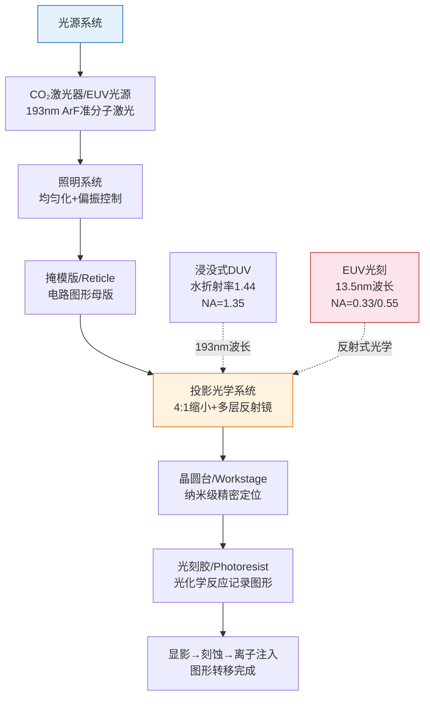
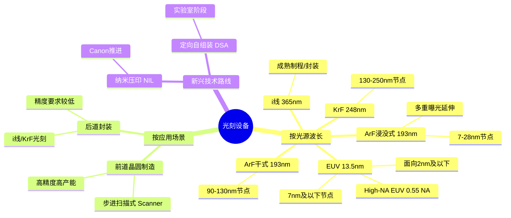
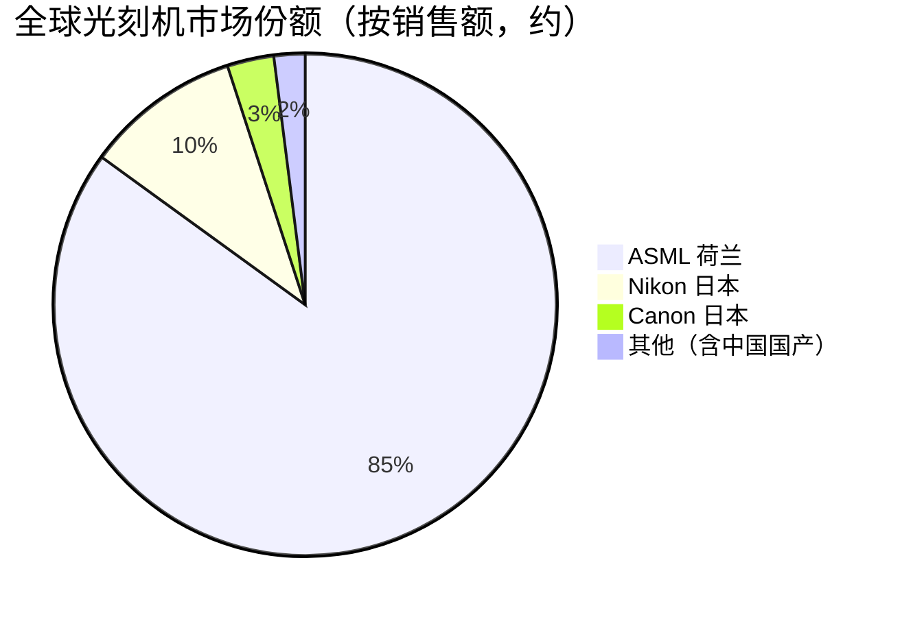

# 光刻设备

> 半导体制造中最核心的设备，利用光化学反应将电路图形精确转移至晶圆表面，决定芯片制程节点的关键瓶颈。

## 概述

光刻设备是半导体制造产业链中技术壁垒最高、单台价值量最大的设备类别，被誉为"半导体设备皇冠上的明珠"。在AI芯片制造过程中，光刻工艺决定了晶体管的特征尺寸（CD）和套刻精度（Overlay），直接关系到AI算力芯片（如GPU、AI加速器）的制程节点、性能与良率。一颗先进AI GPU（如NVIDIA H100/Blackwell系列）需要经过60-80层光刻工序，光刻设备投入占晶圆厂设备总投资的20-25%。

随着AI大模型对算力需求的爆发式增长，先进制程（7nm及以下）芯片产能需求急剧攀升，而EUV（极紫外）光刻技术成为制造7nm及以下节点的必要条件。光刻设备的技术迭代节奏（从DUV到EUV，从0.55 NA到High-NA EUV）直接决定了摩尔定律的延续速度，也深刻影响着AI芯片的能效比和成本曲线。

当前全球光刻机市场呈现高度垄断格局，ASML（荷兰）是唯一能够提供EUV光刻机的企业，Nikon和Canon在DUV领域仍有一定份额。中国受制于出口管制，正加速推进国产光刻机研发，但与国际最先进水平仍存在代际差距。

## 技术原理

光刻的本质是一种精密图形转移技术，其工艺链路包括：涂胶→曝光→显影→刻蚀（将图形转移至衬底）。其中曝光是核心环节，利用特定波长的光源通过掩模版（Reticle/Photomask），经光学投影系统将电路图形缩小后投射至晶圆表面的光刻胶上，引发光化学反应。

EUV光刻机采用13.5nm波长的极紫外光作为光源，采用激光等离子体（LPP）技术产生EUV光——高功率CO₂激光轰击每秒滴落数万滴的液态锡靶，产生等离子体并辐射EUV光。EUV光在真空环境中经多层反射镜组成的光学系统，将掩模图形以4:1缩小比投影至晶圆。整个光路必须在极高真空中运行，且所有光学元件采用钼/硅多层膜反射镜（每层约几纳米厚，需上百层叠加）。

ArF浸没式光刻机采用193nm波长的ArF准分子激光光源，在镜头与晶圆间注入超纯水作为浸没液体，利用水的折射率（n≈1.44）等效提高数值孔径（NA）至1.35，从而实现38nm以下的分辨率。

## 分类与技术路线

光刻设备按光源波长可分为多个技术代际。i线光刻（365nm）用于成熟制程（350nm以上）和封装领域；KrF光刻（248nm）覆盖130-250nm制程；ArF干式光刻（193nm）适用于90-130nm节点；ArF浸没式光刻（193nm+水浸没）可延伸至7nm（依赖多重曝光）；EUV光刻（13.5nm）是7nm及以下节点的唯一量产方案；High-NA EUV（NA=0.55）面向2nm及以下制程。

按应用场景划分，可分为晶圆制造用步进/扫描式光刻机和封装用光刻机。封装光刻对精度要求较低，主要采用i线或KrF光源。此外，纳米压印（NIL）作为新兴技术路线，由Canon推进，直接以物理模具压印图形，省去光学投影环节，但目前仅在小批量量产中应用。

## 市场格局

全球光刻机市场规模约250-300亿美元/年（含服务），其中EUV设备单价超过3亿美元/台，High-NA EUV约3.5-4亿美元/台。市场呈现极端垄断格局：ASML在EUV领域100%垄断，在ArF浸没式领域市占率超过85%，整体高端光刻机市场占有率约90%。Nikon在ArF浸没式市场约10-15%份额，Canon在i线和封装光刻领域仍有竞争力。

中国光刻机市场年需求约50-60亿美元，占全球约20%。受出口管制影响，国内晶圆厂获取EUV设备受阻，只能依托ArF浸没式+多重曝光路线推进至7nm制程。国产光刻机方面，上海微电子（SMEE）的SSA/600系列ArF浸没式光刻机可支持28nm制程，正努力向更先进节点突破。

## 代表企业

| 企业 | 国家/地区 | 主要产品/技术 | 市场地位 |
|------|----------|-------------|---------|
| ASML | 荷兰 | EUV/High-NA EUV/ArFi光刻机 | 全球唯一EUV供应商，高端市场85%+份额 |
| Nikon | 日本 | ArF浸没式/i线光刻机 | DUV领域第二，市占约10% |
| Canon | 日本 | i线/KrF光刻机、纳米压印NIL | 封装光刻与新兴技术 |
| 上海微电子 SMEE | 中国 | SSA/600系列ArF浸没式光刻机 | 国产光刻机龙头，28nm制程 |
| 尼康精机 | 日本 | 光刻机光学部件 | 投影物镜供应商 |
| 蔡司 ZEISS | 德国 | EUV反射镜组/光学系统 | ASML核心光学供应商 |
| Cymer | 美国 | 准分子激光光源/LPP EUV光源 | ASML子公司，光源核心 |
| 长春光机所 | 中国 | EUV光学系统预研 | 国产EUV光学技术攻关 |

## 发展趋势

1. **High-NA EUV加速导入**：ASML的EXE:5000系列High-NA EUV（NA=0.55）已开始向Intel、TSMC等客户交付，面向2nm及A14节点，可减少双重曝光需求、降低掩膜成本，但单台价格超4亿美元，资本开支门槛极高。

2. **多重曝光延续DUV寿命**：在EUV设备受限的背景下，ArF浸没式+SAQP（四重曝光）技术可延伸至7nm甚至5nm制程，虽工序更复杂、良率挑战更大，但仍是国产替代的关键过渡路径。

3. **国产化加速突破**：中国正集中资源推进光刻机产业链攻关，从光源、光学系统到双工作台全面突破，目标在28nm站稳后逐步向更先进节点推进，预计未来5年取得阶段性进展。

4. **计算光刻与AI辅助**：随着制程微缩，计算光刻（OPC、ILT逆向光刻技术）计算量指数级增长，AI/ML技术正被引入光刻图形优化，缩短掩膜版设计周期，提高套刻精度。

5. **设备服务与升级收入增长**：随着存量光刻机数量增长，设备升级（如DUV升级EUV兼容）、维护服务成为ASML等企业重要收入来源，占营收比重持续提升。

## 与AI产业链的关联

光刻设备是AI芯片制造能力的天花板。NVIDIA H100、Blackwell等高端AI GPU均需采用TSMC 4nm/3nm制程，依赖EUV光刻技术。没有EUV光刻机，就无法生产先进制程AI算力芯片，这直接制约着AI大模型训练所需的算力供给。当前全球AI算力需求年增长超40%，对先进制程晶圆产能的渴求持续推升EUV光刻机订单。此外，光刻设备的出口管制深刻影响全球AI芯片供应链的地缘政治格局，是中国发展自主AI算力芯片必须攻克的"卡脖子"核心环节。

---
[← 返回总目录](../../README.md)
