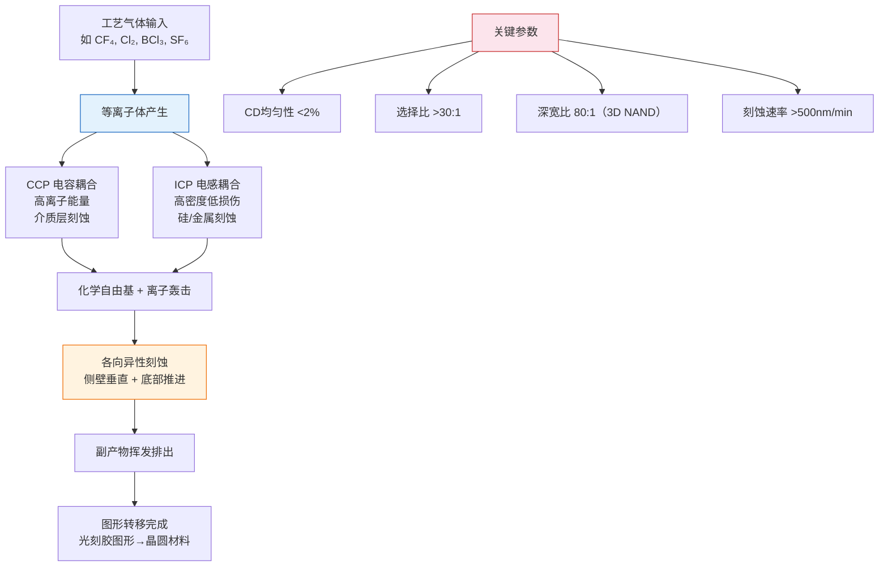
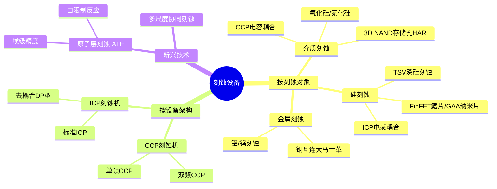
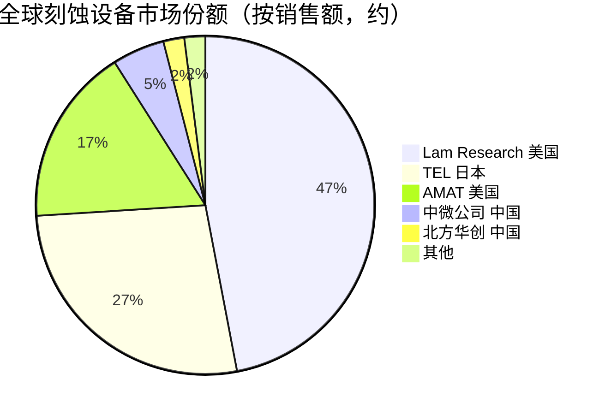

# 刻蚀设备

> 利用化学或物理方法选择性去除晶圆表面材料，将光刻胶上的图形精确转移至下层，是半导体制造中用量最大、工艺最复杂的设备类别。

## 概述

刻蚀是半导体制造中继光刻之后最关键的图形转移步骤。光刻将电路图形记录在光刻胶上，刻蚀则将图形"雕刻"到晶圆的各层材料中。在AI芯片的制造中，刻蚀工序数量随着制程推进和层数增加急剧攀升——7nm芯片需约100-120步刻蚀，3nm芯片则超过150步。刻蚀设备占晶圆厂设备总投资的20-25%，与光刻设备并列价值量最大的设备类别。

AI算力芯片的特殊性进一步放大了刻蚀设备的重要性。先进AI GPU采用多层堆叠的金属互连（14层以上金属层），需要大量高深宽比（HAR）刻蚀工序；HBM高带宽内存的TSV硅通孔需要深硅刻蚀；3D NAND的层数从128层向300层以上演进，其存储孔刻蚀深宽比超过80:1，对刻蚀设备能力提出极限挑战。

刻蚀设备是半导体设备中中国国产化进展最快的领域之一。中微公司（AMEC）的CCP刻蚀机已进入台积电5nm产线，北方华创的ICP刻蚀机在国内28nm及14nm产线广泛使用。刻蚀设备因此被视为中国半导体设备国产化"突围"的标杆领域。

## 技术原理

刻蚀按机理分为湿法刻蚀和干法刻蚀两大类。湿法刻蚀利用液态化学试剂溶解材料，工艺简单、成本低、选择比高，但各向同性（侧向钻蚀严重），无法满足亚微米制程精度要求。现代先进制程主要采用干法刻蚀（等离子刻蚀），利用等离子体产生的化学自由基和离子对材料进行各向异性刻蚀，兼具化学反应（高选择比）和物理轰击（方向性）的双重机制。

CCP（电容耦合等离子体）刻蚀通过射频电源在上下电极间产生高频电场，激发气体电离形成等离子体，离子在电场加速下垂直轰击晶圆表面，适用于介质层（氧化硅、氮化硅）刻蚀，具有较高离子能量。ICP（电感耦合等离子体）刻蚀通过螺旋线圈产生强磁场，在低压下形成高密度等离子体（10¹¹-10¹²/cm³），通过独立控制源功率和偏压功率，实现高刻蚀速率与低损伤的平衡，适用于硅、金属刻蚀及高深宽比结构。

先进刻蚀工艺的核心挑战在于：关键尺寸（CD）均匀性控制在纳米级、刻蚀剖面各向异性（侧壁垂直度>88°）、选择比（对不同材料的刻蚀速率差异）、深宽比相关刻蚀（ARDE）效应控制等。

## 分类与技术路线

刻蚀设备按刻蚀对象和工艺需求分为三大类。介质刻蚀（Dielectric Etch）主要采用CCP刻蚀机，用于刻蚀氧化硅、氮化硅等绝缘层，在3D NAND中承担存储孔（Memory Hole）和字线沟槽的高深宽比刻蚀，是技术难度最高的细分领域。硅刻蚀（Silicon Etch）主要采用ICP刻蚀机，用于晶体管栅极、FinFET鳍片、GAA纳米片结构以及TSV深硅刻蚀。金属刻蚀（Metal Etch）用于铝、铜、钨等金属导线图形化，随着铜互连采用大马士革工艺（Damascene，以介质刻蚀定义沟槽后电镀铜），金属刻蚀占比下降。

按设备架构划分，CCP刻蚀机又分高频/低频双频 CCP（控制离子能量分布）和单频 CCP；ICP刻蚀机分标准 ICP和去耦合等离子体（DP）型。此外，原子层刻蚀（ALE）作为新兴技术路线，通过自限制反应逐原子层去除材料，可实现埃（Å）级精度控制，是未来5nm以下制程的关键技术。

## 市场格局

全球刻蚀设备市场规模约250-280亿美元/年（2025年全球半导体设备总市场约1255亿美元），是半导体设备中最大的单一品类之一。随着3D NAND层数增长（从128层向300层+演进）和逻辑制程步骤增加，刻蚀设备需求增速高于行业均值。市场格局方面，泛林半导体（Lam Research，2025年营收约150亿美元）以约45-50%份额居首，TEL东京电子（2025年营收约140亿美元）约25-30%，AMAT应用材料（2025年营收约270亿美元）约15-20%，三大巨头合计占据约90%份额。

中国市场方面，中微公司CCP刻蚀机在逻辑芯片介质刻蚀领域已进入台积电5nm产线，市场份额逐步提升至约5-8%；北方华创ICP刻蚀机在28nm/14nm产线批量应用。总体国产刻蚀设备在国内市场自给率约15-20%，但先进制程领域仍有较大差距。

## 代表企业

| 企业 | 国家/地区 | 主要产品/技术 | 市场地位 |
|------|----------|-------------|---------|
| Lam Research | 美国 | CCP/ICP刻蚀机、KiYO系列 | 全球第一，介质刻蚀绝对龙头 |
| TEL 东京电子 | 日本 | CCP刻蚀机、Tactras系列 | 全球第二，3D NAND刻蚀强 |
| AMAT 应用材料 | 美国 | ICP刻蚀机、Producer系列 | 全球第三，硅刻蚀领域领先 |
| 中微公司 AMEC | 中国 | CCP刻蚀机Primo系列、ICP刻蚀机 | 国产刻蚀龙头，进入5nm产线 |
| 北方华创 | 中国 | ICP刻蚀机、AES系列 | 国产ICP刻蚀机主力 |
| Hitachi 高子 | 日本 | 单片式刻蚀机 | 日本市场有一定份额 |
| ULVAC | 日本 | 真空刻蚀设备 | 显示面板及半导体刻蚀 |
| 中科院微电子所 | 中国 | 刻蚀工艺与设备预研 | 国产刻蚀技术源头之一 |

## 发展趋势

### 市场规模预测

| 年份 | 市场规模 | 同比增长 | 备注 |
|------|---------|---------|------|
| 2024 | 约1130亿美元 | — | 基准年（半导体设备总市场） |
| 2025 | 约1255亿美元 | +11.1% | 泛林150亿/TEL 140亿/AMAT 270亿美元 |
| 2026E | 约1393亿美元 | +11% | 3D NAND 300层+推动刻蚀需求 |
| 2027E | 约1546亿美元 | +11% | GAA制程推动硅刻蚀升级 |

1. **高深宽比刻蚀持续突破**：3D NAND向300层以上推进，存储孔深宽比超过80:1，对刻蚀设备的剖面控制、选择比和均匀性提出极限挑战，Lam和TEL在此领域持续投入研发。

2. **原子层刻蚀（ALE）商业化**：ALE通过循环脉冲实现原子级精度刻蚀，已成为5nm以下逻辑制程和GAA晶体管的关键使能技术，CCP和ICP设备均在向ALE模式演进。

3. **GAA晶体管推动硅刻蚀升级**：3nm/2nm制程转向全环绕栅极（GAA）纳米片结构，需要高精度释放刻蚀（Release Etch）和选择比>100:1的刻蚀工艺，催生新一代ICP设备需求。

4. **国产化深化与品类扩张**：中微、北方华创在CCP和ICP领域持续突破后，正扩展至铝刻蚀、钨刻蚀等更多品类，国产刻蚀设备在国内市场渗透率有望从20%提升至40%以上。

5. **AI辅助工艺优化**：刻蚀工艺参数（气体配比、功率、压力等）优化高度依赖经验，AI/ML技术正被引入工艺recipe自动调优和缺陷预测，缩短新工艺开发周期。

## 与AI产业链的关联

刻蚀设备直接影响AI芯片的性能和良率。先进AI GPU的多层金属互连（14层+金属层）需要数十步刻蚀，每步CD偏差控制在1-2nm以内；HBM高带宽内存（2025年市场约300-350亿美元）的TSV深硅刻蚀是3D堆叠的关键；3D NAND的层数突破直接受益于刻蚀设备能力提升，而大容量NAND（2025年全球市场约650-925亿美元）是AI训练数据存储的基石。2025年全球AI芯片市场约2032亿美元，大规模AI芯片产能直接拉动刻蚀设备需求。中国刻蚀设备国产化的突破，为国内晶圆厂在出口管制下维持先进制程产能提供了重要支撑，是保障AI算力芯片自主制造能力的关键环节之一。

---
[← 返回总目录](../../README.md)
