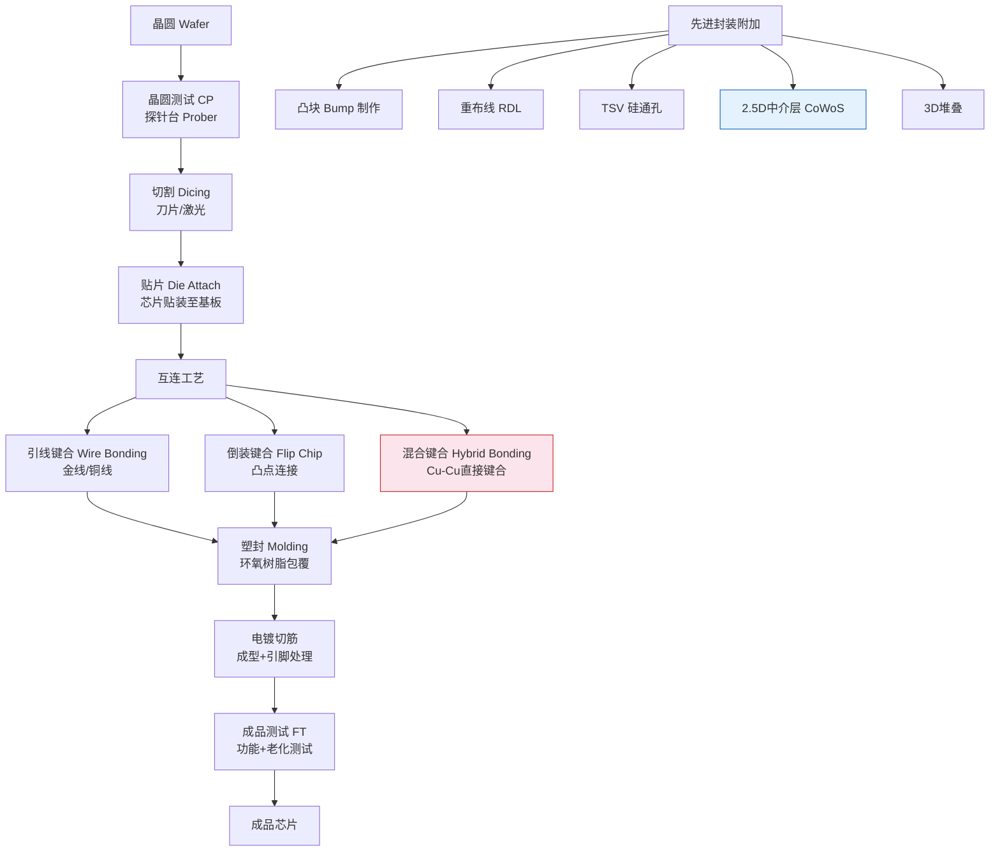
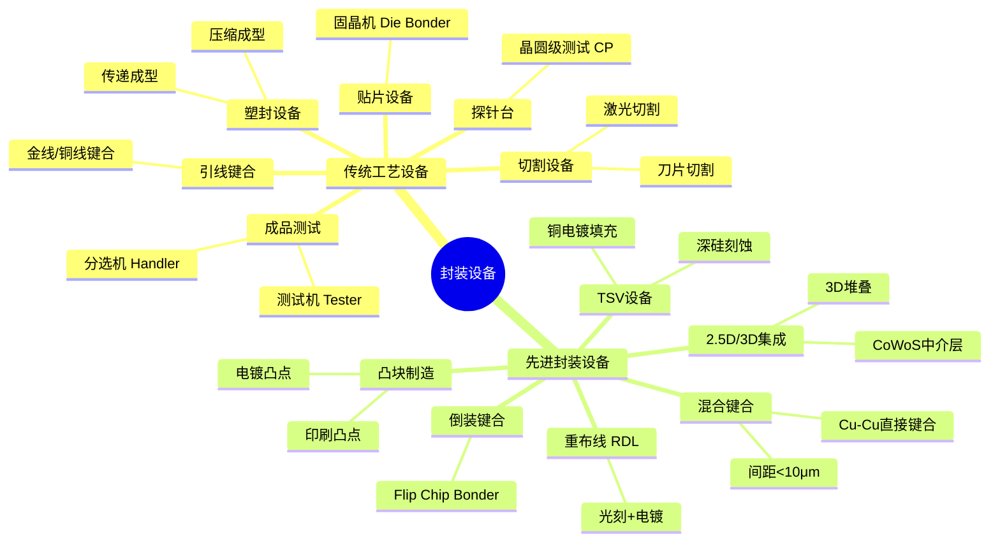
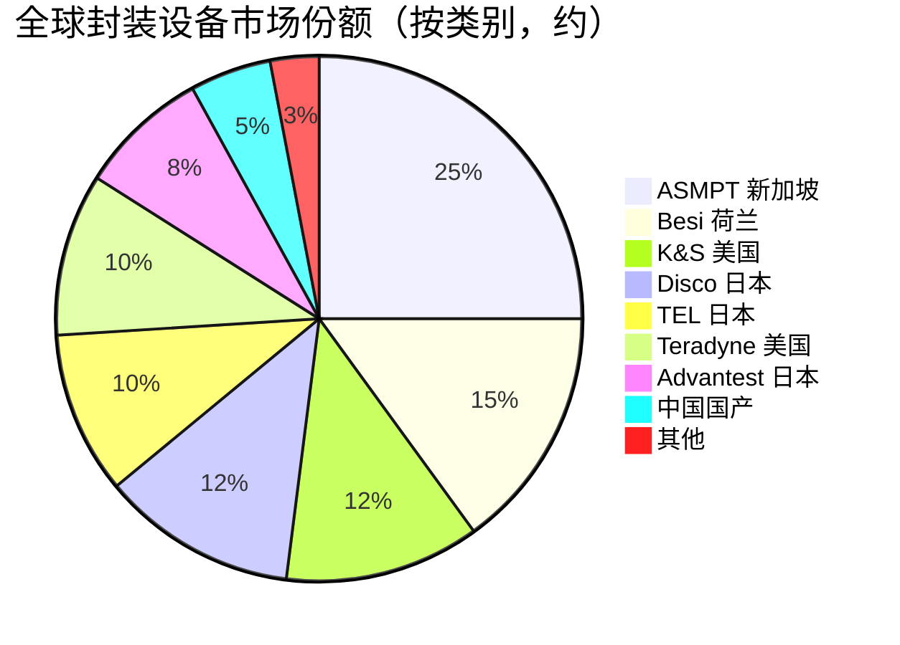

# 封装设备

> 用于完成晶圆切割、芯片互连、封装成型和电学测试的设备集群，是芯片从晶圆走向可用器件的关键环节，也是先进封装技术落地的基础设施。

## 概述

封装设备是半导体制造后道（Back-end）的核心装备，涵盖从晶圆切割到最终成品测试的全过程。传统封装流程包括：晶圆切割（Dicing）→ 芯片贴装（Die Attach）→ 引线键合/倒装（Wire Bonding/Flip Chip）→ 塑封（Molding）→ 电镀切筋（Plating/Trimming）→ 测试（Testing）。先进封装在此基础上引入了凸块（Bump）、重布线（RDL）、硅通孔（TSV）、混合键合（Hybrid Bonding）等新工艺环节。

随着AI算力需求爆发，封装环节的战略地位显著提升。NVIDIA H100/B200等高端AI GPU已普遍采用2.5D封装（如CoWoS）集成GPU与HBM，对凸块制作、TSV、微凸点和混合键合设备提出大量新需求。HBM高带宽内存的3D堆叠需要大规模TSV制造和混合键合设备。Chiplet芯粒封装趋势进一步放大封装设备价值——多芯粒通过先进封装集成，对高精度键合和互连设备需求陡增。

封装设备市场规模约60-70亿美元/年，增速随先进封装渗透率提升而加快。中国封测产业规模全球领先（长电、通富、华天三大封测厂进入全球前十），为国产封装设备提供了广阔的验证和成长空间。

## 技术原理

封装设备涵盖多种工艺类型，每类对应特定的设备：

**晶圆切割（Dicing）**：采用金刚石刀片机械切割或激光隐形切割（Stealth Dicing），将晶圆分割成单颗芯片。激光切割通过聚焦激光在晶圆内部形成改性层，再通过扩膜分离，切口窄、无碎屑，适合超薄晶圆。

**贴片（Die Attach）**：将切割后的芯片拾取并精确贴装至基板或引线框架上，采用环氧树脂或烧结银作为粘接剂。高精度贴片机需要微米级贴装精度和高速拾取能力。

**键合（Bonding）**：引线键合（Wire Bonding）采用热压或超声方式将金线/铜线连接芯片焊盘与基板引脚；倒装键合（Flip Chip）将芯片翻转，通过芯片凸点直接与基板焊盘连接；混合键合（Hybrid Bonding）实现铜-铜直接键合，间距<10μm，无需凸点，是3D堆叠的关键技术。

**塑封（Molding）**：采用环氧树脂通过传递成型（Transfer Molding）或压缩成型（Compression Molding）包覆芯片，提供机械保护和环境隔离。先进封装采用液态塑封料（LMC）降低翘曲。

**探针台（Prober）**：在晶圆切割前对每颗芯片进行电学测试，通过探针卡（Probe Card）接触芯片焊盘，测量电学参数，标记良品与不良品。

## 分类与技术路线

封装设备按工艺环节分为六大类：切割设备（刀片切割机、激光切割机）、贴片设备（固晶机/Die Bonder）、键合设备（引线键合机、倒装键合机、混合键合机）、塑封设备（传递成型机、压缩成型机）、探针台（晶圆测试用）和成品测试设备（分选机+测试机）。此外，先进封装引入了凸块制造设备（电镀/印刷凸点）、TSV制造设备（深硅刻蚀+电镀填充）、重布线设备（光刻+电镀）等新类别。

按技术路线划分，封装技术正从传统引线键合向倒装和混合键合演进。传统引线键合仍占封装总量60%以上，但先进封装（倒装、2.5D、3D）增速显著高于行业均值。Chiplet趋势推动基于混合键合的3D集成成为前沿方向。

## 市场格局

全球封装设备市场约60-70亿美元/年，其中键合设备约20亿美元，测试设备约15-20亿美元，切割+贴片约15亿美元，塑封及其他约10亿美元。市场格局方面：ASMPT（新加坡/荷兰）在引线键合和先进封装设备领域领先；Besi（荷兰）在倒装键合领域领先；K&S（Kulicke & Soffa，美国）在引线键合和先进封装有强地位；东京精密和Disco在切割设备领先；TEL和FormFactor在探针台领先；泰瑞达和爱德万在测试机双寡头垄断。

中国市场方面，长川科技、华峰测控在测试机领域有突破，新益昌在固晶机有一定份额，但先进封装关键设备（混合键合、倒装键合）仍主要依赖进口。

## 代表企业

| 企业 | 国家/地区 | 主要产品/技术 | 市场地位 |
|------|----------|-------------|---------|
| ASMPT | 新加坡/荷兰 | 引线键合机、倒装键合、先进封装 | 封装设备综合龙头 |
| Besi | 荷兰 | 倒装键合机、混合键合设备 | 先进封装键合领先 |
| K&S | 美国 | 引线键合机、先进封装设备 | 引线键合全球前三 |
| Disco | 日本 | 切割设备、研磨设备 | 切割设备全球龙头 |
| 东京精密 | 日本 | 切割、贴片、探针台 | 切割+贴片领先 |
| TEL 东京电子 | 日本 | 探针台Prober | 探针台全球领先 |
| Teradyne | 美国 | 测试机93000系列 | 测试机全球龙头之一 |
| 长川科技/华峰测控 | 中国 | 测试机、分选机 | 国产测试设备突破 |

## 发展趋势

1. **混合键合成为3D集成分水岭**：混合键合实现<10μm间距的Cu-Cu直接互连，是3D堆叠和Chiplet集成的使能技术，Besi和ASMPT正加速设备商业化，Intel和TSMC已导入量产。

2. **AI驱动先进封装产能扩张**：NVIDIA CoWoS封装产能曾成为GPU出货瓶颈，推动TSMC和封测厂大规模扩产，倒装键合和TSV设备需求爆发式增长。

3. **Chiplet推动异构集成设备需求**：多芯粒封装对高精度贴片、键合对准精度要求提升，微米级贴装和实时对准校正成为设备标配。

4. **激光切割渗透率提升**：超薄晶圆和3D堆叠对切割质量要求提高，激光隐形切割逐步替代部分刀片切割，Disco和东京精密持续迭代。

5. **国产封装设备加速验证**：长川科技测试机、新益昌固晶机在成熟封装领域已有份额，正进入先进封装领域验证，预计未来3-5年国产封装设备在国内市场渗透率从10%提升至25%以上。

## 与AI产业链的关联

封装设备直接决定AI芯片的互连密度和性能上限。NVIDIA H100/B200等AI GPU依赖2.5D CoWoS封装集成GPU与HBM，封装产能一度成为AI算力供应瓶颈；HBM高带宽内存的3D TSV堆叠需要大规模混合键合和TSV制造设备；Chiplet异构集成趋势将先进封装从"后道配套"提升为"算力架构关键环节"。封装设备的精度和产能直接影响AI芯片的带宽密度、功耗效率和出货节奏。在先进封装设备国产化加速的背景下，中国封测厂有望在AI时代获得更多自主制造能力，降低对进口先进封装设备的依赖。

---
[← 返回总目录](../../README.md)
