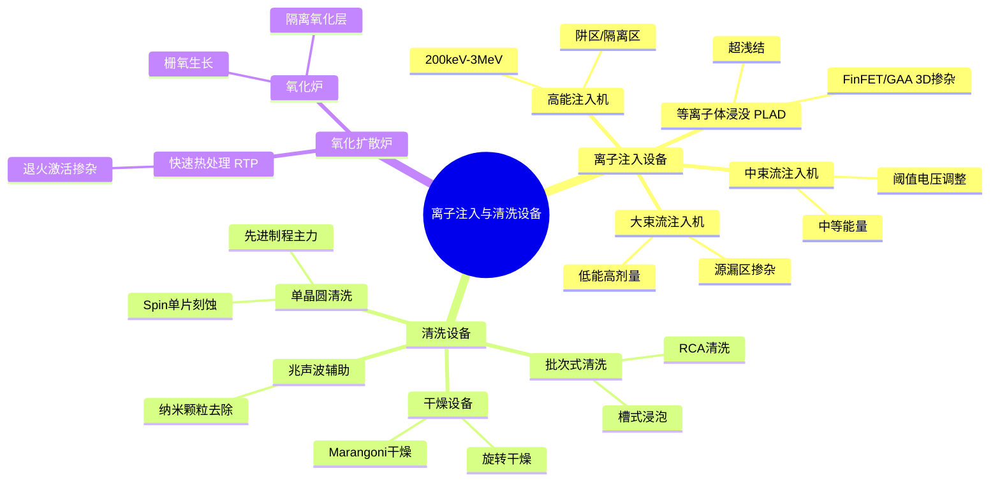
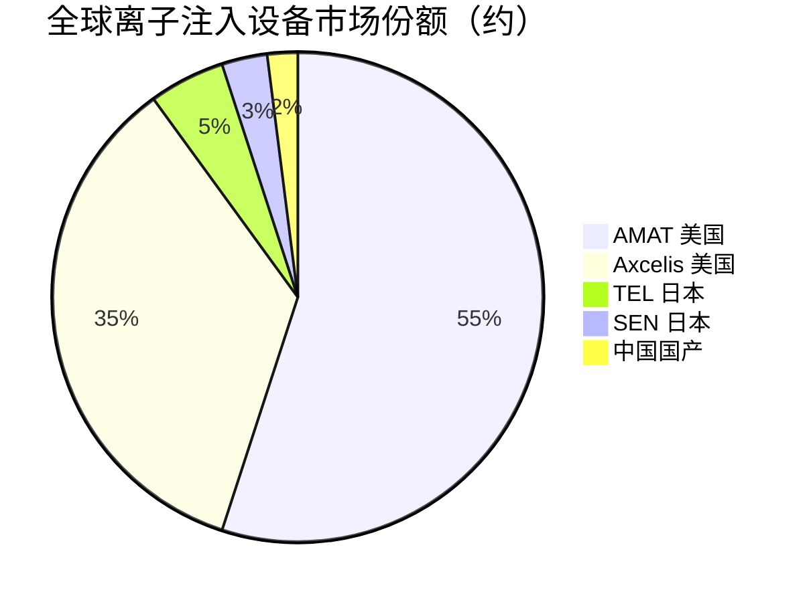

# 离子注入与清洗设备

> 离子注入机通过精确控制杂质原子注入晶圆改变电学性质，清洗设备保障晶圆每步工艺后无污染，两者共同支撑先进制程的器件性能与良率。

## 概述

离子注入与清洗是半导体制造中保障器件电学性能和晶圆洁净度的关键环节。离子注入是将掺杂原子（如硼、磷、砷）以高能离子形式注入硅晶圆，精确控制半导体器件的掺杂浓度和深度分布，形成源漏区、沟道和阱区等结构。清洗设备则贯穿晶圆制造全过程——一颗先进制程芯片需经过200-250步清洗工序，任何纳米级颗粒污染都可能导致芯片失效。

在AI芯片制造中，离子注入的精度要求随制程微缩急剧提升。7nm及以下制程需要超低能量离子注入（<500eV）实现超浅结（结深<10nm），以控制短沟道效应；FinFET和GAA晶体管需要三维精确掺杂，对束流均匀性和角度控制提出极致要求。清洗方面，AI芯片多层互连和TSV结构的高深宽比特征使得清洗难度大增，需要新型单晶圆清洗技术配合。

离子注入设备单价约500-2000万美元/台，占晶圆厂设备投资约5-8%；清洗设备虽单价较低（100-500万美元），但因工序数量庞大，总价值量占设备投资约5-7%。离子注入机是美国对华出口管制最严格的设备品类之一，国产化突破对自主AI芯片制造链具有重要战略意义。

## 技术原理

**离子注入原理**：将掺杂源材料气化电离形成等离子体，通过质量分析器（磁分析器）筛选出所需离子，经加速管加速至设定能量（数百eV到数MeV），由束流扫描系统均匀扫描至晶圆表面。离子能量决定注入深度，束流剂量决定掺杂浓度。注入后需退火激活掺杂原子并修复晶格损伤。

离子注入按能量分为：低能注入（<10keV，超浅结）、中能注入（10-200keV，源漏区）、高能注入（200keV-3MeV，阱区）。按束流形态分为束线式（Beamline）和等离子体浸没式（PLAD，Plasma Doping）：束线式是传统主力，束流均匀、能量精确，但低能大束流困难；PLAD通过等离子体包围晶圆实现大面积注入，适合超低能浅结，正在先进制程中扩大应用。

**清洗原理**：半导体清洗需去除颗粒、有机物、金属污染和自然氧化层。主流技术包括：RCA清洗（SC-1去除颗粒+SC-2去除金属）、稀HF/DHF去除氧化层、SPM（硫酸+双氧水）去除有机物、APM/HPM去粒子。先进制程逐步从批次式浸泡清洗转向单晶圆单片清洗（Spin Cleaning），配合超声波/兆声波辅助和选择性刻蚀，以提高清洗效果并减少晶圆损失。

```mermaid
graph TD
    subgraph 离子注入工艺
        I1["掺杂源材料气化<br/>如 BF₃, PH₃, AsH₃"] --> I2["电离形成等离子体"]
        I2 --> I3["磁分析器筛选离子<br/>质量分辨率M/ΔM>100"]
        I3 --> I4["加速管加速<br/>能量0.5keV-3MeV"]
        I4 --> I5["束流扫描均匀注入<br/>剂量精度<1%"]
        I5 --> I6["退火激活+晶格修复<br/>RTA 1000°C+"]
    end

    subgraph 清洗工艺
        C1["RCA清洗 SC-1<br/>NH₄OH+H₂O₂<br/>去除颗粒"] --> C2["RCA清洗 SC-2<br/>HCl+H₂O₂<br/>去除金属"]
        C2 --> C3["稀HF/DHF<br/>去除自然氧化层"]
        C3 --> C4["兆声波辅助<br/>去除纳米颗粒"]
        C4 --> C5["干燥 Marangoni/旋转<br/>防水印"]
    end

    style I3 fill:#e3f2fd,stroke:#1565c0
    style I5 fill:#fff3e0,stroke:#ef6c00
    style C4 fill:#e8f5e9,stroke:#2e7d32
```

## 分类与技术路线

离子注入设备按能量和束流特性分为：大束流离子注入机（High Current，用于源漏区低能大剂量注入）、中束流离子注入机（Medium Current，用于阈值电压调整）、高能离子注入机（High Energy，用于阱区/隔离区）。此外还有等离子体浸没掺杂设备（PLAD），针对超浅结应用。

清洗设备按工艺形态分为：批次式清洗机（Batch，如槽式清洗，适合成熟制程）、单晶圆清洗机（Single Wafer，适合先进制程高洁净度需求）、兆声波辅助清洗设备。此外还有刷洗器（Brush）、干燥设备（Marangoni干燥/旋转干燥）。氧化扩散炉虽非清洗设备，但常与注入设备配套——注入后退火在快速热处理炉（RTP）或扩散炉中进行，氧化炉用于生长栅氧和隔离氧化层。

## 市场格局

全球离子注入设备市场约30-35亿美元/年，清洗设备市场约25-30亿美元/年，氧化扩散炉约15-20亿美元（2025年全球半导体设备总市场约1255亿美元）。离子注入机市场由AMAT应用材料（2025年营收约270亿美元，份额约55%）和Axcelis（约35%）双寡头垄断，TEL在部分细分有份额。清洗设备市场方面，DNS（迪恩士）和TEL（东京电子，2025年营收约140亿美元）合计占约50-60%，Lam和AMAT紧随其后。氧化扩散炉领域主要由ASM、TEL和Kokusai主导。

中国市场方面，凯世通（中晟）在离子注入机领域有布局，盛美半导体在单片清洗设备领域表现突出，已进入国际市场；北方华创、至纯科技在清洗和扩散炉领域有产品。国产离子注入机自给率不足10%，是国产化最薄弱的设备品类之一。

## 代表企业

| 企业 | 国家/地区 | 主要产品/技术 | 市场地位 |
|------|----------|-------------|---------|
| AMAT 应用材料 | 美国 | VIISta大束流/中束流/高能注入机 | 全球离子注入龙头 |
| Axcelis | 美国 | Puradar大束流、Stratus高能注入 | 全球第二大离子注入设备商 |
| SEN SMIT | 日本 | IMX离子注入机 | 日本市场有一定份额 |
| TEL 东京电子 | 日本 | CLEAN TRACK清洗设备、Surpass注入 | 清洗设备全球领先 |
| DNS 迪恩士 | 日本 | 单片/槽式清洗机 | 清洗设备全球第一 |
| 盛美半导体 ACM | 中国 | 单片清洗机、兆声波清洗 | 国产清洗龙头，进入国际市场 |
| 凯世通/中晟 | 中国 | 离子注入机 | 国产离子注入设备布局 |
| 北方华创 | 中国 | 清洗设备、氧化扩散炉 | 国产清洗+扩散炉主力 |

## 发展趋势

### 市场规模预测

| 年份 | 市场规模 | 同比增长 | 备注 |
|------|---------|---------|------|
| 2024 | 约1130亿美元 | — | 基准年（半导体设备总市场） |
| 2025 | 约1255亿美元 | +11.1% | AMAT 270亿/TEL 140亿美元 |
| 2026E | 约1393亿美元 | +11% | 先进制程扩产拉动离子注入+清洗需求 |
| 2027E | 约1546亿美元 | +11% | GAA制程推动PLAD等离子体掺杂 |

1. **超低能大束流注入**：5nm以下制程需要<500eV超低能注入形成<5nm浅结，同时保持高束流以维持产能，AMAT和Axcelis正突破空间电荷效应限制。

2. **PLAD等离子体掺杂崛起**：GAA晶体管的三维沟道掺杂需要PLAD等面掺杂技术，可解决束线式注入在Fin侧面剂量不足的问题，预计在3nm以下节点扩大应用。

3. **单晶圆清洗成为主流**：先进制程颗粒容忍度降至纳米级，单晶圆清洗凭借更好的工艺控制和可追溯性，逐步替代批次式清洗，市场份额持续提升。

4. **选择性清洗与新型化学**：高深宽比结构清洗需要选择性刻蚀配合，新型化学试剂（如TMAH、DHF+H₂O₂）和兆声波优化成为研发重点。

5. **国产化攻坚与突破**：凯世通、盛美等企业在注入和清洗领域已有产品验证，正加速向先进制程突破；未来5年国产离子注入和清洗设备在国内市场渗透率有望从10%提升至25-30%。

## 与AI产业链的关联

离子注入直接决定AI芯片晶体管的电学性能。先进AI GPU的FinFET/GAA晶体管需要精确到原子级的沟道掺杂控制，影响晶体管开关速度和功耗，直接关系到AI算力芯片的能效比；超浅结技术是控制短沟道效应、实现先进制程微缩的前提。2025年全球AI芯片市场约2032亿美元（同比翻倍），NVIDIA Blackwell架构GPU出货占比80%+，大规模AI芯片产能直接拉动离子注入与清洗设备需求。清洗工序则保障AI芯片整个制造链路的良率——先进制程颗粒容忍度低至每片<10个10nm颗粒，任何污染都会导致AI芯片失效。在出口管制背景下，国产离子注入机的突破是保障中国自主先进制程AI芯片制造链的关键短板之一。

---
[← 返回总目录](../../README.md)
