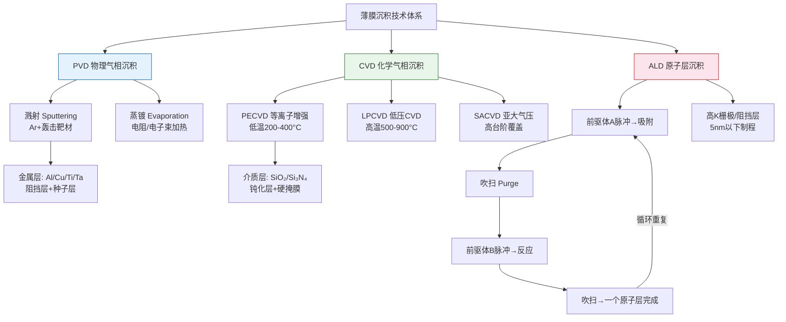
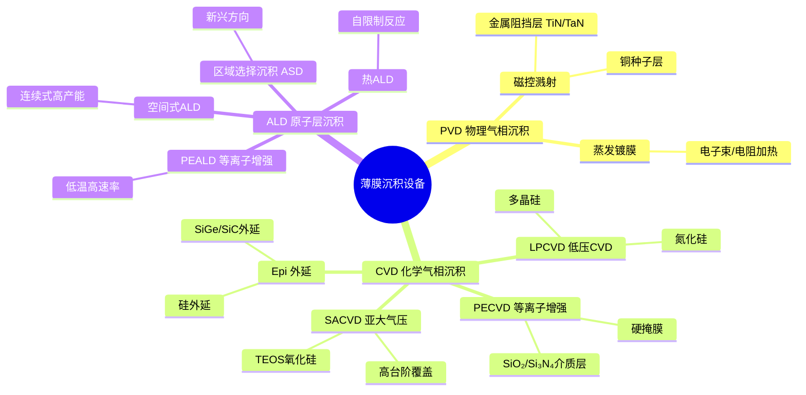
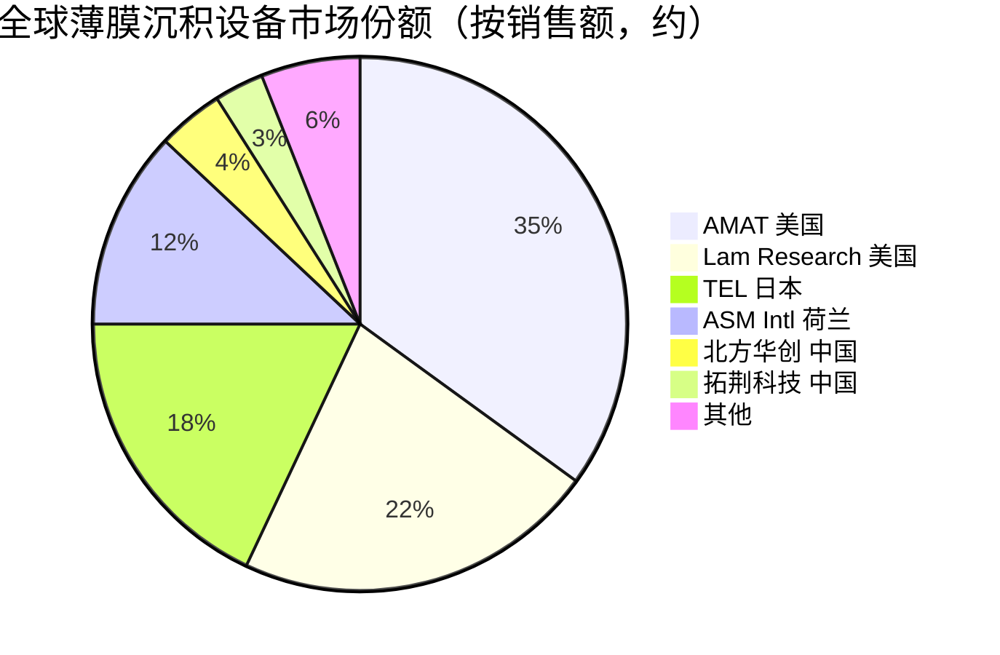

# 薄膜沉积设备

> 在晶圆表面沉积各类功能薄膜材料（导电层、绝缘层、阻挡层等）的设备集群，是半导体制造中工序数量最多、技术路线最丰富的设备类别。

## 概述

薄膜沉积是指在晶圆衬底上以物理或化学方法生长出纳米至微米级厚度薄膜的工艺，是半导体制造中覆盖工序最广的设备类别。一颗先进AI芯片在制造过程中需沉积50-80层不同功能的薄膜，包括栅极氧化层、金属阻挡层、铜种子层、钝化层、硬掩膜等。薄膜沉积设备占晶圆厂设备总投资约20%，与光刻、刻蚀并列为三大核心设备品类。

AI芯片对薄膜沉积的要求极为苛刻。先进AI GPU采用多层金属互连（14层以上），每层需要高质量的扩散阻挡层（如TiN、TaN，厚度仅2-5nm）和铜种子层；7nm以下制程的接触孔需要原子层沉积（ALD）形成均匀的阻挡层；HBM的TSV工艺需要绝缘层和铜填充；3D NAND的字线/位线堆叠需要大批量CVD沉积。薄膜的厚度均匀性（<1%）、台阶覆盖性（>90%）、成分与应力控制直接决定芯片可靠性和良率。

随着制程微缩，传统PVD和CVD面临物理极限，ALD技术凭借原子级厚度控制和优异台阶覆盖能力，成为5nm以下制程不可或缺的关键技术。ALD设备市场近年来保持30%以上的高速增长。

## 技术原理

薄膜沉积主要分为三大技术路线：物理气相沉积（PVD）、化学气相沉积（CVD）和原子层沉积（ALD）。

**PVD（物理气相沉积）**：在高真空环境下，通过溅射（Sputtering）将靶材原子以物理方式沉积至晶圆表面。氩离子在电场加速下轰击靶材，靶材原子溅射飞出并在晶圆上形成薄膜。PVD具有薄膜纯度高、附着力强的优点，广泛用于金属层（铝、铜、钛、钽）沉积，但台阶覆盖性较差，不适合高深宽比结构。PVD是铜互连阻挡层和种子层沉积的主力技术。

**CVD（化学气相沉积）**：利用气态前驱物在晶圆表面发生化学反应生成固态薄膜。按压力和能量输入方式分为：常压CVD（APCVD）、低压CVD（LPCVD）、等离子增强CVD（PECVD）、亚大气压CVD（SACVD）。PECVD利用等离子体增强反应，可在低温（200-400°C）下沉积，是介质层（氧化硅、氮化硅、氮氧化硅）沉积的主流技术。

**ALD（原子层沉积）**：通过循环交替通入两种（或多种）前驱体，每个循环只沉积一个原子层（约0.1nm），通过自限制表面反应实现精确的厚度控制和极致的台阶覆盖（即使在深宽比>50:1的结构中也能保证>95%的覆盖率）。ALD是5nm以下制程阻挡层和高K栅极沉积的使能技术。

## 分类与技术路线

薄膜沉积设备按技术路线分为PVD、CVD和ALD三大体系，各体系内又按工艺条件细分。PVD设备主要包括磁控溅射台和蒸镀台，用于金属和合金沉积，代表产品为AMAT的Endura系列。CVD设备种类最多：PECVD用于介质层沉积（代表为AMAT Producer、Lam VECTOR）；LPCVD多用于多晶硅和氮化硅（如TEL Triase）；SACVD用于高台阶覆盖需求场景（如TEOS沉积氧化硅）。此外还有外延沉积（Epi），用于在硅衬底上生长单晶硅外延层，是功率器件和先进逻辑制程的关键工艺。

ALD设备分为热ALD（Thermal ALD）和等离子增强ALD（PEALD）。PEALD利用等离子体产生反应性自由基，可在更低温度下实现更高沉积速率，是先进制程主力。ALD可进一步细分为空间式ALD（Spatial ALD，连续式高产能）和批次式ALD。新兴方向包括区域选择沉积（Area-Selective Deposition, ASD），通过表面修饰实现只在特定区域成膜，可简化工艺步骤。

## 市场格局

全球薄膜沉积设备市场规模约200-220亿美元/年，其中CVD约120亿美元，PVD约40亿美元，ALD约40-50亿美元（增速最快，CAGR>20%）。市场格局高度集中：AMAT（应用材料）在PVD领域近乎垄断（份额>85%），在CVD领域份额约30%；Lam Research在PECVD领域领先（份额约25%）；TEL在CVD领域约20%；ASM International在ALD领域全球领先（份额约40-50%）。

中国市场方面，北方华创在PVD领域已实现28nm产线批量应用，拓荆科技在PECVD领域进入国内主流产线，中微公司在ALD领域有布局。国产薄膜设备在国内市场自给率约10-15%，但先进制程薄膜设备仍依赖进口。

## 代表企业

| 企业 | 国家/地区 | 主要产品/技术 | 市场地位 |
|------|----------|-------------|---------|
| AMAT 应用材料 | 美国 | Endura PVD、Producer CVD、Olympia ALD | PVD绝对龙头，CVD领先 |
| Lam Research | 美国 | VECTOR PECVD、Striker ALD | PECVD领域领先 |
| TEL 东京电子 | 日本 | Triase CVD、NTT ALD | CVD领域第三 |
| ASM International | 荷兰 | Eagle ALD/PEALD | ALD全球龙头 |
| 北方华创 | 中国 | PVD磁控溅射、CVD设备 | 国产PVD龙头 |
| 拓荆科技 | 中国 | PECVD设备、SACVD | 国产PECVD领先 |
| 中微公司 AMEC | 中国 | ALD设备 | 国产ALD布局 |
| AIXTRON | 德国 | MOCVD外延设备 | 化合物半导体外延龙头 |

## 发展趋势

1. **ALD高速增长成为主力**：5nm以下制程阻挡层厚度需<2nm，传统PVD/CVD无法满足，ALD凭借原子级精度成为必需，ALD设备市场预计未来5年CAGR超20%。

2. **区域选择沉积（ASD）突破**：ASD只在特定区域成膜，可减少光刻和刻蚀步骤、降低成本，AMAT和ASM正加速商业化，有望在3nm节点实现量产应用。

3. **高深宽比结构沉积挑战**：3D NAND 300层+和TSV结构需要ALD在深宽比>80:1的孔内保证>95%覆盖率，对前驱体化学和工艺设计提出极限挑战。

4. **国产替代深化**：北方华创PVD、拓荆PECVD已实现28nm量产，正向14nm及以下突破；ALD领域中微、微导等企业加速布局，预计未来3年国产薄膜设备在国内市场渗透率翻倍。

5. **外延与混合键合驱动新需求**：GAA晶体管需要高质量SiGe/Si外延，3D堆叠封装需要混合键合界面薄膜，催生外延设备和新型薄膜技术的增量需求。

## 与AI产业链的关联

薄膜沉积设备支撑着AI芯片的多层互连和高性能结构。AI GPU的多层金属互连每层都需要ALD沉积超薄阻挡层（2nm以下），防止铜扩散导致的可靠性问题；7nm以下制程的接触电阻需要ALD沉积低阻接触层，直接影响AI芯片的功耗和性能；HBM TSV工艺需要CVD绝缘层和ALD扩散阻挡层；3D NAND层数增长依赖于PECVD高产能介质沉积。ALD等先进薄膜技术是中国突破先进制程封锁的关键工具，对保障国产AI算力芯片制造链具有重要战略意义。

---
[← 返回总目录](../../README.md)
