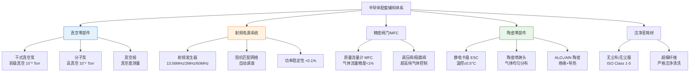
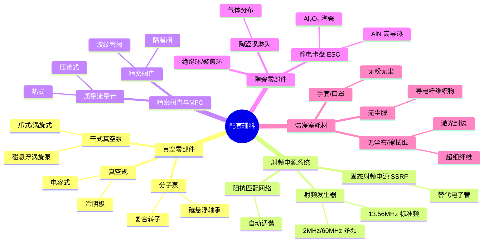
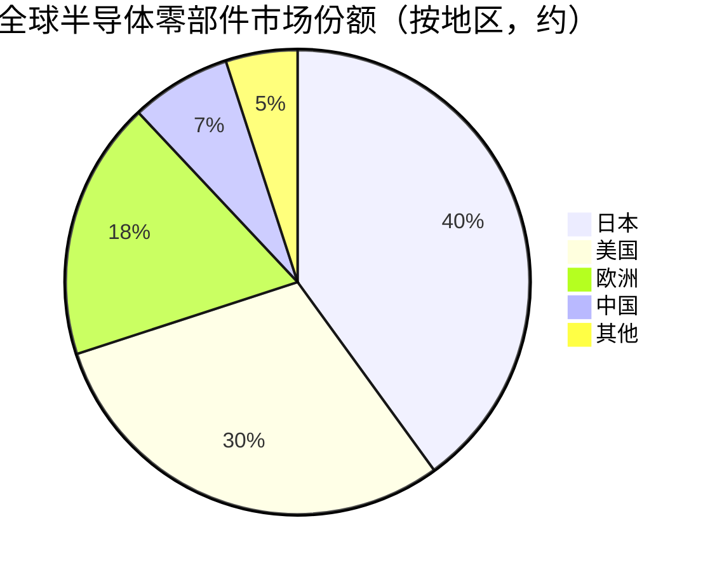

# 配套辅料

> 半导体设备中不可或缺的基础零部件和耗材，涵盖真空零部件、射频电源、精密阀门、陶瓷零部件、洁净室耗材等，是支撑设备稳定运行和工艺精度的"工业基石"。

## 概述

配套辅料是半导体设备产业链中常被忽视、却对设备性能和良率有着决定性影响的关键环节。一台光刻机包含超10万个零部件，来自全球5000余家供应商；一台刻蚀设备涉及真空泵、射频电源、质量流量计、陶瓷静电卡盘等数十种核心辅料。这些配套辅料的技术水平直接决定了半导体设备的工作精度、可靠性和成本。

在AI芯片制造背景下，配套辅料的重要性进一步凸显。先进AI GPU制造涉及的7nm以下制程对真空度、气体纯度、温度均匀性的要求达到极限水平——例如刻蚀设备内真空度需<10⁻⁶ Torr，射频电源频率稳定性要求<0.1%，静电卡盘温度均匀性需<±0.5°C。这些指标直接由核心零部件的性能决定。此外，先进制程设备的高价值化（单台EUV光刻机超3亿美元）使得高端零部件单价也水涨船高，如射频电源单台售价可达30-50万美元，陶瓷静电卡盘单价10-20万美元。

配套辅料市场虽然分散，但总规模可观，2025年全球半导体零部件市场约500-600亿美元/年（随全球半导体设备市场约1255亿美元同步扩容）。该领域技术壁垒高、认证周期长，日本和美国企业长期主导高端市场。中国正加速推进零部件国产化，部分细分领域已取得突破，但高端核心零部件仍高度依赖进口。

## 技术原理

配套辅料按功能可分为几大类，每类对应不同的技术原理：

**真空零部件**：包括干式真空泵、分子泵、冷阴极真空规等。半导体刻蚀、CVD、PVD等工艺需在高真空环境下进行，干式涡旋泵/罗茨泵作为前级泵建立基础真空，分子泵（涡轮分子泵）通过高速旋转转子（数万RPM）将气体分子定向输运实现高真空。冷阴极真空规通过测量电离电流反推真空度。

**射频电源**：为刻蚀和CVD设备提供等离子体激发能量。射频电源将工频电转换为13.56MHz（或2MHz/27MHz/60MHz）高频电功率，通过阻抗匹配网络馈入等离子体腔体。射频电源的频率稳定性、功率稳定性（<0.1%）和阻抗匹配速度直接影响等离子体密度和刻蚀均匀性。

**精密阀门与质量流量计（MFC）**：质量流量计通过热式或压差式原理精确控制工艺气体流量，精度要求<1%。精密阀门包括调压阀、隔膜阀、波纹管阀，需满足超高纯气体不污染要求。

**陶瓷零部件**：包括静电卡盘（ESC，通过静电力固定晶圆并控温）、陶瓷喷淋头（Showerhead，均匀分布工艺气体）、陶瓷绝缘环等。氧化铝（Al₂O₃）和氮化铝（AlN）陶瓷因高绝缘、高导热、耐等离子腐蚀而成为核心材料。

**洁净室耗材**：包括无尘布、无尘服、手套、口罩、擦拭纸等。洁净室环境需达到ISO Class 1-5级（每立方米≥0.1μm颗粒<10-100个），耗材需使用超细纤维并通过严格洁净清洗。

## 分类与技术路线

配套辅料按应用领域和技术特性细分为以下体系。真空零部件方面，干式真空泵正从爪式/涡旋式向更洁净的磁悬浮涡旋泵演进，分子泵向更高转速和更长寿命方向发展。射频电源方面，从固定频率单频向多频可调发展，固态射频电源（SSRF）逐步替代电子管电源，提供更高稳定性和更长寿命。MFC方面，从热式向压差式+热式复合发展，数字通信（DeviceNet/Modbus）替代模拟信号控制。陶瓷零部件方面，AlN陶瓷因更高导热率（170W/m·K）逐步替代Al₂O₃成为先进ESC首选材料，精密加工技术持续迭代。洁净室耗材方面，无尘布向超细纤维和激光封边技术发展，无尘服向更致密织物和全封闭式设计演进。

## 市场格局

全球半导体零部件市场约500-600亿美元/年（2025年全球半导体设备总市场约1255亿美元），其中真空零部件约60-80亿美元，射频电源约40-50亿美元，MFC及阀门约30-40亿美元，陶瓷零部件约40-50亿美元，洁净室耗材约30-40亿美元。随半导体设备市场扩容（2025年约1255亿美元，同比+11%），配套辅料市场同步增长。市场高度集中于日本和美国企业。

真空零部件由Edwards（英国，现属Atlas Copco）、Pfeiffer（德国）、ULVAC（日本）、Ebara（日本）主导。射频电源由Advanced Energy（美国，约50%份额）、MKS（美国）主导。MFC由HORIBA（日本）、Brooks（美国）、MKS主导。陶瓷零部件由日本特殊陶业（NGK）、京瓷（Kyocera）、CoorsTek（美国）主导。洁净室耗材由Texwipe（美国）、BERNARD（日本）、伊藤忠主导。

中国市场方面，汉钟精机在干式真空泵有布局，中微富创和北方华创在射频电源有进展，费勉纳在MFC有产品，但整体国产化率不足10%。高端零部件是中国半导体设备产业链国产化的关键短板。

## 代表企业

| 企业 | 国家/地区 | 主要产品/技术 | 市场地位 |
|------|----------|-------------|---------|
| Edwards/Atlas Copco | 英国 | 干式真空泵、分子泵 | 真空泵全球龙头 |
| Pfeiffer | 德国 | 分子泵、真空规 | 真空技术领先 |
| Advanced Energy | 美国 | 射频电源、阻抗匹配 | 射频电源全球第一，份额约50% |
| MKS Instruments | 美国 | 射频电源、MFC、阀门 | 综合零部件龙头 |
| HORIBA | 日本 | 质量流量计MFC | MFC全球领先 |
| NGK/日本特殊陶业 | 日本 | 陶瓷静电卡盘ESC | 陶瓷零部件龙头 |
| 京瓷 Kyocera | 日本 | 陶瓷喷淋头、绝缘环 | 陶瓷零部件领先 |
| 汉钟精机 | 中国 | 干式真空泵 | 国产真空泵布局 |

## 发展趋势

### 市场规模预测

| 年份 | 市场规模 | 同比增长 | 备注 |
|------|---------|---------|------|
| 2024 | 约1130亿美元 | — | 基准年（半导体设备总市场） |
| 2025 | 约1255亿美元 | +11.1% | 零部件市场约500-600亿美元 |
| 2026E | 约1393亿美元 | +11% | 随设备市场扩容同步增长 |
| 2027E | 约1546亿美元 | +11% | AI芯片扩产拉动零部件需求 |

1. **固态射频电源替代加速**：传统电子管射频电源寿命短、稳定性差，固态射频电源（SSRF）凭借长寿命、高稳定性和数字控制优势，正快速替代电子管，Advanced Energy等企业新品全线固态化。

2. **陶瓷零部件向AlN材料演进**：先进制程对温度均匀性要求提升，AlN陶瓷因导热率（170W/m·K）远高于Al₂O₃（30W/m·K），正成为高端ESC首选材料，NGK和京瓷持续迭代。

3. **真空泵向无油磁悬浮发展**：磁悬浮轴承消除了机械接触磨损，实现无油洁净真空，寿命延长至5-8年，Edwards和Pfeiffer正推出新一代磁悬浮分子泵。

4. **MFC向数字智能演进**：基于半导体MEMS流量传感器和数字通信协议的新一代MFC，可实现远程监控、自诊断和工艺recipe自动配置，精度从1%提升至0.5%以下。

5. **国产化加速突破**：在出口管制和供应链安全驱动下，中国正集中资源攻关核心零部件，真空泵、射频电源、MFC、陶瓷零部件等领域均有企业在验证导入，预计未来5年国产零部件渗透率从不足10%提升至20-30%。

## 与AI产业链的关联

配套辅料是AI芯片制造设备稳定运行的基础保障。先进AI GPU制造涉及的光刻、刻蚀、薄膜沉积等核心设备，其工作精度和可靠性直接由真空泵的真空度、射频电源的功率稳定性、MFC的流量精度、ESC的温度均匀性决定。2025年全球半导体设备市场约1255亿美元（同比+11%），AI芯片市场约2032亿美元（同比翻倍），大规模AI芯片产能扩张直接拉动半导体设备及配套零部件需求。任何核心零部件的性能不足或供应中断，都会导致AI芯片产线停摆——例如射频电源故障会导致刻蚀设备停机，直接影响产能。在出口管制背景下，高端零部件的国产化突破对保障中国AI芯片制造链的自主可控和连续运行具有战略意义，是半导体设备国产化"最后一公里"的关键拼图。

---
[← 返回总目录](../README.md)
