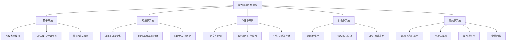
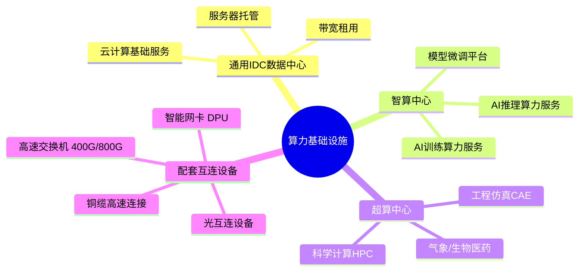
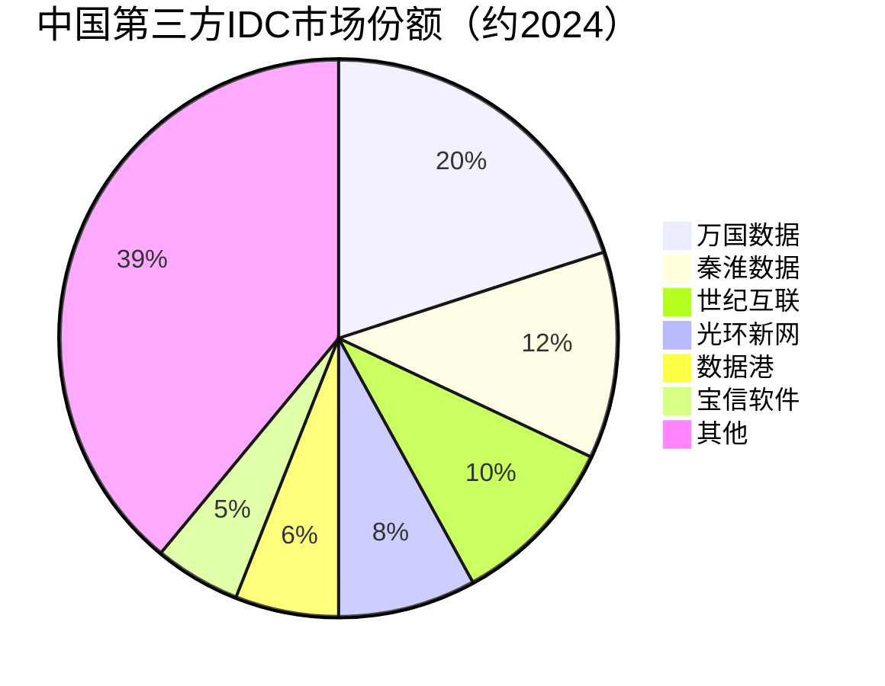

# 算力基础设施

> IDC数据中心、智算中心、超算中心及配套网络互连设备的统称，是AI算力的物理承载基础。

## 概述

算力基础设施是AI产业链下游的"数字底座"，为AI训练和推理提供计算、存储、网络等基础资源。随着大模型参数规模突破万亿级，单次训练所需的算力从PFLOPS级跃升至EFLOPS级，传统数据中心已无法满足需求，智算中心应运而生。

智算中心（AI Computing Center）是专门面向AI计算任务设计的新型数据中心，以GPU/NPU等AI加速芯片为核心算力单元，配备高带宽互连网络、大容量高速存储和高效散热系统。与通用IDC相比，智算中心的单机柜功率密度从传统的6-8kW提升至30-100kW以上，对供电、散热、网络架构提出全新要求。

超算中心则面向科学计算、气象预报、药物研发等HPC场景，采用大规模并行计算架构。随着AI与HPC融合趋势加速，智算中心与超算中心的边界逐渐模糊，融合型算力中心成为发展趋势。

中国"东数西算"工程规划了8个国家算力枢纽节点和10个国家数据中心集群，引导算力资源向西部低成本能源区域布局。三大运营商、互联网巨头和第三方IDC企业纷纷加码智算中心建设，中国智算中心投资规模预计2025年突破千亿元。

## 技术原理

算力基础设施的技术体系围绕"计算-网络-存储-供电-散热"五大子系统展开。

**计算子系统**：以AI服务器为基本单元，通过机柜级集成形成计算节点集群。智算中心采用GPU/NPU服务器集群，通过NVLink、InfiniBand等高速互连实现节点间低延迟通信。单集群规模可达万卡级别，算力规模达EFLOPS级。

**网络子系统**：采用Spine-Leaf胖树拓扑架构，消除网络拥塞。核心层使用400G/800G以太网交换机或InfiniBand交换机，接入层配置100G/200G网卡。RDMA技术实现内核旁路，将网络延迟降至微秒级。无损网络（PFC+ECN）保障数据传输可靠性。

**存储子系统**：采用分布式并行文件系统（如Lustre、GPFS），全闪存NVMe SSD阵列提供高IOPS和低延迟。训练数据通过分布式缓存预加载至GPU显存，减少I/O瓶颈。

**供电子系统**：采用2N或N+1冗余架构，UPS+柴油发电机保障持续供电。高压直流供电（HVDC）提升效率，智能PDU实现机柜级能耗监控。

**散热子系统**：风冷适用单机柜功耗<15kW场景；液冷适用于15-100kW高密场景。冷板式液冷通过冷却液循环散热，可带走60-70%热量；浸没式液冷将IT设备浸入介电液体，散热效率最高。余热回收利用技术可将数据中心废热用于区域供暖。

## 分类与技术路线

算力基础设施按服务类型和算力等级可分为三大类：

**通用IDC数据中心**：提供服务器托管、带宽租用等基础服务。以互联网企业、金融机构和政府客户为主，单机柜功率密度通常6-15kW，采用风冷散热。代表企业包括万国数据、世纪互联、秦淮数据等。

**智算中心**：专门面向AI计算任务设计，以GPU/NPU集群为核心算力单元。单机柜功率密度30-100kW以上，采用液冷散热方案。提供AI训练、推理、模型微调等服务。代表企业包括百度智能云、阿里云、华为云等。

**超算中心**：面向科学计算和工程仿真等HPC场景，采用大规模并行计算架构。代表包括神威·海洋之光、天河二号等国家级超算中心，以及商业超算服务商。

按建设模式可分为：自建型（互联网巨头自建）、托管型（第三方IDC企业建设出租）、混合型（核心自建+弹性扩容）。

## 市场格局

全球数据中心市场2024年规模约2500亿美元，其中AI驱动的智算中心投资占比快速提升。中国IDC市场规模约3000亿元人民币，智算中心占比从2023年的15%快速提升至2025年的30%以上。

在IDC服务商方面，万国数据（GDS）是中国最大的第三方IDC服务商，运营机柜超过10万个；世纪互联、秦淮数据（被贝恩资本私有化）、光环新网等位列国内前列。三大运营商（中国电信、中国移动、中国联通）凭借网络资源和客户优势，合计占据国内IDC市场超过50%份额。

在云服务方面，阿里云、华为云、腾讯云、百度智能云占据国内公有云市场主导地位。全球市场由AWS、Microsoft Azure、Google Cloud主导。

交换机市场由Cisco（约40%）、Arista Networks（约15%）、华为（约10%）主导。InfiniBand交换机由NVIDIA（Mellanox）垄断。高速网卡市场NVIDIA ConnectX系列占主导地位。

## 代表企业

| 企业 | 国家/地区 | 主要产品/技术 | 市场地位 |
|------|----------|-------------|---------|
| 万国数据 | 中国 | GDS智算中心、数据中心托管 | 中国最大第三方IDC服务商 |
| 世纪互联 | 中国 | 数据中心托管、云服务 | 中国IDC行业先行者 |
| 秦淮数据 | 中国 | 数据中心定制化服务 | 亚太领先IDC运营商 |
| Equinix | 美国 | 全球数据中心互连 | 全球最大IDC运营商 |
| 中国电信 | 中国 | 天翼云智算中心 | 国内运营商IDC龙头 |
| 阿里云 | 中国 | 弹性计算、智算中心 | 中国公有云市场份额第一 |
| 华为云 | 中国 | 模型即服务、智算中心 | 国内智算中心建设主力 |
| 百度智能云 | 中国 | 千帆平台、智算中心 | AI云服务领先 |
| AWS | 美国 | EC2 P5实例 | 全球公有云龙头 |
| Digital Realty | 美国 | 数据中心托管 | 全球IDC行业头部 |

## 发展趋势

1. **液冷智算中心成主流**：随着单机柜功率密度突破30kW，液冷智算中心成为标配。冷板式液冷方案成熟度高，浸没式液冷在超大规模场景加速渗透，PUE目标值降至1.1以下。

2. **"东数西算"深化推进**：国家算力枢纽节点加速建设，西部低成本能源区域智算中心规模扩大，算力网络实现跨区域调度，时延敏感业务留在东部，非实时训练向西部转移。

3. **InfiniBand与以太网竞争加剧**：NVIDIA InfiniBand在超大规模训练集群中优势显著，但以太网阵营（UEC联盟）通过改进RDMA和无损网络技术追赶，超以太网方案有望降低智算中心建设成本。

4. **DPU/SmartNIC加速普及**：数据处理器卸载网络、存储和安全任务，释放CPU算力给应用，在智算中心加速部署。NVIDIA BlueField、Intel IPU、AMD Pensando代表不同技术路线。

5. **算力调度与绿色化**：算力网格技术实现跨数据中心算力调度，虚拟化和容器化提升资源利用率。绿色电力（风电、光伏）采购比例提升，碳足迹管理成为合规要求。

## 与AI产业链的关联

算力基础设施是AI产业链算力输出的最终交付平台。大模型训练需要千卡乃至万卡级GPU集群持续运行数周至数月，对计算节点的算力规模、网络互连带宽和存储I/O性能提出极限要求。智算中心为大模型训练提供算力、存储、网络一体化服务，降低企业自建集群的门槛。

算力基础设施向上游拉动AI服务器、加速卡、交换机、光模块等硬件需求，向下游支撑云计算、大模型训练、AI推理服务及各类AI应用落地。算力基础设施的投资规模和建设进度直接决定了区域AI产业发展水平。

---
[← 返回总目录](../README.md)
