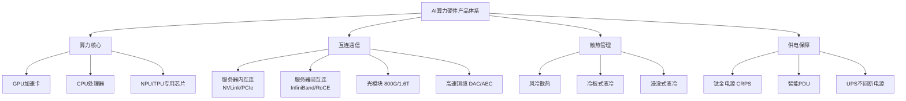
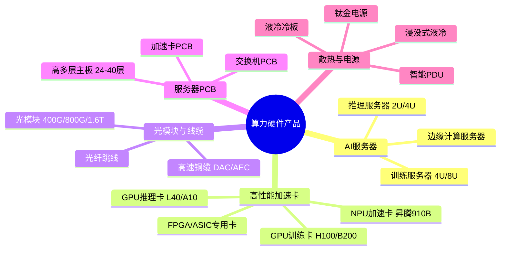
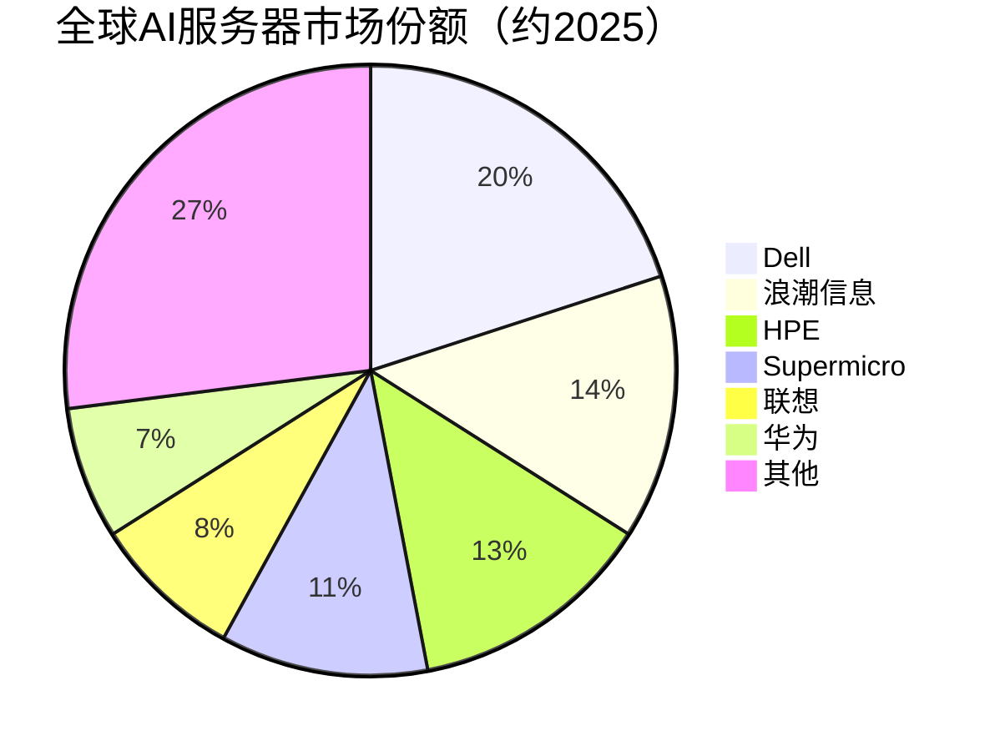

# 算力硬件产品

> AI服务器、训练/推理服务器、高性能加速卡、边缘计算模组、光模块、高速线缆、服务器PCB板、液冷散热、电源及服务器机箱等算力硬件的统称。

## 概述

算力硬件产品是AI产业链下游的核心承载层，是将芯片设计成果转化为实际算力输出的关键环节。随着大模型训练规模从亿级参数跃升至万亿级参数，对算力硬件的需求呈现爆发式增长。AI服务器作为算力硬件的核心载体，其单机算力密度、互连带宽和散热能力直接决定了大模型训练的效率与成本。

在全球AI竞赛背景下，算力硬件产品已从传统通用服务器演进为高度专业化的AI训练/推理服务器体系。训练服务器追求极致算力密度与高速互连，推理服务器则强调低延迟、高吞吐与能效比。高性能加速卡（如NVIDIA H100/B200、AMD MI300、华为昇腾910B等）是AI服务器的"心脏"，决定系统算力上限。

与此同时，围绕AI服务器的配套硬件也迎来技术升级：800G/1.6T光模块满足GPU集群高速互连需求，高多层PCB板支撑信号完整性，液冷散热系统解决高功耗散热难题，钛金级电源保障供电稳定性。整个算力硬件产品体系构成了AI算力基础设施的物理底座。

## 技术原理

AI服务器的核心技术架构围绕"算力-互连-散热-供电"四大维度展开。在算力维度，AI服务器通过PCIe或NVLink等高速总线将多张GPU加速卡组成算力集群，单台4U/8U服务器可搭载8张甚至更多加速卡，单机算力可达数十PFLOPS（FP16）。

在互连维度，服务器内部采用NVLink/NVSwitch实现GPU间高速直连，带宽可达900GB/s以上；服务器间则通过InfiniBand或RoCE（RDMA over Converged Ethernet）网络实现无损低延迟通信，支撑千卡乃至万卡集群的大规模分布式训练。

在散热维度，随着单卡功耗从300W攀升至1000W以上（如B200功耗约1000W），传统风冷已无法满足散热需求，液冷技术成为必然选择。冷板式液冷通过冷却液在冷板内循环带走热量，浸没式液冷则将服务器整体浸入介电液体中，散热效率大幅提升。

在供电维度，AI服务器单机功耗可达10kW以上，需配置高冗余度电源系统（CRPS标准），并采用220V AC或直流供电方案，配合智能PDU实现精细化能耗管理。

## 分类与技术路线

算力硬件产品按功能层次可分为五大类别：

**AI服务器**：分为训练服务器和推理服务器两大类。训练服务器通常为4U/8U机架式，搭载8张及以上GPU，注重算力密度与互连带宽；推理服务器则多为2U/4U，配置4-8张推理卡，注重低延迟与吞吐量。边缘计算服务器则朝小型化、低功耗方向发展。

**高性能加速卡**：包括GPU加速卡（NVIDIA H100/B200、AMD MI300X）、NPU（华为昇腾910B、寒武纪思元590）、FPGA（Intel/AMD）及ASIC专用芯片。训练卡功耗300-1000W，推理卡功耗75-400W。

**光模块与高速线缆**：光模块从400G向800G/1.6T演进，采用QSFP-DD/OSFP封装；高速铜缆DAC（直连铜缆）和AEC（有源电缆）在短距互连中提供低成本方案。

**服务器PCB板**：AI服务器主板和加速卡PCB需要高多层（24-40层）、高频高速材料（M7N/M8等级），制造工艺复杂。

**散热与电源**：液冷散热包含冷板式和浸没式两种技术路线；电源系统采用CRPS标准模块，效率等级达到80PLUS钛金级。

## 市场格局

全球AI服务器市场2025年规模约1672亿美元（GMI），另有预测达2450亿美元（ABI），年复合增长率37.5%，预计2032年突破1.6万亿美元。NVIDIA凭借Blackwell B200/B300 GPU生态优势占据AI加速卡市场75-80%份额，在训练卡领域接近垄断地位。AMD凭借MI300X/MI350系列逐步追赶，市场份额约10%。

在服务器整机层面，浪潮信息是中国AI服务器龙头，国内市场份额超过40%；全球市场方面，Dell凭借AI服务器营收同比增长757%跃居全球第一，HPE AI服务器营收增长30%以上，Supermicro、联想等厂商竞争激烈。Supermicro凭借灵活定制能力在AI服务器市场快速崛起。

光模块领域，中国厂商优势显著。中际旭创、新易盛、华工科技等占据全球光模块市场超过50%份额，800G光模块2025年需求达1800万支、出货同比翻倍，1.6T光模块2025年出货约270万支进入量产元年，中国企业掌握800G至1.6T光模块全球23.4%份额。PCB板领域，沪电股份、胜宏科技在AI服务器高多层板方面加速突破。

## 代表企业

| 企业 | 国家/地区 | 主要产品/技术 | 2025营收/动态 | 市场地位 |
|------|----------|-------------|-------------|---------|
| NVIDIA | 美国 | Blackwell B200/B300、Rubin GPU加速卡 | ~2159亿美元（FY2025） | 全球AI芯片绝对龙头，份额75-80% |
| 浪潮信息 | 中国 | NF5468系列AI服务器 | AI服务器营收高速增长 | 中国AI服务器市场份额第一 |
| Dell | 美国 | PowerEdge XE系列AI服务器 | AI服务器营收同比增757% | 全球AI服务器份额第一 |
| Supermicro | 美国 | GPU SuperServer系列 | AI服务器营收快速增长 | AI服务器定制化领先，增长迅速 |
| 联想 | 中国 | ThinkSystem SR系列AI服务器 | AI服务器业务持续扩大 | 全球AI服务器前五 |
| HPE | 美国 | ProLiant系列、Cray超算 | AI服务器营收增30%+ | 全球服务器头部厂商 |
| 华为 | 中国 | Atlas系列AI服务器、昇腾910B加速卡 | 国产AI服务器放量 | 国产AI服务器领军 |
| 中科曙光 | 中国 | 硅立方计算系统 | 液冷智算持续推广 | 国产高性能计算代表 |
| 超聚变 | 中国 | FusionServer系列 | AI服务器出货增长 | 国内AI服务器前三 |
| 宁畅 | 中国 | X640 G60 AI服务器 | 国产AI服务器新锐 | 国产AI服务器新锐 |

## 发展趋势

### 市场规模预测

| 年份 | 市场规模 | 同比增长 | 备注 |
|------|---------|---------|------|
| 2024 | 约1280亿美元 | — | 基准年 |
| 2025 | 约1672亿美元 | +30.6% | AI服务器需求爆发，GPU服务器主导 |
| 2026E | 约2300亿美元 | +37.5% | Blackwell全面量产，推理需求放量 |
| 2027E | 约3160亿美元 | +37.5% | 1.6T光模块规模商用，液冷渗透率超50% |

> 数据来源：GMI、ABI Research（2025），CAGR 37.5%至2032年1.6万亿美元

1. **液冷散热全面普及**：随着GPU功耗突破1000W，冷板式液冷将成为AI服务器标配，浸没式液冷在超大规模集群中加速落地，液冷渗透率预计2026年达到40%以上。2025年数据中心液冷市场规模约49-55亿美元，CAGR 19.5-20.5%至2032年170亿美元。

2. **800G/1.6T光模块规模商用**：万卡集群对互连带宽需求持续攀升，800G光模块2025年出货1800万支、同比翻倍，1.6T光模块2025年出货约270万支进入量产元年，硅光技术加速渗透。

3. **国产AI服务器加速替代**：受出口管制影响，以昇腾、寒武纪为代表的国产加速卡服务器在政企、金融领域加速渗透，国产化率持续提升。

4. **边缘AI服务器快速增长**：随着AI应用向边缘延伸，低功耗、小型化的边缘AI服务器需求快速增长，预计2025-2028年复合增长率超过40%。

5. **服务器架构向统一互连演进**：NVIDIA NVLink、UCIe等互连标准推动服务器内部从PCIe向更高带宽方向发展，NVSwitch 5.0等新一代互连技术将支撑万卡级集群高效协同。

## 与AI产业链的关联

算力硬件产品是AI产业链的最终输出载体，直接决定AI算力的可用性和经济性。大模型训练需要万卡级GPU集群协同工作，对服务器算力密度、互连带宽和散热能力提出极限挑战。AI推理服务则依赖于部署在数据中心的推理服务器集群，低延迟和高吞吐是关键指标。

算力硬件产品向上游带动芯片设计（GPU/NPU，2025年全球AI芯片市场约2032亿美元）、封装测试（CoWoS/2.5D封装，2025年CoWoS市场约38亿美元）、材料（ABF基板2025年约48.9-58亿美元、高速覆铜板）和设备需求，向下游支撑云计算、大模型训练、AI应用等全产业链发展。2025年全球AI服务器市场约1672亿美元，Dell AI服务器营收同比增长757%，HPE增长30%+，充分反映了AI算力硬件的爆发式需求。中国算力硬件市场在政策驱动下保持高速增长，国产替代进程加速推进。

---
[← 返回总目录](../README.md)
