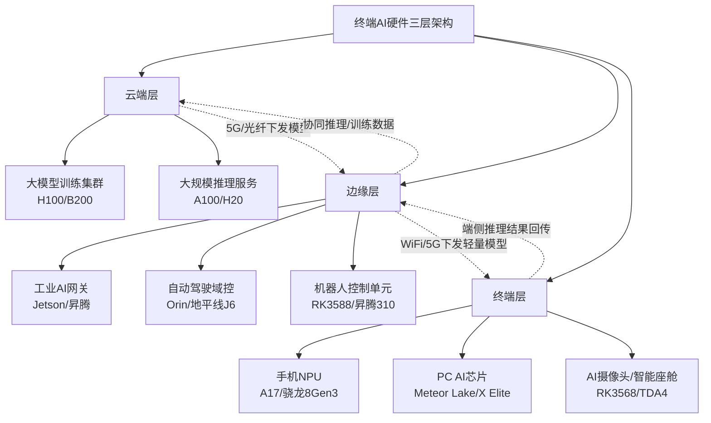
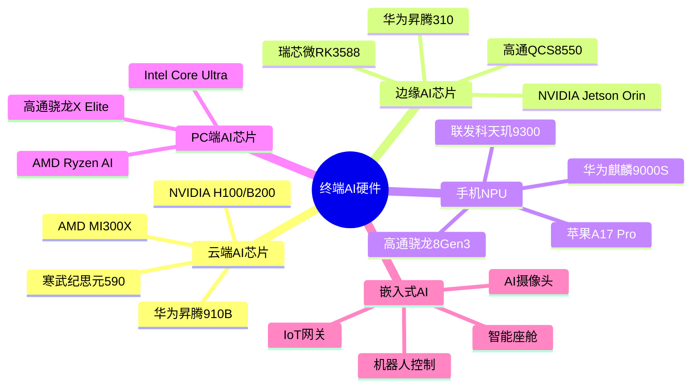
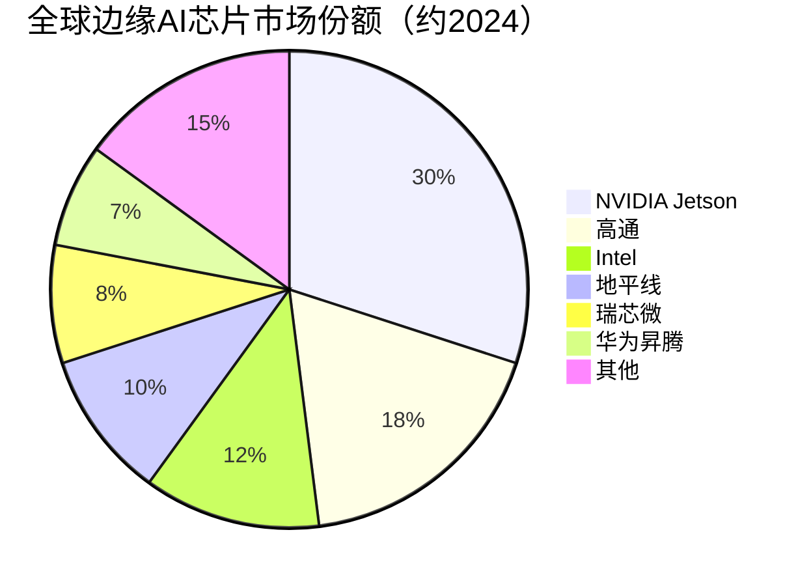

# 终端AI硬件

> 部署在云端、边缘和终端设备上执行AI推理/训练任务的硬件产品统称，涵盖云端训练集群、边缘AI芯片及各类终端AI设备。

## 概述

终端AI硬件是AI产业链中离用户最近的一环，将AI能力从云端延伸到边缘和终端设备，实现低延迟、高隐私的本地AI推理。随着大模型小型化和端侧AI芯片性能提升，AI能力正从云端向终端快速下沉，"端云协同"成为AI硬件发展的重要趋势。

按部署位置，AI硬件可分为三个层次：云端（数据中心级大模型训练/推理集群）、边缘（工业网关、自动驾驶域控、机器人控制单元）、终端（手机NPU、PC端AI芯片、AI摄像头、智能座舱等）。三个层次通过5G/光纤网络实现算力协同，形成"端-边-云"一体化AI计算架构。

AI终端硬件的快速发展得益于三个技术突破：一是大模型压缩技术（量化、剪枝、知识蒸馏）使百亿参数模型可在终端运行；二是先进制程工艺（3nm/5nm）提升芯片能效比；三是专用NPU架构设计大幅提升AI算力效率。以手机为例，2024年旗舰手机AI算力已达40-70 TOPS，可在本地运行10亿参数级别的大模型。

## 技术原理

终端AI硬件的核心是AI加速引擎（NPU/TPU/NNA），其架构设计针对矩阵运算和卷积运算进行深度优化。

**NPU架构**：典型NPU包含标量单元、矢量单元和张量单元三类计算核心。张量单元采用脉动阵列（Systolic Array）架构，通过数据流式处理实现高密度矩阵乘法运算。INT8/INT4量化计算可在精度损失可控的前提下大幅提升算力密度并降低功耗。现代手机NPU还集成Transformer加速单元，针对大模型的Attention机制进行专项优化。

**端侧大模型推理**：通过量化（FP32→INT8/INT4）、权重剪枝、知识蒸馏等技术压缩模型体积。10B参数模型经INT4量化后约占5GB存储，配合LPDDR5X高速内存可在手机端实现3-5 tokens/s的生成速度。关键路径优化包括KV Cache管理、投机解码（Speculative Decoding）等。

**端边云协同**：终端设备执行轻量推理，复杂任务卸载到边缘服务器，大规模训练在云端完成。通过模型分割（Model Partitioning）技术，将大模型拆分为终端运行的部分和云端运行的部分，在保护隐私的同时兼顾性能。

**自动驾驶AI芯片**：采用"CPU+NPU+ISP+VPU"多核异构架构，处理多路摄像头视频流、激光雷达点云和毫米波雷达数据。Orin等芯片集成数十个ARM核心和NPU加速单元，算力达200-500 TOPS。

## 分类与技术路线

终端AI硬件按应用场景和算力等级可分为以下几类：

**云端AI芯片**：以NVIDIA H100/B200、AMD MI300X、华为昇腾910B为代表，功耗300-1000W，算力达数百TFLOPS，部署于数据中心，支撑大模型训练和大规模推理服务。

**边缘AI芯片**：以NVIDIA Jetson Orin、华为昇腾310、瑞芯微RK3588为代表，功耗5-60W，算力10-500 TOPS，部署于工业网关、自动驾驶域控、机器人等边缘设备。

**手机NPU**：集成于手机SoC内部，以苹果A17 Pro Neural Engine、高通Hexagon NPU、联发科APU为代表，算力30-70 TOPS，功耗1-5W，支撑端侧大模型推理、计算摄影和实时语音翻译。

**PC端AI芯片**：Intel Meteor Lake（Core Ultra）集成NPU，高通骁龙X Elite支持终端Copilot+，AMD Ryzen AI系列集成Ryzen AI引擎，算力10-50 TOPS，支撑PC端AI助手和创意工具。

**AI摄像头与智能座舱**：采用安霸CV系列、地平线征程系列、TI TDA4等芯片，功耗2-15W，执行视频分析、目标检测、手势识别等任务。

## 市场格局

终端AI硬件市场规模庞大且增速惊人。全球手机AI芯片市场2024年规模约200亿美元，苹果和高通合计占据旗舰手机AI算力主导地位。PC端AI芯片市场在Copilot+和AI PC概念推动下快速放量，2024年全球AI PC出货量约5000万台，预计2026年突破2亿台。

边缘AI芯片市场由NVIDIA Jetson系列主导，国内地平线、黑芝麻、瑞芯微等在自动驾驶和安防领域占据一定份额。自动驾驶AI芯片市场2024年规模约80亿美元，NVIDIA Orin占据高端市场，地平线征程系列在国内市场快速渗透。

智能座舱芯片方面，高通骁龙8295/8255占据高端市场份额，联发科、瑞芯微在中端市场布局，芯擎科技、芯驰科技等国产厂商加速追赶。

## 代表企业

| 企业 | 国家/地区 | 主要产品/技术 | 市场地位 |
|------|----------|-------------|---------|
| NVIDIA | 美国 | Jetson Orin、B200、L4 | 云端+边缘AI芯片双龙头 |
| Apple | 美国 | A17 Pro、M3/M4系列 | 手机/PC端AI芯片领先 |
| Qualcomm | 美国 | 骁龙8Gen3、X Elite、8295 | 手机/PC/座舱多领域布局 |
| Intel | 美国 | Meteor Lake、Lunar Lake | PC端AI芯片开创者 |
| MediaTek | 中国台湾 | 天玑9300、MT2718 | 手机/座舱AI芯片第二梯队 |
| 华为海思 | 中国 | 麒麟9000S、昇腾310 | 国产端侧AI芯片龙头 |
| 地平线 | 中国 | 征程J3/J5/J6 | 国产自动驾驶芯片领先 |
| 瑞芯微 | 中国 | RK3588、RK3576 | 国产边缘AI芯片代表 |
| 黑芝麻智能 | 中国 | A1000L/A1000 | 国产自动驾驶芯片新锐 |
| 芯擎科技 | 中国 | 龙鹰一号智能座舱SoC | 国产座舱芯片代表 |

## 发展趋势

1. **端侧大模型推理普及**：70亿-130亿参数大模型将逐步在旗舰手机和AI PC上本地运行，INT4量化、KV Cache压缩、投机解码等技术持续优化端侧推理性能，端侧生成AI体验将成为消费电子核心卖点。

2. **NPU算力持续翻倍**：受AI PC和端侧大模型需求驱动，手机NPU算力预计每18个月翻倍，2026年旗舰手机AI算力有望突破100 TOPS，PC端NPU算力达到80-100 TOPS。

3. **端边云协同架构成熟**：模型分割技术实现大模型在终端、边缘、云端的分布式推理，终端处理敏感数据，云端提供大模型推理能力，5G-A/6G网络支撑低时延协同。

4. **自动驾驶芯片算力升级**：L3+自动驾驶需求推动域控芯片算力向500-1000 TOPS升级，NVIDIA Thor、地平线J6P等新一代芯片2025-2026年量产，集成Transformer加速单元。

5. **AI芯片能效比持续优化**：3nm/2nm先进制程结合架构创新，端侧AI芯片能效比持续提升。Chiplet设计降低芯片成本，UCIe标准推动封装级互连标准化。

## 与AI产业链的关联

终端AI硬件是AI产业链"最后一公里"的承载者，将AI能力从数据中心延伸到用户侧。端侧AI推理降低了对云端算力的依赖，减少了网络传输延迟和带宽消耗，同时保护用户数据隐私。手机NPU、PC端AI芯片和智能座舱芯片的普及将催生海量端侧AI应用，推动AI从"云端模型"向"端侧智能体"演进。

终端AI硬件向上游带动芯片设计、先进制程、封装测试需求，向下游支撑AI手机、AI PC、自动驾驶、智能机器人等终端产品创新。端侧AI芯片的国产化对消费电子、汽车电子等战略产业具有关键意义。

---
[← 返回总目录](../README.md)
