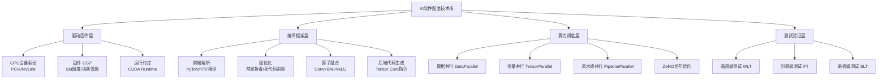
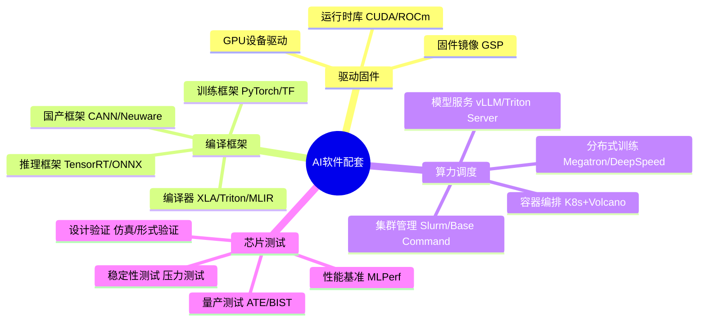
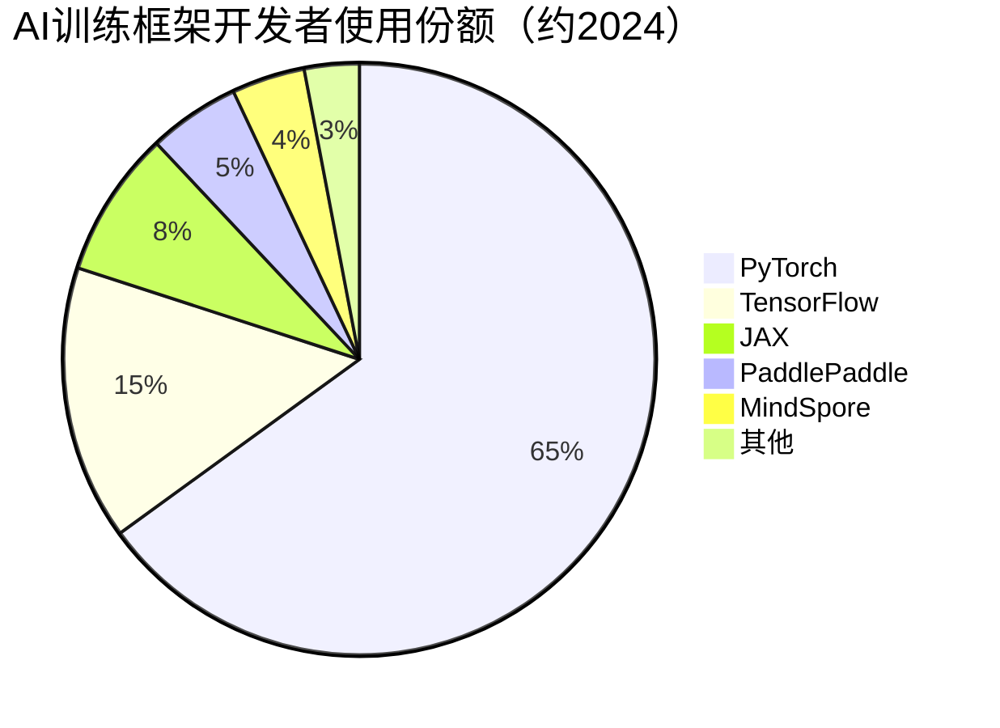

# 软件配套

> 支撑AI芯片和算力硬件运行的软件生态体系，包含驱动固件、编译框架、算力调度软件和芯片测试程序。

## 概述

软件配套是AI算力硬件与上层AI应用之间的桥梁，直接决定了AI芯片的实际算力利用率和开发者生态黏性。NVIDIA之所以在AI芯片市场占据垄断地位，其CUDA软件生态的深厚壁垒是比GPU硬件本身更强大的护城河。软件配套涵盖从底层驱动固件到上层开发框架的完整技术栈。

在驱动固件层面，AI芯片需要与操作系统深度集成，提供稳定的设备驱动和底层通信接口。NVIDIA驱动程序管理GPU资源分配、内存映射和功耗控制，固件运行在芯片内部的微控制器上，负责硬件初始化和任务调度。

在编译框架层面，AI编译器将PyTorch/TensorFlow等高层框架的模型描述编译为芯片可执行的高效机器码。编译过程涉及图优化、算子融合、内存分配、并行调度等多个阶段，编译质量直接影响模型推理速度。TVM、XLA、TensorRT等是主流AI编译框架。

在算力调度层面，分布式训练框架（如Megatron-LM、DeepSpeed）管理千卡级GPU集群的并行训练任务，实现数据并行、张量并行和流水线并行。Kubernetes+Volcano等容器编排平台提供算力资源的弹性调度。芯片测试程序则保障芯片出厂质量和运行稳定性。

## 技术原理

AI软件配套的技术栈自底向上分为四个层次：

**驱动固件层**：GPU驱动通过PCIe/NVLink接口与硬件通信，实现内存映射、命令队列管理和中断处理。固件运行在芯片内嵌的微控制器上，负责SM（Streaming Multiprocessor）调度、时钟频率管理和功耗控制。NVIDIA驱动支持CUDA Runtime API和Driver API两套接口，固件通过GPU固件镜像（GSP）管理硬件资源。

**编译框架层**：AI编译器将高层模型（PyTorch/TensorFlow）转换为芯片可执行的机器码。典型流程包括：前端解析生成计算图 → 图优化（常量折叠、死代码消除）→ 算子融合（Conv+BN+ReLU融合）→ 内存分配 → 后端代码生成。AI编译器需要针对不同芯片架构生成优化的指令序列，充分利用Tensor Core等专用计算单元。

**算力调度层**：分布式训练框架将大模型拆分到多个GPU上并行训练。数据并行将不同batch分配给不同GPU；张量并行将单个矩阵乘法拆分到多个GPU；流水线并行将模型按层划分到不同GPU。ZeRO优化技术将优化器状态、梯度和参数分布在多个GPU上，降低单卡显存压力。AllReduce通信实现GPU间梯度同步。

**测试验证层**：芯片测试程序包括晶圆级测试（WLT）、封装级测试（FT）和系统级测试（SLT）。AI芯片需要专项测试AI计算正确性、内存带宽和散热稳定性。自动化测试框架结合ATE（自动测试设备）实现量产测试。

## 分类与技术路线

AI软件配套按功能层次分为四大类别：

**驱动与固件**：包括GPU/NPU设备驱动、固件镜像、运行时库。NVIDIA CUDA Driver/Runtime API是事实标准；AMD ROCm提供开源替代；国产芯片厂商各自开发驱动栈（华为CANN、寒武纪Neuware）。

**AI编译框架**：
- 训练框架：PyTorch、TensorFlow、JAX（Google）、PaddlePaddle（百度）
- 推理框架：TensorRT（NVIDIA）、ONNX Runtime、TVM（Apache开源）
- 编译器后端：XLA（Google）、Triton（OpenAI）、MLIR（LLVM生态）

**算力调度软件**：
- 分布式训练：Megatron-LM（NVIDIA）、DeepSpeed（微软）、ColossalAI
- 容器编排：Kubernetes + Volcano、Slurm
- 集群管理：NVIDIA Base Command、BCM

**芯片测试程序**：
- 设计验证：Verilog仿真、形式验证
- 量产测试：ATE测试程序、BIST（内建自测试）
- AI专项测试：算力基准测试（MLPerf）、稳定性测试

## 市场格局

AI软件配套市场呈现"NVIDIA生态垄断+多方追赶"格局。NVIDIA CUDA生态拥有超过400万开发者，是AI软件事实标准。CUDA生态包括cuDNN、TensorRT、NCCL、Megatron-LM等全套工具链，深度绑定AI开发者。

AMD ROCm作为开源替代方案，近年快速追赶，已支持PyTorch主流生态，但开发者基数仍远低于CUDA。Intel oneAPI统一编程模型覆盖CPU/GPU/FPGA，在HPC领域有一定份额。

国产AI软件生态加速建设。华为CANN（异构计算架构）支持MindSpore和PyTorch，适配昇腾全系列芯片；寒武纪Neuware支持Cambricon PyTorch；燧原Enflame提供芯片软件栈。但生态完整度和开发者活跃度与CUDA仍有差距。

在推理服务化方面，vLLM（UC Berkeley开源）凭借PagedAttention技术成为大模型推理部署主流方案；NVIDIA Triton Inference Server支持多框架统一部署。

## 代表企业

| 企业 | 国家/地区 | 主要产品/技术 | 市场地位 |
|------|----------|-------------|---------|
| NVIDIA | 美国 | CUDA、TensorRT、Megatron-LM | AI软件生态绝对垄断 |
| Google | 美国 | TensorFlow、JAX、XLA | AI框架开创者 |
| Meta | 美国 | PyTorch、PyTorch Distributed | AI训练框架主流 |
| Microsoft | 美国 | DeepSpeed、ONNX Runtime | 分布式训练领先 |
| AMD | 美国 | ROCm、Omniparser | CUDA开源替代方案 |
| 华为 | 中国 | CANN、MindSpore | 国产AI软件生态龙头 |
| 百度 | 中国 | PaddlePaddle、飞桨 | 国产AI框架代表 |
| 寒武纪 | 中国 | Neuware、Cambricon PyTorch | 国产AI芯片软件栈 |
| OpenAI | 美国 | Triton编译器 | 开源GPU编译器创新 |
| 智源研究院 | 中国 | FlagScale、Aquila | 国产大模型训练框架 |

## 发展趋势

1. **AI编译器快速演进**：OpenAI Triton、MLIR等新一代AI编译器降低算子开发门槛，开发者可用Python编写高性能GPU算子。编译器自动优化（AutoTVM、Ansor）减少手动调优工作量，编译效率持续提升。

2. **国产软件生态加速突破**：在出口管制压力下，昇腾CANN、寒武纪Neuware等国产软件栈加速适配PyTorch生态，MindSpore在昇腾芯片上原生优化，国产AI芯片"硬件+软件"协同迭代加速。

3. **大模型推理框架标准化**：vLLM、TGI、TensorRT-LLM等推理框架竞争加剧，PagedAttention、连续批处理（Continuous Batching）等技术成为标配。推理服务化部署向统一标准化方向发展。

4. **万卡级分布式训练成熟**：3D并行（数据+张量+流水线并行）成为千亿参数模型训练标配，ZeRO-3优化降低显存占用。千卡至万卡集群训练稳定性管理技术（容错、弹性恢复）持续完善。

5. **MLPerf基准测试影响力扩大**：MLPerf基准成为AI芯片性能评价标准，训练和推理基准覆盖主流AI任务。芯片厂商和云服务商积极参与MLPerf提交，推动性能透明化和公平竞争。

## 与AI产业链的关联

软件配套是AI产业链"软实力"的核心体现，决定了AI芯片的算力能否被有效释放。没有强大的软件生态，再优秀的硬件设计也无法转化为实际算力输出。CUDA生态的护城河效应使NVIDIA在硬件性能差距缩小的情况下仍保持市场垄断地位。

软件配套向上游支撑芯片设计验证和量产测试，向下游服务AI训练、推理和部署全流程。国产AI软件生态的完善对实现"芯片-框架-应用"全栈自主可控具有战略意义。随着大模型训练成本持续攀升，软件优化的经济价值日益凸显，编译优化和算力调度效率直接关系到训练成本和推理延迟。

---
[← 返回总目录](../README.md)
