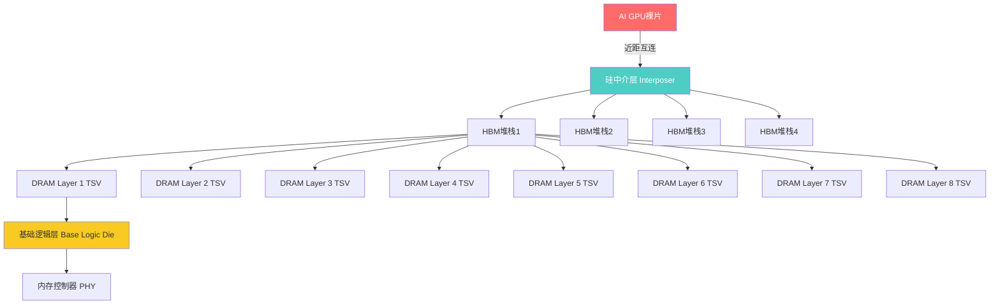
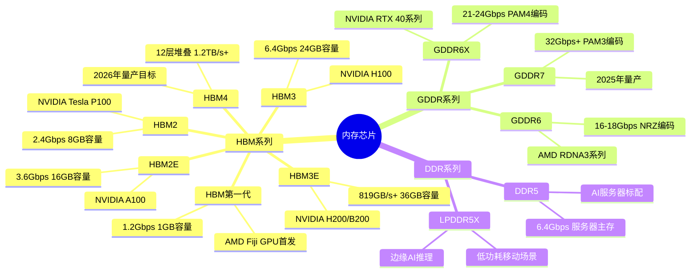
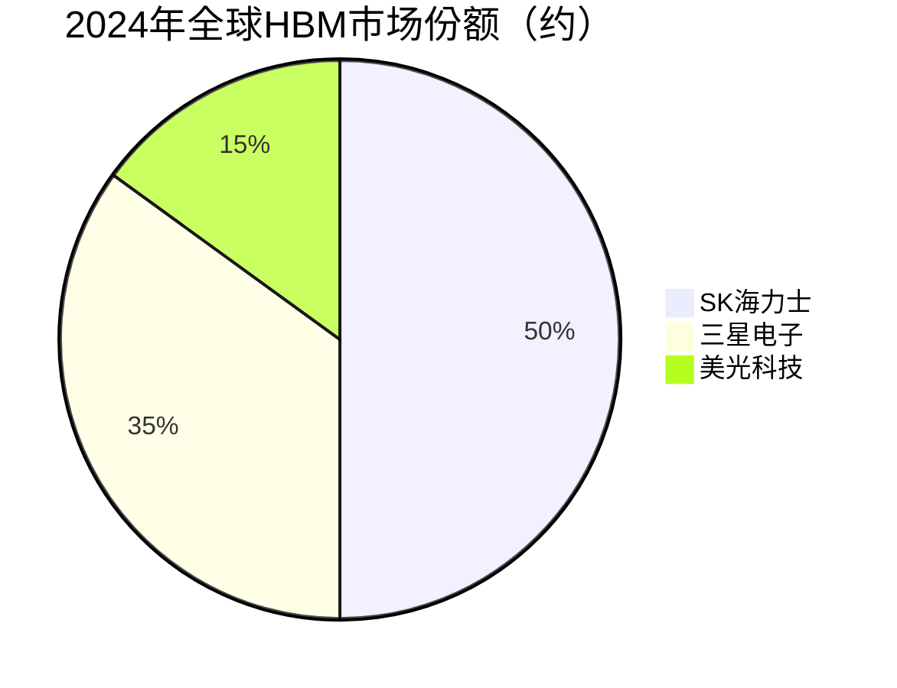

# 内存芯片（HBM与GDDR6X）

> 面向AI高带宽计算场景的高端存储器件，包括HBM高带宽存储与GDDR6X图形显存，是AI GPU算力的关键配套。

## 概述

内存芯片是AI产业链中游存储环节的核心组成部分，直接决定了AI加速卡的数据吞吐能力与训练效率。在大模型训练和推理过程中，GPU需要以极高带宽与存储器交换海量参数和激活值数据，传统DDR内存的带宽已无法满足需求，因此HBM（High Bandwidth Memory）和GDDR6X等高带宽存储技术应运而生，成为AI算力基础设施不可或缺的组成部分。

HBM采用3D堆叠工艺，通过TSV（硅穿孔）将多层DRAM芯片垂直堆叠，配合2.5D/3D先进封装与GPU裸片集成在同一基板上，实现极高的数据传输带宽。目前HBM3E单堆栈带宽已达819GB/s以上，NVIDIA H100搭载6颗HBM3E堆栈组成超过3.35TB容量和3.35TB/s总带宽，而最新的H200/B200系列进一步提升至4.8TB/s以上。GDDR6X则主要用于高端显卡，通过PAM4信令技术实现每针脚24Gbps的传输速率，适合对带宽要求高但成本敏感的AI推理卡和游戏GPU。

在AI大模型浪潮驱动下，HBM需求呈爆发式增长。2024年全球HBM市场规模约200亿美元，预计2025年将突破300亿美元，年增长率超过50%。SK海力士、三星、美光三家厂商垄断了HBM供应，产能成为制约AI GPU出货的关键瓶颈。同时，国内长鑫存储、武汉新芯等企业也在积极布局DDR5、GDDR等存储产品，逐步缩小与国际先进水平的差距。

## 技术原理

HBM（High Bandwidth Memory）的核心技术原理是通过3D堆叠和TSV硅穿孔技术，将多层DRAM芯片垂直堆叠在一起，从而在极小的封装面积内实现巨大的数据吞吐带宽。传统GDDR显存通过PCB走线连接GPU，受限于引脚数量和信号完整性，带宽提升遭遇瓶颈。HBM则将存储器与逻辑芯片通过硅中介层（Silicon Interposer）直接连接，大幅缩短互连路径，降低功耗并提升带宽。

HBM的技术架构可分为三个关键层次：底层为基础逻辑层（Base Logic Die），负责内存控制与接口管理；中间为多层DRAM裸片堆叠，通过TSV实现层间垂直互连；顶部可选配散热片。HBM3E采用8层或12层堆叠，单堆栈容量24GB-36GB，带宽达819GB/s-1.2TB/s。相比GDDR6的64-72GB/s带宽，HBM在带宽密度上具有数量级优势。

GDDR6X的技术原理则采用PAM4（4级脉冲幅度调制）信令，每个时钟周期传输2bit数据，相比GDDR6的NRZ编码带宽翻倍。GDDR6X单针脚速率达24Gbps，配合256-bit总线总带宽达768GB/s。NVIDIA RTX 4090搭载24GB GDDR6X，带宽超过1TB/s，为AI推理和图形渲染提供均衡的性能与成本方案。

## 分类与技术路线

HBM系列是AI GPU的核心存储方案，每一代都在带宽和容量上实现跃升。HBM3E是目前AI训练卡的标配，HBM4预计2026年量产，将采用12层堆叠和混合键合技术，单堆栈带宽超过1.2TB/s。GDDR系列定位于AI推理卡和消费级GPU，GDDR7已进入量产阶段，速率达32Gbps以上。DDR5作为服务器主存和CPU配套，在AI推理服务器中仍占重要地位。

## 市场格局

全球高带宽存储市场呈现高度垄断格局，SK海力士、三星、美光三家韩国和美国企业占据超过95%的HBM市场份额。其中SK海力士凭借与NVIDIA的深度合作，占据HBM市场约50%份额，是HBM3E的最大供应商。三星紧随其后，约35%份额，同时为NVIDIA和AMD供货。美光约15%份额，2024年率先量产1β工艺HBM3E。

2024年全球HBM市场规模约200亿美元，同比增长超过80%。随着AI训练和推理需求爆发，预计2025年HBM市场规模将突破300亿美元，2027年有望达到500亿美元以上。HBM占DRAM总收入的比例从2023年的约8%快速提升至2024年的30%以上，成为存储行业增长最快的细分市场。

在GDDR市场，三星和美光同样占据主导地位。DDR5市场则由三星、SK海力士、美光三家垄断。国内方面，长鑫存储（CXMT）在DDR4/DDR5和LPDDR领域取得突破，已实现19nm DDR4量产，17nm DDR5研发中。武汉新芯专注于 NOR Flash和部分DRAM产品。合肥长鑫规划产能达12万片/月，但与国际三强在工艺和产能上仍有差距。

## 代表企业

| 企业 | 国家/地区 | 主要产品/技术 | 市场地位 |
|------|----------|-------------|---------|
| SK海力士 | 韩国 | HBM3E、HBM4、DDR5 | HBM市场份额第一，NVIDIA核心供应商 |
| 三星电子 | 韩国 | HBM3E、GDDR6X、DDR5 | HBM第二，存储芯片全球龙头 |
| 美光科技 | 美国 | HBM3E（1β工艺）、GDDR6 | HBM第三，率先量产1β节点 |
| NVIDIA | 美国 | GPU+HBM集成方案 | AI GPU最大用户，定义HBM规格 |
| AMD | 美国 | GPU+HBM集成方案 | AI GPU第二大用户 |
| 长鑫存储 | 中国 | DDR4/DDR5、LPDDR5 | 国内DRAM领先企业，19nm量产 |
| 武汉新芯 | 中国 | NOR Flash、DRAM | 国内存储新锐企业 |
| 南亚科技 | 中国台湾 | DDR4/DDR5、利基型DRAM | 台湾地区DRAM代表企业 |

## 发展趋势

1. **HBM4世代加速到来**：12层堆叠HBM4预计2026年量产，单堆栈容量达36-48GB，带宽超过1.2TB/s，将采用混合键合技术替代微凸点连接，进一步提升带宽密度和能效。NVIDIA Rubin系列GPU将率先搭载HBM4。

2. **3D DRAM技术探索**：传统2D DRAM微缩接近物理极限，3D DRAM将存储单元垂直堆叠，有望突破10nm以下节点。三星、SK海力士已投入研发，预计2027-2028年实现量产。

3. **CXL内存扩展**：CXL（Compute Express Link）协议允许GPU/CPU共享池化内存资源，将HBM作为高速缓存层、DDR5作为容量扩展层，实现分层存储架构，降低大模型训练的内存成本。

4. **国内HBM研发加速**：长鑫存储、武汉新芯等企业已启动HBM预研，预计在HBM2/HBM2E级别率先实现国产化，逐步追赶国际先进水平。同时国内先进封装产能也在加速建设。

5. **存算一体融合**：HBM与近存计算（Near-Memory Computing）结合，在HBM基础逻辑层嵌入计算单元，减少数据搬运功耗。三星已在HBM-PIM（Processing-In-Memory）原型中验证该路线。

## 与AI产业链的关联

HBM内存是AI GPU算力的命脉。大模型训练过程中，万亿参数模型的梯度更新和激活值存储需要极高的内存带宽和容量，HBM的带宽直接决定了GPU的计算效率——如果存储带宽不足，GPU将处于"等数据"的闲置状态，造成算力浪费。NVIDIA H100/B200系列GPU的性能天花板在很大程度上由HBM3E的带宽和容量决定，HBM产能也成为制约AI芯片出货的硬瓶颈。

GDDR6X/7则为AI推理卡和边缘AI提供更经济的高带宽方案。在AI推理场景中，模型参数固定、访存模式可预测，GDDR系列以较低成本提供接近HBM的带宽，适合大规模部署。同时，HBM的功耗效率（带宽/瓦特）优势使其在数据中心训练场景不可替代，而GDDR的低成本特性更适合推理和消费级AI应用。两者共同构成了AI算力基础设施的多层次高带宽存储体系。

---
[← 返回总目录](../../README.md)
