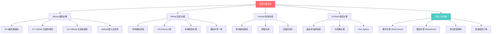
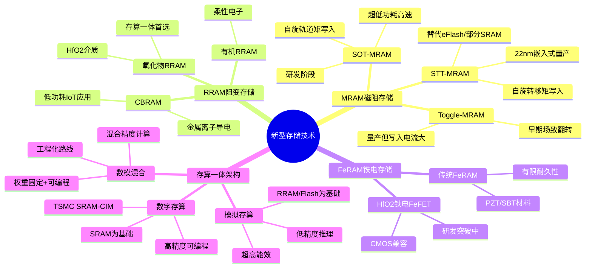
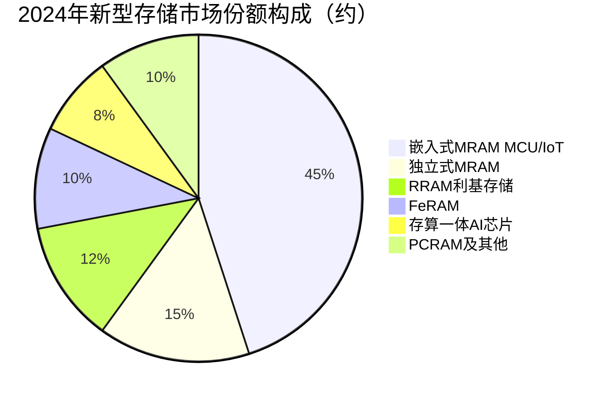

# 新型存储技术（MRAM与存算一体）

> 融合存储与计算的新一代存储技术，包括MRAM、RRAM、FeRAM及存算一体架构，突破冯·诺依曼瓶颈的关键路径。

## 概述

新型存储技术是AI产业链中最前沿的存储研究方向，旨在突破传统冯·诺依曼架构中存储与计算分离导致的数据搬运瓶颈。随着AI模型规模快速增长，数据在处理器和存储器之间的搬运能耗已远超计算能耗，"存储墙"和"功耗墙"成为制约AI算力效率提升的核心障碍。MRAM、RRAM、FeRAM等新型非易失性存储器件，以及基于这些器件构建的存算一体架构，为突破上述瓶颈提供了变革性路径。

MRAM（Magnetoresistive RAM，磁阻随机存储器）利用磁性隧道结（MTJ）的电阻态变化存储数据，具备非易失性、无限写入耐久和纳秒级读写速度，被视为替代SRAM作为嵌入式缓存的理想方案。三星和台积电已在22nm/16nm工艺节点集成嵌入式MRAM（eMRAM），用于物联网MCU和边缘AI芯片。RRAM（阻变随机存储器）通过绝缘介质中导电通道的形成与断裂实现阻态变化，结构简单且易于3D集成，是存算一体加速器中最受关注的器件类型。FeRAM利用铁电材料的极化方向存储数据，具有超低功耗和高读写速度的特点。

存算一体（Compute-in-Memory / Processing-in-Memory, CIM/PIM）是新型存储技术在AI领域的核心应用方向。通过在存储阵列内部直接执行矩阵乘加运算（MAC），将权重参数固定在存储单元中，输入数据通过存储阵列时自然完成乘加计算，完全消除数据搬运开销。基于RRAM的模拟存算一体芯片在AI推理能效上比传统GPU高出100倍以上，是后摩尔时代AI芯片的重要发展方向。知存科技、亿铸科技、后摩智能等国内企业已推出存算一体AI芯片产品。

## 技术原理

MRAM的核心存储单元是磁性隧道结（Magnetic Tunnel Junction, MTJ），由两层铁磁层夹一层绝缘隧道势垒层构成。其中一层铁磁层为参考层（Reference Layer），磁化方向固定；另一层为自由层（Free Layer），磁化方向可通过编程改变。当自由层与参考层磁化方向平行时，MTJ电阻低（表示"0"）；反平行时，电阻高（表示"1"）。读取数据时通过测量MTJ电阻状态即可实现。STT-MRAM（自旋转移矩MRAM）利用自旋极化电流改变自由层磁化方向，是目前最成熟的MRAM技术。SOT-MRAM（自旋轨道矩MRAM）利用自旋轨道耦合效应，功耗更低且速度更快，是下一代方向。

RRAM的核心机制是在金属/绝缘介质/金属三层结构中，通过施加电压在绝缘层中形成或断裂导电通道（Conductive Filament）。Set操作形成导电通道使器件进入低阻态（LRS），Reset操作断裂导电通道使器件回到高阻态（HRS）。RRAM器件可通过调控导电通道的粗细实现多级阻态，适合多值存储和模拟计算。常见的RRAM介质材料包括HfO₂、TaOₓ、TiOₓ等过渡金属氧化物。

存算一体的核心原理是在存储阵列中直接执行矩阵乘加运算。以RRAM交叉阵列（Crossbar Array）为例：权重参数以电导值形式存储在RRAM单元中，输入向量以电压形式施加在字线上。根据基尔霍夫电流定律，每条位线上流过的电流等于所有字线电压乘以对应RRAM电导之和——这恰好完成了一次矩阵-向量乘法（MVM），且在常数时间内完成。一个N×N的交叉阵列可在O(1)时间内完成N个乘加运算，计算密度极高。挑战在于模拟计算的精度受器件非理想性（如器件间变异、电导漂移）限制，目前主要面向INT8/INT4精度推理场景。

## 分类与技术路线

MRAM分为STT-MRAM和SOT-MRAM两条技术路线。STT-MRAM已实现22nm嵌入式量产，用于替代eFlash作为物联网MCU的代码存储，具有更快的读取速度和更好的写入耐久性。SOT-MRAM利用自旋轨道耦合效应实现写入，功耗更低且写入速度更快（亚纳秒级），有望替代SRAM作为末级缓存，但器件集成度和制造良率仍需提升。

存算一体架构按计算精度分为数字存算、模拟存算和混合架构三类。数字存算以SRAM阵列为基础，每个存储单元配设计算逻辑，精度高且可编程性好，但面积开销大。模拟存算以RRAM/Flash阵列为基础，利用物理定律直接计算乘加，能效极高但精度有限。混合架构在模拟计算基础上引入数字校正和精度补偿，是当前工程化主流路线。

## 市场格局

新型存储技术市场目前仍处于早期商业化阶段，市场规模相对HBM和NAND Flash较小，但增长潜力巨大。2024年全球MRAM市场规模约12亿美元，其中嵌入式STT-MRAM在MCU和IoT领域快速增长。RRAM和FeRAM市场仍在培育期，主要产品为利基型存储器件。存算一体芯片市场目前约5-8亿美元，但预计2030年将突破100亿美元。

MRAM和RRAM市场由三星、台积电、GlobalFoundries等晶圆代工厂主导，通过嵌入式方式集成在客户芯片中。独立式MRAM产品主要由Everspin（美国）、Avalanche Technology（美国）等企业提供。存算一体AI芯片领域，国外有Mythic、Rain AI、d-Matrix等初创企业，国内有知存科技、亿铸科技、后摩智能、九天睿芯等企业布局，部分产品已实现量产交付。

国内在新型存储技术领域与国际差距相对较小，是潜在的弯道超车机会。中科院微电子所、清华大学、北京大学等科研机构在RRAM存算一体领域处于国际领先水平。合肥长鑫、上海积塔等企业在eMRAM工艺开发上取得进展。后摩智能的存算一体芯片已实现商业化部署，知存科技的WTM系列芯片在可穿戴AI和语音识别领域获得应用。

## 代表企业

| 企业 | 国家/地区 | 主要产品/技术 | 市场地位 |
|------|----------|-------------|---------|
| 三星电子 | 韩国 | eMRAM、HBM-PIM存算一体 | 工艺领先，率先集成eMRAM |
| 台积电 TSMC | 中国台湾 | eMRAM 22nm/16nm、SRAM-CIM | 代工集成领先，存算IP丰富 |
| GlobalFoundries | 美国 | eMRAM 22FDX | FD-SOI+eMRAM组合方案 |
| Everspin | 美国 | 独立式STT-MRAM | 独立MRAM产品先驱 |
| 知存科技 | 中国 | WTM系列存算一体芯片 | 国内存算一体先行者 |
| 后摩智能 | 中国 | 存算一体AI芯片 | 国内存算商业化领先 |
| 亿铸科技 | 中国 | 模拟存算一体AI推理 | 存算架构创新企业 |
| Mythic | 美国 | RRAM模拟存算AI芯片 | 模拟存算先驱 |

## 发展趋势

1. **SOT-MRAM替代SRAM缓存**：SOT-MRAM具备接近SRAM的速度和远超SRAM的非易失性，有望在5nm以下先进工艺节点替代SRAM作为末级缓存，大幅降低芯片面积和静态功耗。台积电和三星正加速SOT-MRAM工艺研发，预计2026-2027年实现先进节点集成。

2. **RRAM存算一体规模化**：基于RRAM的模拟存算芯片在AI推理能效上具有颠覆性优势（超过100TOPS/W），已在语音识别、视觉推理等边缘AI场景实现量产。下一步将提升计算精度（支持INT8以上）和阵列规模，向数据中心推理加速场景拓展。

3. **HfO₂铁电存储突破**：发现HfO₂薄膜具有铁电性是存储领域的重大突破，因为HfO₂是CMOS工艺兼容的标准材料。基于HfO₂的铁电存储器（FeFET和FeRAM）有望在存储密度、速度和功耗上同时优于Flash和DRAM，是下一代通用存储器的候选方案。

4. **3D存算一体架构**：将RRAM/Flash存算阵列进行3D堆叠，类似3D NAND的垂直集成方式，可在有限芯片面积内实现超高计算密度。三星和Mythic已展示3D存算一体原型，有望在AI推理加速卡中实现百TOPS级算力。

5. **国家战略支持加码**：新型存储和存算一体被列为国家重点研发计划重点方向，国内科研机构和企业在RRAM存算一体领域论文和专利数量位居世界前列。随着AI算力需求与功耗约束加剧，存算一体作为颠覆性技术将获得更多政策和资本支持。

## 与AI产业链的关联

新型存储与存算一体技术是突破AI算力效率瓶颈的关键路径。传统AI加速器受制于冯·诺依曼架构，数据在存储器和处理器之间搬运的能耗和延迟占据了系统总开销的60%以上。存算一体通过在存储阵列中直接执行矩阵乘加运算，完全消除权重数据搬运，可将AI推理能效提升1-2个数量级。这对于功耗受限的边缘AI（智能穿戴、IoT、自动驾驶）和大模型推理推理场景具有革命性意义。

MRAM作为非易失性高速度存储器，可在AI芯片断电时保存模型权重和中间状态，实现"即时唤醒"功能——设备开机即处于就绪状态，无需从外部存储加载模型，大幅降低AI系统启动延迟。同时MRAM替代SRAM缓存可降低AI芯片静态功耗，延长电池供电AI设备的续航时间。随着AI模型参数规模持续增长和算力功耗约束加剧，新型存储技术将成为后摩尔时代AI芯片创新的核心方向，为AI算力可持续发展提供根本性技术支撑。

---
[← 返回总目录](../../README.md)
