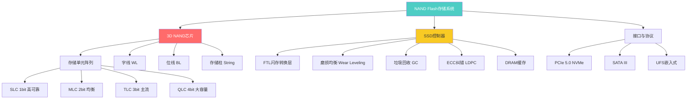
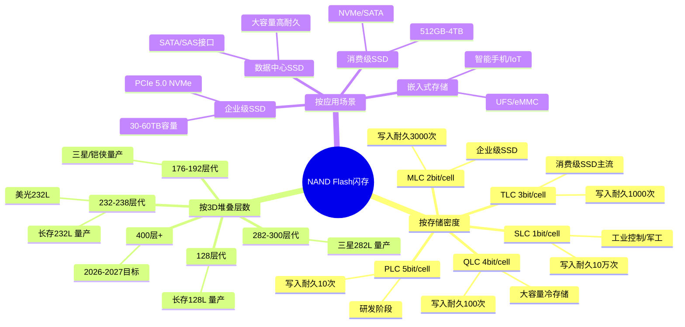
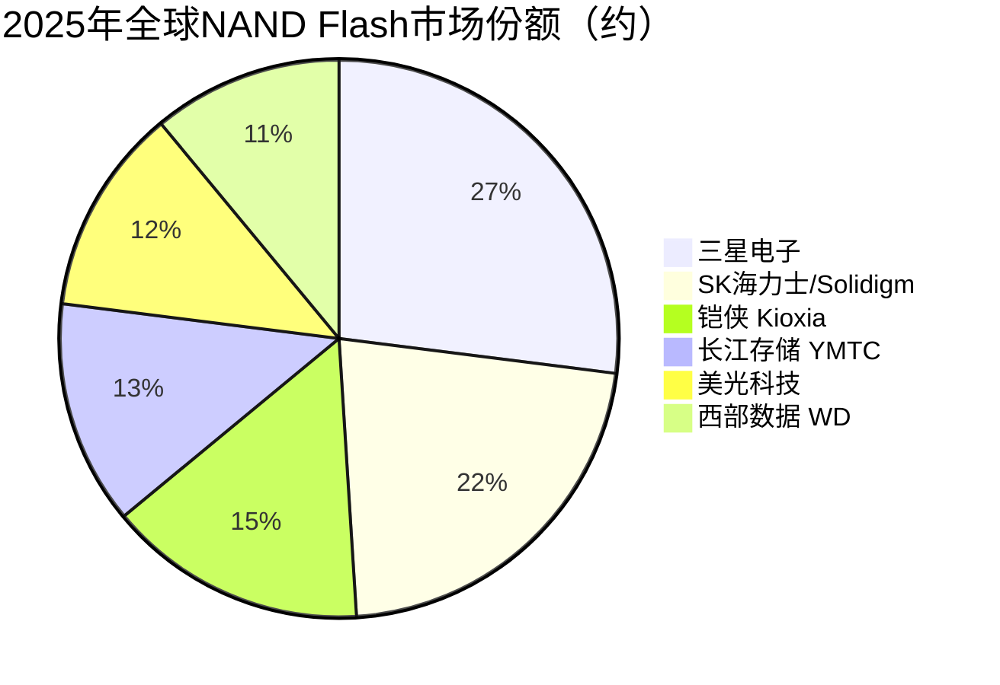

# 闪存芯片（NAND Flash与SSD）

> 基于NAND Flash闪存技术的高容量非易失性存储器件，是AI数据存储与训练数据管理的核心载体。

## 概述

NAND Flash闪存是AI产业链中非易失性存储的核心技术，广泛应用于固态硬盘（SSD）、嵌入式存储和数据中心存储系统。在AI大模型训练和推理过程中，海量训练数据集（文本、图像、视频）的存储、模型参数的持久化、检查点（Checkpoint）的快速保存与恢复，都高度依赖高容量、高吞吐的NAND Flash存储。

随着AI模型规模从数十亿参数增长至万亿级，训练数据集规模从TB级扩展到PB级甚至EB级，对存储容量和读写带宽提出了前所未有的要求。数据中心SSD需要支持PCIe 5.0接口、读写速度超过14GB/s，单盘容量达30TB-60TB以上。3D NAND技术通过垂直堆叠存储单元层数，已从早期的24层发展至目前的232层/282层，单颗芯片容量达1Tb以上，计划向500层以上推进。

NAND Flash市场是全球存储芯片市场的重要组成部分，2025年全球NAND Flash市场规模约650-925亿美元，其中企业级SSD随AI推理大容量需求快速增长。AI服务器需求推动企业级SSD成为增长最快的细分市场，QLC SSD放量推动大容量存储需求。三星、SK海力士（含Solidigm）、铠侠、美光、西部数据五家厂商主导全球NAND Flash供应。国内长江存储（YMTC）凭借Xtacking架构在3D NAND领域实现突破，已量产232层产品，份额从9%提升至约13%，跻身全球第一梯队。

## 技术原理

NAND Flash的基本存储单元是浮栅晶体管（Floating Gate Transistor）或电荷俘获器件（Charge Trap Flash, CTF）。每个存储单元通过在浮栅或电荷俘获层中存储电荷来表示数据位。根据每个单元存储的位数不同，NAND Flash分为SLC（1bit/cell）、MLC（2bit/cell）、TLC（3bit/cell）和QLC（4bit/cell）四种类型。位密度越高，单颗芯片容量越大，但写入耐久性和读取可靠性相应下降。

3D NAND是当前NAND Flash的主流技术路线。传统2D NAND在平面方向缩小存储单元，随着工艺节点推进到15nm以下，存储单元间干扰严重，难以继续微缩。3D NAND将存储单元转为垂直堆叠结构，通过刻蚀深孔（Deep Hole）形成存储柱（Memory String），每个存储柱可包含上百个存储单元层。三星、SK海力士、美光采用CTF架构，铠侠/西部数据采用BiCS架构，长江存储采用独创的Xtacking架构——先在两片晶圆上分别制造存储阵列和外围电路，再通过键合面拼接。

SSD（Solid State Drive）是基于NAND Flash的完整存储设备，其核心技术包括SSD控制器和FTL（Flash Translation Layer）固件。SSD控制器负责管理NAND芯片的读写操作、磨损均衡（Wear Leveling）以延长寿命、垃圾回收（Garbage Collection）以维护写入性能、以及LDPC纠错编码以保证数据可靠性。企业级SSD还需支持端到端数据保护、断电保护（PLP）、NVMe over Fabrics等高级功能，以满足AI数据中心的高可靠性要求。

## 分类与技术路线

NAND Flash按存储密度分为SLC到PLC五种类型，AI数据中心主要使用TLC和QLC企业级SSD，兼顾容量和耐久性。按3D堆叠层数，目前主流产品在200-300层区间，各大厂商正向400层以上推进。长江存储的Xtacking架构独特地将存储阵列与外围电路分别制造再键合，实现了更高的存储密度和更短的研发周期。铠侠和西部数据联合研发BiCS架构，三星和美光采用独立的CTF架构。

## 市场格局

全球NAND Flash市场高度集中，前五大厂商占据超过95%市场份额。三星电子以约27.0%的份额位居第一，在消费级和企业级SSD市场均占据主导。SK海力士（含Solidigm）约22.1%份额排名第二，其Solidigm部门原为Intel NAND业务，在企业级SSD领域实力雄厚。铠侠约14-15%份额排名第三，与西部数据联合运营四日市工厂。长江存储份额从9%提升至约13%，跻身全球第一梯队。

2025年全球NAND Flash市场规模约650-925亿美元，企业级SSD随AI推理大容量需求QLC放量快速增长。AI大模型训练推动企业级SSD需求爆发式增长，高容量PCIe 5.0 NVMe SSD供不应求。国内方面，长江存储已实现232层3D NAND量产，产能达10万片/月以上，产品覆盖消费级和企业级SSD，份额从9%提升至约13%。长江存储的Xtacking架构在堆叠效率和性能上达到国际先进水平，是国内存储产业链的关键突破。

## 代表企业

| 企业 | 国家/地区 | 主要产品/技术 | 市场地位 |
|------|----------|-------------|---------|
| 三星电子 | 韩国 | 282层V-NAND、企业级SSD | NAND全球第一，全产品线覆盖 |
| SK海力士/Solidigm | 韩国/美国 | 238层4D NAND、PCIe SSD | NAND第二，企业级SSD领先 |
| 铠侠 Kioxia | 日本 | BiCS6 162层、BiCS8 | NAND第三，与WD联合运营 |
| 美光科技 | 美国 | 232层NAND、Crucial SSD | NAND第四，同时供应HBM |
| 西部数据 WD | 美国 | BiCS NAND、Ultrastar SSD | NAND第五，企业存储领先 |
| 长江存储 YMTC | 中国 | 232层Xtacking 3D NAND | 国内NAND龙头，全球第一梯队 |
| 长江存储/致钛 | 中国 | 消费级/企业级SSD | 国内SSD品牌新锐 |
| 群联电子 | 中国台湾 | SSD控制器、eMMC | 全球SSD控制器领先企业 |

## 发展趋势

### 市场规模预测

| 年份 | 市场规模 | 同比增长 | 备注 |
|------|---------|---------|------|
| 2024 | ~650亿美元 | — | 基准年 |
| 2025 | ~650-925亿美元 | +0-42% | 企业级SSD QLC放量，AI推理大容量需求 |
| 2026E | ~950亿美元 | +15% | 400层3D NAND量产，PCIe 6.0 SSD问世 |
| 2027E | ~1050亿美元 | +11% | AI数据中心存储需求持续增长 |

1. **400层以上3D NAND加速**：各大厂商正加速研发300层以上3D NAND，预计2026-2027年实现400层量产。更高的堆叠层数意味着单芯片容量倍增，同时需要解决深孔刻蚀、层间应力等工艺挑战。三星已展示300层以上V-NAND原型。

2. **QLC/PLC大容量化**：AI数据集存储对容量需求远超耐久性要求，QLC SSD凭借4bit/cell密度成为大容量企业级SSD的主流选择，单盘容量达60TB以上。PLC（5bit/cell）正在研发中，有望进一步降低每GB成本，但写入耐久性挑战巨大。

3. **PCIe 5.0 NVMe SSD普及**：PCIe 5.0接口带宽翻倍，企业级SSD读写速度可达14GB/s以上，满足AI训练数据加载和检查点保存的带宽需求。PCIe 6.0 SSD预计2026年问世，带宽再翻倍至28GB/s。

4. **存算融合与近存处理**：在SSD控制器中嵌入AI推理加速单元（如NPU），实现"存储即计算"，将部分推理任务下放到存储层执行，减少数据搬运开销。三星已有SmartSSD产品，适合大规模向量检索等场景。

5. **国内产业链自主化**：长江存储232层NAND已达到国际先进水平，后续将向300层以上推进。国内SSD控制器企业（如得一微、英韧科技）和SSD品牌（如忆联、忆恒创源）快速成长，逐步构建完整的国产存储产业链。

## 与AI产业链的关联

NAND Flash闪存是AI数据基础设施的基石。2025年全球NAND市场规模约650-925亿美元，企业级SSD随AI推理大容量需求QLC放量快速增长。大模型训练需要从SSD加载海量训练数据（文本语料、图像、视频），SSD的读取带宽直接影响数据供给效率。训练过程中的检查点定期保存需要在不影响训练的前提下快速写入数百GB模型状态，要求SSD具备高顺序写入带宽和低延迟。AI推理服务器的高并发模型加载同样依赖高IOPS SSD。长江存储份额从9%提升至13%，在全球NAND市场地位显著提升。

企业级SSD在AI数据中心中的角色正从"纯存储"向"智能存储"演进。支持计算存储（Computational Storage）的SSD可在存储设备内部执行数据压缩、加密、过滤和部分AI推理运算，大幅降低CPU/GPU的数据搬运负担。对于RAG（检索增强生成）等AI应用场景，高速SSD上的向量数据库检索效率直接影响AI系统的响应延迟和用户体验。随着AI数据规模指数级增长，高容量高带宽NAND Flash存储的需求将持续攀升，成为存储行业增长的核心驱动力。

---
[← 返回总目录](../../README.md)
