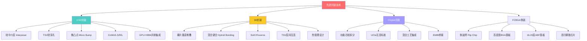
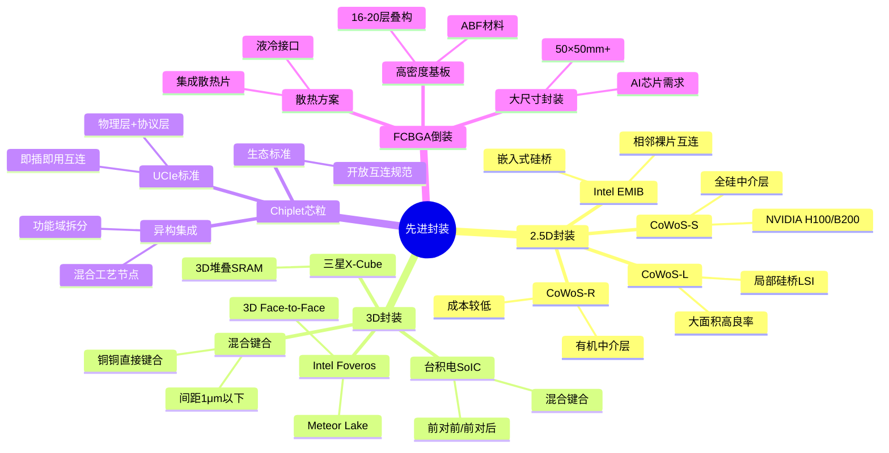
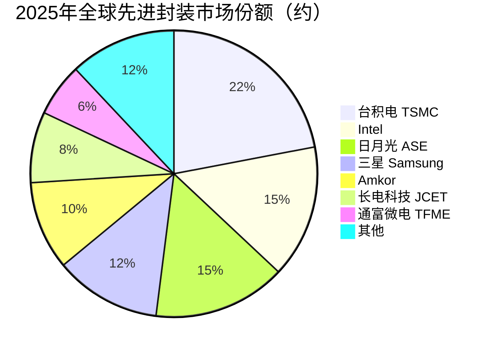

# 先进封装技术

> 2.5D/3D封装、Chiplet芯粒封装与FCBGA倒装封装技术，是后摩尔时代延续芯片性能提升和AI算力集成的核心路径。

## 概述

先进封装是AI产业链中游的关键环节，在后摩尔时代晶体管微缩放缓的背景下，先进封装成为延续芯片性能提升和功能集成的主要路径。AI芯片（如NVIDIA H100/B200、AMD MI300X）对算力密度、存储带宽和互连速率的需求远超传统封装能力，必须依赖2.5D/3D先进封装将GPU裸片、HBM堆栈、I/O芯片等异质功能模块高密度集成在同一封装内。

2.5D封装通过硅中介层（Silicon Interposer）将多个裸片并排排列在高密度布线基板上，裸片之间通过硅中介层的微细互连实现超高带宽通信。台积电CoWoS（Chip-on-Wafer-on-Substrate）是2.5D封装的标杆技术，NVIDIA从P100开始即采用CoWoS集成GPU与HBM，最新的B200在CoWoS封装内集成了两个GPU裸片和8颗HBM3E堆栈，封装面积接近光刻掩膜极限。3D封装则将多个裸片垂直堆叠，通过TSV（硅穿孔）和混合键合（Hybrid Bonding）实现层间超高密度互连，AMD MI300X采用3D堆叠将CPU、GPU、I/O和缓存芯片垂直集成，实现了创纪录的计算密度。

Chiplet芯粒封装是先进封装的理念升级——将单一大规模SoC拆分为多个功能芯粒，各自采用最优工艺制造后通过先进封装集成。Intel提出UCIe（Universal Chiplet Interconnect Express）标准，推动Chiplet互连接口标准化。FCBGA（Flip Chip Ball Grid Array）倒装封装是高引脚密度芯片的主流封装方式，通过倒装焊技术将芯片凸点直接与基板连接，广泛应用于CPU、GPU、芯片组等高性能芯片。随着AI芯片功耗和引脚数持续攀升，FCBGA基板层数已达16-20层以上，基板尺寸和技术要求不断提高。

## 技术原理

2.5D封装的技术核心是硅中介层（Silicon Interposer）。硅中介层是一块面积较大的硅片，上面通过TSV制造垂直互连通孔，表面布有微米级铜互连线。GPU裸片和HBM堆栈并排安装在硅中介层上，通过微凸点（Micro Bump）与中介层连接，中介层内的TSV将信号引至底部基板。硅中介层的关键优势在于可以利用半导体工艺制造亚微米级互连线，实现极高的布线密度和信号完整性，使GPU与HBM之间的互连带宽可达数TB/s。台积电CoWoS-S采用全硅中介层，CoWoS-R采用有机中介层降低成本，CoWoS-L使用局部硅桥（LSI）在关键互连区域使用硅，其余区域使用有机基板，兼顾性能和成本。

3D封装将裸片在垂直方向堆叠，通过TSV或混合键合实现层间互连。混合键合（Hybrid Bonding）是下一代3D封装的核心技术——它不使用微凸点，而是通过铜-铜直接键合实现互连，互连间距可缩小至1μm以下，互连密度比微凸点提高10倍以上。台积电SoIC（System on Integrated Chips）和Intel Foveros都采用混合键合技术。3D封装的优势在于极短的互连路径和极高的互连密度，但散热是重大挑战——上层芯片的热量必须穿透下层芯片导出，需要特殊的热管理设计。

Chiplet封装的理念是将原本集成的SoC按功能域拆分为多个芯粒——如计算核、I/O、缓存、存储控制器等——每个芯粒采用最适合的工艺节点（计算核用3nm，I/O用6nm），再通过先进封装集成。Intel的EMIB（Embedded Multi-die Interconnect Bridge）技术在有机基板中嵌入小型硅桥，实现相邻裸片间的高密度互连，成本低于全硅中介层。UCIe标准定义了芯粒间互连的物理层和协议层规范，使不同厂商的芯粒可以"即插即用"地组合，推动Chiplet生态发展。

FCBGA封装通过倒装焊技术将芯片有源面朝下，芯片上的焊盘凸点直接与基板焊盘对准连接，无需传统引线键合。这种连接方式缩短了互连路径、降低了寄生电感，适合高速高引脚数芯片。FCBGA基板采用ABF（Ajinomoto Build-up Film）材料，通过多层叠构实现高密度布线。AI芯片的FCBGA基板层数已达16-20层，基板尺寸超过50×50mm，制造难度极高。

## 分类与技术路线

2.5D封装以CoWoS和EMIB为代表，是目前AI GPU+HBM集成的首选方案。3D封装以SoIC和Foveros为代表，通过混合键合实现更高集成度，适合CPU+缓存、GPU+HBM等需要极致互连密度的场景。Chiplet封装强调标准化和生态开放，UCIe 1.0标准已发布并获多家厂商支持。FCBGA是高性能芯片的基础封装形式，随芯片功耗和引脚数增长，基板技术要求不断提升。

## 市场格局

先进封装市场快速增长，2025年全球先进封装市场规模约556亿美元（USDAnalytics），CAGR 8.3%至2034年1140亿美元。其中2.5D/3D封装和Chiplet封装随AI芯片爆发，CoWoS市场2025年约38亿美元，CAGR 19.4%至2034年189亿美元。flip-chip（倒装）占先进封装约41.37%。AI芯片是先进封装需求的最大驱动力，NVIDIA AI GPU的封装成本占整卡成本的20-30%。

台积电在先进封装领域占据绝对主导地位，凭借CoWoS和SoIC技术几乎垄断了AI GPU先进封装订单。2025年台积电CoWoS产能翻倍但仍供不应求，订单满载。Intel通过EMIB和Foveros技术自用并开放代工服务，三星通过I-Cube和X-Cube参与竞争。国内长电科技、通富微电、华天科技等封测企业在传统先进封装领域具备能力，但在2.5D/3D高端封装方面与国际领先水平仍有差距，正在加速布局。

国内封装基板领域，深南电路、兴森科技在FCBGA基板领域有所布局，但高端ABF基板仍主要依赖日本味之素和台湾欣兴电子供应。Chiplet和UCIe标准方面，中国Chiplet互连标准（ACC标准）已发布，国内企业积极参与Chiplet生态建设。

## 代表企业

| 企业 | 国家/地区 | 主要产品/技术 | 市场地位 |
|------|----------|-------------|---------|
| 台积电 TSMC | 中国台湾 | CoWoS、SoIC、InFO | 先进封装绝对龙头，AI芯片首选 |
| Intel | 美国 | EMIB、Foveros、UCIe | 自用+代工，Chiplet标准推动者 |
| 三星 Samsung | 韩国 | I-Cube、X-Cube、混合键合 | 先进封装第三，自用为主 |
| 日月光 ASE | 中国台湾 | FOCoS、SiP | 封测代工龙头 |
| Amkor | 美国/韩国 | 高密度FCBGA、2.5D | 全球最大OSAT之一 |
| 长电科技 JCET | 中国 | eWLB、XDFOI | 国内封测龙头，2.5D研发中 |
| 通富微电 TFME | 中国 | 高密度FCBGA、Chiplet封装 | AMD封装合作伙伴 |
| 深南电路 | 中国 | FCBGA封装基板 | 国内高端基板领先企业 |

## 发展趋势

### 市场规模预测

| 年份 | 市场规模 | 同比增长 | 备注 |
|------|---------|---------|------|
| 2024 | ~513亿美元 | — | 基准年 |
| 2025 | ~556亿美元 | +8.3% | CoWoS产能翻倍，AI芯片需求驱动 |
| 2026E | ~602亿美元 | +8.3% | 2.5D/3D/Chiplet封装随AI芯片爆发 |
| 2027E | ~652亿美元 | +8.3% | CAGR 8.3%至2034年1140亿美元 |

1. **CoWoS面积持续扩大**：台积电计划将CoWoS最大封装面积从目前的约1700mm²提升至2025年的2400mm²以上，支持更大规模的GPU+HBM集成。光罩限制逐步突破后，单封装内可集成更多裸片，进一步提升AI芯片的系统级性能。

2. **混合键合全面普及**：混合键合将从当前的3μm间距推进至1μm以下，互连密度提高10倍，功耗降低50%以上。台积电和Intel在混合键合技术上领先，将成为3D封装的标准互连方式，彻底替代微凸点。

3. **Chiplet生态标准化**：UCIe标准加速推广，越来越多芯片厂商推出UCIe兼容芯粒。开放Chiplet市场将改变芯片设计模式，使中小企业也能通过组合标准芯粒快速构建定制化AI芯片。中国ACC标准与UCIe形成互补，推动本土Chiplet生态发展。

4. **玻璃基板封装探索**：玻璃基板相比有机ABF基板具有更低的介电常数、更好的尺寸稳定性和更高的布线密度，有望将基板面积提升至有机基板的2-3倍。Intel计划2026年后引入玻璃基板，用于超大尺寸AI芯片封装。

5. **国内先进封装加速追赶**：长电科技XDFOI 2.5D封装技术已进入客户验证阶段，通富微电在高密度FCBGA方面持续投入。国内ABF基板（深南电路、兴森科技）和先进封装产能建设加速，有望在2-3年内缩小与国际领先水平的差距。

## 与AI产业链的关联

先进封装是AI芯片性能实现的关键使能技术。2025年全球先进封装市场约556亿美元，CoWoS市场约38亿美元（CAGR 19.4%至2034年189亿美元），flip-chip占先进封装41.37%。NVIDIA H100/B200/Blackwell之所以能实现惊人的算力指标，不仅依赖GPU裸片本身的计算能力，更依赖CoWoS封装将GPU与HBM超高带宽互连、将多个GPU裸片无缝集成。可以说，没有先进封装，就没有当代AI GPU。先进封装的产能直接制约AI芯片的出货量——2025年台积电CoWoS产能翻倍但仍供不应求，成为AI GPU供应紧张的核心原因之一。

Chiplet封装为AI芯片设计提供了新的范式。通过将大芯片拆分为多个芯粒，可以提高良率（小芯粒良率远高于大芯片）、降低制造成本（不同功能模块采用不同工艺节点）、加速产品迭代。对于AI推理芯片等成本敏感场景，Chiplet方案可以在性能、成本和上市时间之间取得更优平衡。FCBGA则为所有高性能AI芯片提供基础的物理封装支撑，基板技术和散热能力直接影响AI芯片的可靠性和性能发挥。随着AI芯片功耗向1000W以上攀升，先进封装的热管理和供电设计也成为关键挑战，液冷集成封装方案正在加速研发。

---
[← 返回总目录](../../README.md)
