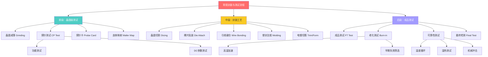
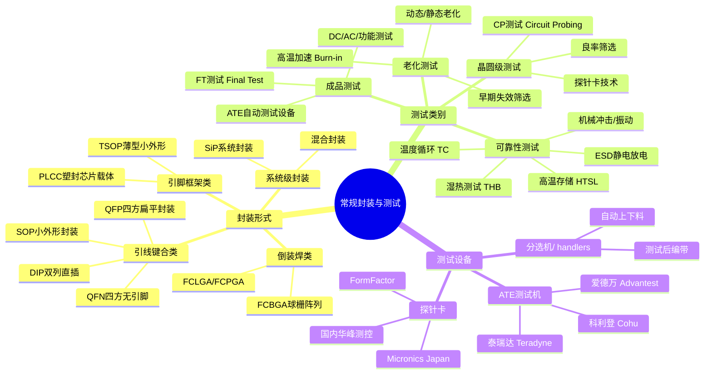
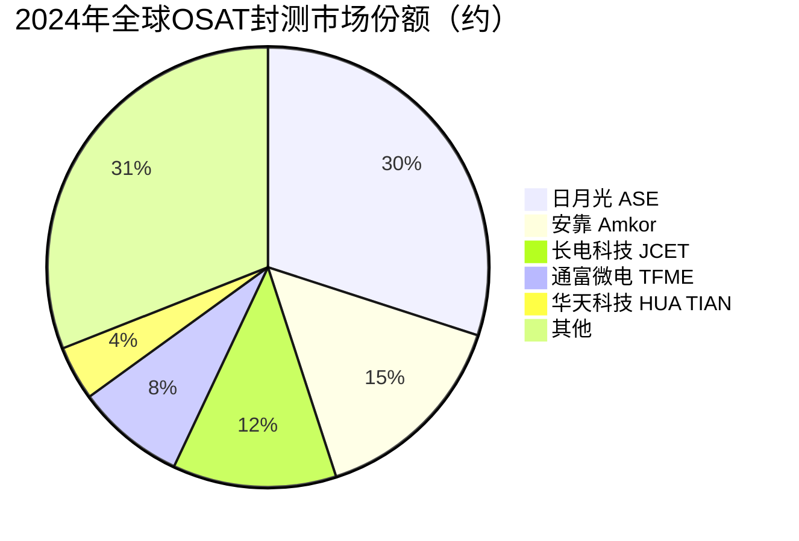

# 常规封装与测试

> 芯片封装测试环节，包括传统封装工艺、老化测试（Burn-in）、可靠性测试与探针测试（CP/FT），保障芯片出厂品质与可靠性。

## 概述

常规封装与测试是半导体制造产业链的最后一道关键环节，负责将晶圆切割后的裸片封装为成品芯片，并通过一系列测试确保芯片功能和可靠性满足规格要求。虽然先进封装技术在AI芯片领域备受关注，但常规封装（如QFP、QFN、BGA、SOP等传统封装形式）仍然是全球芯片出货量最大的封装类别，广泛应用于消费电子、工业控制、汽车电子、通信设备等领域。AI服务器中的供电管理芯片、时钟芯片、接口芯片等配套器件同样采用常规封装。

测试环节是芯片质量控制的核心，包括晶圆测试（CP，Circuit Probing）、成品测试（FT，Final Test）、老化测试（Burn-in Test）和可靠性测试。CP测试在晶圆切割前通过探针卡（Probe Card）接触芯片焊盘，筛选出功能合格的裸片，避免对不良裸片投入封装成本。FT测试在封装完成后对成品芯片进行全面功能和参数测试，确保出厂品质。老化测试通过在高温、高压、高频等加速条件下运行芯片，激发早期失效，剔除可靠性不达标的产品。可靠性测试则通过长期环境应力测试评估芯片在寿命期内的稳定性。

中国是全球封测产业的重要基地，长电科技、通富微电、华天科技等国内封测企业位列全球OSAT（外包封测服务商）前十。2024年全球封测市场规模约700亿美元，其中中国市场占比超过35%。随着AI芯片和汽车电子需求增长，高可靠性测试和车规级封装成为封测行业的重要增长方向。同时，国内封测企业正从传统封装向先进封装延伸，提升产品附加值和技术竞争力。

## 技术原理

常规封装的基本流程包括：晶圆减薄（Grinding）、晶圆切割（Dicing）、裸片贴装（Die Attach）、引线键合（Wire Bonding）或倒装焊（Flip Chip）、塑封注胶（Molding）、打标（Marking）、切筋成型（Trim & Form）和成品测试。封装的核心功能是保护裸片免受外界环境（湿气、灰尘、机械冲击）影响，同时提供芯片与外部电路之间的电气互连和散热通道。

封装形式按互连方式可分为引线键合（Wire Bonding）和倒装焊（Flip Chip）两大类。引线键合使用金线或铜线将芯片焊盘连接到引脚框架，工艺成熟、成本低廉，是消费级芯片最常用的互连方式。倒装焊通过芯片上的凸点直接与基板连接，互连路径短、寄生参数小，适合高速高引脚数芯片。封装形式按外形可分为DIP（双列直插）、SOP（小外形封装）、QFP（四方扁平封装）、QFN（四方扁平无引脚）、BGA（球栅阵列）等，各有不同的引脚密度和散热特性适用场景。

测试环节的技术原理涉及半导体器件的电学特性测量和可靠性物理。CP测试使用探针卡——一种精密的测试接口器件，其探针精确对准芯片焊盘，将自动测试设备（ATE）的测试信号施加到芯片上。探针卡技术分为悬臂梁式（Cantilever）、垂直式（Vertical）和MEMS式，AI芯片等高引脚数芯片需要MEMS垂直探针卡，单张卡价格可达数万美元。FT测试在自动测试设备（ATE）上进行，测试项目包括DC参数（漏电流、功耗）、AC参数（时序、频率）、功能测试（逻辑正确性）等。

老化测试（Burn-in Test）基于可靠性物理中的加速失效模型——阿伦尼乌斯方程，通过提高工作温度和电压加速器件退化过程，使早期失效产品在出厂前暴露。典型老化条件为125°C环境温度下持续运行48-168小时，辅以高于额定值的电压应力。可靠性测试则包括温度循环（-65°C至+150°C，500-1000次循环）、高温存储（150°C，1000小时）、湿热测试（85°C/85%RH）、机械冲击和振动测试等，确保芯片在预期使用寿命内的可靠性。

## 分类与技术路线

封装形式按互连方式分为引线键合和倒装焊两大类，按外形分为多种标准化封装。测试环节按流程顺序为CP→封装→FT→老化→可靠性验证，每个环节使用不同设备和技术。ATE测试机是测试环节的核心设备，高端SoC测试机单台价格可达数百万美元，全球市场由日本爱德万和美国泰瑞达双寡头垄断。

## 市场格局

全球封测市场2024年规模约700亿美元，其中OSAT（外包封测服务）市场约450亿美元，IDM自封测约250亿美元。日月光（ASE）以约30%的OSAT市场份额位居全球第一，安靠以约15%份额排名第二。中国大陆封测企业长电科技（JCET）以约12%份额排名第三，通富微电约8%排名第四，华天科技约4%排名第六，三家中国封测企业合计占据全球OSAT市场约24%份额，中国是全球封测产业的重要基地。

测试设备市场方面，ATE测试机全球市场约80亿美元，日本爱德万约45%份额排名第一，美国泰瑞达约40%份额排名第二，两家合计占据约85%市场份额。国内华峰测控在模拟/混合信号测试机领域取得突破，但高端SoC测试机仍依赖进口。探针卡市场约20亿美元，美国FormFactor占据约25%份额排名第一。

## 代表企业

| 企业 | 国家/地区 | 主要产品/技术 | 市场地位 |
|------|----------|-------------|---------|
| 日月光 ASE | 中国台湾 | 全系列封装、SiP、测试 | 全球OSAT第一 |
| 安靠 Amkor | 美国/韩国 | FC封装、BGA、测试 | 全球OSAT第二 |
| 长电科技 JCET | 中国 | 引线键合、SiP、先进封装 | 国内封测龙头，全球第三 |
| 通富微电 TFME | 中国 | BGA、FC封装、AMD封测 | 国内封测第二，AMD合作伙伴 |
| 华天科技 | 中国 | 传统封装、TSV封装 | 国内封测第三 |
| 爱德万 Advantest | 日本 | ATE测试机、探针卡 | 测试设备全球第一 |
| 泰瑞达 Teradyne | 美国 | ATE测试机、半导体测试 | 测试设备全球第二 |
| 华峰测控 | 中国 | 模拟/混合信号测试机 | 国内测试设备领先企业 |

## 发展趋势

1. **车规级封测需求增长**：智能汽车和自动驾驶对芯片可靠性要求极高，车规级封装（AEC-Q100认证）和1000小时以上老化测试需求快速增长。国内封测企业加速布局车规级封装产线，长电科技已获得多家车企认证。

2. **AI配套芯片封测增长**：AI服务器中的供电管理（PMIC）、时钟发生器、接口芯片、光模块驱动器等配套器件采用常规封装，随AI服务器出货量增长而需求攀升。高可靠性BGA和QFN封装需求增加。

3. **测试自动化与智能化**：AI技术应用于测试数据分析和良率预测，机器学习模型可从CP/FT测试数据中识别潜在不良模式，提前预警工艺偏移。数字孪生和虚拟测试技术缩短新产品导入周期。

4. **国产测试设备突破**：华峰测控在模拟测试机领域已实现国产替代，精测电子、长川科技等企业在数字测试机领域加速研发。国产探针卡和分选机也在快速进步，但高端SoC测试设备仍需突破。

5. **封装测试一体化**：OSAT企业从单一封装或测试向"封测一体化"发展，为客户提供封装+测试一站式服务，提升竞争力。同时部分IDM将封测环节外包，OSAT市场份额持续提升。

## 与AI产业链的关联

常规封测虽不如先进封装那样直接关联AI GPU，但同样是AI产业链不可或缺的支撑环节。AI服务器系统中除了GPU/HBM等核心器件外，还需要大量配套芯片——电源管理芯片为GPU提供精确的多路供电、时钟芯片提供高速同步时钟、I/O芯片管理数据传输、温度传感器监控散热状态。这些配套芯片虽然不采用先进封装，但可靠性要求高，其封测质量直接影响AI服务器的系统稳定性。

测试环节为AI芯片的品质保障提供最终防线。AI GPU在出厂前需要经历严格的CP和FT测试，确保每个功能单元（CUDA核心、张量核心、HBM接口）均正常工作。老化测试筛选出早期失效产品，避免AI训练过程中因芯片故障导致训练中断——大模型训练一次运行成本可达数百万美元，芯片可靠性至关重要。可靠性测试验证AI芯片在数据中心高温环境下的长期工作能力。同时，随着AI芯片功耗向1000W以上攀升，封装的热阻特性和散热设计也面临更大挑战，推动高导热封装材料和先进散热结构的研发应用。国内封测企业的成长为AI芯片国产化提供了重要的产业基础支撑。

---
[← 返回总目录](../../README.md)
