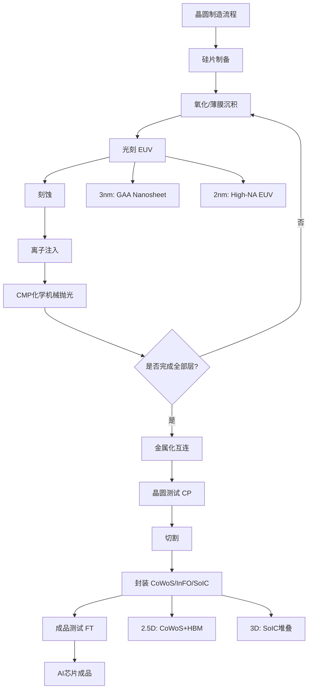
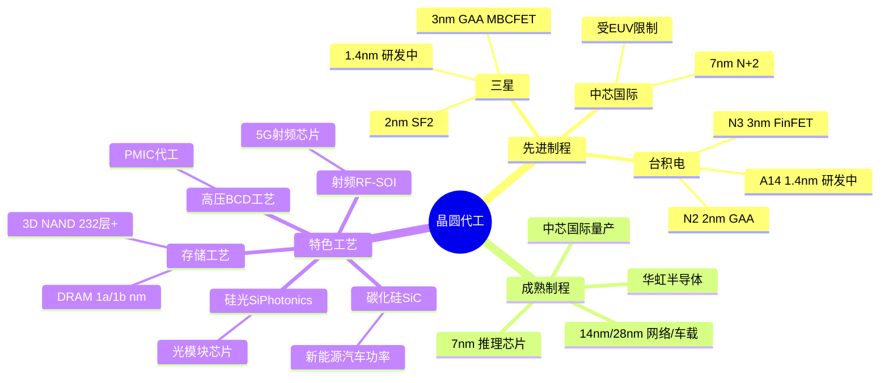
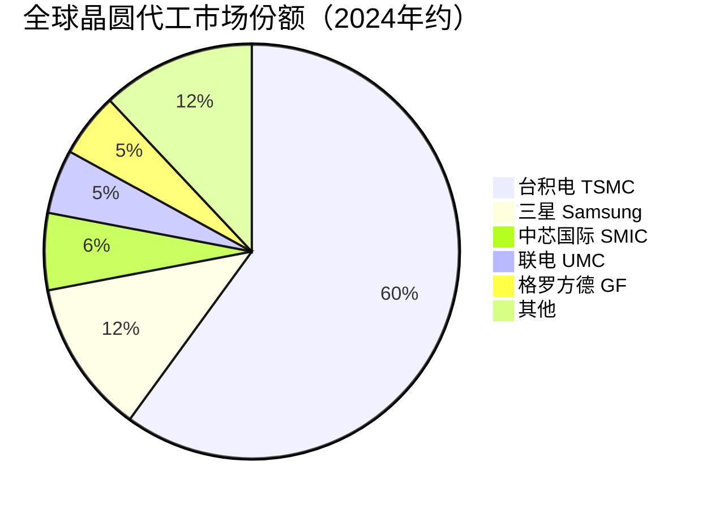

# 晶圆代工

> 晶圆代工是半导体产业链中将芯片设计图纸（GDSII）转化为物理芯片的制造环节，涵盖先进制程（3nm/2nm/1.4nm）、成熟制程（7nm/14nm/28nm）和特色工艺（高压/射频/存储/SiC等），是AI算力芯片实现量产的核心环节。

## 概述

晶圆代工是AI半导体产业链中游的关键制造环节，直接决定了芯片设计能否从图纸变为实体产品。全球晶圆代工市场规模在2024年达到约1500亿美元，其中AI芯片代工需求是增长的核心驱动力——NVIDIA的H100/B200系列芯片全部由台积电代工，AI芯片对先进制程的巨大需求推动了台积电营收的爆发式增长。

晶圆代工按制程节点分为三大类别：**先进制程**（3nm及以下）用于制造高性能AI训练芯片（GPU、TPU）；**成熟制程**（7nm-28nm）用于制造AI推理芯片、网络芯片和服务器CPU；**特色工艺**用于制造电源管理芯片、射频芯片、存储芯片和碳化硅功率器件等配套芯片。不同制程节点对应不同的应用场景和客户群体。

晶圆代工是技术壁垒最高、资本投入最大的半导体环节。一座月产5万片的3nm晶圆厂投资超过200亿美元，且需要持续巨额研发投入保持制程领先。全球能制造5nm以下芯片的晶圆厂仅有台积电、三星和中芯国际三家，这种高度集中的产能格局使得晶圆代工成为AI产业链中供应链风险最高的环节之一。

## 技术原理

**光刻技术**：光刻是晶圆制造中精度最高、成本最大的步骤。先进制程采用EUV（极紫外光）光刻，波长13.5nm，NA 0.33的EUV可制造5nm/3nm芯片。High-NA EUV（NA 0.55）是2nm及以下制程的关键设备，单台价格超过3.5亿美元。在光刻过程中，光刻机将掩模版上的电路图案通过光学缩小投影到涂有光刻胶的硅片上，经显影后形成电路图形。

**晶体管架构演进**：随着制程缩小，传统平面MOSFET面临短沟道效应和漏电问题。3nm制程采用GAA（Gate-All-Around，环绕栅极）晶体管架构——三星3nm已采用GAA MBCFET架构，台积电3nm仍采用FinFET（鳍式场效应管）架构。2nm制程全面转向GAA Nanosheet（纳米片）架构，台积电N2工艺采用GAA纳米片晶体管，三星2nm也采用GAA架构。1.4nm及以下制程可能需要CFET（互补场效应晶体管）等全新架构。

**工艺流程**：一片晶圆从裸硅片到成品需要经过数百道工序，主要包括：**氧化/沉积**——在硅片上生长氧化层或沉积各种薄膜材料；**光刻**——将电路图案转移到光刻胶上；**刻蚀**——用化学或物理方法去除未被光刻胶保护的薄膜材料，形成电路图形；**离子注入**——向硅片中注入掺杂离子，改变电学特性；**金属化**——沉积金属层（铜/钨/钌）形成互连线；**CMP（化学机械抛光）**——平坦化晶圆表面。以上步骤循环重复数十次，逐层构建芯片的三维结构。

**先进封装**：随着摩尔定律趋缓，先进封装成为延续芯片性能提升的重要路径。**CoWoS（Chip-on-Wafer-on-Substrate）**——台积电的2.5D封装技术，通过硅中介层将多个芯片（GPU+HBM）高密度互连，是NVIDIA H100/B200的核心封装技术；**InFO（Integrated Fan-Out）**——台积电的扇出型封装，用于移动处理器；**3D堆叠**——SoIC（System on Integrated Chips）技术实现芯片的3D垂直堆叠，键合间距缩小到数微米。

## 分类与技术路线

**先进制程（3nm/2nm/1.4nm）**：
- **台积电**：N3（3nm FinFET）、N3E/N3P（3nm增强版）、N2（2nm GAA Nanosheet）、A14（1.4nm，研发中）。N3工艺已被苹果A17/A18和NVIDIA H100采用，N2预计2025年量产，A14预计2027-2028年量产。
- **三星**：3nm采用GAA MBCFET架构（业界首个GAA量产），2nm（SF2）预计2025年量产，1.4nm在研发中。三星代工在良率和客户数量上落后台积电。
- **中芯国际**：目前最先进制程为7nm（N+2工艺），通过DUV光刻多重曝光实现，但在良率和成本上受限。更先进制程（5nm/3nm）受EUV设备限制无法推进。

**成熟制程（7nm/14nm/28nm）**：用于AI推理芯片、网络交换芯片、车载芯片和服务器CPU等。台积电在7nm/28nm成熟制程占据领先份额。中芯国际在14nm/28nm已实现规模量产，华虹半导体在28nm/40nm特色工艺领域有竞争力。成熟制程产能需求持续旺盛，是国产晶圆代工的重要阵地。

**特色工艺**：
- **高压工艺（BCD）**：用于电源管理芯片（PMIC），英飞凌、TI在BCD工艺领先，华虹半导体和中芯国际在国产PMIC代工领域有一定份额。
- **射频工艺（RF-SOI/GaN-on-SiC）**：用于5G通信射频芯片和功率放大器，Qorvo、Skyworks主导GaN射频器件代工。
- **存储工艺（DRAM/NAND）**：DRAM采用1a/1b/1c nm节点（10nm级），3D NAND层数已超过232层，三星、SK海力士、美光垄断。
- **碳化硅（SiC）**：用于新能源汽车功率器件，Wolfspeed、意法半导体、英飞凌在SiC晶圆代工领域领先，国内三安光电在天岳先进等在SiC外延和器件领域布局。
- **光电子工艺（InP/SiPhotonics）**：用于光模块芯片和硅光集成，台积电和Tower Semiconductor在硅光代工领域有布局。

## 市场格局

全球晶圆代工市场高度集中，台积电以约60%的份额占据绝对主导地位，尤其在先进制程领域，台积电几乎垄断了3nm/5nm/7nm的AI芯片代工订单。2024年台积电营收超过900亿美元，AI相关业务（HPC平台）贡献超过50%的营收增长。

三星代工份额约10-12%，在先进制程上积极追赶台积电，但在良率和大客户获取上仍有差距。中芯国际份额约6%，是中国大陆最大的晶圆代工厂，但在先进制程上受设备出口管制限制。联电（UMC）和格罗方德（GlobalFoundries）已退出先进制程竞争，聚焦成熟制程和特色工艺。

在存储代工领域，三星、SK海力士、美光三家垄断全球DRAM市场，HBM（高带宽存储）由SK海力士率先量产并占据过半份额。中国长鑫存储（CXMT）在DRAM领域快速追赶，长江存储（YMTC）在3D NAND领域已达到国际先进水平。

## 代表企业

| 企业 | 国家/地区 | 主要产品/技术 | 市场地位 |
|------|----------|-------------|---------|
| 台积电 TSMC | 中国台湾 | N3/N2/A14先进制程、CoWoS封装 | 全球晶圆代工绝对龙头 |
| 三星代工 | 韩国 | 3nm GAA、SF2 2nm | 全球第二大先进制程代工厂 |
| 中芯国际 SMIC | 中国大陆 | 14nm/28nm成熟制程、7nm N+2 | 中国大陆最大晶圆代工厂 |
| 联电 UMC | 中国台湾 | 28nm/14nm成熟制程 | 全球第三大纯代工厂 |
| 格罗方德 GF | 美国 | 22FDX FD-SOI、成熟制程 | 美国最大纯代工厂 |
| 华虹半导体 | 中国大陆 | 28nm/40nm特色工艺、BCD/功率器件 | 国产特色工艺代工领先 |
| SK海力士 | 韩国 | HBM3E高带宽存储、DRAM | HBM存储全球第一 |
| 长江存储 YMTC | 中国大陆 | 3D NAND Xtacking架构 | 国产存储芯片领军者 |

## 发展趋势

1. **2nm GAA制程量产在即**：台积电N2工艺预计2025年量产，采用GAA Nanosheet晶体管架构，相比N3E在相同功耗下性能提升10-15%，在相同性能下功耗降低25-30%。苹果和NVIDIA将是首批2nm客户。三星SF2也计划2025年量产。

2. **High-NA EUV推动1.4nm制程**：台积电A14（1.4nm）和英特尔14A（1.4nm）制程将需要ASML的High-NA EUV光刻机。High-NA EUV单台价格3.5-4亿美元，将显著推高先进制程的资本支出门槛，进一步加剧代工厂的集中度。

3. **先进封装成为差异化关键**：在制程微缩趋缓的背景下，先进封装（CoWoS、SoIC、3D堆叠）成为芯片性能提升的关键路径。台积电CoWoS产能2024年仍供不应求，NVIDIA AI芯片的交付瓶颈很大程度上来自CoWoS封装产能不足。各大代工厂纷纷扩产先进封装产能。

4. **地缘政治加速产能分散**：美国《芯片法案》、欧盟《芯片法案》和日本半导体产业振兴政策推动晶圆代工产能向多地分散。台积电在亚利桑那州建3nm/2nm工厂，在日本熊本建28nm/22nm工厂，在德国德累斯顿建车规芯片工厂。产能分散增加了AI芯片供应链的弹性。

5. **国产代工在成熟制程和特色工艺突破**：在先进制程受EUV限制的背景下，中国晶圆代工厂聚焦成熟制程扩产和特色工艺创新。中芯国际在北京、上海、深圳、天津建设多个12英寸晶圆厂，华虹半导体在无锡扩产12英寸特色工艺产线。碳化硅、硅光等新兴特色工艺领域是国产代工弯道超车的机会。

## 与AI产业链的关联

晶圆代工是AI芯片从设计到量产的"最后一公里"，直接决定了AI算力芯片的产能、性能和成本。NVIDIA的GPU虽由其设计，但制造完全依赖台积电——如果台积电停产，全球AI训练芯片供应将面临断供风险。台积电CoWoS先进封装产能更是直接决定了NVIDIA AI芯片的出货量上限。

在AI集群层面，HBM高带宽存储芯片的产能同样制约着AI芯片的交付。SK海力士的HBM3E产能2024年持续紧张，NVIDIA和AMD均在争夺HBM产能分配。存储代工的产能扩张节奏直接影响AI芯片的供给。

对中国而言，先进制程代工能力是AI产业链自主可控的关键瓶颈。在美国对中芯国际等企业实施设备出口管制的背景下，国产7nm及以下制程的发展受到严重制约。发展国产先进制程代工能力、突破EUV光刻设备限制、提升成熟制程和特色工艺产能，是保障中国AI产业链安全的战略要务。

---
[← 返回总目录](../README.md)
