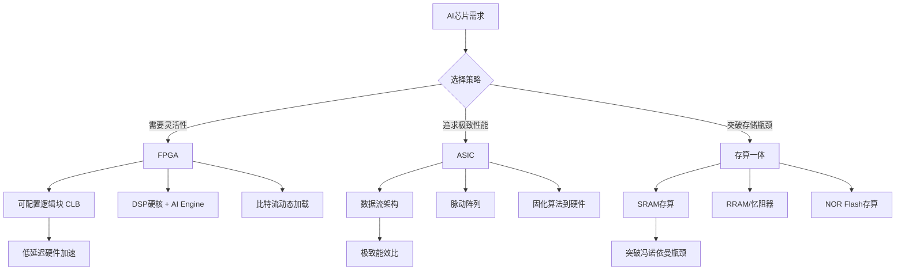
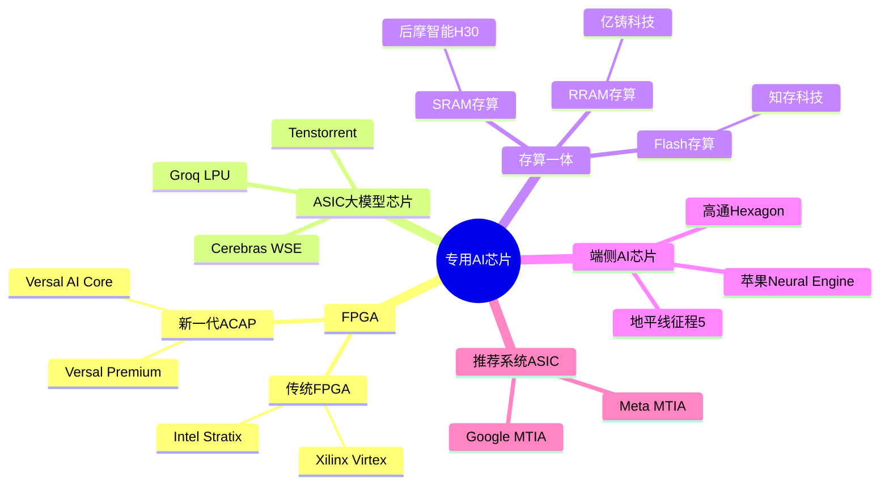
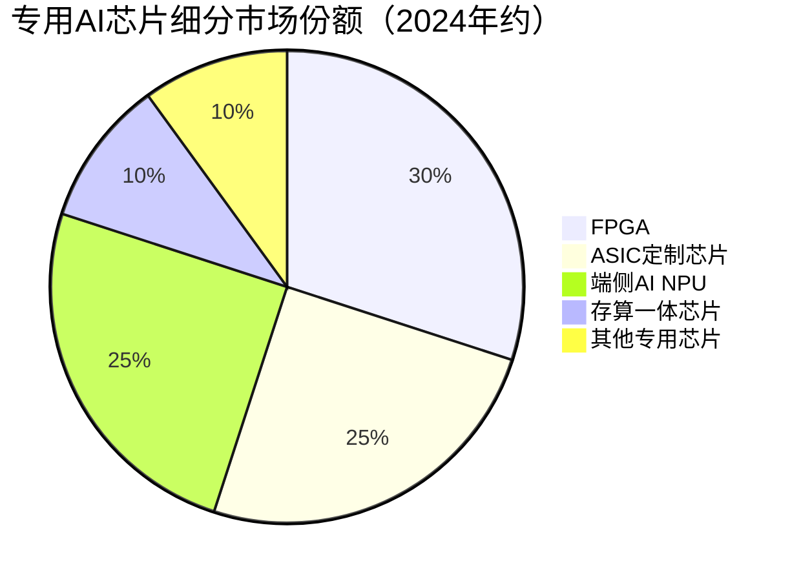

# 专用芯片

> 针对特定AI应用场景或功能需求定制的芯片，包括FPGA可编程芯片、ASIC定制大模型芯片、存算一体芯片等，追求极致能效比和场景适配性。

## 概述

专用芯片是AI半导体产业链中游芯片设计领域的重要组成部分，与通用AI算力芯片形成互补关系。通用GPU虽具备强大算力和灵活的软件生态，但其在特定场景下的能效比并非最优——在自动驾驶、端侧AI推理、大规模推荐系统等场景中，专用芯片往往能以更低的功耗和成本实现同等甚至更优的性能。

随着AI应用场景的细分化，"通用算力+专用加速"的混合架构正在成为主流趋势。大型数据中心在GPU训练集群之外，越来越多地部署专用推理芯片来处理海量在线推理请求。而在端侧设备（手机、IoT、汽车）中，专用NPU已成为标配——苹果A系列芯片中的Neural Engine、高通骁龙Hexagon DSP等均为典型代表。

专用芯片的核心价值在于**能效比优势**和**场景定制化**。通过裁剪不必要的通用计算单元、优化数据流和存储层次、固化常用算法到硬件中，专用芯片可在特定任务上实现5-10倍的能效提升。FPGA提供硬件可编程的灵活性，ASIC提供极致的定制化性能，存算一体芯片则从架构层面突破"冯·诺依曼瓶颈"，代表了AI芯片的未来发展方向。

## 技术原理

**FPGA（现场可编程门阵列）**：FPGA由大量可配置逻辑块（CLB）、可编程互连资源和嵌入式硬核（如DSP、BRAM、高速收发器）组成。与ASIC的固定电路不同，FPGA的电路功能通过加载比特流文件动态配置，可在同一硬件上实现不同算法的硬件加速。现代FPGA（如AMD/Xilinx Versal、Intel Agilex）集成了AI Engine等专用计算单元，支持INT8/FP16精度AI推理。FPGA的关键优势是低延迟、可重构和流式数据处理能力强，适合金融高频交易、5G通信、视频转码等需要灵活性和低延迟的场景。

**ASIC（专用集成电路）**：ASIC是为特定算法或应用定制的芯片，设计完成后电路固定不可更改。AI ASIC通常采用以下设计策略：**数据流架构**——让数据在固定的硬件流水线中流动，减少数据搬运开销；**脉动阵列**——通过规则的数据流动模式实现大规模矩阵运算的高效执行；**专用存储层次**——根据模型特征设计片上SRAM容量和数据复用策略。代表性产品包括Groq的LPU（极致推理吞吐量）、Cerebras的WSE（整片晶圆级AI芯片）、Google TPU等。

**存算一体芯片**：传统冯·诺依曼架构中，计算单元和存储单元分离，数据在两者之间搬运消耗大量时间和能耗。存算一体芯片将计算功能嵌入存储阵列中，在数据存储的位置直接执行计算。主要技术路线包括：**SRAM存算**——在SRAM位单元阵列上实现模拟域乘加运算；**RRAM/忆阻器存算**——利用阻变存储器的模拟特性实现矩阵乘法；**Flash存算**——基于NOR Flash存储单元的存内计算。存算一体芯片在AI推理场景下有望实现10-100倍的能效提升。

## 分类与技术路线

专用AI芯片按技术路线和目标场景可分为以下类别：

**FPGA芯片**：按架构分为传统FPGA（Xilinx Virtex/Spartan、Intel Stratax/Cyclone）和ACAP（自适应计算加速平台，如Xilinx Versal）。AI场景中FPGA主要用于推理加速、视频/图像处理和5G基带加速。AMD收购Xilinx后，FPGA与GPU/CPU的异构融合成为趋势。

**ASIC定制大模型芯片**：为大模型推理或训练专门设计的芯片。Groq LPU采用确定性数据流架构，在LLM推理中实现极低延迟和高吞吐量；Cerebras WSE-3采用晶圆级集成，在一整片晶圆上构建超大AI芯片，集成4万亿个晶体管和90万个AI核心；Tenstorrent采用RISC-V架构设计AI训练/推理芯片。

**存算一体芯片**：国内企业在新赛道上具有先发优势。清华大学团队孵化的知存科技推出基于Flash存算的AI芯片；亿铸科技推出基于RRAM的存算一体AI芯片；后摩智能的鸿途H30基于SRAM存算架构，在端侧推理场景下实现高能效比。国际方面，Mythic、Rain AI等初创公司也在推进存算一体AI芯片的商业化。

**端侧AI专用芯片**：面向手机、IoT、可穿戴设备的低功耗AI芯片。苹果Neural Engine（16核NPU，算力35TOPS）、高通Hexagon DSP、联发科APU等均为手机端AI推理专用加速单元。汽车领域的NVIDIA Orin、地平线征程5等也是AI专用SoC的代表。

**推荐系统专用芯片**：互联网巨头的推荐系统需要处理海量稀疏特征，对存储带宽和Embedding查表性能要求极高。Google的推断机（Video Intelligence Processing Unit）、Meta的MTIA等均为推荐系统定制的ASIC芯片。

## 市场格局

专用AI芯片市场呈现碎片化竞争格局，不同技术路线各有优势领域。FPGA市场由AMD（原Xilinx）和Intel双寡头垄断，合计份额超过85%，但国产FPGA（紫光同创、复旦微电、安路科技）在通信、工业领域逐步突破。ASIC芯片市场因其定制化特性，参与者分散，各企业针对特定场景深耕。

存算一体芯片是AI芯片领域的新兴赛道，国内外基本处于同一起跑线。知存科技、后摩智能、亿铸科技等国内企业在模拟存算技术路线上具有技术积累。清华大学、北京大学等高校在存算一体基础研究方面处于国际前沿。

端侧AI芯片市场中，高通在手机AP领域领先，联发科在中端市场快速崛起。华为麒麟9000s搭载的NPU在国产手机芯片中表现突出。汽车AI芯片方面，NVIDIA Orin占据高端自动驾驶市场，地平线征程5在国内市场份额领先。

## 代表企业

| 企业 | 国家/地区 | 主要产品/技术 | 市场地位 |
|------|----------|-------------|---------|
| AMD/Xilinx | 美国 | Versal ACAP、Virtex FPGA | 全球FPGA市场份额第一 |
| Intel | 美国 | Stratix/Agilex FPGA | 全球FPGA市场份额第二 |
| Groq | 美国 | LPU推理加速芯片 | 极致推理性能新锐 |
| Cerebras | 美国 | WSE-3晶圆级AI芯片 | 晶圆级计算首创者 |
| 紫光同创 | 中国 | Pango FPGA系列 | 国产FPGA军用/工业领域主力 |
| 后摩智能 | 中国 | 鸿途H30存算一体芯片 | 国产存算一体AI芯片代表 |
| 地平线 | 中国 | 征程5/6自动驾驶AI芯片 | 国产车载AI芯片领军者 |
| 知存科技 | 中国 | Flash存算AI芯片 | 存算一体技术先行者 |

## 发展趋势

1. **Chiplet+专用加速的异构融合**：通过先进封装将FPGA、ASIC、NPU与通用CPU/GPU集成在同一封装内，根据工作负载动态调度计算资源。AMD的Versal ACAP已实现CPU+FPGA+AI Engine的异构集成，Intel的Falcon Shores将集成x86+GPU+AI加速器。

2. **存算一体技术从实验室走向量产**：基于RRAM和SRAM的存算一体AI芯片在2024-2025年进入小批量量产阶段，在可穿戴设备、智能音箱等低功耗AI场景率先落地。但大规模数据中心应用仍需解决模拟计算精度和可靠性问题。

3. **大模型推理专用芯片爆发**：随着大模型从训练转向推理部署，针对Transformer架构优化的推理专用芯片需求爆发。Groq LPU、Cerebras CS-3等产品在LLM推理场景展现出远超GPU的吞吐量/成本比，可能重塑AI推理芯片市场格局。

4. **开源指令集驱动AI芯片创新**：RISC-V等开源指令集降低了AI芯片设计门槛，Tenstorrent、SiFive等企业基于RISC-V构建AI加速器，打破x86/ARM架构的授权限制，为国产AI芯片提供更多自主设计空间。

5. **车规级AI芯片需求快速增长**：智能驾驶从L2向L3/L4演进，对车载AI算力需求从数十TOPS增长到数千TOPS。NVIDIA Orin、地平线征程6、黑芝麻A1000等车规级AI芯片竞争日趋激烈。

## 与AI产业链的关联

专用AI芯片在AI产业链中承担着"最后一公里"的角色——将大模型能力高效部署到各类终端和应用场景中。通用GPU擅长训练，但在推理部署、端侧AI和特定场景中，专用芯片以更低的功耗和成本实现AI能力交付。

在大模型推理服务中，专用推理芯片可显著降低单次推理的成本，使大模型的商业化落地成为可能。在端侧AI中，专用NPU使手机、汽车、IoT设备能够在本地运行AI模型，降低对云端算力的依赖，同时保护用户隐私。存算一体芯片作为革命性架构，有望从根本上解决AI计算的能效瓶颈，推动AI从"大力出奇迹"走向"精巧高效"。

专用芯片的发展也推动了芯片设计方法论的变革——从"通用硬件+软件适配"转向"算法-架构协同设计"，AI芯片设计越来越依赖与AI模型和编译器的紧密协同优化。

---
[← 返回总目录](../../README.md)
