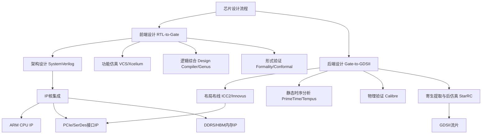
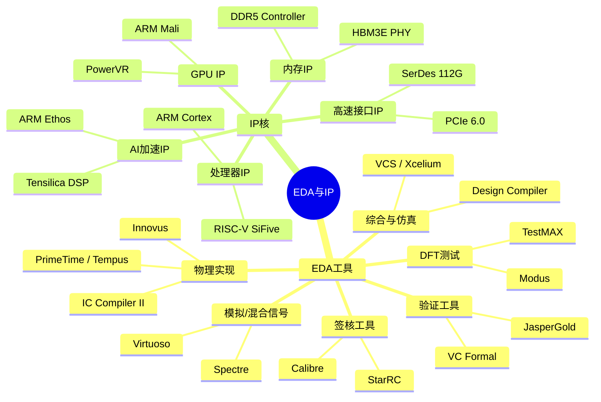
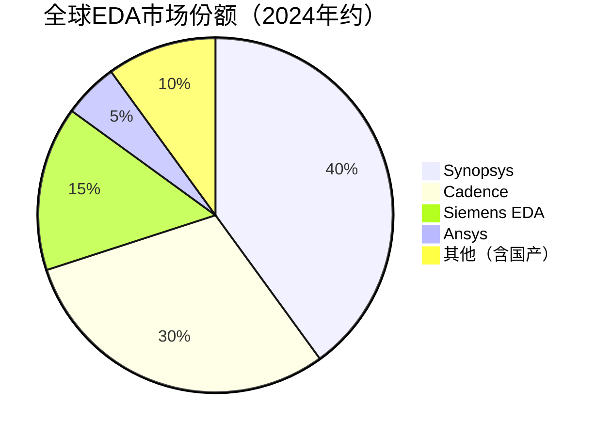

# 设计工具EDA与IP

> EDA（电子设计自动化）软件与IP（知识产权）核是芯片设计的两大基础工具，EDA提供从RTL到GDSII的全流程设计工具链，IP核提供经过验证的可复用设计模块，二者共同构成了现代芯片设计的"工业母机"。

## 概述

EDA软件和IP核是半导体产业链中游芯片设计环节的"基础设施"。如果说芯片设计是"盖大楼"，那么EDA软件就是"建筑设计软件"，IP核就是"预制构件"。没有EDA工具，现代百亿级晶体管芯片的设计根本无法实现；没有高质量的IP核，芯片设计周期将从数月延长到数年，成本将增加数倍。

在AI芯片设计领域，EDA和IP的重要性更加突出。AI芯片（如GPU、TPU）通常采用最先进的制程节点（3nm/2nm），晶体管规模达数百亿甚至千亿级别，对EDA工具的容量、精度和效率提出了极高要求。同时，AI芯片需要大量高速接口IP（PCIe 6.0、112G SerDes、HBM3E PHY）和高速内存IP（DDR5控制器、HBM控制器），这些IP的验证和集成是芯片成功流片的关键。

EDA和IP市场被少数国际巨头垄断，Synopsys、Cadence、Siemens EDA三家美国/德国企业占据全球EDA市场约75%的份额。IP市场方面，ARM在CPU IP领域占据绝对统治地位，Synopsys和Cadence在接口IP领域领先。这种高度集中的市场格局使得EDA和IP成为半导体产业链中"卡脖子"风险最高的环节之一——一旦EDA授权被限制，芯片设计将面临全面停滞。

## 技术原理

**EDA设计流程**：现代芯片设计流程分为前端设计（RTL-to-Gate）和后端设计（Gate-to-GDSII）两大阶段。前端设计包括：**架构设计与功能仿真**——使用SystemVerilog描述电路功能，通过仿真工具验证功能正确性；**逻辑综合**——将RTL代码映射为标准单元门级网表，优化面积、功耗和时序；**形式验证**——数学方法证明综合前后逻辑功能等价。

后端设计包括：**布局布线**——将逻辑单元放置在芯片物理位置并完成金属连线，是后端设计的核心步骤，需同时满足时序、功耗、面积和可制造性约束；**静态时序分析（STA）**——验证所有路径的时序是否满足目标频率要求；**物理验证**——包括DRC（设计规则检查）、LVS（版图与原理图一致性检查）和ERC（电气规则检查）；**寄生参数提取与仿真**——提取布线后的RC寄生参数，进行精确的后仿真。

**AI驱动的EDA创新**：近年EDA工具开始引入AI技术优化设计流程。Synopsys的DSO.ai使用强化学习自动探索设计空间，在布局布线和时序优化中实现比人工更优的结果。Cadence的Cerebrus AI自动调优流程参数，将设计收敛周期缩短50%以上。AI芯片设计的EDA工具本身也在被AI改造。

**IP核技术**：IP核分为软核（RTL代码）、硬核（GDSII版图）和固核（网表）三种形式。**处理器IP**——ARM Cortex系列CPU、Mali GPU和Ethos NPU IP是手机SoC的标准配置；**接口IP**——包括PCIe/USB/以太网/SerDes等高速接口的PHY和Controller IP，设计难度随速率提升急剧增加；**内存IP**——DDR5/HBM3E控制器IP和PHY IP是AI芯片的关键组件，验证复杂度极高；**模拟IP**——PLL、ADC/DAC、电源管理等模拟电路IP需要与工艺深度配合。

## 分类与技术路线

**EDA工具分类**：
- **综合与仿真工具**：Synopsys Design Compiler（逻辑综合）、VCS（仿真）、Formality（形式验证）；Cadence Genus（综合）、Xcelium（仿真）、Conformal（形式验证）。
- **物理实现工具**：Synopsys IC Compiler II（布局布线）、StarRC（寄生提取）、PrimeTime（STA）；Cadence Innovus（布局布线）、Tempus（STA）、Quantus（寄生提取）。
- **模拟/混合信号工具**：Cadence Virtuoso（版图设计）、Spectre（电路仿真）；Synopsys Custom Compiler、FineSim。
- **验证工具**：Synopsys VC Formal（形式验证）、SpyGlass（Lint检查）；Cadence JasperGold（形式验证）。
- **DFT工具**：Synopsys TestMAX（测试压缩）、TetraMAX（ATPG）；Cadence Modus（测试生成）。
- **封装与签核工具**：Siemens Calibre（物理验证签核）、Synopsys StarRC（RC提取签核）。

**IP核分类**：
- **CPU IP**：ARM Cortex-A/X/M系列、RISC-V处理器IP（SiFive、平头哥玄铁）。
- **GPU IP**：ARM Mali-G系列、Imagination PowerVR。
- **AI加速IP**：ARM Ethos NPU IP、Cadence Tensilica DSP、Synopsys EV系列视觉IP。
- **高速接口IP**：Synopsys和Cadence提供PCIe 6.0/CXL 3.0/USB4/以太网/SerDes全套IP。
- **内存IP**：Synopsys DDR5/HBM3E Controller+PHY、Cadence DDR/HBM IP、Alphawave SerDes IP。

## 市场格局

全球EDA市场规模约150亿美元（2024年），其中Synopsys约40%、Cadence约30%、Siemens EDA约15%，三家合计占据85%以上份额。EDA市场虽规模不大，但技术壁垒极高——每家头部企业经过30-40年的技术积累和并购整合才形成全流程工具链，新进入者极难在短期内建立竞争力。

IP市场规模约70亿美元（2024年），ARM在CPU IP领域占比超过40%，是绝对龙头。Synopsys（Interface IP）和Cadence（Interface IP + Verification IP）在接口IP领域领先。Alphawave在112G/224G SerDes IP领域快速崛起，已成为高速SerDes IP的重要供应商。

中国EDA市场方面，华大九天在模拟EDA和平板显示EDA领域有一定优势，概伦电子在器件建模和电路仿真领域有技术积累，广立微在良率分析领域有所布局，芯和半导体在先进封装EDA领域有产品。但国产EDA在全流程数字芯片设计工具链上与国际三巨头差距较大，尤其在先进制程（7nm以下）的设计能力上差距明显。

## 代表企业

| 企业 | 国家/地区 | 主要产品/技术 | 市场地位 |
|------|----------|-------------|---------|
| Synopsys | 美国 | Design Compiler、ICC2、PrimeTime、VC Formal | 全球EDA市场份额第一 |
| Cadence | 美国 | Genus、Innovus、Tempus、Virtuoso | 全球EDA市场份额第二 |
| Siemens EDA（原Mentor） | 德国 | Calibre、Calibre nmDRC、Tessent | 物理验证和DFT领域领先 |
| ARM | 英国 | Cortex CPU IP、Mali GPU、Ethos NPU IP | 全球CPU IP绝对龙头 |
| Alphawave Semi | 英国/加拿大 | 112G/224G SerDes IP、PCIe/CXL IP | 高速接口IP新锐 |
| Imagination | 英国 | PowerVR GPU IP、NNA AI加速IP | GPU IP授权领先企业 |
| 华大九天 | 中国 | 模拟EDA、平板显示EDA、晶圆制造EDA | 国产EDA龙头企业 |
| 概伦电子 | 中国 | 器件建模、电路仿真EDA | 国产EDA细分领域领先 |

## 发展趋势

1. **AI赋能EDA成为行业趋势**：Synopsys DSO.ai和Cadence Cerebrus将AI/ML引入EDA流程，自动优化布局布线和参数调优。AI驱动的EDA可将设计周期缩短40-60%，在先进制程芯片设计中价值尤为突出。未来EDA工具将向"AI自动设计+人工审核"模式演进。

2. **云原生EDA平台兴起**：传统EDA在本地服务器运行，芯片设计规模增大导致算力需求远超本地集群能力。Synopsys Cloud和Cadence Cloud将EDA工具迁移至云端，利用云的弹性算力加速仿真和验证。AWS、Azure等云厂商也推出EDA专用云实例。

3. **RISC-V生态推动IP多元化**：RISC-V开源指令集为处理器IP提供了ARM之外的选择。平头哥玄铁系列RISC-V IP已应用于阿里云和智能终端场景。但RISC-V在高端CPU IP（服务器级）和AI加速IP方面仍需时间追赶ARM生态。

4. **3D-IC和先进封装EDA需求爆发**：Chiplet和3D封装技术需要全新的EDA工具——3D-IC布局布线、多芯粒联合仿真、热-电协同分析等。Synopsys 3DIC Compiler和Cadence Integrity 3D-IC平台正在快速发展，先进封装EDA成为新的增长点。

5. **国产EDA在特定领域突破**：国产EDA短期内难以在数字全流程上与国际三巨头竞争，但可在模拟/混合信号EDA、先进封装EDA、DFT工具和良率分析等细分领域实现突破。政策支持和市场需求双轮驱动下，国产EDA企业迎来发展窗口期。

## 与AI产业链的关联

EDA和IP是AI芯片设计的"必要工具"——没有EDA工具和IP核，任何AI芯片（GPU、NPU、ASIC）都无法完成设计。AI芯片的快速迭代（每年新一代产品）严重依赖EDA工具的设计效率提升和高质量IP的快速集成。

反过来，AI技术也在深刻改变EDA和IP产业。AI驱动的EDA工具正在将芯片设计从"手工密集型"转向"AI辅助自动化"，大幅降低设计门槛和周期。这种变革可能降低对资深设计师的依赖，使更多企业有能力设计先进芯片，从而推动整个芯片设计行业的繁荣。

在供应链安全层面，EDA和IP是最容易被"卡脖子"的环节。如果Synopsys/Cadence/ARM停止授权，国内芯片设计将面临系统性风险。发展自主EDA工具和国产IP生态不仅是技术问题，更是国家AI产业链安全的战略需要。

---
[← 返回总目录](../../README.md)
