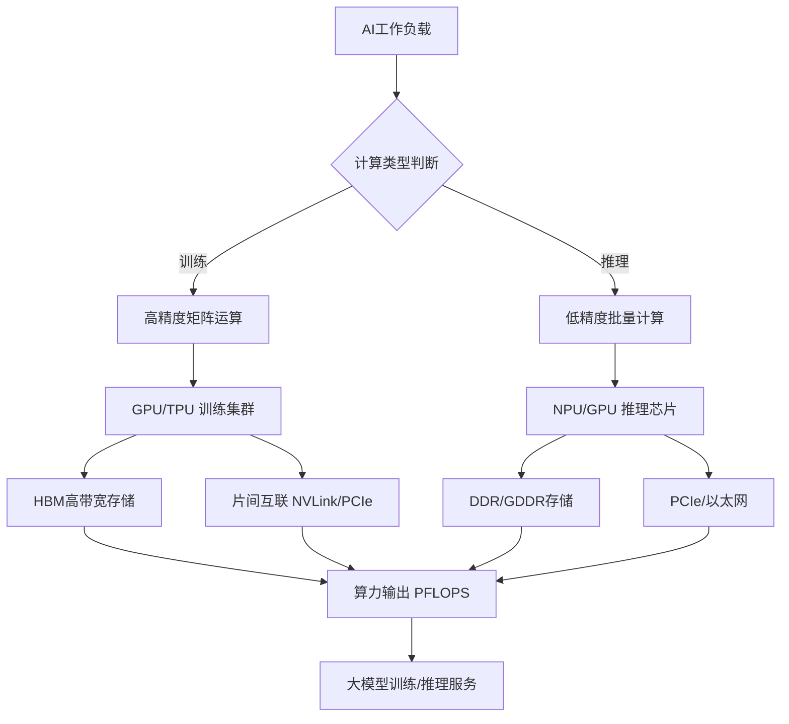
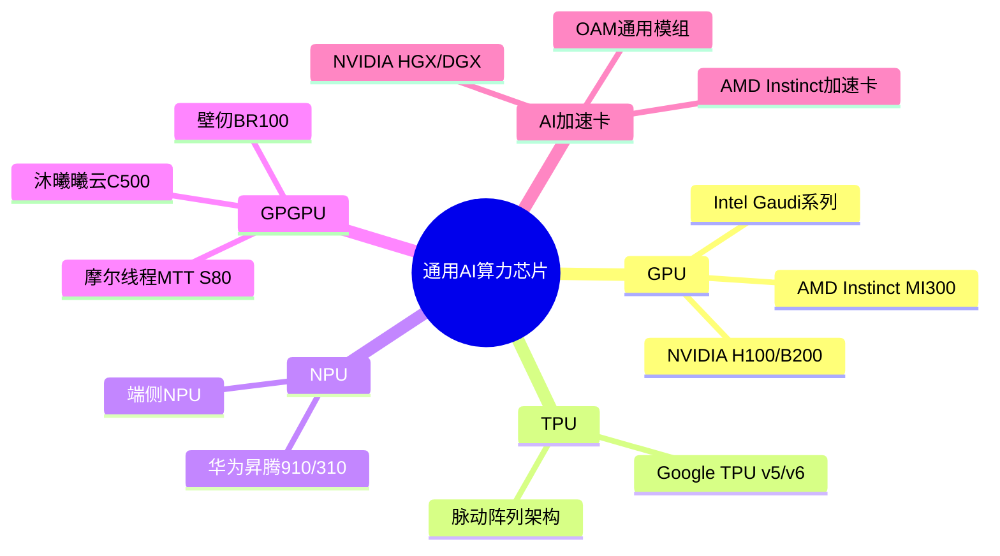
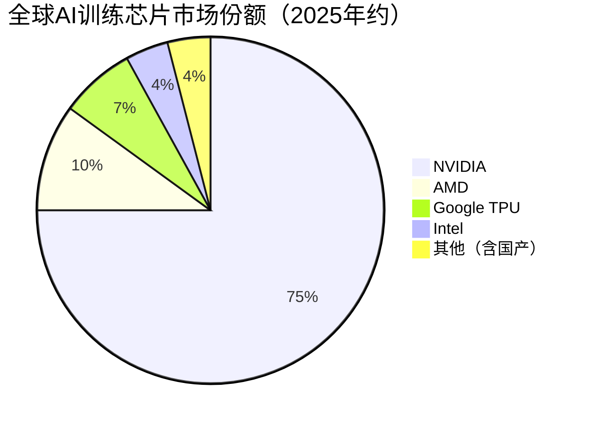

# 通用AI算力芯片

> 专为人工智能训练与推理设计的高性能处理器，涵盖GPU、AI加速卡、TPU、NPU、GPGPU等类型，是AI算力基础设施的核心硬件。

## 概述

通用AI算力芯片是AI半导体产业链中游芯片设计环节中最重要的品类之一。随着大语言模型（LLM）、多模态AI、自动驾驶等应用场景的爆发式增长，对算力的需求呈指数级上升。根据MarketsandMarkets测算，全球AI芯片市场规模在2025年已达约2032亿美元，预计到2032年将超过5648.7亿美元，年复合增长率（CAGR）约15.7%。

通用AI算力芯片的核心特征在于其架构专为并行计算优化，能够高效处理矩阵乘法、张量运算等AI计算的核心操作。与通用CPU不同，这些芯片牺牲了通用逻辑控制能力，换取了在AI工作负载下的极致算力和能效比。GPU（Graphics Processing Unit）凭借其数千个计算核心成为当前AI训练市场的主流选择，而TPU、NPU等专用架构则在特定场景下展现出更高的能效比。

在AI产业链中，通用AI算力芯片处于承上启下的关键位置：上游依赖先进制程晶圆代工、EDA工具和IP核，下游服务于云服务商、大模型企业、智算中心等终端客户。芯片设计能力直接决定了一个国家或企业在AI产业链中的话语权和核心竞争力。

## 技术原理

通用AI算力芯片的技术核心在于大规模并行计算架构的设计。以GPU为例，其架构由流多处理器（SM）阵列组成，每个SM包含数十个CUDA核心（NVIDIA架构）或计算单元（AMD架构），能够同时执行数千个线程。AI训练中最核心的矩阵乘法（GEMM）操作通过张量核心（Tensor Core）硬件加速，每个时钟周期可执行数十次矩阵乘加运算。

现代AI芯片普遍采用以下关键技术：**多精度计算**——支持FP64/FP32/FP16/BF16/INT8/INT4等多种数据精度，在训练阶段使用高精度保证收敛性，推理阶段使用低精度提升吞吐量；**高带宽存储**——通过HBM（高带宽存储器）堆叠技术提供数TB/s的内存带宽，解决"内存墙"问题；**片上网络（NoC）**——通过高速片上互联实现多芯片间低延迟通信；**稀疏计算**——利用AI模型中权重和激活值的稀疏性跳过零值计算，提升有效算力。

在软件生态方面，NVIDIA的CUDA平台已成为行业事实标准，开发者通过cuDNN、TensorRT等库调用底层硬件加速。AMD推出ROCm生态，Intel推出oneAPI，国内企业也在积极构建自主软件栈。芯片与软件的协同设计（Hardware-Software Co-design）是提升AI系统整体效率的关键路径。

## 分类与技术路线

通用AI算力芯片按架构类型可分为以下几大路线：

**GPU（图形处理器）**：最初为图形渲染设计，因其强大的并行计算能力成为AI训练的首选。NVIDIA的H100/B200系列在AI训练市场占据绝对主导地位，AMD的Instinct MI300系列也在快速追赶。GPU的优势在于通用性强、软件生态成熟，劣势是能效比不如专用芯片。

**TPU（张量处理器）**：Google设计的专用AI芯片，采用脉动阵列（Systolic Array）架构执行矩阵运算。TPU v5/v6在Google内部的大模型训练和推理中广泛部署，能效比显著优于GPU。TPU架构通过专用数据流设计，在大批量推理场景下具有极高效率。

**NPU（神经网络处理器）**：专为神经网络推理设计的处理器，广泛应用于端侧和边缘AI场景。华为昇腾系列（昇腾910训练、昇腾310推理）是国内NPU的代表产品。NPU通常采用较低的精度（INT8/INT4）和精简的指令集，在功耗受限场景下具有优势。

**GPGPU（通用计算GPU）**：去除图形渲染功能、专注于通用计算的GPU变体。国内企业如壁仞科技、摩尔线程、沐曦等均推出GPGPU产品，架构上兼容CUDA生态以降低迁移成本，但在实际性能和生态成熟度上与国际领先产品仍有差距。

**AI加速卡**：以PCIe卡或OAM模组形式集成的AI计算模块，通常搭载GPU/NPU芯片、HBM存储和供电系统，可灵活插入服务器。NVIDIA的HGX/DGX系统、AMD的Instinct加速卡是市场主流产品。

## 市场格局

全球AI芯片市场呈现高度集中的竞争格局。NVIDIA凭借其CUDA生态和产品性能优势，在AI训练GPU市场占据70-80%的份额，其Blackwell B200/B300系列是大模型训练的事实标准，新一代Rubin架构已开始交付。2025自然年NVIDIA营收约2159亿美元（FY2025为1305亿美元，同比+114%），其中数据中心收入1152亿美元（+142%），AI芯片需求推动其市值一度突破3万亿美元。Blackwell架构2025年占NVIDIA高端GPU出货80%+。

AMD通过Instinct MI300X/MI350（集成HBM3和CPU+GPU Chiplet架构）积极切入AI训练市场，2025年营收约346亿美元，份额约10%，获得Meta、Microsoft等大客户订单。Google的TPU v5/v6主要供内部使用，份额约7%，同时也通过Google Cloud向客户提供TPU Pod服务。Intel的Gaudi系列AI加速器份额约4%，在性价比方面有一定竞争力。

中国市场方面，华为昇腾910B在国产替代需求的推动下获得大量订单，在中兴通讯、百度等企业的AI集群中部署。壁仞科技BR100、寒武纪思元590等产品在国产GPGPU/NPU领域具有代表性，但在先进制程受限和软件生态薄弱的制约下，与国际领先产品仍有代际差距。海光信息的DCU系列产品在政企信创市场有一定份额。

## 代表企业

| 企业 | 国家/地区 | 主要产品/技术 | 市场地位 |
|------|----------|-------------|---------|
| NVIDIA | 美国 | Blackwell B200/B300、Rubin、CUDA生态 | 全球AI训练芯片绝对领导者，份额70-80%，2025自然年营收~2159亿美元 |
| AMD | 美国 | Instinct MI300X/MI350加速卡、ROCm | 全球第二大AI GPU供应商，2025年营收~346亿美元，份额~10% |
| Google | 美国 | TPU v5/v6、脉动阵列架构 | 专用AI芯片先驱，内部大规模部署，份额~7% |
| Intel | 美国 | Gaudi 2/3 AI加速器、oneAPI | 传统芯片巨头转型AI赛道，份额~4% |
| 华为海思 | 中国 | 昇腾910B训练芯片、昇腾310推理芯片 | 国产AI训练芯片领军者 |
| 寒武纪 | 中国 | 思元590/370系列AI芯片 | 国产AI芯片上市公司代表 |
| 壁仞科技 | 中国 | BR100 GPGPU、7nm制程 | 国产GPGPU高性能计算新锐 |
| 海光信息 | 中国 | DCU深算系列加速卡 | 信创市场AI芯片主力供应商 |

## 发展趋势

### 市场规模预测

| 年份 | 市场规模 | 同比增长 | 备注 |
|------|---------|---------|------|
| 2024 | ~1000亿美元 | — | 基准年 |
| 2025 | ~2032亿美元 | +103.2% | Blackwell量产，AI训练需求爆发 |
| 2026E | ~2350亿美元 | +15.7% | Rubin架构交付，推理需求加速 |
| 2027E | ~2720亿美元 | +15.7% | CAGR 15.7%至2032年5648.7亿美元 |

1. **Chiplet（小芯片）架构成为主流**：随着单片芯片面积逼近光刻极限，通过Chiplet将多个计算芯粒通过2.5D/3D封装集成成为突破算力瓶颈的关键路径。NVIDIA的B200采用双芯片设计，AMD的MI300X采用CPU+GPU多芯粒集成方案。

2. **超低精度计算与稀疏加速**：FP8、INT4等超低精度格式正在被广泛支持，结合结构化稀疏（2:4 Sparsity）可将有效算力翻倍。NVIDIA Hopper架构的Transformer Engine已支持FP8训练，下一代Blackwell架构进一步引入FP4精度。

3. **高带宽存储持续升级**：HBM3E带宽突破3TB/s，下一代HBM4将堆叠16层DRAM，带宽超过5TB/s。存储带宽已成为AI芯片性能提升的核心瓶颈之一，存储芯片厂商SK海力士、三星、美光在HBM领域竞争激烈。

4. **软件生态自主化加速**：国产AI芯片企业正在从依赖CUDA兼容转向构建自主软件栈。华为的CANN、寒武纪的Neuware等平台逐步成熟，但与CUDA生态的全面竞争仍需时间。

5. **推理算力需求超越训练**：随着大模型从训练阶段进入规模化部署推理阶段，推理芯片的市场需求将超越训练芯片。低功耗、高吞吐量的推理专用芯片（如Groq的LPU）可能成为新的市场增长点。

## 与AI产业链的关联

通用AI算力芯片是AI产业链的"心脏"，直接决定了大模型训练效率和推理服务质量。2025年全球AI芯片市场规模达约2032亿美元，大语言模型的参数规模从亿级到万亿级增长，训练一次GPT-4级别模型需要数千张H100/Blackwell GPU运行数月，算力成本动辄数千万美元。NVIDIA 2025自然年营收约2159亿美元，其中数据中心收入1152亿美元（+142%），Blackwell占高端出货80%+，反映了AI算力需求的爆发式增长。芯片的算力、带宽和能效直接决定了AI技术的商业化可行性和普及速度。

在应用层面，通用AI算力芯片支撑着云计算、自动驾驶、智能制造、智慧医疗等领域的AI应用落地。AI芯片的性能提升和成本下降是推动AI技术从实验室走向千行百业的关键驱动力。同时，AI芯片设计对先进制程、EDA工具和高带宽存储的强烈需求也带动了整个半导体产业链的技术升级。

---
[← 返回总目录](../../README.md)
