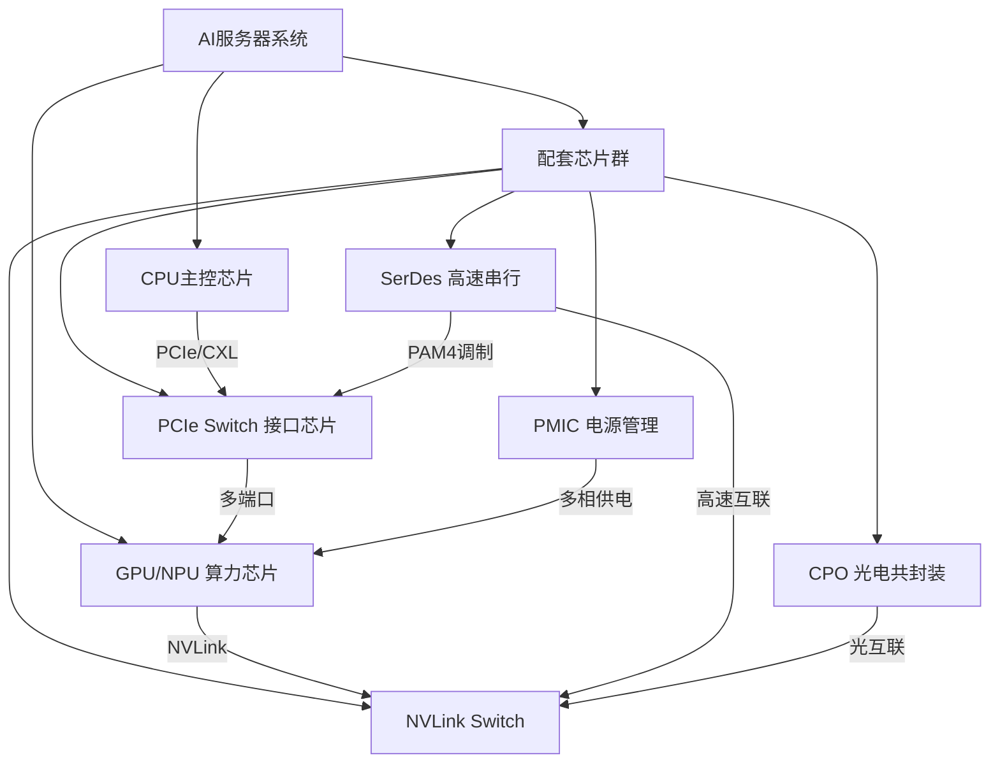
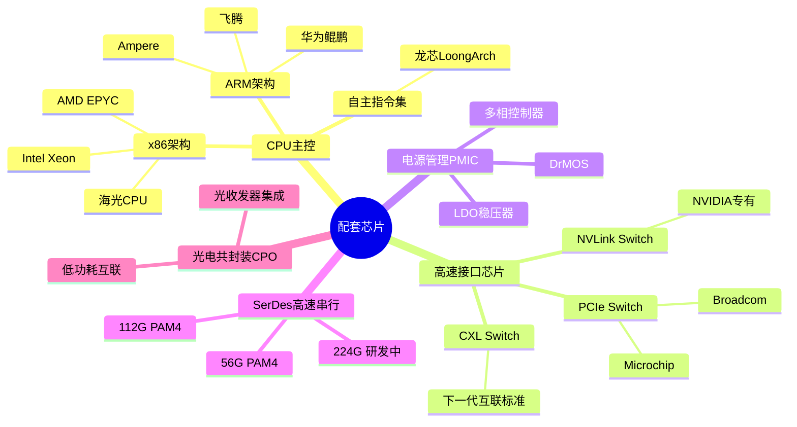
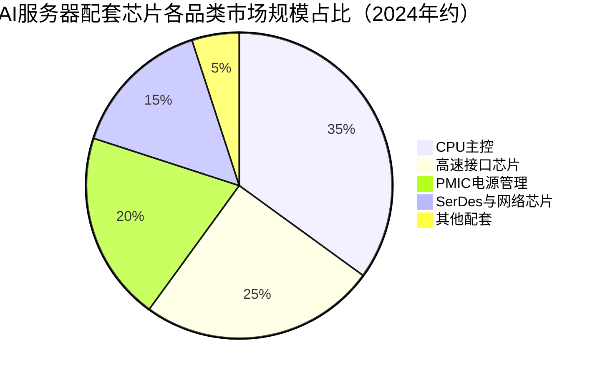

# 配套芯片

> AI算力系统中除核心AI处理器之外的支撑性芯片，包括CPU主控、高速接口芯片、电源管理PMIC、SerDes高速串行芯片等，是构建完整AI计算系统的必要组件。

## 概述

在AI半导体产业链中，通用AI算力芯片（GPU/TPU/NPU）通常获得最多关注，但一个完整的AI计算系统离不开大量配套芯片的支撑。以一台NVIDIA DGX H100服务器为例，其中包含4颗H100 GPU的同时，还需要2颗Intel Xeon CPU进行系统控制、多颗PCIe Switch芯片实现GPU-CPU互联、数十颗电源管理芯片（PMIC）为GPU和CPU供电、以及大量SerDes接口芯片实现高速数据传输。

配套芯片虽不直接执行AI计算，但直接决定了AI系统的整体性能、稳定性和成本。例如，PCIe 5.0 Switch芯片的带宽决定了GPU与CPU之间的数据传输效率；PMIC的供电精度和响应速度影响GPU能否稳定运行在标称频率；SerDes芯片的速率决定了服务器之间高速互联（NVLink、InfiniBand）的上限。

在AI集群规模不断扩大的趋势下，配套芯片的重要性日益凸显。万卡级AI训练集群需要数以万计的网络交换芯片、光电转换芯片和供电管理芯片，这些配套芯片的供应链安全、性能瓶颈和成本占比直接影响AI基础设施的整体效率。配套芯片也是国产替代的重要领域——在核心GPU受到出口管制的同时，配套芯片的自主可控同样关键。

## 技术原理

**CPU（中央处理器）**：AI服务器中的CPU承担系统主控、数据预处理、I/O管理和部分推理任务调度等职责。现代服务器CPU采用多核架构（16-128核），集成DDR5内存控制器和PCIe 5.0/6.0接口。Intel Xeon Scalable处理器集成Ultra Accelerator Link（UALink）接口，AMD EPYC处理器支持Infinity Fabric互联架构。CPU与GPU之间通过PCIe或CXL（Compute Express Link）协议通信，CXL 3.0支持内存共享和缓存一致性，允许GPU直接访问CPU内存。

**高速接口芯片**：包括PCIe Switch（PLX芯片）、CXL Switch和NVLink Switch等。PCIe Switch提供多端口PCIe互联，将1个上游端口扩展为多个下游端口，实现多GPU共享一个CPU根端口。PCIe 5.0单通道带宽32GT/s，PCIe 6.0翻倍至64GT/s。NVLink Switch是NVIDIA专有技术，提供GPU间900GB/s的互联带宽，是构建大规模GPU集群的关键组件。UALink联盟正在推动开放标准的高速Scale-up互联。

**电源管理芯片（PMIC）**：AI GPU功耗可达700W以上（如NVIDIA B200），需要多相VRM（电压调节模块）供电。PMIC集成多相控制器和DrMOS（集成驱动器+MOSFET），实现精确的多相供电控制。先进PMIC支持数字控制、自适应电压定位（AVP）和动态电压频率调节（DVFS），在毫秒级时间内响应GPU负载变化。AI服务器中单颗GPU需要10-20相供电，每相配备独立的DrMOS和电感。

**SerDes高速串行芯片**：SerDes（Serializer/Deserializer）是高速数据收发的核心电路，将并行数据转换为串行数据在物理链路上传输。在AI服务器中，SerDes应用于PCIe（56/112Gbps PAM4）、以太网（400G/800G）、NVLink、CXL等高速接口。112Gbps SerDes采用PAM4调制（4电平脉冲幅度调制），在相同带宽下将引脚数减半。下一代224Gbps SerDes正在研发中，将支持1.6T以太网和PCIe 7.0。

**光电共封装芯片（CPO）**：随着数据速率提升，传统铜线互联面临功耗和距离瓶颈。CPO将光收发器与交换芯片共封装在同一个基板上，大幅降低互联功耗。NVIDIA的Quantum-2 InfiniBand交换机已集成CPO技术，博通、Marvell等企业也在推进CPO交换芯片研发。

## 分类与技术路线

**CPU主控芯片**：AI服务器CPU按架构分为x86（Intel Xeon、AMD EPYC）和ARM（Ampere Altra、AWS Graviton、华为鲲鹏）两大阵营。x86凭借软件生态占据AI服务器CPU市场主导地位，ARM在云计算领域凭借能效优势逐步渗透。国产CPU方面，华为鲲鹏920基于ARM架构，海光CPU基于x86架构授权，飞腾CPU基于ARM架构，龙芯采用自主LoongArch指令集。

**高速接口芯片**：按协议分为PCIe Switch、CXL Switch、NVLink Switch和UALink Switch。PCIe Switch市场由Broadcom（博通）和Microchip（原Microsemi）主导，国产替代方面，国芯科技、裕太微等在PCIe Controller领域布局。CXL是下一代服务器互联标准，CXL 3.0支持64GB/s带宽和内存池化。

**电源管理芯片（PMIC）**：AI服务器PMIC包括多相控制器、DrMOS、LDO稳压器和负载开关等。国际供应商包括英飞凌、TI、MPS（芯源系统）等。国内企业在模拟芯片领域整体偏弱，但圣邦股份、晶丰明源等在消费级PMIC有一定积累，工业级和服务器级PMIC仍以外资为主。

**SerDes与网络芯片**：SerDes IP和PHY是高速接口的核心，Broadcom、Marvell、Synopsys、Cadence提供SerDes IP授权和芯片产品。以太网交换芯片领域，Broadcom Tomahawk系列占据数据中心交换芯片70%以上份额，国产方面盛科网络在中低端交换芯片有一定份额。InfiniBand方面，NVIDIA（收购Mellanox）几乎垄断。

## 市场格局

配套芯片市场呈现"细分领域高度集中"的特征。服务器CPU市场由Intel（约70%）和AMD（约25%）双寡头垄断；PCIe Switch芯片市场Broadcom占比超过60%；数据中心以太网交换芯片市场Broadcom占比超过70%；SerDes IP市场Synopsys和Cadence合计份额超过80%。

PMIC市场相对分散，英飞凌、TI、MPS在高端服务器PMIC领域领先。国产替代方面，配套芯片是国内企业可以切入的重要方向——与核心GPU受制程限制不同，许多配套芯片（如PCIe Switch、PMIC、以太网PHY）可在成熟制程（14nm/28nm）上实现，国产供应链具备可行性。

SerDes芯片是AI服务器的关键瓶颈之一，112G PAM4 SerDes的量产能力直接决定了服务器互联带宽的上限。国内企业在高速SerDes设计方面与国际领先水平仍有差距，但正在快速追赶。

## 代表企业

| 企业 | 国家/地区 | 主要产品/技术 | 市场地位 |
|------|----------|-------------|---------|
| Intel | 美国 | Xeon Scalable处理器 | 服务器CPU市场份额第一 |
| AMD | 美国 | EPYC处理器、Instinct加速卡 | 服务器CPU市场第二 |
| Broadcom | 美国 | Tomahawk交换芯片、PCIe Switch | 数据中心接口芯片龙头 |
| NVIDIA | 美国 | NVLink Switch、Quantum InfiniBand | AI网络互联绝对领先 |
| 英飞凌 Infineon | 德国 | 服务器PMIC、DrMOS | 电源管理芯片领先供应商 |
| MPS 芯源系统 | 美国 | 服务器多相PMIC、DrMOS | AI服务器PMIC核心供应商 |
| 华为海思 | 中国 | 鲲鹏920服务器CPU | 国产ARM服务器CPU代表 |
| 盛科网络 | 中国 | 数据中心以太网交换芯片 | 国产交换芯片先行者 |

## 发展趋势

1. **CXL协议推动内存池化与解耦**：CXL 3.0标准支持内存池化和Switch-based拓扑，使GPU可跨服务器共享CPU内存资源。这将改变AI服务器的架构设计，从"每节点独立内存"走向"集群共享内存池"，提升内存利用率并降低成本。CXL Switch芯片市场预计2025年后快速增长。

2. **224Gbps SerDes成为竞争焦点**：PCIe 7.0和1.6T以太网需要224Gbps SerDes，目前处于研发早期阶段。Broadcom、Synopsys等头部企业已展示224G SerDes原型，国产企业在112G SerDes量产上仍在追赶。

3. **CPO共封装光学加速落地**：NVIDIA Quantum-X InfiniBand交换机和Broadcom Bailly交换机已采用CPO技术。2025-2026年将是CPO芯片规模商用的关键时期，有望将数据中心互联功耗降低50%以上。

4. **国产配套芯片替代加速**：在PCIe Switch、以太网PHY、PMIC等领域，国内企业正利用成熟制程优势加速替代。澜起科技的DDR5内存接口芯片、津逮CPU已在国内服务器市场有一定份额。

5. **服务器CPU能效竞争升级**：AI服务器功耗已达数十千瓦，CPU能效成为整体能效优化的关键。ARM架构服务器CPU（Ampere、AWS Graviton）在推理场景的能效比优于x86，可能改变AI推理服务器的CPU选型趋势。

## 与AI产业链的关联

配套芯片虽不执行核心AI计算，但如同人体的"血管和神经系统"，将算力芯片、存储和网络有机连接为一个整体。AI服务器中配套芯片的成本占比可达30-40%，其性能瓶颈会直接限制核心AI芯片的发挥——即使GPU算力再强，如果PCIe带宽不足或供电不稳，整体系统效率也会大打折扣。

在AI集群层面，网络交换芯片和光模块芯片决定了万卡集群的有效算力利用率。NVIDIA的InfiniBand网络凭借超低延迟和高吞吐量，是其GPU集群效率领先的关键因素之一。国产AI算力集群的性能差距很大程度上来自网络和互联配套芯片的不足。

配套芯片也是半导体国产替代的重要突破口。相比核心GPU受先进制程限制，许多配套芯片可在成熟制程上实现，技术门槛相对可控。发展国产配套芯片产业链不仅有助于降低AI系统整体成本，更是保障AI算力基础设施供应链安全的关键举措。

---
[← 返回总目录](../../README.md)
