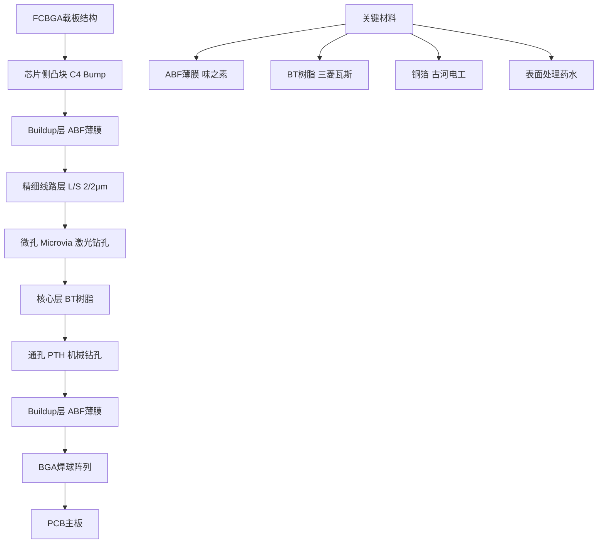
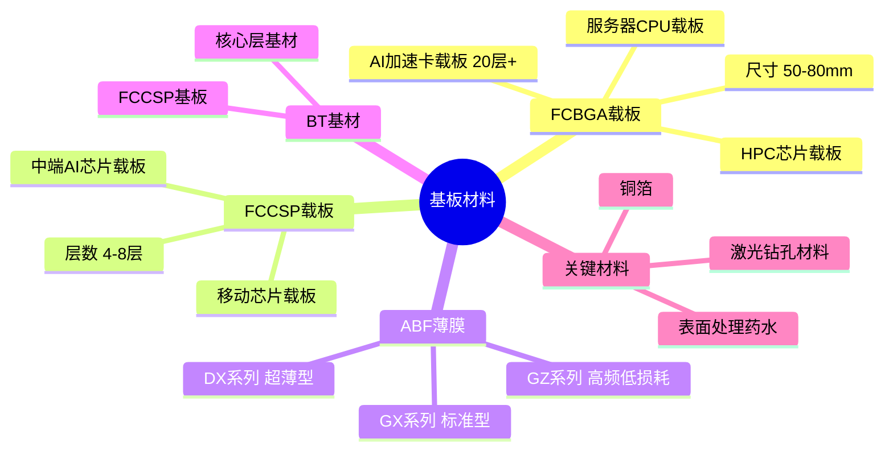
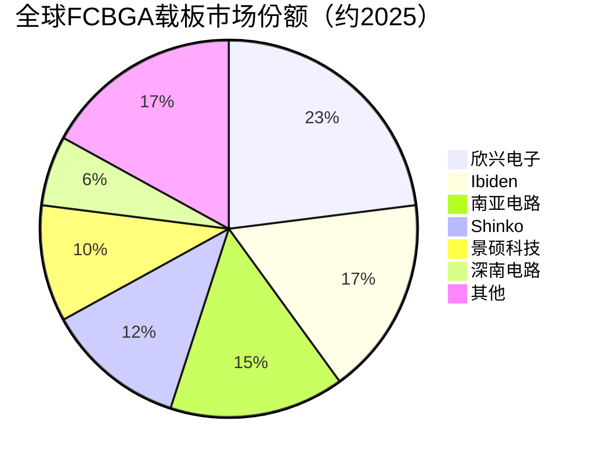

# 基板材料

> FCBGA载板及ABF树脂基板等高端封装基板材料，是AI大芯片先进封装的关键载体。

## 概述

基板材料是连接芯片裸片与PCB板之间的桥梁，在先进封装中扮演至关重要的角色。随着AI芯片算力密度持续提升、芯片面积越来越大（NVIDIA B200面积超过1600mm²），传统引线键合封装已无法满足高I/O密度和高带宽需求，FCBGA（倒装芯片球栅阵列）载板成为大芯片封装的刚需选择。

FCBGA载板的核心材料是ABF（Ajinomoto Build-up Film）树脂基板，由日本味之素公司发明并长期垄断。ABF基板具有低介电常数、低介电损耗、高耐热性和优异的绝缘性能，是制造高层数、高密度FCBGA载板的关键介质层材料。AI加速卡、HPC芯片、服务器CPU等大芯片几乎全部采用ABF基板的FCBGA载板封装。

ABF基板市场长期由日本味之素垄断，市场份额超过90%。近年来中国台湾和大陆厂商加速突破，但ABF薄膜本身的国产化进展缓慢，是半导体材料领域的重要"卡脖子"环节。FCBGA载板制造则由欣兴、南电、景硕等台厂主导，中国大陆厂商（深南电路、兴森科技）加速追赶。

## 技术原理

FCBGA载板采用"核心层+ buildup层"的多层堆叠结构：

**核心层（Core）**：载板中间的刚性基材，通常采用BT（Bismaleimide Triazine）树脂或玻璃纤维覆铜板。核心层通过机械钻孔和电镀工艺形成通孔（PTH），连接载板上下表面。

**Buildup层**：核心层上下两侧叠加的增层，采用ABF薄膜作为介质层。ABF薄膜厚度约20-80μm，通过激光钻孔形成微孔（Microvia），微孔直径可小至15-30μm，实现高密度互连。微孔内通过化学铜和电镀铜填充形成导通。

**线路层**：在ABF buildup层上通过半加成法（SAP）或全加成法工艺形成精细铜线路。先进FCBGA载板线路线宽/线距（L/S）已达2/2μm级别，逼近传统PCB工艺极限。

**焊盘与表面处理**：芯片侧采用C4（Bump）焊盘连接芯片凸块；PCB侧采用BGA焊球阵列连接主板。表面处理方式包括ENIG（化学镍金）、ENEPIG（化学镍钯金）等。

**ABF基板优势**：
- 低介电常数（Dk≈3.2）和高频信号完整性优异
- 低介电损耗（Df≈0.005）适用于高频信号传输
- 低热膨胀系数（CTE）匹配芯片和PCB，提高可靠性
- 优异的绝缘性能和耐热性（Tg>180°C）

## 分类与技术路线

基板材料按封装类型和应用场景可分为以下类别：

**FCBGA载板**：面向CPU、GPU、AI加速卡等大芯片封装，引脚数从3000到8000+不等。层数从8层到20层以上，ABF buildup层占主要比例。AI加速卡FCBGA载板尺寸可达70×70mm以上，是面积最大的封装载板类型。

**FCCSP载板**：面向移动芯片、中端AI芯片，引脚数500-3000，层数4-8层。相比FCBGA尺寸更小，线距更密，成本更低。

**ABF薄膜**：作为FCBGA载板buildup层介质材料，分为多个等级：
- ABF-GX系列：标准型，适用于25-15μm L/S
- ABF-GZ系列：高频低损耗型
- ABF-DX系列：超薄型，适用于5μm以下L/S

**BT基材**：作为FCBGA核心层和FCCSP基板材料，三菱瓦斯化学占据全球主要份额。

## 市场格局

全球ABF载板市场2025年规模约48.9-58亿美元，受AI服务器和HPC需求驱动，2025-2027年保持约10.9%年增长，CAGR至2033年达95.5亿美元。ABF薄膜市场2025年规模约8-9亿美元，味之素占据约95%份额，近乎垄断。

FCBGA载板制造由台湾厂商主导：
- 欣兴电子（Unimicron）：全球FCBGA载板龙头，AI加速卡载板主力供应商
- 南亚电路（Nan Ya PCB）：台塑集团旗下，FCBGA载板全球前三
- 景硕科技（Kinsus）：联电集团旗下，FCBGA载板全球前三
- 日本 Ibiden：FCBGA载板老牌厂商，Intel CPU载板主要供应商
- 日本 Shinko：富士通旗下，FCBGA载板头部厂商

中国大陆FCBGA载板加速突破：
- 深南电路：国内FCBGA载板领军，14层以下已量产，20层以上验证中
- 兴森科技：FCBGA载板布局多年，AI芯片载板客户导入中
- 珠海越亚：RF/嵌入式芯片封装基板

ABF薄膜方面，中国岱鼎新材、宏仁电子等积极推进国产化，但产品性能与味之素仍有差距。

## 代表企业

| 企业 | 国家/地区 | 主要产品/技术 | 市场地位 |
|------|----------|-------------|---------|
| 味之素 | 日本 | ABF薄膜（GX/GZ/DX系列） | ABF基板材料绝对垄断，份额>90% |
| 欣兴电子 | 中国台湾 | FCBGA载板、FCCSP载板 | 全球FCBGA载板龙头 |
| Ibiden | 日本 | FCBGA载板 | Intel CPU载板主要供应商 |
| 南亚电路 | 中国台湾 | FCBGA载板 | 全球前三FCBGA载板厂 |
| Shinko | 日本 | FCBGA载板 | 老牌载板厂商 |
| 景硕科技 | 中国台湾 | FCBGA载板 | 联电集团载板业务 |
| 深南电路 | 中国 | FCBGA载板、高频PCB | 国产FCBGA载板领军 |
| 兴森科技 | 中国 | FCBGA载板、IC载板 | 国产载板积极布局者 |
| 三菱瓦斯化学 | 日本 | BT树脂基材 | BT基材全球主要供应商 |
| 岱鼎新材 | 中国 | ABF薄膜国产化 | 国产ABF薄膜先行者 |

## 发展趋势

### 市场规模预测

| 年份 | 市场规模 | 同比增长 | 备注 |
|------|---------|---------|------|
| 2024 | 约48.9亿美元 | — | 基准年 |
| 2025 | 约54.2亿美元 | +10.9% | AI芯片封装推动ABF载板需求爆发 |
| 2026E | 约60.1亿美元 | +10.9% | CoWoS产能扩张，FCBGA高层数需求增长 |
| 2027E | 约66.6亿美元 | +10.8% | 玻璃基板崭露头角，国产ABF薄膜验证导入 |

> 数据来源：市场研究机构（2025），ABF载板市场CAGR至2033年95.5亿美元

1. **AI驱动载板层数和密度持续提升**：AI加速卡FCBGA载板层数从14层向20层以上演进，L/S从5/5μm向2/2μm甚至更细推进，载板面积增大、工艺难度攀升，头部载板厂加速扩产。

2. **ABF薄膜国产化加速突破**：中国岱鼎新材、宏仁电子等ABF薄膜国产化项目加速推进，目标在AI算力国产化大背景下实现关键材料自主可控。预计2026-2027年国产ABF薄膜有望在部分中端载板产品中实现验证导入。

3. **载板制造向中国大陆转移**：受AI芯片国产化驱动，深南电路、兴森科技等大陆载板厂加速FCBGA高层数技术攻关。预计2026年大陆厂商在高层数FCBGA载板领域有望实现批量出货。

4. **玻璃基板技术崭露头角**：Intel推动玻璃基板（Glass Substrate）作为下一代先进封装基板方案，具有更低介电常数、更优异的热机械性能和更高的布线密度。预计2026年后在超大芯片封装中开始应用。

5. **2.5D/3D封装载板需求增长**：CoWoS等2.5D封装需要硅中介层+有机载板的组合方案，3D堆叠封装推动TSV互连密度提升。载板在先进封装中的角色从单纯承载向多功能互连演进。

## 与AI产业链的关联

基板材料是AI大芯片先进封装的核心承载材料。NVIDIA H100/B200、AMD MI300X、华为昇腾910B等AI加速芯片全部采用FCBGA载板封装。芯片面积越大、I/O越多，对载板层数、密度和ABF薄膜性能要求越高。

ABF薄膜和FCBGA载板的供应能力直接制约AI芯片量产。2025年ABF载板市场约48.9-58亿美元，味之素垄断ABF薄膜95%份额，产能紧张曾导致部分芯片出货受限。向上游基板材料关联ABF薄膜、BT树脂、铜箔等化工材料，向下游支撑AI芯片封装、AI服务器制造。ABF薄膜的国产化突破对AI芯片供应链安全具有战略意义。

---
[← 返回总目录](../README.md)
