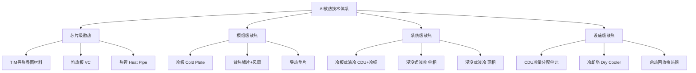
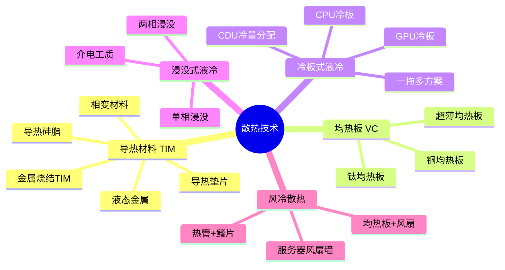
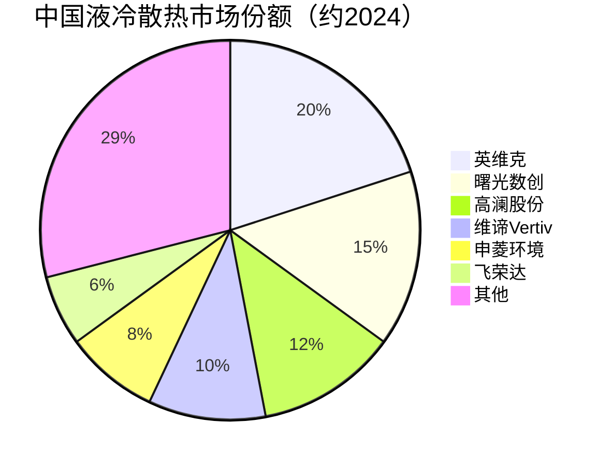

# 散热

> 均热板、水冷板、导热材料和液冷设备等热管理技术的统称，是保障AI高功耗芯片稳定运行的关键环节。

## 概述

散热（热管理）是AI产业链中容易被忽视但至关重要的配套环节。随着AI芯片单卡功耗从300W（A100）攀升至700W（H100）、1000W（B200）甚至更高，传统风冷散热已无法满足散热需求，液冷散热技术成为必然选择。散热系统的性能直接决定了AI芯片能否在满载状态下稳定运行，进而影响算力输出效率。

散热技术按导热介质和形态可分为五个层次：芯片级散热（TIM导热界面材料、均热板）、模组级散热（冷板、散热器）、系统级散热（机柜级液冷）、设施级散热（CDU冷量分配单元、冷却塔）和余热回收。

AI服务器散热面临三大挑战：一是热流密度急剧上升，单芯片热流密度超过100W/cm²；二是散热功耗上限受限，单机柜功耗从8kW飙升至100kW以上；三是能效要求提升，PUE（电能利用效率）目标降至1.1以下。液冷散热（冷板式和浸没式）是解决上述挑战的关键技术路径。

中国液冷散热产业近年来快速发展，英维克、曙光数创、高澜股份等企业在冷板式液冷领域已具备规模出货能力。导热界面材料（TIM）领域，国产化率仍较低，高端导热硅脂、导热垫片等仍以日本信越、美国道康宁等外资品牌为主。

## 技术原理

AI散热系统的热传导路径为：芯片 → TIM → 散热器/冷板 → 冷却液/空气 → 外界环境。

**芯片级散热**：
- TIM（Thermal Interface Material）导热界面材料填充芯片与散热器之间的微观间隙，消除空气层（空气热阻极高）。TIM分为导热硅脂（导热系数3-8 W/m·K）、导热垫片（2-5 W/m·K）、液态金属（70-80 W/m·K）和相变材料等类型。
- 均热板（VC, Vapor Chamber）利用工质相变传热原理，蒸发-冷凝循环实现高效热量扩散。均热板导热等效系数可达10000 W/m·K以上，远超纯铜（约400 W/m·K），是大功率芯片散热的核心器件。

**冷板式液冷**：
- 冷板（Cold Plate）通常为铜或铝材质，内部加工微通道结构。冷却液（通常是25%乙二醇水溶液或3M Novec工程液）在微通道内流动，通过强制对流带走芯片热量。
- 冷板散热能力可达500-1000W以上，温差控制在15-25°C以内。
- CDU（Coolant Distribution Unit）冷量分配单元提供冷却液循环动力、温度控制和过滤功能，将一次侧（室外冷却塔）与二次侧（IT设备）隔离。

**浸没式液冷**：
- 单相浸没：IT设备浸没在介电液体（如3M Novec 649）中，液体通过泵循环至外部换热器散热。不发生相变，液体损耗小，维护简单。
- 两相浸没：IT设备浸没在低沸点介电液体中，液体在芯片表面沸腾蒸发带走热量，蒸气在冷凝器中冷凝回流。相变换热效率更高，但系统复杂、工质易损耗。

**风冷散热**：通过散热鳍片+风扇组合散热，适用单卡功耗<350W场景。热管+均热板组合可提升散热效率，但在1000W级功耗面前已力不从心。

## 分类与技术路线

散热技术按热传导路径和应用场景分类如下：

**导热材料（TIM）**：
- 导热硅脂：成本最低，导热系数3-8 W/m·K，易干涸老化
- 导热垫片：安装方便，导热系数2-5 W/m·K，适用于大面积接触
- 液态金属：导热系数最高（70-80 W/m·K），但存在腐蚀风险
- 相变材料：常温固态、工作温度变液态，兼顾导热和使用便利性
- 金属烧结TIM：铟箔等高导热金属材料

**均热板（VC）**：
- 铜均热板：主流方案，工质为纯水，适用温度0-100°C
- 钛均热板：轻量化，抗腐蚀，高端应用
- 超薄均热板：厚度<0.5mm，手机终端散热

**冷板式液冷**：
- CPU冷板：覆盖CPU顶面，功耗散热200-500W
- GPU冷板：覆盖GPU顶面+显存，功耗散热500-1000W+
- 一拖多方案：单CDU支撑多机柜，降低PUE

**浸没式液冷**：
- 单相浸没：3M Novec、Shell SFR等介电液
- 两相浸没：3M Novec 649/7100等低沸点工质

## 市场格局

全球AI散热市场2024年规模约80亿美元，预计2026年突破150亿美元。液冷散热渗透率从2023年的10%快速提升，预计2026年达到40%以上。中国液冷散热市场规模约200亿元人民币，增速领先全球。

液冷散热设备厂商：
- 英维克：国内液冷龙头，冷板式液冷快速渗透，AI服务器液冷方案领先
- 曙光数创：浸没式液冷技术领先，冷板式产品加速布局
- 高澜股份：液冷技术积累深厚，新能源+数据中心双业务
- 申菱环境：专业温控设备厂商，数据中心液冷快速拓展
- 维谛技术Vertiv：全球数据中心温控龙头

TIM导热材料市场：
- 日本信越化学：导热硅脂龙头
- 美国道康宁（Dow）：导热材料全球领先
- 日本东丽：导热垫片和石墨散热膜
- 汉高：导热胶和垫片

均热板（VC）市场：
- 台湾超众科技（Auras）：全球VC龙头
- 台湾双鸿科技：VC和散热模组龙头
- 台湾奇鋐科技：散热模组领先厂商
- 中国碳元科技、飞荣达等国产VC加速突破

## 代表企业

| 企业 | 国家/地区 | 主要产品/技术 | 市场地位 |
|------|----------|-------------|---------|
| 英维克 | 中国 | 冷板式液冷、CDU、机房空调 | 国内液冷散热龙头 |
| 曙光数创 | 中国 | 浸没式液冷、冷板式液冷 | 浸没式液冷技术领先 |
| 高澜股份 | 中国 | 液冷冷板、CDU | 液冷技术积累深厚 |
| 维谛Vertiv | 美国 | 数据中心温控全方案 | 全球温控龙头 |
| 信越化学 | 日本 | 导热硅脂、硅油 | 导热材料龙头 |
| 道康宁Dow | 美国 | 导热硅脂、导热垫片 | 导热材料全球领先 |
| 超众科技Auras | 中国台湾 | 均热板、散热模组 | 全球VC龙头 |
| 双鸿科技 | 中国台湾 | 均热板、散热器 | 散热模组头部 |
| 3M | 美国 | Novec介电液、导热材料 | 浸没式冷却液主要供应商 |
| 飞荣达 | 中国 | 导热材料、电磁屏蔽 | 国产散热材料代表 |

## 发展趋势

1. **液冷散热全面渗透**：随着GPU功耗突破1000W，冷板式液冷成为AI服务器标配。预计2026年AI服务器液冷渗透率超过50%，浸没式液冷在超大规模智算中心加速落地，PUE目标值降至1.1以下。

2. **均热板大型化与精密化**：大芯片面积和功耗提升推动均热板向大面积（100×100mm以上）和超薄化发展。钛均热板和3D VC等新型方案在超高功耗场景应用。

3. **导热材料升级换代**：液态金属导热硅脂在高端AI芯片中渗透率提升，金属烧结TIM（铟箔等）在超高功耗GPU中加速应用。相变材料在服务器维护便利性需求下逐步推广。

4. **浸没式液冷工质国产化**：3M退出PFAS化学品生产后，浸没式液冷工质供应面临挑战。中国厂商加速开发非PFAS介电液替代品，碳氢化合物和硅油基工质成为研究热点。

5. **余热回收与绿色低碳**：数据中心液冷废热（40-60°C温水）通过热泵提升温度后用于区域供暖、农业温室等场景。北欧和 中国北方地区已有多个余热回收示范项目，能效提升和碳减排效益显著。

## 与AI产业链的关联

散热是AI芯片发挥算力的"温度保障"。芯片在高温下会发生降频保护、计算错误甚至永久损坏，散热性能直接决定了AI芯片的持续算力输出。1000W级GPU在风冷条件下无法满载运行，液冷散热成为解锁满算力的必要条件。

散热向上游拉动导热材料、均热板、冷板、CDU等器件需求，向下游支撑AI服务器、智算中心建设。液冷散热技术的成熟和国产化降低直接关系到AI算力建设的成本和进度。中国在液冷设备制造领域已具备较强竞争力，但在高端导热材料和介电工质方面仍需加大国产化力度。

---
[← 返回总目录](../README.md)
