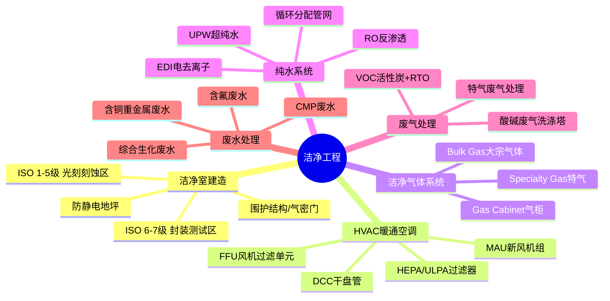
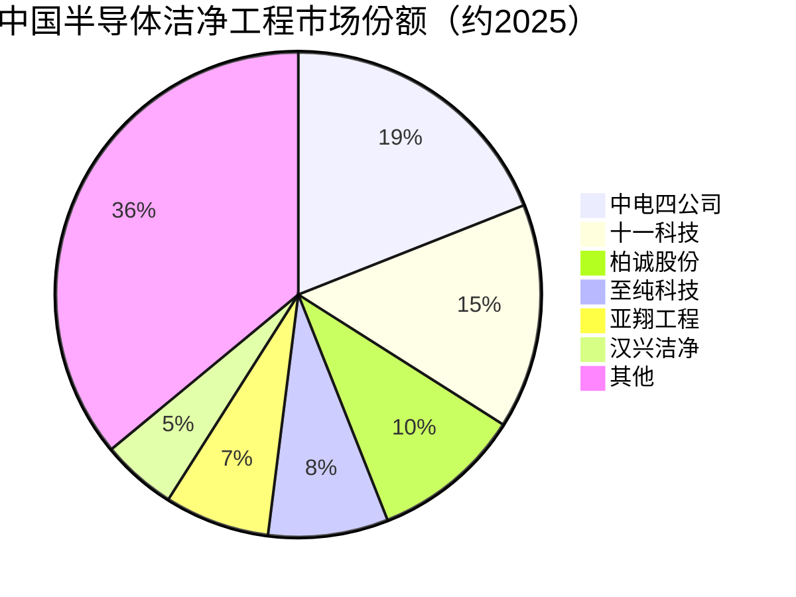

# 洁净工程

> 半导体洁净厂房、中央空调系统及废气废水处理等环境控制工程，是保障半导体制造良率的基础设施。

## 概述

洁净工程是半导体制造和先进封装不可或缺的基础设施。半导体制造对生产环境洁净度要求极高，一颗0.1μm的微粒落在晶圆表面就可能导致芯片缺陷，造成良率损失。因此，晶圆厂、先进封装厂和AI芯片相关制造环节必须建设高等级洁净厂房，将空气中微粒数量控制在极低水平。

洁净工程涵盖洁净室设计建造、HVAC（暖通空调）系统、FFU（风机过滤单元）、洁净气体输送、纯水系统、废气处理和废水处理等完整子系统。一座12英寸晶圆厂洁净室面积可达数万平方米，建设投资高达数十亿元，是晶圆厂CAPEX的重要组成部分。

随着中国半导体产能扩张和AI芯片国产化加速，洁净工程市场需求旺盛。中国洁净工程企业从早期承接外资晶圆厂分包项目，逐步发展为具备全流程交付能力的综合服务商。中电四公司、十一科技、柏诚股份等在半导体洁净工程领域占据领先地位。

废气废水处理是洁净工程的环保配套环节。半导体制造过程产生多种有害气体（如SiH4、AsH3、HF等）和含重金属废水，需要经过严格的处理才能排放。随着环保法规趋严，废气废水处理技术要求持续提升。

## 技术原理

半导体洁净工程的核心是控制空气中微粒浓度、温度、湿度和化学污染：

**洁净室分级**：按ISO标准，洁净室分为ISO 1-9级。半导体晶圆制造区域通常要求ISO 1-5级（每立方米空气中≥0.1μm微粒不超过10-100,000个），封装区域ISO 6-7级。

**空气过滤系统**：
- 初效过滤器：过滤大颗粒（≥5μm），保护后续过滤器
- 中效过滤器：过滤中等颗粒（≥1μm）
- HEPA（高效空气过滤器）：过滤≥0.3μm微粒，效率99.97%以上
- ULPA（超高效过滤器）：过滤≥0.1μm微粒，效率99.9995%以上
- FFU（风机过滤单元）：集成风机和HEPA/ULPA过滤器，安装在洁净室天花板上，形成垂直层流气流

**气流组织**：
- 垂直层流：空气从天花板FFU垂直向下流动，从地板回风格栅排出，形成均匀层流。适用于ISO 1-5级超高洁净区。
- 非单向流（乱流）：空气以乱流形式混合稀释污染物。适用于ISO 6-9级一般洁净区。

**温湿度控制**：洁净室温度通常控制在22±1°C，湿度45±5%。精密空调系统（MAU+DCC+FFU组合）实现恒温恒湿控制。光刻区域对温度波动要求极为严格（±0.1°C），防止热膨胀影响光刻精度。

**AMC（Airborne Molecular Contamination）控制**：空气中分子级污染物（如SO2、NH3、有机物）在晶圆表面沉积导致缺陷。化学过滤器（活性炭、离子交换树脂）去除AMC。

**纯水系统**：UPW（超纯水）电阻率要求达到18.2MΩ·cm，微粒、有机物、溶解气体和离子含量极低。半导体制造每片晶圆消耗数百升超纯水。

**废气处理**：
- 酸性废气（HF、HCl）：湿式洗涤塔
- 碱性废气（NH3）：酸液洗涤塔
- 有机废气（VOC）：活性炭吸附+RTO蓄热焚烧
- 特气废气（SiH4、AsH3）：燃烧洗涤或催化分解

**废水处理**：
- 含氟废水：钙盐沉淀法
- 含铜废水：化学沉淀+离子交换
- 含重金属废水：氢氧化物沉淀
- 有机废水：生化处理
- CMP废水：混凝沉淀+膜分离

```mermaid
graph TD
    A[半导体洁净工程体系] --> B[洁净室建造]
    A --> C[暖通空调 HVAC]
    A --> D[洁净气体系统]
    A --> E[纯水系统]
    A --> F[废气处理]
    A --> G[废水处理]
    
    B --> B1[洁净室围护结构]
    B --> B2[气密门/传递窗]
    B --> B3[防静电地坪]
    
    C --> C1[MAU 新风机组]
    C --> C2[DCC 干盘管]
    C --> C3[FFU 风机过滤单元]
    C --> C4[HEPA/ULPA过滤器]
    
    D --> D1[Bulk Gas N2/Ar/He]
    D --> D2[Specialty Gas 输送]
    D --> D3[Gas Cabinet 气柜]
    
    E --> E1[RO反渗透]
    E --> E2[EDI电去离子]
    E --> E3[UV紫外线杀菌]
    E --> E4[UPW超纯水]
    
    F --> F1[酸碱废气洗涤塔]
    F --> F2[VOC活性炭+RTO]
    F --> F3[特气废气燃烧洗涤]
    
    G --> G1[含氟废水处理]
    G --> G2[含铜/重金属废水]
    G --> G3[有机废水生化处理]
    G --> G4[CMP废水膜分离]
```

## 分类与技术路线

洁净工程按服务对象和技术子系统分类：

**洁净室等级**：
- ISO 1-5级：晶圆制造核心区（光刻、刻蚀、薄膜沉积）
- ISO 6-7级：封装测试区、量测区
- ISO 8-9级：一般生产辅助区

**HVAC系统架构**：
- MAU（Make-up Air Unit）新风机组：处理室外新风，控温控湿
- DCC（Dry Cooling Coil）干盘管：消除室内热负荷，不带湿
- FFU（Fan Filter Unit）风机过滤单元：过滤+循环送风
- RC（Recirculation Chamber）回风夹层：气流组织

**纯水系统**：
- 预处理：多介质过滤+活性炭+UF
- 脱盐：RO反渗透+EDI电去离子
- 精处理：混床离子交换+UV+膜脱气
- 供水循环：分配管网+回流循环

**废气处理系统**：
- 通用排气：一般酸碱废气
- 工艺排气：特气废气、毒性气体
- 热排气：高温工艺排气

**废水处理系统**：
- 含氟废水：CaCl2+Ca(OH)2沉淀
- 含铜废水：Na2S沉淀+混凝
- CMP废水：混凝+UF膜分离
- 综合废水：生化A/O+MBR

## 市场格局

全球半导体洁净工程市场2025年规模约165亿美元，中国占比约30-35%。随着中国半导体产能扩张和AI芯片国产化加速，中国洁净工程市场2025年规模约400亿元人民币，增速高于全球平均水平，中国晶圆厂建设带动洁净工程市场快速增长。

**洁净工程总包商**：
- 中电四公司（中国电子系统工程第四建设有限公司）：半导体洁净工程国内龙头
- 十一科技（信息产业电子第十一设计研究院）：半导体工程设计+总包领先
- 柏诚股份：洁净室工程A股上市代表
- 至纯科技：高纯工艺系统+洁净工程
- 亚翔工程：台资背景洁净工程
- 汉兴洁净：洁净室工程综合服务商

**HVAC设备**：
- 约克York：冷水机组龙头
- 开利Carrier：暖通空调头部
- 特灵Trane：冷冻机组领先
- 国祥空调：国产洁净空调代表
- 天加TICA：洁净空调+FFU

**FFU和过滤器**：
- 美埃Airkey：FFU国内领先
- 康菲尔Camfil：过滤器国际龙头
- AAF：过滤器国际品牌

**纯水系统**：
- 企贸化学品：超纯水系统
- 奥特维德：纯水系统供应商

## 代表企业

| 企业 | 国家/地区 | 主要产品/技术 | 市场地位 |
|------|----------|-------------|---------|
| 中电四公司 | 中国 | 半导体洁净室EPC总包 | 国内半导体洁净工程龙头 |
| 十一科技 | 中国 | 半导体工程设计+总包 | 设计+总包综合能力领先 |
| 柏诚股份 | 中国 | 洁净室工程EPC | A股洁净工程代表 |
| 至纯科技 | 中国 | 高纯工艺系统、湿法设备 | 高纯系统+洁净工程 |
| 亚翔工程 | 中国 | 洁净室工程 | 台资背景洁净工程商 |
| 美埃Airkey | 中国 | FFU风机过滤单元 | 国产FFU领先 |
| 康菲尔Camfil | 瑞典 | HEPA/ULPA过滤器 | 过滤器全球龙头 |
| 约克York | 美国 | 冷水机组、暖通设备 | HVAC设备龙头 |
| 天加TICA | 中国 | 洁净空调、FFU | 国产洁净空调代表 |
| 国祥空调 | 中国 | 洁净空调系统 | 国产洁净空调厂商 |

## 发展趋势

### 市场规模预测

| 年份 | 市场规模 | 同比增长 | 备注 |
|------|---------|---------|------|
| 2024 | 约150亿美元 | — | 基准年 |
| 2025 | 约165亿美元 | +10% | 中国晶圆厂扩产带动洁净工程需求 |
| 2026E | 约183亿美元 | +10.9% | AI芯片国产化推动先进封装洁净室建设 |
| 2027E | 约203亿美元 | +10.9% | 先进制程洁净度要求提升，绿色低碳技术应用 |

> 数据来源：综合市场研究机构估算（2025），含洁净室建造、HVAC、FFU、纯水及废气废水处理

1. **AI芯片国产化驱动洁净工程需求增长**：AI芯片国产化浪潮推动晶圆厂和先进封装厂扩产，中芯国际、华虹、长鑫存储、长江存储等持续扩产带动洁净工程订单增长。12英寸晶圆厂建设投资中洁净工程占比约15-20%。

2. **洁净室等级要求持续提升**：先进制程（7nm及以下）对洁净度要求从ISO 5级向ISO 3-4级提升。AMC分子级污染控制日益重要，化学过滤器需求和检测设备市场快速增长。

3. **绿色低碳洁净技术**：传统洁净室能耗极高（PUE可达2-3），绿色洁净技术成为趋势。FFU变频控制、热回收、智能空调系统等降低能耗，LED照明和变频风机降低运行成本。

4. **智能化运维管理**：IoT传感器实时监测洁净室微粒浓度、温湿度、压差等参数，AI算法优化空调控制策略，预测性维护减少停机风险。数字孪生技术应用于洁净室设计验证和运营优化。

5. **废气废水处理技术升级**：环保法规趋严推动废气废水处理技术升级。含氟废水深度处理、VOC超低排放、特气废气高效处理等技术需求提升。废水资源化回收利用技术（如氟回收）开始产业化应用。

## 与AI产业链的关联

洁净工程是AI芯片制造的"环境基础设施"。AI芯片先进制程对洁净度要求极高，光刻、刻蚀等核心工艺必须在ISO 1-5级洁净室中进行。洁净室建设质量和运行稳定性直接决定了芯片良率和产能，进而影响AI芯片供应能力。

洁净工程向上游关联建筑材料、暖通设备、过滤器、管阀件等，向下游服务晶圆制造、先进封装、AI芯片量产等全产业链。2025年全球半导体洁净工程市场约165亿美元，中国市场约400亿元人民币，随晶圆厂扩产需求持续增长。中国洁净工程企业在总包能力、设备制造和系统集成方面已具备较强竞争力，但在高精度环境传感器、超高效过滤材料和特种管阀等环节仍存在进口依赖。洁净工程行业的持续发展对支撑中国半导体和AI芯片国产化具有重要意义。

---
[← 返回总目录](../README.md)
