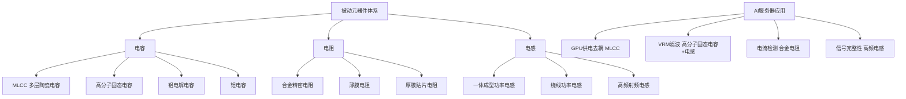
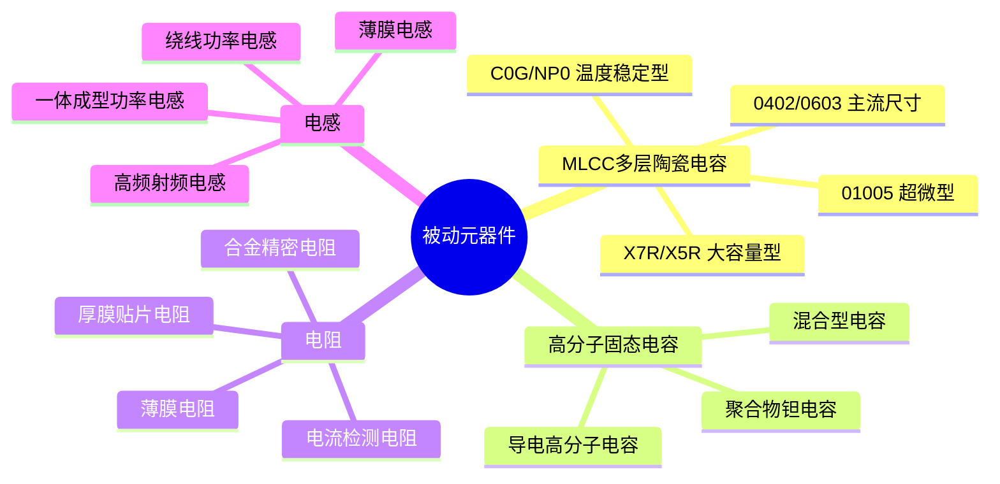
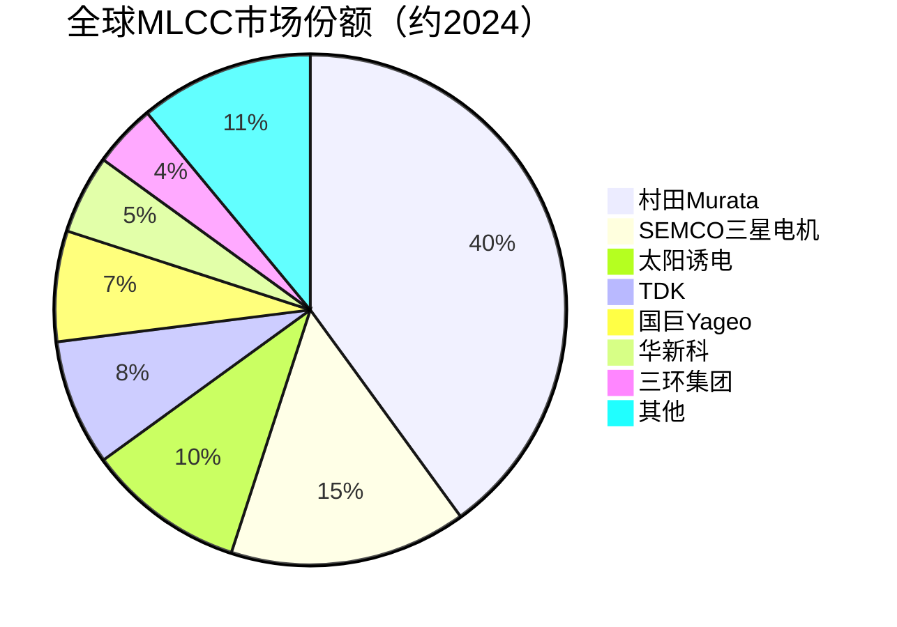

# 被动元器件

> 高端电容、电阻、高频电感等被动电子元器件的统称，是AI服务器和终端设备稳定运行的基础配套。

## 概述

被动元器件是指不需要外部能量源即可工作的电子元器件，主要包括电容、电阻和电感三大类。虽然被动元器件单价低、技术门槛看似不高，但在AI服务器和高性能计算设备中，高端被动元器件的质量和数量直接决定了系统稳定性和信号完整性。一台AI服务器需要数万颗被动元器件，涵盖多层陶瓷电容（MLCC）、高分子固态电容、合金电阻、高频电感等。

AI服务器对被动元器件提出更高要求：一是高耐压和大电流承载能力，GPU供电需要大量大容量MLCC和高频功率电感；二是高可靠性，AI服务器7×24小时不间断运行，被动元器件需具备10年以上的使用寿命；三是小型化和高密度集成，PCB空间有限，要求被动元器件在更小封装内提供更大容值。

被动元器件市场由日本厂商长期主导。村田制作所（Murata）在MLCC领域占据全球约40%份额，TDK、太阳诱电等日企在高端MLCC领域形成技术壁垒。中国台湾国巨、华新科在中端市场有较强竞争力。中国大陆三环集团、风华高科、顺络电子等在中低端市场稳步拓展，高端产品国产化率仍较低。

## 技术原理

被动元器件在AI电路中承担滤波、去耦、稳压、阻抗匹配等关键功能：

**MLCC（多层陶瓷电容）**：
- 结构：由交替堆叠的陶瓷介质层（BaTiO3钛酸钡等）和内电极（Ni或Cu）组成，层数可达1000层以上。单层厚度降至1μm以下，实现大容量小型化。
- 功能：在GPU供电回路中作为去耦电容，滤除高频纹波，稳定供电电压。AI服务器GPU供电需要数百颗大容量MLCC并联。
- 关键参数：容值（0.01μF-100μF）、耐压（6.3V-100V）、ESR（等效串联电阻）、ESL（等效串联电感）。

**高分子固态电容（导电高分子铝电解电容）**：
- 结构：以导电高分子（PEDOT、PPy等）作为阴极材料替代传统电解液，阳极为铝箔。
- 功能：大容量去耦和低频滤波，弥补MLCC在高容值场景的成本劣势。ESR极低，纹波电流承受能力高。
- 应用：AI服务器CPU/GPU供电VRM模块、主板电源滤波。

**合金电阻（精密贴片电阻）**：
- 结构：采用合金箔或合金膜作为电阻体，具有低TCR（温度系数）、高精度、低噪音特性。
- 功能：电流检测和限流保护。GPU供电回路需要精密合金电阻检测相电流，实现精准VRM控制。
- 关键参数：阻值精度（±0.1%-1%）、TCR（±10-50ppm/°C）、额定功率。

**高频电感（功率电感）**：
- 结构：由磁芯（铁氧体或金属磁性粉末）和绕组（铜线）组成。一体成型电感将绕组压注在金属磁性粉末中，具有低DCR、高饱和电流特性。
- 功能：GPU/CPU供电回路中的储能和滤波，配合VRM实现电压转换。
- 关键参数：感值、DCR（直流电阻）、饱和电流、温升电流。

## 分类与技术路线

被动元器件按功能和材料分类：

**MLCC（多层陶瓷电容）**：
- 按介质材料：Class I（C0G/NP0，温度稳定但容值小）、Class II（X7R/X5R，大容值但温漂大）
- 按尺寸：0201、0402、0603、0805、1206等，AI服务器以0402/0603为主
- 按容值：小容值（0.01-1μF，高频去耦）、大容值（10-100μF，低频滤波）
- 高端MLCC：01005超微型、大容量高耐压（100μF/10V以上）

**高分子固态电容**：
- 导电高分子电容：PEDOT/PPy阴极，ESR极低
- 混合型电容：导电高分子+电解液混合，兼顾性能和寿命
- 聚合物钽电容：高分子钽电容，高可靠性

**合金电阻**：
- 锰铜合金电阻：低TCR，高精度
- 康铜合金电阻：通用精密电阻
- 贴片合金电阻：0603/1206/2512等封装

**功率电感**：
- 一体成型电感：金属粉末压注，低DCR、高Isat，GPU供电主力
- 绕线电感：铁氧体磁芯+铜绕组，通用功率电感
- 薄膜电感：高频射频应用，手机和通信设备

## 市场格局

全球被动元器件市场2024年规模约350亿美元，其中MLCC约160亿美元、电容约90亿美元、电阻约50亿美元、电感约50亿美元。AI服务器和HPC需求驱动高端被动元器件快速增长。

**MLCC市场**：
- 村田制作所：全球MLCC龙头，份额约40%，高端产品壁垒最高
- Samsung Electro-Mechanics（SEMCO）：韩国MLCC第二大厂
- 太阳诱电（Taiyo Yuden）：日本高端MLCC厂商
- TDK：日本MLCC头部厂商
- 国巨（Yageo）：中国台湾，中端MLCC主力
- 华新科：中国台湾MLCC厂商
- 三环集团：中国MLCC国产化领军
- 风华高科：中国MLCC老牌厂商

**电感市场**：
- 村田：高频电感龙头
- TDK：功率电感头部厂商
- 顺络电子：中国电感龙头，一体成型电感加速突破
- 奇力新：中国台湾电感厂商

**电阻市场**：
- 国巨：全球电阻龙头，份额约30%
- 华新科：中国台湾电阻厂商
- 乾坤科技：中国台湾精密电阻
- 风华高科：中国电阻厂商

## 代表企业

| 企业 | 国家/地区 | 主要产品/技术 | 市场地位 |
|------|----------|-------------|---------|
| 村田制作所 | 日本 | MLCC、电感、射频器件 | 全球被动元器件龙头 |
| Samsung SEMCO | 韩国 | MLCC、电感 | 全球MLCC第二 |
| TDK | 日本 | MLCC、电感、传感器 | 被动元器件头部 |
| 太阳诱电 | 日本 | MLCC、电感 | 高端MLCC厂商 |
| 国巨Yageo | 中国台湾 | 电阻、MLCC | 全球电阻龙头 |
| 华新科 | 中国台湾 | MLCC、电阻 | 中端被动元器件主力 |
| 三环集团 | 中国 | MLCC、陶瓷器件 | 国产MLCC领军 |
| 顺络电子 | 中国 | 电感、变压器 | 国产电感龙头 |
| 风华高科 | 中国 | MLCC、电阻 | 国产被动元器件老牌 |
| 奇力新 | 中国台湾 | 电感、电阻 | 电感器件厂商 |

## 发展趋势

1. **AI服务器驱动高端MLCC需求增长**：AI服务器GPU供电回路需要大量大容量MLCC（22μF/100μF级）和高频去耦MLCC（0.01-0.1μF级）。单台AI服务器MLCC用量可达3-5万颗，是普通服务器的2-3倍。

2. **MLCC微型化与高容化并进**：01005超微型MLCC在手机和可穿戴设备加速渗透，大容量高耐压MLCC在AI服务器需求旺盛。层数从500层向1500层以上演进，单层厚度降至0.5μm以下。

3. **一体成型电感渗透加速**：AI服务器GPU供电对电感饱和电流和DCR要求提升，一体成型电感凭借低DCR和高Isat优势加速替代传统绕线电感。顺络电子等国产厂商一体成型电感加速放量。

4. **国产被动元器件加速替代**：在中美科技竞争背景下，三环集团、风华高科、顺络电子等国产被动元器件厂商加速高端产品研发。MLCC在0402/0603中高容值产品国产化率提升，电感一体成型产品国产化突破。

5. **被动元器件供应链本地化**：AI服务器厂商推动被动元器件供应链本地化，减少对日本和台湾供应链的依赖。中国大陆被动元器件厂商扩产提速，三环集团、顺络电子等积极扩产满足AI需求。

## 与AI产业链的关联

被动元器件是AI服务器和终端设备的"基础设施元件"。虽然单价低，但用量极大，质量和可靠性直接决定系统稳定性。AI服务器GPU供电回路中的MLCC、电感和电阻承担电压转换、滤波和电流检测功能，任一元件故障都可能导致GPU宕机或性能下降。

被动元器件向上游关联陶瓷粉体（钛酸钡）、电极金属浆料（镍浆、铜浆）、磁性材料等原材料，向下游服务AI服务器、AI终端、自动驾驶等全产业链。高端被动元器件的国产化对保障AI产业链供应链安全具有重要意义。随着AI服务器出货量快速增长，高端被动元器件市场规模持续扩大，国产化替代空间广阔。

---
[← 返回总目录](../README.md)
