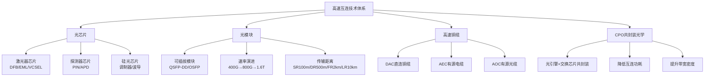
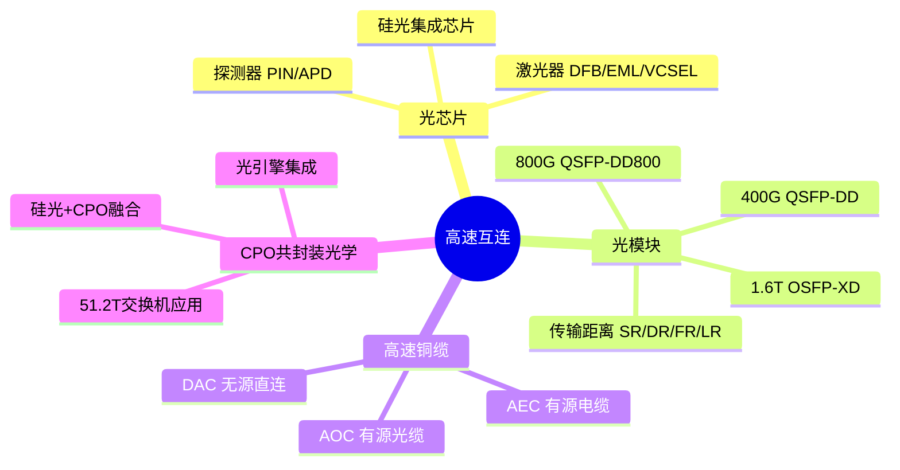
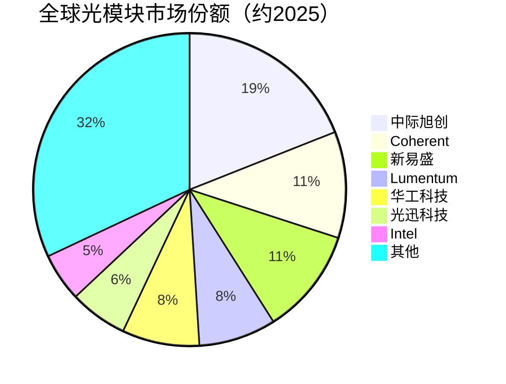

# 高速互连

> 光芯片、光模块及Co-packaged共封装光学器件等高速数据互连技术的统称，是AI大规模集群算力的"高速公路"。

## 概述

高速互连是AI算力集群的生命线。在万卡级GPU训练集群中，节点间数据传输带宽和延迟直接决定了模型训练效率。随着单卡算力从TFLOPS级跃升至PFLOPS级，互连带宽需求从100G/通道快速演进到800G乃至1.6T/通道。高速互连技术涵盖光芯片、光模块、高速铜缆和共封装光学（CPO）四大领域，是AI产业链中技术密集度最高、创新迭代最快的细分配套环节之一。

光芯片是光模块的核心器件，包括激光器芯片（DFB/EML/VCSEL）和探测器芯片（PIN/APD）。光芯片设计和制造能力直接决定了光模块的传输速率和功耗表现。中国在25G及以下光芯片领域已实现较高国产化率，但50G/100G高速光芯片仍以外资为主，国产化率不足30%。

光模块是将电信号转换为光信号（及反向）的核心器件，在数据中心短距互连（100m-2km）中以可插拔模块（QSFP-DD/OSFP）形态存在。800G光模块2024年规模出货，1.6T光模块2025-2026年量产，硅光和CPO技术将重塑光互连架构。

## 技术原理

光模块的基本工作原理是"电→光→电"转换过程：

**发射端**：电信号输入激光器驱动芯片（Driver IC），驱动激光器芯片（DFB或EML）将电信号调制为光信号。直接调制（DML）通过改变激光器驱动电流实现信号调制，结构简单但速率受限；外调制（EML）使用外部调制器（MZM/EAM）实现更高速率和更长传输距离。

**传输**：光信号通过光纤传输。单模光纤（SMF）适用于长距传输（2km-40km+），多模光纤（MMF）适用于短距传输（100m-300m）。波分复用（WDM）技术在一根光纤中传输多路不同波长光信号，成倍提升容量。

**接收端**：光信号经光纤到达接收端，由探测器芯片（PIN或APD）将光信号转换为电信号，经TIA（跨阻放大器）放大后输出到主机。

**CPO（Co-Packaged Optics）**：将光引擎与交换芯片共同封装在同一基板上，光信号在封装内部完成转换，大幅缩短电信号传输路径，降低功耗并提升带宽密度。CPO有望在51.2T及以上交换机中规模应用。

**硅光技术**：利用硅基CMOS工艺在硅芯片上集成光子器件（调制器、波导、探测器），实现光子集成。硅光的优势在于可复用成熟的CMOS产线降低成本，但激光器仍需III-V族材料外贴集成。

## 分类与技术路线

高速互连技术按形态和功能可分为以下几类：

**光芯片**：
- 激光器芯片：DFB（分布反馈式，25G/50G）、EML（电吸收调制，50G/100G/200G）、VCSEL（垂直腔面发射，短距多模）
- 探测器芯片：PIN（高线性度）、APD（高灵敏度）
- 硅光芯片：集成调制器、波导、耦合器

**光模块**：
- 封装形态：SFP28（25G）、SFP56（50G）、QSFP56（200G）、QSFP-DD（400G/800G）、OSFP（800G/1.6T）
- 传输距离：SR（100m）、DR（500m）、FR（2km）、LR（10km）、ZR（80km+）
- 技术方案：直接调制DML、外调制EML、硅光集成

**高速铜缆**：
- DAC（Direct Attach Cable）：无源直连铜缆，25G/通道，功耗极低但距离受限（<3m）
- AEC（Active Electrical Cable）：有源电缆，内置均衡器延长距离至5-7m
- AOC（Active Optical Cable）：有源光缆，两端集成光模块

**CPO共封装光学**：
- 将光引擎集成在交换芯片封装基板上，光电转换距离缩短至毫米级
- 目标应用于51.2T及以上高带宽交换机
- 代表方案：NVIDIA Spectrum-X、Broadcom Hollow Optical

## 市场格局

全球光收发器市场2025年规模约134亿美元，CAGR 13.5%至2035年481亿美元，预计2026年突破152亿美元。800G光模块2025年需求达1800万支、出货同比翻倍，1.6T光模块2025年出货约270万支进入量产元年。中国厂商在光模块整机领域占据全球领先地位，掌握800G至1.6T光模块全球23.4%份额。

中际旭创是全球光模块龙头，800G/1.6T出货量全球第一，市场份额约15-20%。新易盛、华工科技、光迅科技、亨通光电等中国厂商合计占据全球光模块市场超过50%份额。海外厂商中，Coherent（II-VI合并）、Lumentum在高端光芯片领域占据优势。

光芯片市场由日美厂商主导。激光器芯片市场日本三菱、住友、美国Lumentum、Coherent占据主要份额。中国源杰科技、长光华芯在25G激光器芯片已实现规模出货，50G/100G EML芯片加速验证。

CPO技术目前处于产业化早期，Broadcom、NVIDIA（XSR）、Intel（硅光CPO）等厂商积极布局，预计2026-2027年在51.2T交换机中规模应用。

## 代表企业

| 企业 | 国家/地区 | 主要产品/技术 | 市场地位 |
|------|----------|-------------|---------|
| 中际旭创 | 中国 | 800G/1.6T光模块 | 全球光模块出货量第一 |
| Coherent | 美国 | EML激光器、光模块 | 高端光芯片龙头 |
| Lumentum | 美国 | 激光器芯片、光模块 | 光器件行业头部 |
| 新易盛 | 中国 | 800G光模块 | 光模块高速增长新锐 |
| 华工科技 | 中国 | 800G光模块、激光器 | 光通信综合方案商 |
| 光迅科技 | 中国 | 光模块、光芯片 | 国资背景光器件龙头 |
| 源杰科技 | 中国 | 25G/50G激光器芯片 | 国产激光器芯片领先 |
| 住友电工 | 日本 | EML激光器 | 高端光芯片供应商 |
| Marvell | 美国 | DSP芯片、光互连 | 光模块DSP核心供应商 |
| 亨通光电 | 中国 | 光纤光缆、光模块 | 光通信全产业链 |

## 发展趋势

### 市场规模预测

| 年份 | 市场规模 | 同比增长 | 备注 |
|------|---------|---------|------|
| 2024 | 约118亿美元 | — | 基准年 |
| 2025 | 约134亿美元 | +13.5% | 800G出货翻倍，1.6T量产元年 |
| 2026E | 约152亿美元 | +13.5% | 1.6T规模商用，CPO产业化加速 |
| 2027E | 约172亿美元 | +13.5% | 硅光渗透率提升，224G SerDes推动铜缆回归 |

> 数据来源：市场研究机构（2025），全球光收发器市场CAGR 13.5%至2035年481亿美元

1. **1.6T光模块加速商用**：1.6T光模块采用OSFP-XD封装，单通道200G PAM4调制，2025年出货约270万支进入量产元年，2026年规模商用。DSP芯片、EML激光器和硅光方案是三大技术路线竞争焦点。

2. **硅光技术渗透加速**：硅光方案在中距（DR/FR）场景凭借成本和集成度优势加速替代传统分立方案。Intel硅光800G已规模出货，国内硅杰、曦智科技等加速布局。硅光+CPO融合有望重塑光互连架构。

3. **CPO共封装光学产业化**：51.2T交换机推动CPO技术从概念走向量产，光引擎与交换芯片共封装可降低互连功耗30-50%。预计2026-2027年在超大规模数据中心率先应用。

4. **高速铜缆回归短距互连**：随着GPU集群机柜内互连带宽需求激增，224G SerDes推动DAC/AEC铜缆在机柜内1-3m互连场景回归，铜缆凭借低成本低功耗优势在柜内Scale-up互连中与光模块形成互补。

5. **国产光芯片加速突破**：50G EML激光器芯片国产化加速，源杰科技、长光华芯等有望在2025-2026年实现规模出货。100G EML和硅光芯片是下一阶段攻关重点。

## 与AI产业链的关联

高速互连是AI大规模训练集群的"神经网络"，决定了GPU节点间数据传输带宽和延迟。万卡级GPU训练中，AllReduce梯度同步通信量巨大，互连带宽不足将导致GPU利用率下降（通信等待）。800G光模块和InfiniBand网络使千卡集群训练效率提升至90%以上。

高速互连向上游拉动光芯片、光器件和DSP芯片需求，向下游支撑智算中心、AI服务器集群互连网络建设。2025年全球光收发器市场约134亿美元，800G光模块需求1800万支、出货同比翻倍，1.6T光模块出货约270万支进入量产元年。中国企业掌握800G至1.6T光模块全球23.4%份额，在光模块整机领域已具备全球竞争力，但高速光芯片和DSP芯片仍存在"卡脖子"风险，国产化突破对AI产业链安全至关重要。

---
[← 返回总目录](../README.md)
