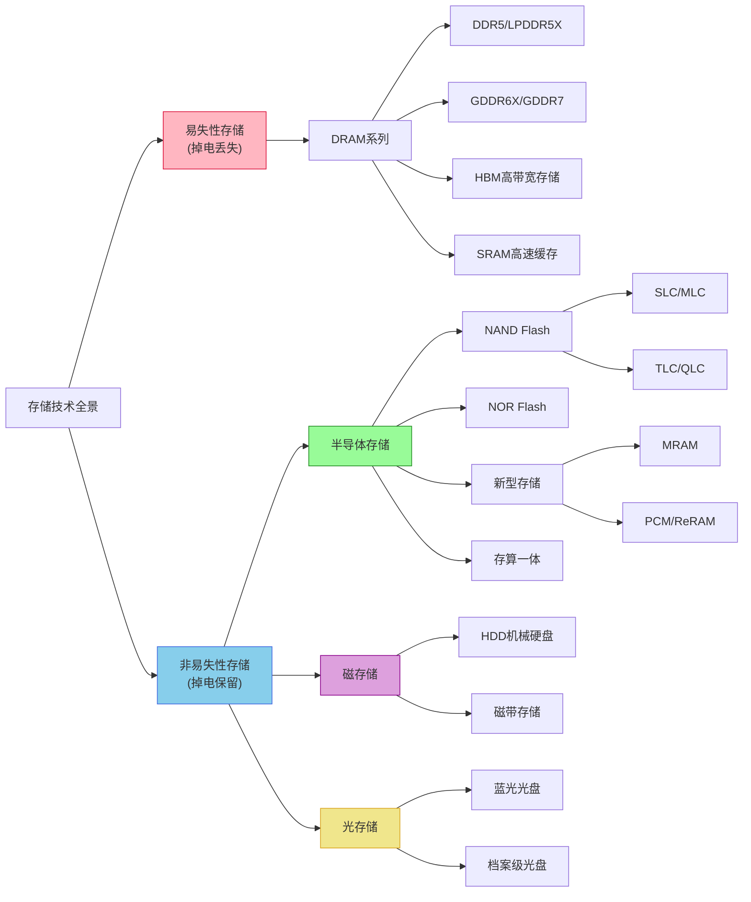
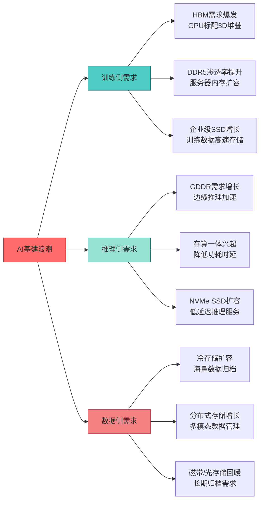
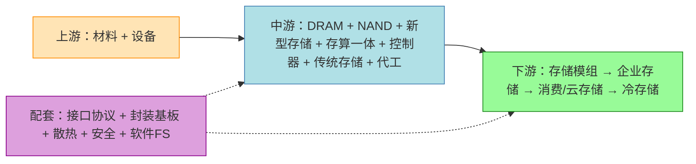

# 存储产业链知识库

> 全存储行业深度解析：从材料设备到芯片制造，从模组系统到云端应用，深度分析AI基建浪潮下的存储产业全链路。

## 存储产业链全景架构

```mermaid
graph TB
    subgraph 上游["上游：存储材料与设备"]
        direction LR
        A1["基础材料<br/>硅片/光刻胶/电子特气"]
        A2["功能材料<br/>相变/铁磁/阻变材料"]
        A3["HDD材料<br/>磁头/盘片/磁带介质"]
        A4["制造设备<br/>光刻/刻蚀/薄膜/CMP"]
        A5["专用设备<br/>3D NAND堆叠/TSV/测试"]
    end

    subgraph 中游["中游：存储芯片设计与制造"]
        direction LR
        B1["DRAM系列<br/>DDR5/GDDR/HBM"]
        B2["NAND系列<br/>3D NAND/SLC-MLC-TLC-QLC"]
        B3["新型存储<br/>MRAM/PCM/ReRAM"]
        B4["存算一体<br/>近存计算/存内计算"]
        B5["控制器<br/>SSD主控/内存接口"]
        B6["传统存储<br/>HDD/光盘/磁带"]
        B7["制造代工<br/>IDM与Foundry"]
    end

    subgraph 下游["下游：存储模组系统与应用"]
        direction LR
        C1["存储模组<br/>内存模组/SSD/嵌入式"]
        C2["企业存储<br/>全闪存阵列/分布式SDS"]
        C3["消费存储<br/>手机/PC/汽车存储"]
        C4["云存储<br/>对象/块/文件存储"]
        C5["冷存储<br/>备份归档/灾备"]
    end

    subgraph 配套["细分配套产业链"]
        direction LR
        D1["接口协议<br/>PCIe/NVMe/CXL"]
        D2["封装基板<br/>TSV/3D堆叠/BGA"]
        D3["散热方案<br/>SSD/HBM/数据中心"]
        D4["安全加密<br/>硬件加密/数据销毁"]
        D5["软件文件系统<br/>存储OS/FS/数据管理"]
    end

    A1 & A2 & A3 & A4 & A5 --> B1 & B2 & B3 & B4 & B5 & B6 & B7
    B1 & B2 & B3 & B4 & B5 & B6 & B7 --> C1 & C2 & C3 & C4 & C5
    D1 & D2 & D3 & D4 & D5 -.-> B1 & B2 & B3 & B4 & B5 & B6 & B7
    D1 & D2 & D3 & D4 & D5 -.-> C1 & C2 & C3 & C4 & C5

    style 上游 fill:#FFE4B5,stroke:#FF8C00
    style 中游 fill:#B0E0E6,stroke:#4682B4
    style 下游 fill:#98FB98,stroke:#228B22
    style 配套 fill:#DDA0DD,stroke:#8B008B
```

## 存储技术分类矩阵

## AI基建对存储行业的拉动效应总览

---

## 目录导航

### 📊 总览

| 序号 | 概念 | 简介 |
|------|------|------|
| 1 | [存储产业概览与市场分析](总览/存储产业概览与市场分析.md) | 全景市场分析、AI基建拉动效应总览 |
| 2 | [存储技术演进路线](总览/存储技术演进路线.md) | 从磁带到半导体到存算一体的技术演进史 |

### ⛏️ 上游：存储材料与设备

#### 基础材料

| 序号 | 概念 | 简介 |
|------|------|------|
| 1 | [存储芯片基础材料](上游/存储芯片基础材料.md) | 硅片/光刻胶/电子特气/湿化学品/CMP材料 |
| 2 | [存储专用功能材料](上游/存储专用功能材料.md) | 相变材料/铁电材料/磁性材料/阻变材料 |
| 3 | [HDD专用材料](上游/HDD专用材料.md) | 磁头材料/盘片基板/磁性薄膜/磁带介质 |

#### 制造设备

| 序号 | 概念 | 简介 |
|------|------|------|
| 4 | [光刻设备](上游/光刻设备.md) | 存储芯片制造用光刻机 |
| 5 | [刻蚀设备](上游/刻蚀设备.md) | 高深宽比刻蚀(3D NAND专用)/等离子刻蚀 |
| 6 | [薄膜沉积设备](上游/薄膜沉积设备.md) | ALD/CVD/PVD存储薄膜工艺核心 |
| 7 | [CMP与量检测设备](上游/CMP与量检测设备.md) | 存储专用CMP/缺陷检测 |
| 8 | [3D NAND堆叠专用设备](上游/3D-NAND堆叠专用设备.md) | 多层堆叠工艺设备 |
| 9 | [TSV与3D封装设备](上游/TSV与3D封装设备.md) | 硅穿孔/堆叠键合设备 |
| 10 | [存储测试与老化设备](上游/存储测试与老化设备.md) | 存储芯片测试/老化/可靠性验证 |

### 🔧 中游：存储芯片设计与制造

#### DRAM系列

| 序号 | 概念 | 简介 |
|------|------|------|
| 11 | [DDR5与LPDDR5X](中游/DRAM/DDR5与LPDDR5X.md) | 服务器主存/移动端内存 |
| 12 | [GDDR系列](中游/DRAM/GDDR系列.md) | GDDR6X/GDDR7显卡与AI推理内存 |
| 13 | [HBM高带宽存储](中游/DRAM/HBM高带宽存储.md) | AI训练核心存储(3D堆叠TSV) |
| 14 | [利基型DRAM](中游/DRAM/利基型DRAM.md) | DDR3/DDR4利基市场 |

#### NAND Flash系列

| 序号 | 概念 | 简介 |
|------|------|------|
| 15 | [3D NAND Flash](中游/NAND/3D-NAND-Flash.md) | 128层/232层/300层+堆叠 |
| 16 | [闪存类型SLC/MLC/TLC/QLC](中游/NAND/闪存类型SLC-MLC-TLC-QLC.md) | 存储密度与耐久度权衡 |
| 17 | [NOR Flash](中游/NAND/NOR-Flash.md) | 嵌入式/车规级存储 |

#### 新型存储

| 序号 | 概念 | 简介 |
|------|------|------|
| 18 | [MRAM磁阻存储](中游/新型存储/MRAM磁阻存储.md) | STT-MRAM/SOT-MRAM |
| 19 | [PCM与ReRAM](中游/新型存储/PCM与ReRAM.md) | 相变存储/阻变存储 |

#### 其他中游环节

| 序号 | 概念 | 简介 |
|------|------|------|
| 20 | [存算一体芯片](中游/存算一体芯片.md) | 近存计算/存内计算/模拟存算 |
| 21 | [存储控制器与接口芯片](中游/存储控制器与接口芯片.md) | SSD主控/内存接口芯片(RCD/DB/SPD Hub) |
| 22 | [HDD机械硬盘](中游/HDD机械硬盘.md) | 企业级近线/HAMR/MAMR技术 |
| 23 | [光盘存储](中游/光盘存储.md) | 蓝光/档案级光盘/光磁混合 |
| 24 | [磁带存储](中游/磁带存储.md) | LTO磁带/线性磁带存储 |
| 25 | [存储芯片制造与代工](中游/存储芯片制造与代工.md) | IDM与Foundry模式 |

### 🏗️ 下游：存储模组、系统与应用

| 序号 | 概念 | 简介 |
|------|------|------|
| 26 | [内存模组](下游/内存模组.md) | RDIMM/LRDIMM/UDIMM |
| 27 | [SSD固态硬盘](下游/SSD固态硬盘.md) | 企业级/消费级SSD |
| 28 | [嵌入式存储](下游/嵌入式存储.md) | eMMC/UFS/存储卡 |
| 29 | [企业级存储系统](下游/企业级存储系统.md) | 全闪存阵列/混合阵列 |
| 30 | [分布式存储与软件定义存储](下游/分布式存储与软件定义存储.md) | Ceph/Gluster/SDS |
| 31 | [消费级存储应用](下游/消费级存储应用.md) | 手机/PC/汽车存储 |
| 32 | [云存储与数据中心存储](下游/云存储与数据中心存储.md) | 对象/块/文件存储 |
| 33 | [备份归档与冷存储](下游/备份归档与冷存储.md) | 灾备/归档/冷数据 |

### 🔩 细分配套产业链

| 序号 | 概念 | 简介 |
|------|------|------|
| 34 | [存储接口与协议](细分配套/存储接口与协议.md) | PCIe/NVMe/CXL/DDR5接口 |
| 35 | [存储封装与基板](细分配套/存储封装与基板.md) | TSV/3D堆叠/BGA基板/模组PCB |
| 36 | [存储散热方案](细分配套/存储散热方案.md) | 企业SSD散热/HBM散热/数据中心散热 |
| 37 | [存储安全与加密](细分配套/存储安全与加密.md) | 硬件加密/安全存储/数据销毁 |
| 38 | [存储软件与文件系统](细分配套/存储软件与文件系统.md) | 存储OS/文件系统/数据管理 |

---

## 精简分层总结构

---

## 2025年市场数据速览

| 指标 | 2024年 | 2025年 | 2026年预测 | 2027年预测 |
|------|--------|--------|-----------|-----------|
| 全球DRAM+NAND市场规模 | ~1700亿美元 | **2215.91亿美元**（+32.7%） | 5516亿美元（+134%） | 8427亿美元（+53%） |
| 全球半导体存储市场 | ~2060亿美元 | **2342亿美元**（+13.7%） | — | — |
| 其中DRAM | ~970亿美元 | ~1290亿美元 | — | — |
| 其中NAND | ~680亿美元 | ~650-925亿美元 | — | — |
| 全球半导体设备销售 | ~1140亿美元 | **1255亿美元**（新纪录） | — | — |

### 核心竞争格局（2025年Q4）

| 领域 | 龙头企业 | 关键变化 |
|------|---------|---------|
| DRAM | 三星37.1%、SK海力士33.1%、美光20.8% | 三家合计>91%，长江存储逐步进入 |
| NAND Flash | 三星27.0%、SK海力士22.1%、铠侠~14-15% | 长江存储份额从5%→13%，挑战前三 |
| HBM | SK海力士~62%、美光第二（首超三星）、三星~20-30% | 美光Q2首超三星，AI训练需求驱动 |
| 企业级SSD | 三星32.3%、SK集团~19%、美光~13-17% | AI推理拉动QLC企业级SSD增长 |
| HDD | 西数~43%、希捷~40%、东芝~17% | 近线HDD产能售罄至2026年 |
| 半导体设备 | ASML~372亿$(#1)、AMAT~270亿$(#2)、泛林#3 | 中国设备国产化率从11.3%升至25% |

> 数据来源：TrendForce、Counterpoint Research、IDC、SEAJ等权威机构。详细数据见各详情页。

---

*本知识库基于公开行业资料整理，深度分析AI基建浪潮下的存储产业全链路。*
