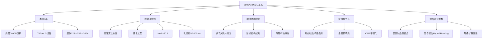
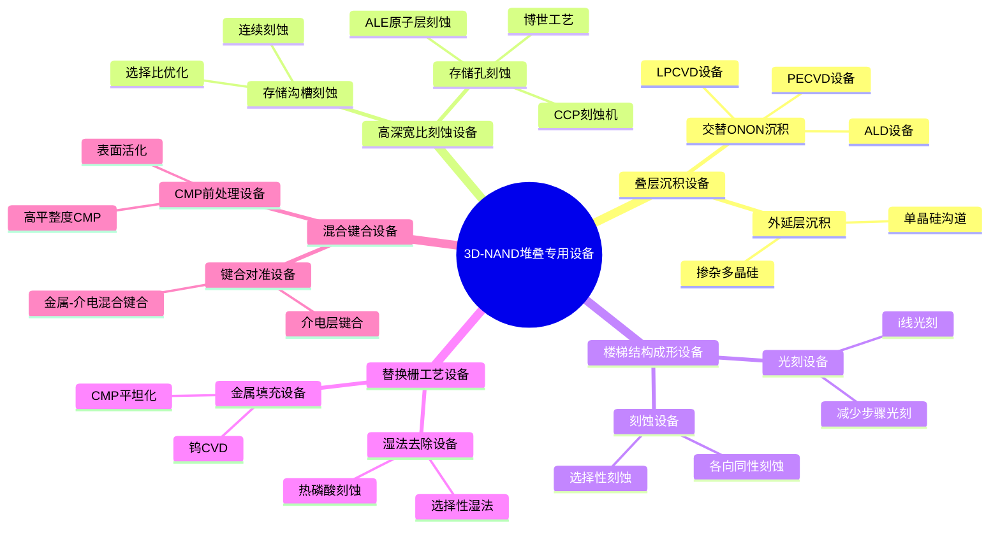
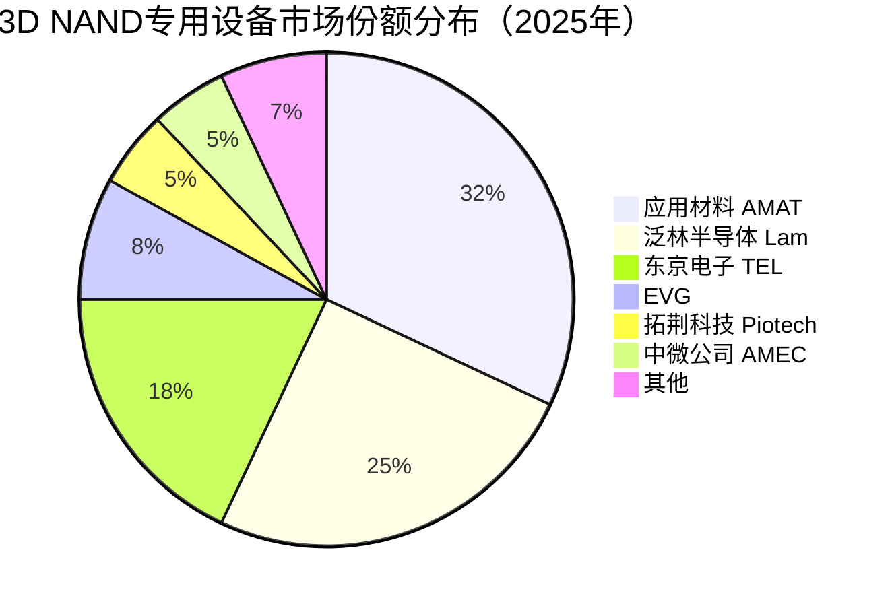

# 3D-NAND堆叠专用设备

> 3D-NAND堆叠专用设备是支撑3D NAND垂直堆叠架构制造的特殊设备，包括多层薄膜沉积、高深宽比刻蚀、楼梯结构成形、混合键合等专用工艺设备。

## 概述

3D NAND是存储芯片技术发展的重要里程碑。与2D NAND通过平面缩微提升密度不同，3D NAND通过将存储单元垂直堆叠来突破平面缩微的物理限制。3D NAND的堆叠层数从2013年三星首次量产的24层，发展到2024年长江存储、三星、SK海力士量产的232层，实验室阶段已探索300层以上，远期目标向400层乃至500层推进。

3D NAND的制造工艺与2D NAND有根本性差异，催生了一系列专用设备需求。核心工艺包括：ONO（Oxide-Nitride-Oxide）交替层沉积、存储孔（Memory Hole）高深宽比刻蚀、楼梯结构（Stair-case）光刻和刻蚀、字线（Word Line）金属替换栅工艺、混合键合（Hybrid Bonding）堆叠等。这些工艺对设备的特殊要求推动了专用设备的技术发展和市场增长。

3D NAND专用设备是存储设备投资中增长最快的细分领域。随着3D NAND层数从128层向232层再到300层以上推进，专用设备的工艺步骤和设备数量成比例增加。特别是混合键合技术在3D NAND中的导入，为键合设备带来新的市场增量。应用材料、泛林半导体、东京电子等设备巨头在3D NAND专用设备领域持续创新。

## 技术原理

3D NAND的核心制造流程包括：首先在硅片上交替沉积多层氧化硅和氮化硅（约116对，对应232层），形成叠层结构；然后通过高深宽比刻蚀形成存储孔（Memory Hole）；在孔内沉积ONO电荷陷阱层和 polysilicon 沟道；接着通过楼梯结构刻蚀暴露每一层氮化硅，将氮化硅替换为钨金属形成字线（Word Line）；最后进行位线（Bit Line）和接触孔工艺。

**叠层沉积** 是3D NAND的第一步，需要交替沉积氧化硅和氮化硅。232层需要约116对交替层，每对厚度约40-50nm，总叠层厚度约5-6μm。交替层沉积使用CVD或ALD设备，要求极高的均匀性和界面控制。层数增加使沉积步骤和设备需求成比例增长。

**存储孔刻蚀** 是3D NAND最关键的工艺之一。存储孔需要穿透整个叠层（5-6μm深），孔径仅50-100nm，深宽比达60:1到100:1以上。这需要专用的CCP刻蚀设备，采用博世工艺或连续刻蚀方案。深宽比的增加是3D NAND层数提升的最大技术瓶颈之一。

**楼梯结构成形** 用于暴露每一层字线进行电连接。楼梯结构通过重复的光刻和刻蚀步骤形成阶梯状图形，每增加一层就需要一次额外的光刻和刻蚀。232层相比128层，楼梯结构的光刻和刻蚀步骤增加约80%，设备需求量大幅增加。

**替换栅工艺** 是3D NAND的核心创新之一。先在叠层中刻蚀氮化硅，然后填充金属钨形成字线。这需要高选择性的湿法或干法刻蚀去除氮化硅，以及钨CVD填充和CMP平坦化。

**混合键合（Hybrid Bonding）** 是3D NAND向更层数推进的关键使能技术。当单晶圆叠层厚度达到物理极限时，可将两个叠层通过混合键合堆叠在一起，实现双倍层数。混合键合需要极高平整度的表面（<0.5nm RMS），对CMP和键合设备提出极高要求。

## 分类与技术路线

## 市场格局

3D NAND专用设备是存储设备市场中增长最快的细分领域。2025年全球半导体设备总销售额达**1255亿美元**（新纪录），3D NAND专用设备市场规模约80-100亿美元/年，包括叠层沉积设备（约30-35亿美元）、高深宽比刻蚀设备（约25-30亿美元）、楼梯结构光刻刻蚀设备（约15-20亿美元）、替换栅工艺设备（约10-15亿美元）和混合键合设备（约5-10亿美元）。2025年3D NAND技术节点：三星236层V-NAND量产推进420层，SK海力士321层2Tb QLC量产，美光232层，长江存储232层Xtacking 3.0。

应用材料（2025年营收~270亿美元，全球#2）在叠层沉积和替换栅工艺设备领域占据主导地位。泛林半导体（#3，份额提升210基点）在高深宽比刻蚀设备领域具有技术优势。东京电子（#4）在多种工艺设备领域有一定份额。混合键合设备市场由EVG（奥地利）和应用材料主导，荷兰BESI也在先进封装键合领域布局。

中国3D NAND专用设备国产化进展较快，中国设备国产化率从11.3%升至25%，受益于长江存储的设备国产化推动。拓荆科技在交替ONON层PECVD设备领域取得突破，已进入长江存储232层产线。中微公司在高深宽比刻蚀设备领域表现突出，其CCP刻蚀机在存储孔刻蚀中性能优异。华海清科在替换栅CMP领域实现国产替代。

## 代表企业

| 企业 | 国家/地区 | 主要产品/技术 | 市场地位 |
|------|----------|-------------|---------|
| 应用材料 AMAT | 美国 | 叠层沉积、替换栅、CMP | 3D NAND设备全面龙头 |
| 泛林半导体 Lam | 美国 | 高深宽比刻蚀、ALD | HAR刻蚀技术领先者 |
| 东京电子 TEL | 日本 | 刻蚀、CVD、涂胶显影 | 日系3D NAND设备商 |
| EVG | 奥地利 | 混合键合设备 | 晶圆键合设备龙头 |
| BESI | 荷兰 | 混合键合设备 | 先进封装键合设备商 |
| 拓荆科技 Piotech | 中国 | PECVD叠层沉积设备 | 国产3D NAND沉积设备龙头 |
| 中微公司 AMEC | 中国 | CCP高深宽比刻蚀 | 国产HAR刻蚀设备代表 |
| 华海清科 HWATSING | 中国 | CMP设备 | 国产CMP设备龙头 |
| 北方华创 Naura | 中国 | CVD、ALD设备 | 国产薄膜沉积设备商 |
| 芯源微电子 KINGSEMI | 中国 | 涂胶显影设备 | 国产涂胶显影设备商 |

## 发展趋势

### 市场规模预测

| 年份 | 市场规模 | 同比增长 | 备注 |
|------|---------|---------|------|
| 2024 | ~1140亿美元（半导体设备） | — | 基准年 |
| 2025 | 1255亿美元 | +约10% | 236层/321层NAND量产，混合键合导入加速 |
| 2026E | ~1380亿美元 | +约10% | 300层+NAND，混合键合设备市场爆发 |
| 2027E | ~1500亿美元 | +约9% | 产能释放，400层探索，混合键合成标配 |

> 3D NAND专用设备市场约80-100亿美元/年，混合键合设备有望从5-10亿美元增长到20-30亿美元。层数：236层/232层/321层（2025），推进420层。

**1. 混合键合技术导入加速。** 3D NAND向300层以上推进，单晶圆叠层厚度逼近物理极限，混合键合技术成为必选项。三星、SK海力士计划在2025-2026年导入混合键合堆叠3D NAND，带动键合设备需求爆发。

**2. 高深宽比刻蚀技术突破。** 300层以上3D NAND要求深宽比超过100:1，传统刻蚀方案面临极限。设备厂商在低温刻蚀、脉冲等离子体、ALE等方向持续创新。

**3. 叠层沉积效率提升。** 232层需要116对交替层沉积，沉积时间长是产能瓶颈。设备厂商在高产能CVD和ALD方案上持续优化，空间ALD技术有望提升沉积效率。

**4. 楼梯结构工艺简化。** 楼梯结构的光刻和刻蚀步骤随层数成比例增加。新型自对准楼梯成形技术和减少光刻步骤的工艺创新是降低成本的关键方向。

**5. 国产3D NAND设备加速渗透。** 长江存储232层3D NAND产线中国产设备渗透率持续提升。拓荆科技PECVD、中微公司CCP刻蚀、华海清科CMP等国产设备在3D NAND产线的应用不断扩大。

## AI基建拉动分析

AI基建浪潮对3D NAND专用设备市场的拉动是直接且巨大的。3D NAND是AI数据中心SSD的核心存储介质，AI数据量的指数级增长推动3D NAND产能扩张和层数提升。AI训练数据集、模型参数、推理日志等数据存储需求，直接拉动企业级SSD出货量增长，进而带动3D NAND专用设备投资。

从量上看，全球3D NAND产能从2023年到2026年预计增长约50%，新增产能对应的专用设备投资约300-400亿美元。层数从232层向300层以上推进，每增加一层，专用设备的工艺步骤和设备需求量相应增加。3D NAND专用设备市场是存储设备投资中增长确定性最高的细分领域。

从技术升级角度看，混合键合技术在3D NAND中的导入是革命性变化，为键合设备带来全新市场。混合键合设备目前单价高达数百万美元，市场规模有望从目前的5-10亿美元增长到20-30亿美元。国产设备厂商在混合键合领域也在积极布局，华海清科、拓荆科技等企业具有先发优势。

从投资角度，3D NAND专用设备是AI存储设备投资的核心赛道。应用材料、泛林半导体作为全球龙头，直接受益于3D NAND设备投资增长。国产3D NAND设备企业中，拓荆科技（PECVD叠层沉积）、中微公司（HAR刻蚀）、华海清科（CMP）是核心投资标的，在国产替代和AI存储双轮驱动下具有强劲增长潜力。

---
[← 返回总目录](../README.md)
