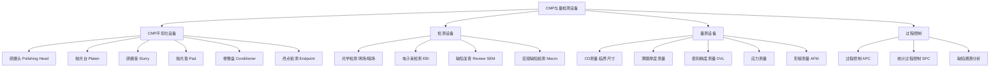
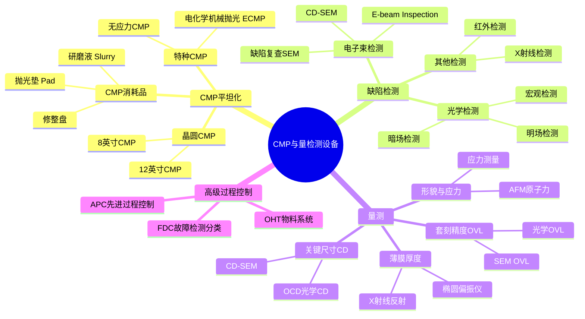
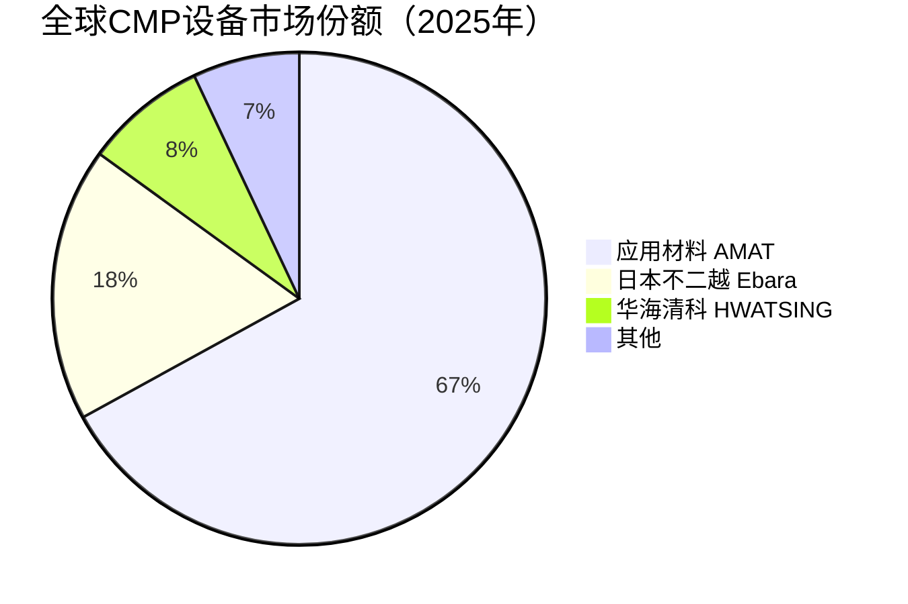

# CMP与量检测设备

> CMP（化学机械平坦化）设备与量检测设备是存储芯片制造中保障晶圆表面平整度和工艺质量的关键设备，对3D NAND多层堆叠和DRAM精细制程至关重要。

## 概述

CMP和量检测设备是存储芯片制造中质量控制的核心环节。CMP设备通过化学腐蚀和机械研磨的协同作用，将晶圆表面的不平整区域磨平，实现全局平坦化。量检测设备在各个工艺步骤后对晶圆进行检测和测量，确保工艺参数在规格范围内，及时发现缺陷并反馈修正。

CMP在3D NAND制造中具有特殊重要性。3D NAND的多层堆叠结构在沉积后表面会产生显著的高低差，如果不进行平坦化处理，后续光刻和刻蚀步骤将因焦深不足而失效。3D NAND的层数越多，CMP步骤越多——232层3D NAND的CMP步骤可达40-50步，远多于2D NAND的15-20步。DRAM的CMP步骤也较多，特别是电容形成和金属化步骤。

量检测设备分为检测类和量测类两大类。检测类设备用于发现晶圆上的缺陷（颗粒、划痕、残留物等），包括光学检测、电子束检测等；量测类设备用于测量关键尺寸（CD）、薄膜厚度、套刻精度等工艺参数。3D NAND的高深宽比结构和DRAM的极小特征尺寸，对量检测设备的分辨率和精度提出极高要求。

## 技术原理

CMP的基本原理是化学腐蚀与机械研磨的协同作用。研磨液（Slurry）中的化学成分与晶圆表面材料发生反应，生成易去除的反应产物；研磨垫（Pad）和研磨颗粒通过机械摩擦去除反应产物，暴露新鲜表面继续化学反应。化学作用和机械作用的平衡决定CMP的去除速率、均匀性和选择比。

**CMP设备** 的核心组件包括研磨头、抛光台、研磨液供给系统和抛光垫修整系统。研磨头将晶圆压在旋转的抛光垫上，研磨液供给到研磨界面。通过控制压力、转速、研磨液流量等参数，实现不同材料的选择性去除。先进的CMP设备采用多区压力控制（Multi-Zone），通过在研磨头不同区域施加不同压力来补偿边缘效应，提升均匀性。

**光学检测设备** 利用光照射晶圆表面，通过检测散射光或反射光的变化来发现缺陷。明场检测（BF）对浅缺陷灵敏，暗场检测（DF）对颗粒和深缺陷灵敏。3D NAND的深孔和深沟槽结构对光学检测的穿透深度提出挑战。

**电子束检测（EBI）** 利用电子束扫描晶圆表面，具有比光学检测更高的分辨率，可检测10nm以下的微小缺陷。电子束检测在先进DRAM和3D NAND的缺陷检测中日益重要，但检测速度慢、产能低是瓶颈。

**CD测量和OVL测量** 是量测类设备的核心功能。CD（关键尺寸）测量采用CD-SEM（扫描电子显微镜），分辨率可达0.1nm以下，用于测量线宽、孔径等关键尺寸。OVL（套刻精度）测量通过测量叠层图形的对准偏差，评估光刻对准精度。3D NAND的层层堆叠需要极高的OVL精度，套刻偏差需控制在数纳米以内。

## 分类与技术路线

## 市场格局

2025年全球半导体设备总销售额达**1255亿美元**（新纪录），CMP设备市场规模约25-30亿美元/年，应用材料（2025年营收~270亿美元，全球#2）在CMP设备领域占据约65%-70%的绝对主导地位，其他竞争者包括日本不二越（Ebara）等。量检测设备市场规模约80-100亿美元/年，应用材料（AMAT）、科磊（KLA，全球半导体设备#5）是量检测设备两大龙头，其中科磊在缺陷检测领域占据领先地位。

中国CMP和量检测设备国产化进展不一，中国设备国产化率从11.3%升至25%。华海清科在CMP设备领域取得重大突破，其12英寸CMP设备已进入长江存储、中芯国际等客户产线，实现国产替代。量检测设备领域，精测电子、中科飞测等在光学量测领域有所布局，东方晶源在电子束检测领域研发推进。整体来看，量检测设备的国产化率仍较低，特别是高端电子束检测设备主要依赖进口。

## 代表企业

| 企业 | 国家/地区 | 主要产品/技术 | 市场地位 |
|------|----------|-------------|---------|
| 应用材料 AMAT | 美国 | CMP设备、量检测设备 | 全球CMP设备绝对龙头 |
| 科磊 KLA | 美国 | 缺陷检测、CD量测、OVL | 量检测设备全球龙头 |
| 日本不二越 Ebara | 日本 | CMP设备 | 日系CMP设备领先者 |
| 华海清科 HWATSING | 中国 | 12英寸CMP设备 | 国产CMP设备龙头 |
| 精测电子 Jingce | 中国 | 光学量测设备 | 国产量测设备领先者 |
| 中科飞测 Skyverse | 中国 | 光学检测设备 | 国产检测设备代表 |
| 东方晶源 ABeam | 中国 | 电子束检测设备 | 国产EBI研发先行者 |
| 日立高科技 Hitachi | 日本 | CD-SEM、电子束检测 | 日系量检测设备龙头 |
| ASML | 荷兰 | 电子束量测（原HMI） | 量测设备供应商 |
| 奥普拓 Opto | 中国 | 椭圆偏振仪 | 国产薄膜量测设备 |

## 发展趋势

### 市场规模预测

| 年份 | 市场规模 | 同比增长 | 备注 |
|------|---------|---------|------|
| 2024 | ~1140亿美元（半导体设备） | — | 基准年 |
| 2025 | 1255亿美元 | +约10% | 新纪录，AMAT~270亿$(#2)，科磊#5 |
| 2026E | ~1380亿美元 | +约10% | 3D NAND CMP步骤增至60-80步，HBM量检测需求 |
| 2027E | ~1500亿美元 | +约9% | 产能释放，电子束检测设备需求增长 |

> CMP设备市场约25-30亿美元/年，量检测设备市场约80-100亿美元/年。3D NAND层数增加带动CMP步骤从40步向60步以上增长。

**1. CMP步骤数量持续增加。** 3D NAND层数增加带动CMP步骤从40步向60步以上增长，单晶圆CMP设备需求量持续提升。3D NAND的ONO层平坦化、楼梯结构CMP等新应用不断涌现。

**2. 高精度缺陷检测需求提升。** 3D NAND的微小缺陷（10nm级）会影响良率，要求检测设备分辨率从100nm级向10nm级提升。电子束检测设备的需求增长，但产能瓶颈仍是挑战。

**3. 多技术融合量检测。** 将光学量测、电子束量测和计算光刻结合，实现全方位的过程控制。光学CD（OCD）技术结合机器学习算法提升量测精度和效率。

**4. 高级过程控制（APC）智能化。** 利用AI和机器学习技术，实现CMP和量检测数据的实时分析和工艺自动调整。预测性过程控制减少良率损失。

**5. 国产CMP和量检测设备突破。** 华海清科CMP设备在存储产线持续扩大份额，中科飞测、精测电子在光学量测领域实现部分替代。电子束检测设备的国产化是下一个攻坚目标。

## AI基建拉动分析

AI基建浪潮对CMP和量检测设备市场的拉动主要体现在3D NAND和HBM产能扩张带来的设备需求增长。3D NAND是AI数据中心SSD的核心存储介质，层数从232层向300层以上推进，CMP步骤从40-50步增加到60-80步，单晶圆CMP设备需求量大幅增加。

HBM对量检测设备的需求拉动也很显著。HBM采用3D堆叠DRAM架构，涉及TSV、微凸点、混合键合等先进工艺，每一步都需要精密的量测和缺陷检测。HBM3E和HBM4的堆叠层数和工艺复杂度提升，对量检测设备的需求和精度要求不断提高。

从投资角度，CMP设备中应用材料是全球龙头，受益于AI存储设备投资增长。国产CMP设备中华海清科是核心标的，在长江存储等国产存储厂的渗透率持续提升。量检测设备中科磊是全球龙头，在AI存储良率管控需求增长中直接受益。国产量检测设备企业中科飞测、精测电子在国产替代趋势下具有成长空间。

---
[← 返回总目录](../README.md)
