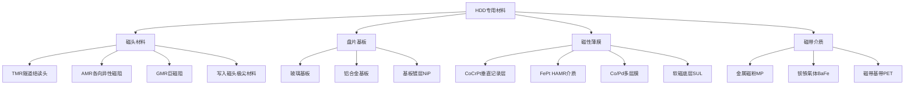
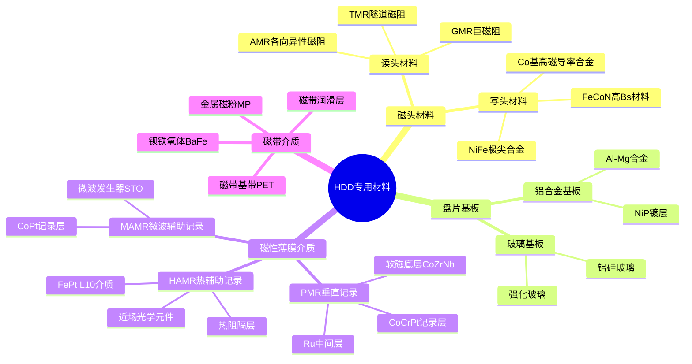
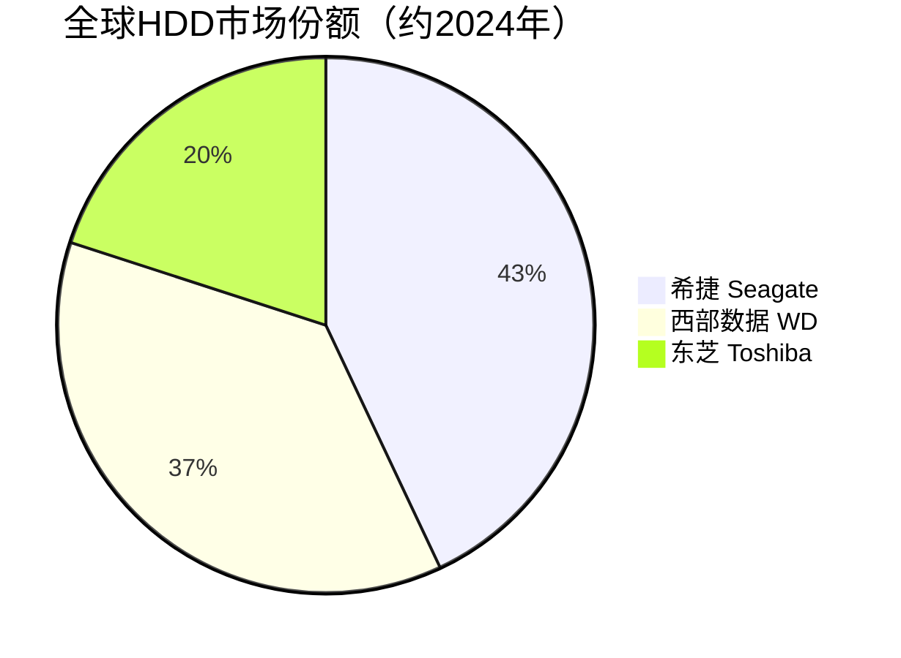

# HDD专用材料

> HDD专用材料是机械硬盘制造所需的特殊材料体系，包括磁头材料、盘片基板材料、磁性薄膜材料和磁带介质等。

## 概述

机械硬盘（HDD）虽然在大容量固态硬盘（SSD）的冲击下在消费市场逐渐萎缩，但在数据中心冷数据存储、企业级大容量存储、视频监控存储等领域仍不可替代。特别是在AI时代，海量训练数据和推理数据的存储需求使HDD以其极低的每比特成本优势，在数据中心大容量存储中保持重要地位。希捷、西部数据、东芝三大HDD厂商持续推进HAMR（热辅助磁记录）和MAMR（微波辅助磁记录）技术，单盘容量从20TB向30TB乃至50TB以上推进。

HDD的制造涉及独特的材料体系，与半导体存储芯片材料差异显著。HDD的核心组件包括磁头（读写头）、盘片、主轴电机、音圈电机等。磁头材料需要具备特殊的磁阻效应，用于读取盘片上的磁信号；盘片基板需要高平整度和机械强度，通常使用玻璃或铝合金；磁性薄膜是实际记录数据的介质，需要具备高矫顽力和高磁各向异性。

HDD专用材料的技术演进与存储密度提升密切相关。从早期的纵向磁记录（LMR）到垂直磁记录（PMR），再到当前的HAMR和MAMR，每次记录方式变革都伴随着材料体系的重大更新。HAMR技术引入了铁铂（FePt）高矫顽力介质材料和近场光学加热元件，是材料科学的重大突破。

## 技术原理

HDD数据存储的基本原理是利用磁性材料中磁化方向的变化来表示二进制数据。盘片表面镀覆磁性薄膜，磁头通过施加局部磁场使磁性区域磁化方向翻转来写入数据，通过检测磁性区域的磁信号来读取数据。

**磁头材料** 方面，读头经历了AMR→GMR→TMR的技术演进。当前主流的TMR（隧道磁阻）读头采用CoFeB/MgO/CoFeB结构，利用磁性隧道结的磁阻效应读取盘片上的磁信号，TMR比率可达100%以上，远高于GMR的10%-20%。写入磁头的极尖材料通常采用高磁导率的NiFe合金或Co基合金。

**盘片基板** 是HDD的机械基础。玻璃基板具有优异的平整度和表面光洁度，适合高密度记录，在2.5英寸盘和企业级HDD中广泛使用。铝合金基板成本较低，通过镀NiP层后抛光获得平整表面，主要用于3.5英寸桌面盘。

**磁性薄膜** 是实际记录数据的介质层。PMR技术使用CoCrPt合金作为记录层，通过Co的磁各向异性和Cr、Pt的掺杂优化磁性能。HAMR技术引入FePt L1₀有序合金，具有极高的磁晶各向异性能（Ku>10^7 erg/cm³），可以在极小的晶粒尺寸下保持热稳定性，支撑更高的记录密度。

**磁带介质** 用于磁带存储系统，采用金属磁粉（MP）或钡铁氧体（BaFe）颗粒涂布在PET基带上。LTO（Linear Tape-Open）磁带单盒容量已达18TB（LTO-9），成本远低于HDD，是冷数据归档存储的优选方案。

## 分类与技术路线

## 市场格局

全球HDD市场规模约70-80亿美元/年，出货量约1.5-2亿块/年。希捷、西部数据、东芝三家垄断全球HDD市场，份额分别约43%、37%、20%。HDD市场虽然整体出货量呈下降趋势，但在企业级大容量存储市场（近线存储）保持增长，单盘容量持续提升带动ASP提升。

HDD专用材料市场规模约15-20亿美元，其中磁性薄膜材料和磁头材料占主要部分。材料供应商高度专业化，与HDD厂商深度绑定。TDK、西部数据旗下头部业务、希捷自研磁头是主要供应体系。盘片基板市场由日本HOYA、日本电气硝子（玻璃基板）等少数企业主导。

## 代表企业

| 企业 | 国家/地区 | 主要产品/技术 | 市场地位 |
|------|----------|-------------|---------|
| 希捷 Seagate | 美国 | HDD整机、HAMR技术 | 全球HDD第一大厂 |
| 西部数据 WD | 美国 | HDD整机、MAMR技术 | 全球HDD第二大厂 |
| 东芝 Toshiba | 日本 | HDD整机 | 全球HDD第三大厂 |
| TDK | 日本 | 磁头组件、磁性材料 | 全球最大磁头供应商 |
| HOYA | 日本 | 玻璃盘片基板 | 玻璃基板龙头 |
| 日本电气硝子 NEG | 日本 | 玻璃盘片基板 | 玻璃基板主要供应商 |
| 富士通 Fujitsu | 日本 | 磁头材料、电子元件 | 磁头材料供应商 |
| 昭和电工 Showa Denko | 日本 | 磁盘介质、外延片 | HDD介质供应商 |
| IBM | 美国 | 磁带技术、LTO | LTO标准制定者 |
| FujiFilm | 日本 | LTO磁带介质 | 全球最大磁带介质供应商 |

## 发展趋势

**1. HAMR技术加速量产。** 希捷已开始量产HAMR硬盘，单盘容量突破24TB。HAMR的规模化量产将带动FePt介质材料、近场光学元件、等离子体加热器等专用材料的需求增长。

**2. 单盘容量向30-50TB推进。** 通过HAMR/MAMR技术叠加叠瓦式磁记录（SMR），HDD单盘容量预计在2026-2028年突破30TB，远期目标50TB以上，满足AI数据中心的超大容量存储需求。

**3. 玻璃基板渗透率提升。** 玻璃基板相比铝合金基板具有更高的平整度和热稳定性，适合HAMR等高密度记录技术，渗透率持续提升。

**4. 磁带存储持续演进。** LTO磁带路线图规划到LTO-12（192TB），FujiFilm和Sony的锶铁氧体磁带技术取得突破，磁带存储在冷数据归档场景保持成本优势。

**5. HAMR材料体系持续优化。** FePt介质材料的晶粒尺寸控制、化学有序度优化、热阻隔层设计等材料工程问题持续攻关，以提升记录密度和可靠性。

## AI基建拉动分析

AI基础设施建设对HDD专用材料的拉动效应主要体现在数据中心大容量存储需求增长。AI训练和推理产生海量数据——训练数据集、模型参数、中间激活值、推理日志等——需要大容量、低成本的存储系统。HDD以每比特成本约为SSD的1/5-1/10的优势，在AI数据中心冷数据和温数据存储中不可替代。

具体而言，AI数据中心采用"热-温-冷"三级存储架构：NVMe SSD用于热数据（频繁访问），企业级HDD用于温数据（偶尔访问），磁带库用于冷数据（长期归档）。AI数据量的指数级增长直接拉动企业级HDD和磁带的采购量。希捷、西部数据的近线HDD出货量在2024年恢复增长。

从材料角度看，AI数据中心对HDD容量的需求推动HAMR技术加速量产，直接带动FePt高矫顽力介质材料、近场光学加热元件等新型材料的需求。同时，单盘容量提升也要求磁头材料和读头性能同步升级，TMR读头材料的TMR比率要求进一步提高。HDD专用材料供应商在AI存储需求拉动下，迎来新一轮增长机遇。

---
[← 返回总目录](../README.md)
