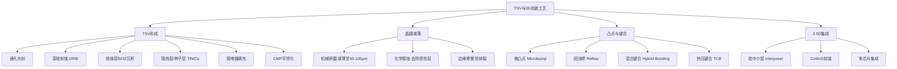
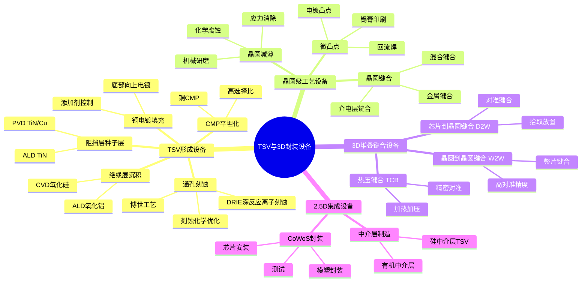
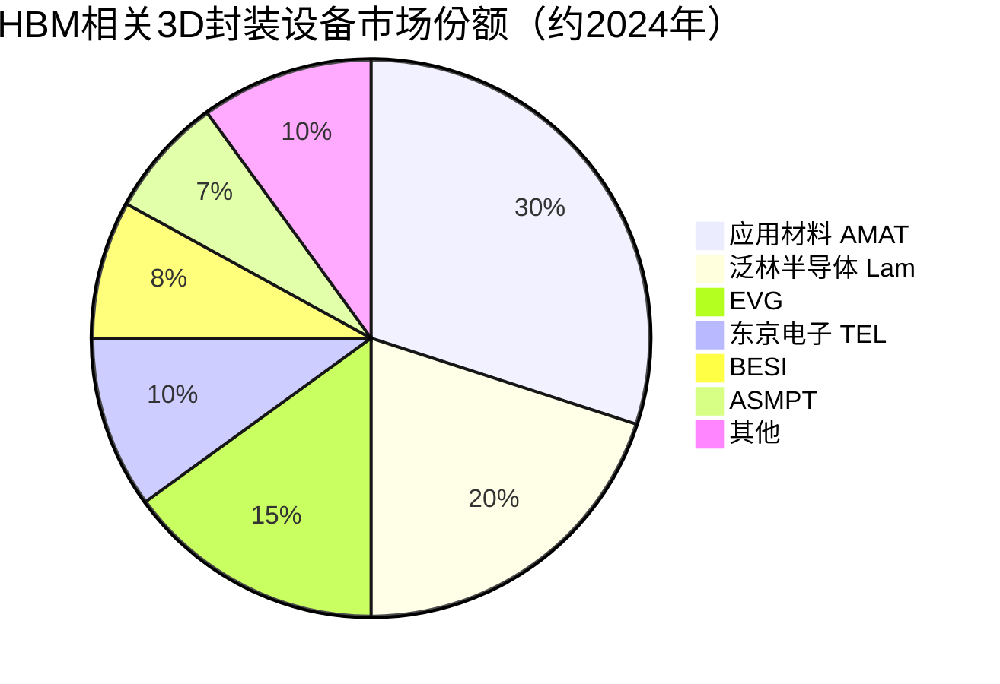

# TSV与3D封装设备

> TSV（硅通孔）与3D封装设备是HBM高带宽存储器制造的核心设备，涵盖硅通孔刻蚀、绝缘层沉积、铜填充、晶圆减薄、堆叠键合等关键工艺设备。

## 概述

TSV（Through-Silicon Via，硅通孔）技术是3D集成电路（3D IC）的核心使能技术，通过在硅晶圆上制作垂直贯穿的导电通孔，实现芯片间的高速垂直互连。TSV技术在HBM（高带宽存储器）中具有关键应用——HBM通过TSV将多层DRAM芯片垂直堆叠，实现超高带宽和容量密度。HBM是AI算力芯片GPU的关键配套存储，TSV设备直接受益于AI基建浪潮。

3D封装设备涵盖TSV形成、晶圆级封装（WLP）、扇出型封装（FOPLP）、混合键合（Hybrid Bonding）、2.5D中介层封装等先进封装工艺设备。随着摩尔定律放缓，先进封装成为延续摩尔定律的重要路径，3D封装设备市场快速增长。

HBM的3D封装流程包括：DRAM晶圆TSV形成→晶圆减薄→微凸点形成→DRAM芯片堆叠键合→与逻辑芯片2.5D集成。每个步骤都需要专用设备。HBM3E的12-Hi堆叠和HBM4的16-Hi堆叠，对堆叠对准精度、键合强度和工艺一致性提出更高要求。混合键合技术在HBM4中预计将逐步替代微凸点互连，成为新一代堆叠技术。

## 技术原理

TSV技术的基本流程包括：TSV通孔刻蚀→绝缘层沉积→阻挡层/种子层沉积→铜电镀填充→CMP去除多余铜→晶圆减薄→凸点/键合。TSV贯穿整个硅片厚度，实现芯片正背面的电气连接。

**TSV通孔刻蚀** 采用深反应离子刻蚀（DRIE），利用博世工艺在高深宽比下实现垂直通孔。TSV的直径通常为5-10μm，深度为50-100μm（对应减薄后的晶圆厚度），深宽比为5:1到20:1。相比3D NAND存储孔的深宽比（60:1+），TSV的深宽比较低，但通孔直径更大，刻蚀均匀性和侧壁粗糙度控制是关键。

**绝缘层和种子层沉积** 在TSV侧壁沉积氧化硅作为绝缘层，然后沉积TiN/TaN作为铜扩散阻挡层，再沉积Cu种子层。由于TSV的高深宽比，共形沉积是关键挑战，ALD技术在阻挡层沉积中日益重要。

**铜电镀填充** 是TSV工艺的核心难点。铜电镀需要完全填充TSV通孔，避免空洞（Void）缺陷。采用底部向上（Bottom-Up）电镀工艺，通过添加剂控制铜离子的沉积速率分布，实现无空洞填充。电镀设备包括晶圆级电镀系统和专用化学品供应。

**晶圆减薄** 将晶圆从原始厚度（约775μm）减薄到50-100μm，使TSV暴露出来。减薄采用机械研磨+化学腐蚀的组合，先通过粗磨和精磨去除大部分材料，再通过化学腐蚀去除研磨损伤层，最后进行边缘修整防止碎片。

**堆叠键合** 是HBM的核心工艺。当前主流采用微凸点（Microbump）+热压键合（TCB）方案，在DRAM芯片表面制作5-10μm的铜微凸点，通过加热加压实现芯片间互连。混合键合（Hybrid Bonding）是下一代技术，将介电层键合和金属键合同时完成，无需凸点，互连间距可缩小到1μm以下。

## 分类与技术路线

## 市场格局

全球TSV与3D封装设备市场规模约60-80亿美元/年，其中HBM相关设备约30-40亿美元。先进封装设备市场快速增长，2024-2027年复合增长率预计超过15%。主要设备供应商包括应用材料（AMAT）、泛林半导体（Lam）、ASML（光刻）、东京电子（TEL）、EVG（键合）、BESI（键合）、ASM Pacific（封装）等。

HBM专用设备市场高度集中于少数厂商。TSV刻蚀设备主要由泛林半导体和应用材料供应；铜电镀设备由应用材料（AMAT）主导；混合键合设备由EVG和应用材料主导。台积电作为HBM封装的代工方（CoWoS封装），其先进封装产能是HBM出货的瓶颈。

中国TSV与3D封装设备国产化进展相对较快。长电科技、通富微电、华天科技等封测企业在先进封装领域积极布局。设备方面，新益昌在固晶机领域有所突破，ASMPT（被中国收购）在封装设备领域全球领先。芯碁微装在直写光刻领域有应用。但高端混合键合设备和TSV电镀设备仍主要依赖进口。

## 代表企业

| 企业 | 国家/地区 | 主要产品/技术 | 市场地位 |
|------|----------|-------------|---------|
| 应用材料 AMAT | 美国 | TSV电镀、CMP、键合 | 3D封装设备全面龙头 |
| 泛林半导体 Lam | 美国 | TSV深硅刻蚀 | TSV刻蚀设备领先者 |
| EVG | 奥地利 | 晶圆键合、混合键合 | 键合设备全球龙头 |
| BESI | 荷兰 | 芯片键合、TCB | 先进封装键合设备商 |
| 东京电子 TEL | 日本 | 涂胶显影、电镀 | 日系封装设备商 |
| ASMPT | 新加坡/中国 | 固晶机、封装设备 | 全球封测设备龙头 |
| 台积电 TSMC | 中国台湾 | CoWoS封装代工 | HBM封装关键代工方 |
| 新益昌 Newco | 中国 | 固晶机 | 国产固晶机龙头 |
| 长电科技 JCET | 中国 | 先进封装代工 | 中国封测龙头 |
| 芯碁微装 Ubec | 中国 | 直写光刻 | 国产直写光刻设备 |

## 发展趋势

**1. 混合键合技术加速导入。** 混合键合替代微凸点互连是3D封装的发展方向。HBM4预计将采用混合键合技术，实现更细的互连间距和更高的带宽密度。混合键合设备市场有望从5亿美元增长到20亿美元以上。

**2. TSV尺寸缩小。** HBM的TSV直径从当前的6-8μm向3-5μm缩小，提升互连密度。这对深硅刻蚀的精度和铜电镀的填充能力提出更高要求。

**3. 3D堆叠层数增加。** HBM从8-Hi堆叠向12-Hi和16-Hi发展，堆叠对准精度要求提升。芯片到晶圆（D2W）键合的对准精度需从1μm级提升到0.5μm以下。

**4. CoWoS封装产能扩张。** 台积电的CoWoS封装是HBM出货的瓶颈，台积电持续扩充CoWoS产能。2024-2026年CoWoS产能预计翻倍，带动相关封装设备投资。

**5. 国产先进封装设备突破。** 中国封测企业在先进封装领域积极追赶，长电科技、通富微电等在2.5D封装领域有所布局。设备方面，新益昌在固晶机领域实现部分国产替代。

## AI基建拉动分析

AI基建浪潮对TSV与3D封装设备市场的拉动是最直接、最显著的。HBM是AI算力芯片GPU的核心配套存储，每颗NVIDIA H100 GPU需要6颗HBM3（每颗4层DRAM堆叠），H200需要6颗HBM3E（每颗8层堆叠），B200需要8颗HBM3E。HBM的需求量随AI算力芯片出货量成比例增长。

HBM的制造高度依赖TSV和3D封装设备。每颗HBM芯片需要：TSV深硅刻蚀→绝缘层沉积→铜电镀填充→CMP→晶圆减薄→微凸点形成→多层堆叠键合→CoWoS封装。HBM3E的8-Hi堆叠需要8次堆叠键合，HBM4的12-Hi/16-Hi堆叠将需要更多键合步骤。HBM出货量增长直接带动TSV和3D封装设备需求。

混合键合技术在HBM4中的导入是重要增量市场。混合键合设备单价高达500-1000万美元，是封装设备中价值量最高的类别。从微凸点向混合键合的切换将带来数十亿美元的设备更新需求。

从投资角度，TSV与3D封装设备是AI存储设备投资中增长最快、弹性最大的细分领域。应用材料、泛林半导体、EVG等设备商直接受益于HBM产能扩张和混合键合技术导入。台积电作为HBM封装代工方，其CoWoS产能扩张是HBM出货的关键变量。中国先进封装设备和封测企业（长电科技、通富微电、新益昌等）在国产替代趋势下也具有长期投资价值。

---
[← 返回总目录](../README.md)
