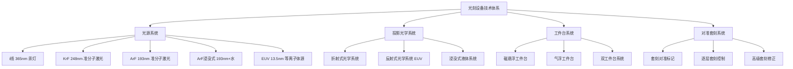
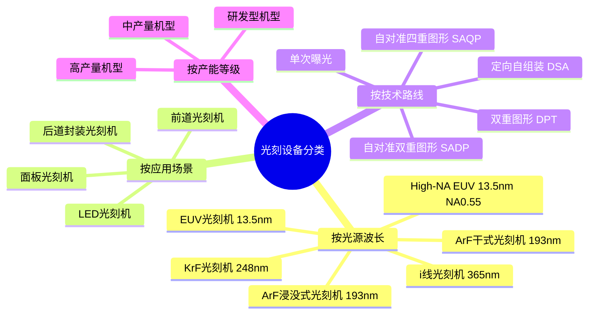
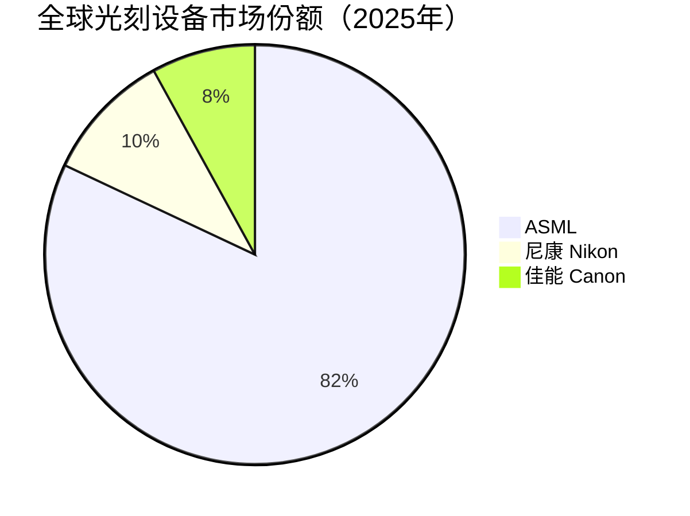

# 光刻设备

> 光刻设备是存储芯片制造中最核心、最昂贵的工艺设备，利用光化学反应将电路图形从掩模版转移到晶圆表面的光刻胶上，决定芯片的最小特征尺寸和集成密度。

## 概述

光刻是半导体制造中工艺步骤最多、成本最高的环节。在存储芯片制造中，光刻步骤约占总工艺步骤的30%-40%，光刻设备投资约占整条产线设备投资的30%。3D NAND由于堆叠层数增加，光刻步骤从2D时代的约20-30步增加到100步以上，光刻设备需求量大幅增加。DRAM向1a/1b nm节点推进，逐步引入EUV光刻技术。

存储芯片光刻与逻辑芯片光刻在技术路线上有显著差异。逻辑芯片追求最小线宽，大量采用EUV光刻；存储芯片则在关键层（如DRAM存储单元的活性区、位线、字线）采用ArF浸没式光刻或EUV光刻，非关键层（如3D NAND的层间介质层通孔）使用i线光刻。3D NAND的核心挑战不在于线宽缩小，而在于多层堆叠中的套刻精度和层间对准。

全球光刻设备市场高度垄断，ASML（荷兰）是EUV光刻机的唯一供应商，ArF浸没式光刻机领域ASML、尼康、佳能三家竞争。中国光刻设备国产化由上海微电子（SMEE）主导，目前国产光刻机主要在i线/KrF级别，ArF浸没式光刻机处于研发验证阶段。

## 技术原理

光刻工艺的基本流程为：涂胶→前烘→曝光→后烘→显影→坚膜。曝光是核心步骤，光源通过掩模版和光学投影系统将图形转移到光刻胶上。光刻分辨率由瑞利公式决定：R = k₁·λ/NA，其中λ为光源波长，NA为投影镜头数值孔径，k₁为工艺因子。

**光源波长** 决定光刻分辨率。i线光源（365nm）用于非关键层，KrF（248nm）用于次关键层，ArF（193nm）用于关键层。ArF浸没式光刻在镜头和晶圆间注入超纯水（n=1.44），等效NA提升至1.35，实现38nm以下分辨率。EUV光刻使用13.5nm极紫外光，采用反射式光学系统，实现13nm以下分辨率。

**双重图形技术（DPT）** 是在没有EUV的情况下实现更小节点的关键技术。通过将一次光刻分解为两次光刻，每次定义一半图形，两次叠加实现更密的图形分布。自对准双重图形（SADP）和自对准四重图形（SAQP）技术进一步将图形密度提升2倍和4倍，被广泛用于DRAM和3D NAND制造。

**3D NAND特殊光刻需求** 在于多层堆叠的套刻精度。3D NAND从128层到232层再到300层以上，每层都需要精确对准，层间累积偏差必须控制在极小范围内。此外，3D NAND的楼梯结构（stair-case）光刻采用多次重复曝光形成阶梯状图形，光刻步骤数量大幅增加。

## 分类与技术路线

## 市场格局

2025年全球半导体设备总销售额达**1255亿美元**（新纪录，+约10%），其中光刻设备市场规模约250-280亿美元/年，EUV光刻机约100-120亿美元。ASML 2025年营收约**372亿美元**，在全球半导体设备排名第一，在光刻设备市场占据绝对垄断地位，尤其在ArF浸没式和EUV光刻机领域市占率超过80%。尼康和佳能在ArF干式和i线光刻机领域有一定份额，佳能还推出了纳米压印光刻（NIL）技术作为低成本替代方案。

中国光刻设备国产化处于攻坚阶段，中国设备国产化率从11.3%升至25%。上海微电子（SMEE）是国产光刻机的主力承担单位，其SSA600/20步进扫描投影光刻机可实现90nm工艺。上海微电子在ArF浸没式光刻机领域持续研发，但与国际先进水平仍有较大差距。此外，芯碁微装在直写光刻（无掩模光刻）领域有所布局，主要面向PCB和封装应用。

## 代表企业

| 企业 | 国家/地区 | 主要产品/技术 | 市场地位 |
|------|----------|-------------|---------|
| ASML | 荷兰 | EUV、ArF浸没式光刻机 | 全球光刻设备绝对龙头 |
| 尼康 Nikon | 日本 | ArF干式、i线光刻机 | 日系光刻机代表 |
| 佳能 Canon | 日本 | i线光刻机、纳米压印NIL | 封装/成熟制程光刻 |
| 上海微电子 SMEE | 中国 | i线/KrF光刻机 | 中国光刻机主力 |
| 芯碁微装 Ubec | 中国 | 直写光刻、LDI | 国产直写光刻领先 |
| 茂莱光学 MOLAI | 中国 | 光学元件 | 光刻光学元件供应 |
| 蔡司 ZEISS | 德国 | 光学镜头 | ASML EUV光学系统合作伙伴 |
| Cymer | 美国 | 光源系统 | ASML子公司，光源供应 |
| 彤程电子 RPT | 中国 | 光刻胶 | 国产光刻胶代表 |
| 华卓精科 Huazhuo | 中国 | 双工件台 | 国产光刻工件台 |

## 发展趋势

### 市场规模预测

| 年份 | 市场规模 | 同比增长 | 备注 |
|------|---------|---------|------|
| 2024 | ~1140亿美元（半导体设备） | — | 基准年 |
| 2025 | 1255亿美元 | +约10% | 新纪录，ASML~372亿$(#1)，AMAT~270亿$(#2) |
| 2026E | ~1380亿美元 | +约10% | HBM4开发，DRAM EUV需求增加 |
| 2027E | ~1500亿美元 | +约9% | 产能释放，先进制程设备持续投入 |

> 光刻设备约占半导体设备投资30%。ASML EUV光刻机独家供应，存储芯片厂EUV需求占比提升。

**1. EUV光刻在存储中逐步导入。** DRAM 1a nm以下节点开始引入EUV光刻，三星、SK海力士率先在DRAM关键层采用EUV。3D NAND短期内仍以ArF浸没式为主，但超300层堆叠可能需要EUV辅助。

**2. High-NA EUV光刻机量产。** ASML的High-NA EUV光刻机（NA=0.55，型号EXE:5000系列）已开始交付，可实现8nm以下分辨率，主要用于2nm及以下逻辑制程，长期可能进入存储领域。

**3. 双重图形技术持续优化。** SADP/SAQP技术在存储芯片制造中广泛应用，工艺优化和成本控制是重点方向。定向自组装（DSA）技术作为低成本增强方案在研发推进。

**4. 纳米压印光刻（NIL）探索存储应用。** 佳能推出NIL技术，在DRAM和3D NAND的特定层应用具有成本优势，但工艺成熟度和缺陷率仍需改善。

**5. 国产光刻机持续攻坚。** 在ArF浸没式光刻机、EUV光刻机等高端领域，中国面临技术封锁和供应链限制。国产光刻机的突破需要光学系统、工件台、光源等各环节协同攻关。

## AI基建拉动分析

AI基建浪潮对光刻设备市场的拉动效应主要体现在DRAM先进制程和HBM产能扩张。2025年全球半导体设备销售1255亿美元创纪录，AI训练和推理对高性能DRAM的需求激增，推动DRAM制程从1Y nm向1a/1b nm节点升级，EUV光刻需求增加。三星和SK海力士在DRAM EUV光刻上的投入加大，ASML 2025年营收约372亿美元（#1），EUV光刻机订单中存储芯片厂需求占比提升。

HBM对光刻设备的需求拉动更为显著。HBM由多层DRAM芯片堆叠而成，相比普通DRAM需要更多的光刻步骤。HBM3E的大规模量产（SK海力士份额~62%，TSV产能150K）和HBM4的开发，使DRAM晶圆的光刻步骤和设备需求量增加。每颗HBM芯片包含4-8层甚至12-16层DRAM裸片，对DRAM晶圆的产能需求是普通DDR5的数倍。2025年DRAM市场约1290亿美元，NAND约650-925亿美元。

从投资角度看，光刻设备是半导体设备中价值量最高、技术壁垒最深的环节。ASML作为EUV光刻机独家供应商，是AI存储设备投资的核心标的。国产光刻设备虽然与国际先进水平有差距，但中国设备国产化率从11.3%升至25%，在国产替代大趋势下，上海微电子等国产光刻设备企业具有长期投资价值。光刻设备产业链中的光学元件、光源系统、工件台等关键环节也值得关注。

---
[← 返回总目录](../README.md)
