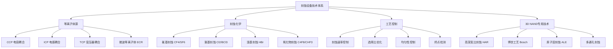
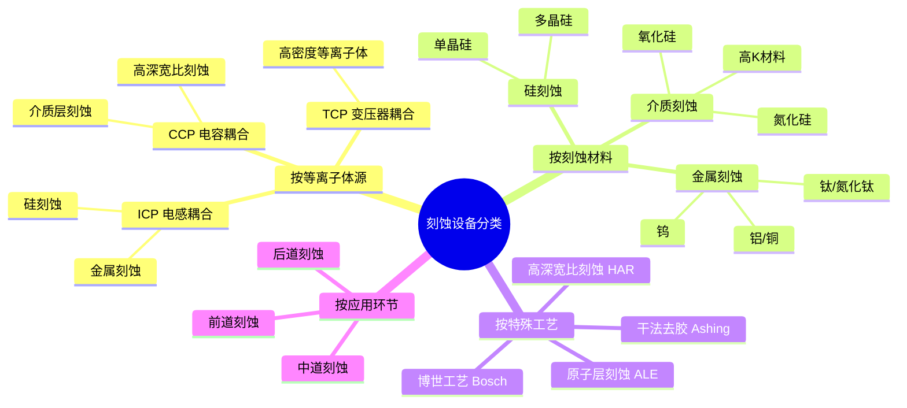
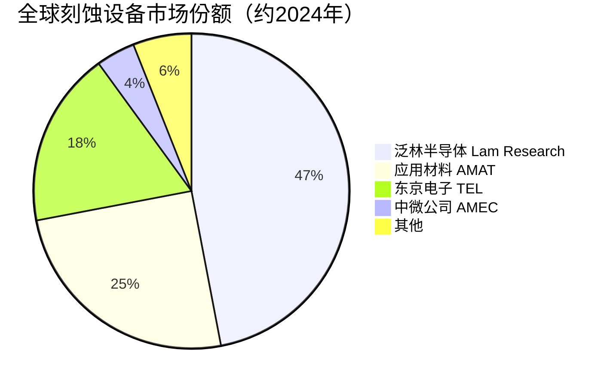

# 刻蚀设备

> 刻蚀设备是存储芯片制造中去除特定材料层、形成精细电路图形的关键设备，在3D NAND高深宽比刻蚀和DRAM精细图形刻蚀中发挥核心作用。

## 概述

刻蚀是半导体制造中继光刻之后的关键图形转移步骤。光刻在光刻胶上形成图案后，刻蚀将该图案转移到下方的材料层上。刻蚀设备在存储芯片制造中应用广泛，尤其在3D NAND制造中具有特殊重要性——3D NAND的存储单元通过交替沉积的多层薄膜经刻蚀形成，堆叠层数从128层增加到232层再到300层以上，对刻蚀设备的深宽比能力提出极高要求。

刻蚀设备按原理分为湿法刻蚀和干法刻蚀两大类。湿法刻蚀利用化学溶液溶解材料，工艺简单但各向同性，分辨率有限；干法刻蚀利用等离子体中的化学和物理作用去除材料，各向异性好、精度高，是现代存储芯片制造的主流。干法刻蚀按等离子体产生方式分为电容耦合等离子体（CCP）、电感耦合等离子体（ICP）和变压器耦合等离子体（TCP）等类型。

全球刻蚀设备市场高度集中，泛林半导体（Lam Research）、应用材料（AMAT）、东京电子（TEL）三家占据约90%市场份额。中国企业中，中微公司（AMEC）在CCP刻蚀领域取得突破，北方华创（Naura）在ICP刻蚀领域持续追赶，已进入长江存储等国产存储芯片厂的供应链。

## 技术原理

刻蚀的基本原理是利用等离子体产生的活性自由基和离子对材料层进行化学和物理刻蚀。自由基提供化学刻蚀作用，实现高选择比；离子提供物理轰击作用，实现方向性（各向异性）。两者的协同作用使刻蚀同时具备高精度、高选择比和高方向性。

**高深宽比（HAR）刻蚀** 是3D NAND的核心技术。3D NAND的存储孔（Memory Hole）需要穿透128-300+层交替的氮化硅/氧化硅叠层，孔径仅数十纳米，深度达数微米，深宽比可达60:1到100:1以上。这要求刻蚀设备具备极高的等离子体密度控制能力和侧壁形貌控制能力。传统的连续刻蚀在如此高的深宽比下会产生侧壁粗糙、形貌扭曲等问题。

**博世工艺（Bosch Process）** 是解决高深宽比刻蚀的周期性刻蚀技术。其原理是在刻蚀步骤和钝化步骤之间交替切换：刻蚀步骤使用SF₆等离子体去除底部材料；钝化步骤使用C₄F₈在侧壁形成聚合物保护层。通过快速切换（每周期数秒），实现各向异性高深宽比刻蚀。博世工艺在3D NAND存储孔和存储沟槽刻蚀中广泛使用。

**原子层刻蚀（ALE）** 是刻蚀技术的前沿方向，借鉴原子层沉积（ALD）的自限制反应原理，实现原子级精度刻蚀。ALE通过循环交替进行表面改性和去除步骤，每次循环精确去除单层原子。ALE在先进DRAM和3D NAND的关键层刻蚀中逐步引入，实现更精确的尺寸控制和更低的刻蚀损伤。

## 分类与技术路线

## 市场格局

全球刻蚀设备市场规模约250-280亿美元/年，是半导体设备中价值量最大的环节之一。其中CCP刻蚀市场约80-100亿美元，ICP刻蚀市场约100-120亿美元。泛林半导体在CCP和ICP刻蚀领域均处于领先地位，应用材料在CCP刻蚀领域具有优势，东京电子在ICP刻蚀领域表现突出。

中国刻蚀设备国产化进展相对较快。中微公司在CCP刻蚀领域已实现5nm以下先进制程的量产应用，进入台积电、长江存储等客户的先进制程产线。北方华创在ICP刻蚀领域持续追赶，其Primo系列ICP刻蚀机已进入28nm以上成熟制程和存储芯片产线。中微公司的Primo系列CCP刻蚀机在3D NAND高深宽比刻蚀中表现优异，成为长江存储232层3D NAND产线的重要设备。

## 代表企业

| 企业 | 国家/地区 | 主要产品/技术 | 市场地位 |
|------|----------|-------------|---------|
| 泛林半导体 Lam Research | 美国 | CCP/ICP刻蚀、高深宽比刻蚀 | 全球刻蚀设备龙头 |
| 应用材料 AMAT | 美国 | CCP刻蚀、刻蚀组合方案 | 全球第二大刻蚀设备商 |
| 东京电子 TEL | 日本 | ICP刻蚀、湿法刻蚀 | 日系刻蚀设备龙头 |
| 中微公司 AMEC | 中国 | CCP刻蚀、ICP刻蚀 | 国产刻蚀设备领先者 |
| 北方华创 Naura | 中国 | ICP刻蚀、去胶机 | 国产ICP刻蚀代表 |
| Hitachi High-Tech | 日本 | 干法刻蚀、湿法刻蚀 | 日系刻蚀设备商 |
| SPTS Technologies | 英国 | ICP刻蚀、等离子体处理 | 特种刻蚀设备商 |
| ULVAC | 日本 | 干法刻蚀、真空设备 | 真空刻蚀设备商 |
| 格兰达 Gason | 美国 | 去胶机、干法去胶 | 去胶设备领先者 |
|屹唐股份 E-town | 中国 | 干法去胶机 | 国产去胶设备代表 |

## 发展趋势

**1. 高深宽比刻蚀能力持续突破。** 3D NAND向300层乃至400层推进，要求刻蚀设备的深宽比能力从当前的60:1-80:1提升至100:1以上。设备厂商在等离子体源设计、脉冲调制、低温刻蚀等方面持续创新。

**2. 原子层刻蚀（ALE）加速导入。** ALE技术从实验室向量产过渡，在先进DRAM和3D NAND关键层刻蚀中逐步引入。ALE的精度优势和低损伤特性使其成为未来刻蚀技术的重要方向。

**3. 刻蚀与沉积工艺协同。** 3D NAND中刻蚀和沉积工艺紧密关联，如存储孔刻蚀后的孔内壁沉积（ONO层）。设备厂商提供刻蚀-沉积一体化的工艺方案，提升工艺效率和质量。

**4. 刻蚀选择性要求提升。** 随着工艺节点推进，刻蚀选择比（目标材料与非目标材料刻蚀速率比）要求从10:1提升到50:1以上，要求更精细的等离子体化学和工艺控制。

**5. 国产刻蚀设备份额提升。** 中微公司、北方华创在存储芯片刻蚀设备领域持续取得突破，国产刻蚀设备在长江存储、长鑫存储等国产存储厂的渗透率不断提升。

## AI基建拉动分析

AI基建浪潮对刻蚀设备市场的拉动极为显著。3D NAND是AI数据中心SSD的核心存储介质，AI数据增长推动3D NAND产能扩张和堆叠层数提升。每增加一层堆叠，刻蚀步骤相应增加，设备需求量成比例增长。232层相比128层，刻蚀设备需求量增加约30%-40%。

HBM对刻蚀设备的需求拉动同样显著。HBM采用TSV（硅通孔）技术堆叠多层DRAM芯片，TSV的深硅刻蚀需要高深宽比ICP刻蚀设备。HBM3E的12-Hi堆叠需要更多的TSV通孔，HBM4的16-Hi堆叠将进一步增加TSV刻蚀需求。每颗HBM芯片的制造涉及数十道刻蚀步骤，是普通DRAM芯片刻蚀量的2-3倍。

从投资角度，刻蚀设备是存储设备投资中价值量最大的环节。泛林半导体、应用材料、东京电子三大设备商在AI存储设备投资中受益最为直接。国产刻蚀设备企业中微公司和北方华创在3D NAND高深宽比刻蚀和HBM TSV刻蚀领域持续突破，国产替代空间广阔。特别是中微公司的CCP刻蚀机在3D NAND存储孔刻蚀中性能优异，是国产存储设备投资的核心标的。

---
[← 返回总目录](../README.md)
