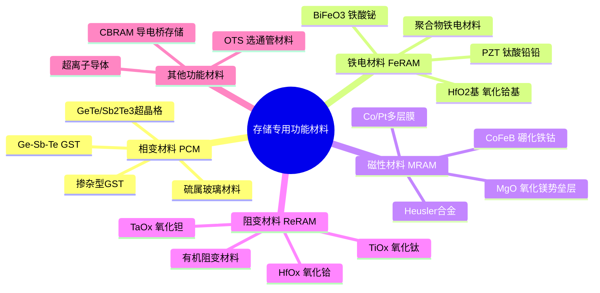
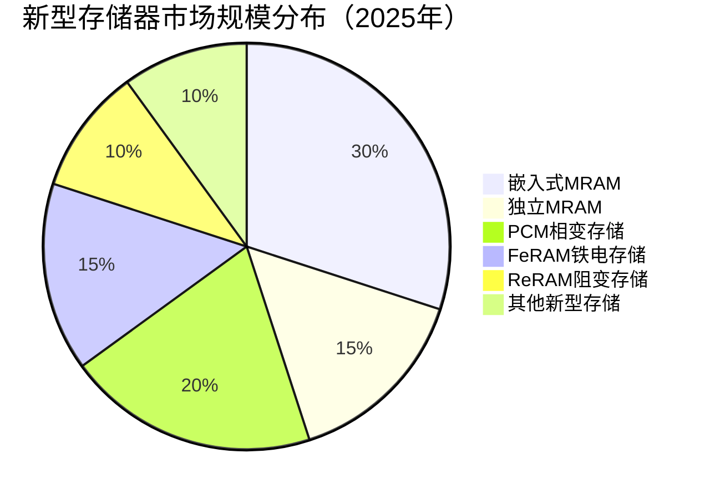

# 存储专用功能材料

> 存储专用功能材料是实现新型存储技术（PCM、MRAM、FeRAM、ReRAM）的核心功能材料，包括相变材料、铁电材料、磁性材料和阻变材料等。

## 概述

存储专用功能材料是支撑新型非易失性存储器发展的关键材料体系。与传统NAND Flash和DRAM依赖浮栅电荷存储和电容电荷存储不同，新型存储器利用材料本身的物理状态变化来实现数据存储：相变存储器（PCM）利用Ge-Sb-Te（GST）合金在晶态和非晶态之间的相变；磁性随机存储器（MRAM）利用磁性隧道结（MTJ）中磁化方向的变化；铁电随机存储器（FeRAM）利用铁电材料的极化方向；阻变存储器（ReRAM）利用金属氧化物中导电通道的形成和断裂。

这些功能材料赋予了新型存储器独特的性能优势：非易失性（断电不丢失）、高速写入（纳秒级）、高耐久性（10^10-10^12次写入）、低功耗等。新型存储器被视为"存储器终极形态"的有力候选，有望在特定应用场景替代DRAM和NAND。但目前受限于材料工艺成熟度、制造成本和规模化集成难度，新型存储器的商业化规模仍远小于主流存储器。

功能材料的研发和产业化是新型存储技术突破的核心。材料的组分控制、薄膜质量、界面特性直接决定器件性能。近年来，随着3D XPoint（Intel/Micron的PCM变种产品）的退出，MRAM在嵌入式应用中取得进展，ReRAM在存算一体芯片中展现潜力，功能材料的发展正进入新阶段。

## 技术原理

存储专用功能材料的核心原理是利用材料在外部激励（电、磁、热）下的可逆状态变化来存储数据。每种材料体系对应一种存储机制，各有优缺点。

```mermaid
graph TD
    A[存储专用功能材料] --> B[相变材料 PCM]
    A --> C[铁电材料 FeRAM]
    A --> D[磁性材料 MRAM]
    A --> E[阻变材料 ReRAM]
    
    B --> B1[Ge-Sb-Te GST合金]
    B --> B2[晶态↔非晶态相变]
    B --> B3[电阻差异存储数据]
    
    C --> C1[PZT Pb(Zr,Ti)O3]
    C --> C2[HfO2氧化铪基]
    C --> C3[极化方向存储数据]
    
    D --> D1[CoFeB磁性层]
    D --> D2[MgO势垒层]
    D --> C3[磁化方向存储数据]
    
    E --> E1[TaOx/HfOx]
    E --> E2[导电细丝形成/断裂]
    E --> E3[电阻变化存储数据]
```

**相变材料（PCM）** 以Ge₂Sb₂Te₅（GST）为代表，利用材料在晶态（低电阻）和非晶态（高电阻）之间的可逆相变来存储数据。写入时通过电脉冲加热：高强度短脉冲使材料熔化后快速冷却形成非晶态（RESET）；中等强度长脉冲使材料结晶化（SET）。读取时通过低强度脉冲测量电阻值。GST材料的相变速度快（纳秒级）、循环寿命高（10^12次），但RESET电流较大，功耗仍是挑战。

**磁性材料（MRAM）** 以CoFeB/MgO/CoFeB磁性隧道结（MTJ）为核心结构。通过外部磁场或自旋转移力矩（STT）改变自由层的磁化方向，当自由层与参考层磁化方向平行时电阻低（表示"0"），反平行时电阻高（表示"1"）。STT-MRAM具有高速（<10ns）、高耐久性（>10^14次）和非易失性，是最接近"通用存储器"的新型存储技术。

**铁电材料（FeRAM）** 以Pb(Zr,Ti)O₃（PZT）和HfO₂基材料为代表。铁电材料具有自发极化特性，极化方向在外电场作用下可翻转，用于存储数据。传统PZT基FeRAM受限于铅污染和薄膜质量，HfO₂基铁电材料（如Si掺杂HfO₂）的发现为FeRAM提供了CMOS兼容的新路线。

**阻变材料（ReRAM）** 以TaOx、HfOx等过渡金属氧化物为代表。通过电场在氧化物中形成和断裂导电细丝（氧空位或金属离子聚集），实现高阻态和低阻态之间的切换。ReRAM结构简单、功耗低、易于3D集成，在存算一体芯片中具有应用潜力。

## 分类与技术路线



## 市场格局

2025年全球新兴存储市场规模约**94亿美元**（CAGR 18.6%），另一数据约30亿美元（CAGR 8.8%），相比DRAM（约1290亿美元）和NAND Flash（约650-925亿美元）仍属小众市场，但增速最快。其中嵌入式MRAM增长最快；PCM受3D XPoint退出影响有所收缩；FeRAM主要在汽车和工业领域应用；ReRAM仍处于商业化早期，但在存算一体芯片中展现潜力。2035年预测市场规模达77-490亿美元。

功能材料市场高度专业化，供应商通常为材料企业和存储芯片企业联合开发的定制化产品。PCM材料方面，美光/Intel曾开发3D XPoint，目前仅三星、SK海力士等有PCM研究布局。MRAM材料方面，美国陶氏电子材料、日本信越化学等提供CoFeB靶材。FeRAM材料方面，HfO₂基铁电材料成为研究热点，多家设备商和材料商积极布局。



## 代表企业

| 企业 | 国家/地区 | 主要产品/技术 | 市场地位 |
|------|----------|-------------|---------|
| Everspin | 美国 | STT-MRAM独立芯片 | 全球独立MRAM龙头 |
| 三星 Samsung | 韩国 | STT-MRAM、嵌入式MRAM | 嵌入式MRAM领先者 |
| 台积电 TSMC | 中国台湾 | 嵌入式MRAM代工 | 先进制程MRAM代工 |
| GlobalFoundries | 美国 | eMRAM嵌入式存储 | 22FDX平台MRAM |
| Crossbar | 美国 | ReRAM技术 | ReRAM技术领先者 |
| TSMC/WD联合 | 中国台湾 | ReRAM嵌入式 | 40nm ReRAM工艺 |
| Panasonic | 日本 | ReRAM TaOx | ReRAM量产先行者 |
| 陶氏化学 Dow | 美国 | CoFeB磁性靶材 | MRAM材料领先供应商 |
| 信越化学 Shin-Etsu | 日本 | 磁性材料、靶材 | 多种功能材料供应 |
| 中芯国际 SMIC | 中国 | 嵌入式MRAM/ReRAM | 国产新型存储代工 |
| 兆易创新 GigaDevice | 中国 | NOR Flash/新型存储 | 国产存储芯片领先者 |

## 发展趋势

### 市场规模预测

| 年份 | 市场规模 | 同比增长 | 备注 |
|------|---------|---------|------|
| 2024 | ~79亿美元 | — | 基准年（新兴存储） |
| 2025 | 94亿美元 | +约19% | STT-MRAM量产化，存算一体兴起 |
| 2026E | ~111亿美元 | +约18% | AI推理拉动ReRAM存算一体商业化 |
| 2027E | ~132亿美元 | +约19% | CXL内存池化，嵌入式MRAM在MCU渗透 |

> CAGR 18.6%（2025-2035），2035年预测77-490亿美元。主要技术：MRAM、ReRAM、PCM、FeRAM。

**1. 嵌入式MRAM加速商业化。** STT-MRAM作为嵌入式非易失存储，在MCU、IoT芯片中替代eFlash的优势明显。三星、台积电在28nm/22nm工艺节点提供嵌入式MRAM选项，汽车MCU是主要应用场景。

**2. HfO₂基铁电材料成为热点。** HfO₂基铁电材料的发现使FeRAM与CMOS工艺兼容成为可能，铁电HfO₂（FeFET）存储器有望在28nm以下先进制程实现嵌入式集成。

**3. ReRAM在存算一体中展现潜力。** ReRAM的模拟阻变特性使其适合模拟存内计算，在AI推理加速器中具有应用前景。清华大学、悉尼大学等研究团队的ReRAM存算一体芯片已取得突破性成果。

**4. 材料工程优化持续推进。** 通过掺杂、界面工程、超晶格结构等手段优化功能材料性能。如GST超晶格结构降低RESET电流，CoFeB硼含量优化提升TMR比率。

**5. 3D集成新型存储探索。** 借鉴3D NAND的堆叠思路，探索3D PCM、3D ReRAM等新型存储的垂直集成架构，以提升存储密度。

## AI基建拉动分析

AI基础设施建设对存储专用功能材料的拉动主要体现在两个维度。一是新型存储器在AI边缘推理场景的应用潜力，二是存算一体技术的商业化前景。AI推理对低功耗、高能效存储的需求，为MRAM、ReRAM等新型存储器在边缘AI芯片中的嵌入式应用创造了市场机会。

存算一体被视为突破"存储墙"瓶颈、提升AI系统能效的关键技术路径。ReRAM和PCM的模拟阻变特性使其适合实现模拟存内计算（CIM），在矩阵乘法运算中实现"存储即计算"的效果，大幅降低数据搬运功耗。多家AI芯片初创公司正在基于ReRAM/PCM开发存算一体AI加速器，若技术成熟并规模化商用，将带动功能材料需求大幅增长。

此外，HBM等AI核心存储技术在向HBM4演进过程中，也在探索引入新型存储技术的可能性。如三星的HBM-PIM方案在HBM内部嵌入计算单元，SK海力士探索AiM方案等，这些创新为功能材料在高端存储中的应用开辟了新空间。

---
[← 返回总目录](../README.md)
