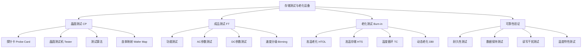
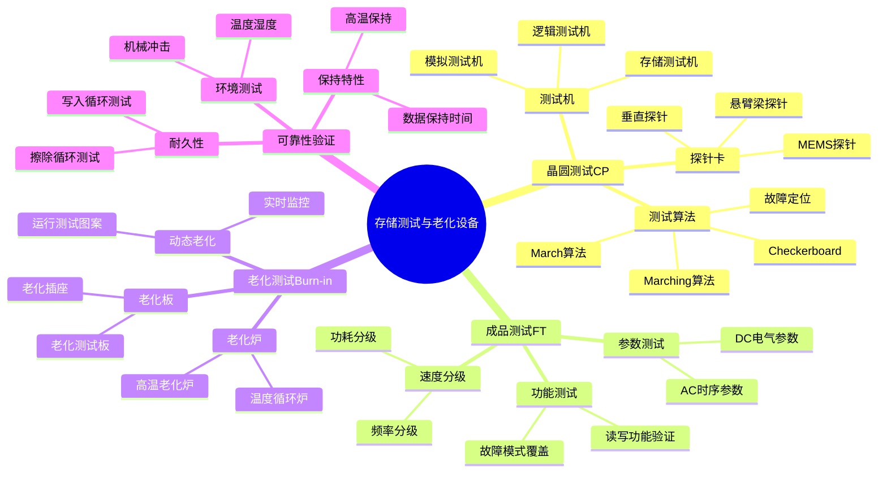
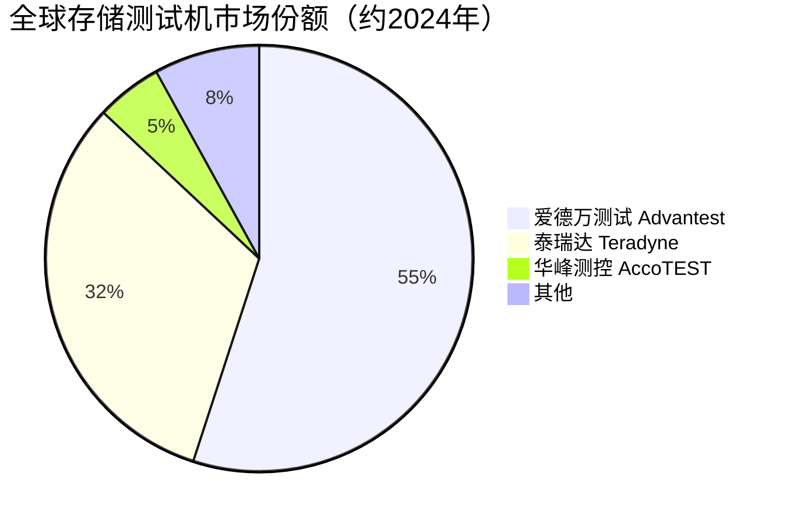

# 存储测试与老化设备

> 存储测试与老化设备是存储芯片制造后道的质量保障设备，涵盖晶圆级测试、老化测试、成品测试和可靠性验证等环节，确保存储芯片在出厂前满足性能和可靠性要求。

## 概述

存储测试是存储芯片制造的最后环节，也是产品质量和良率的最终把关。存储芯片的测试相比逻辑芯片更为复杂，需要验证存储单元的读写功能、数据保持特性、访问速度、功耗等多个维度。3D NAND的高层数堆叠和HBM的多层堆叠架构，使测试时间和测试成本显著增加——3D NAND的测试时间可达普通逻辑芯片的3-5倍。

存储测试设备按测试环节分为前道测试（CP，晶圆探针测试）和后道测试（FT，成品测试）。CP测试在晶圆切割前通过探针卡接触芯片焊盘进行功能测试，筛选出不良裸片；FT测试在封装后对成品芯片进行完整功能和性能测试。老化测试（Burn-in）是将芯片在高温高压条件下长时间运行，筛选早期失效芯片，确保长期可靠性。

存储测试设备市场由爱德万测试（Advantest）、泰瑞达（Teradyne）两大测试设备巨头主导，两家合计份额超过85%。老化测试设备市场由台湾日月光、韩国AMS等企业占据。探针卡市场由台湾旺硅、日本Micronics、美国FormFactor等企业供应。

AI存储浪潮对测试设备市场拉动显著。HBM芯片的多层堆叠和高速接口使测试复杂度倍增，需要专用的高速测试设备和堆叠测试方案。3D NAND的高层数和QLC（4比特/单元）技术使测试时间大幅增加，带动测试设备需求增长。

## 技术原理

存储测试的核心是通过施加特定的电压和时序信号，验证存储芯片的读写功能、数据保持和访问特性。存储芯片测试需要专门的测试算法，覆盖各种存储单元状态和边界条件。

**晶圆测试（CP测试）** 在晶圆切割前进行。探针卡上的探针与晶圆上每个芯片的焊盘接触，测试机通过探针施加电压和时序信号，测试芯片的存储功能。CP测试筛选出不良裸片，避免将不良品进入封装环节。3D NAND的CP测试需要专用的存储测试算法，覆盖所有存储单元的读写擦除操作，测试时间可能长达数十分钟。

**成品测试（FT测试）** 在封装后进行，包括功能测试、AC参数测试、DC参数测试和速度分级。功能测试验证芯片的读写功能正确性；AC参数测试测量访问时间、建立时间等时序参数；DC参数测试测量功耗、漏电流等电气参数；速度分级根据芯片的最高工作频率将其分为不同等级。

**老化测试（Burn-in）** 将芯片在高温（85°C-125°C）和高压条件下长时间运行（数十到数百小时），加速早期失效。老化测试筛选出制造缺陷导致的早期失效芯片，确保出厂芯片的长期可靠性。动态老化（DBI）在老化过程中同时运行测试图案，更有效地激发潜在缺陷。

**HBM专用测试** 包括堆叠测试和高速接口测试。HBM的多层DRAM堆叠架构使测试复杂度成倍增加——需要测试每层DRAM的功能，以及层间TSV互连的完整性。HBM的高速接口（1024位宽）需要专用的高速测试设备，测试带宽达1.2TB/s以上。

## 分类与技术路线

## 市场格局

全球存储测试与老化设备市场规模约50-60亿美元/年，其中测试机市场约30-35亿美元，老化设备市场约10-15亿美元，探针卡市场约8-10亿美元。爱德万测试和泰瑞达两大巨头合计占据测试机市场85%以上份额，爱德万在存储测试领域优势更为突出。

老化测试设备市场由台湾日月光/ASE、韩国AMS、日本Tokyo Electron等企业供应。探针卡市场中，台湾旺硅（FormFactor）、日本Micronics、美国FormFactor是主要供应商。随着3D NAND层数增加和HBM高速接口测试需求，探针卡的技术要求和价值量持续提升。

中国存储测试设备国产化率较低。华峰测控在模拟和数模混合测试机领域有所突破，但存储测试机仍主要依赖进口。长川科技、精测电子在存储测试设备领域积极布局。老化设备国产化率也较低，主要依赖台湾和韩国供应商。

## 代表企业

| 企业 | 国家/地区 | 主要产品/技术 | 市场地位 |
|------|----------|-------------|---------|
| 爱德万测试 Advantest | 日本 | 存储测试机、逻辑测试机 | 全球测试设备龙头 |
| 泰瑞达 Teradyne | 美国 | 存储测试机、SoC测试机 | 全球测试设备第二 |
| 日月光 ASE | 中国台湾 | 老化测试、封装测试 | 全球封测龙头 |
| AMS | 韩国 | 老化测试设备 | HBM老化设备领先者 |
| FormFactor | 美国 | 探针卡 | 全球探针卡龙头 |
| 旺硅 MPI | 中国台湾 | 探针卡 | 探针卡主要供应商 |
| Micronics | 日本 | 探针卡 | 日系探针卡供应商 |
| 华峰测控 AccoTEST | 中国 | 模拟测试机 | 国产测试机代表 |
| 长川科技 Changchuan | 中国 | 测试机、分选机 | 国产测试设备商 |
| 精测电子 Jingce | 中国 | 存储测试设备 | 国产存储测试布局者 |

## 发展趋势

**1. 高速存储测试需求增长。** DDR5、LPDDR5X、HBM3E等高速存储器的接口速率持续提升，测试设备需要支持更高带宽的测试能力。HBM3E的1.2TB/s带宽对测试机的数据生成和采集能力提出极高要求。

**2. 3D NAND测试时间优化。** 3D NAND层数增加和QLC技术使测试时间大幅增长，测试时间已成为产能瓶颈。并行测试技术和测试算法优化是降低测试成本的关键方向。

**3. HBM堆叠测试方案创新。** HBM的多层堆叠架构需要专门的堆叠测试方案，包括已知良好裸片（KGD）测试、TSV互连测试、堆叠后功能测试等。测试设备厂商推出HBM专用测试方案。

**4. AI赋能测试优化。** 利用AI和机器学习技术优化测试流程、预测良率、定位故障。AI驱动的智能测试可减少测试时间20%-30%，提升测试效率。

**5. 老化测试需求升级。** 3D NAND和HBM的可靠性要求更高，老化测试条件更加严苛。动态老化（DBI）和系统级老化（SLT）在存储芯片测试中逐步导入。

## AI基建拉动分析

AI基建浪潮对存储测试与老化设备市场的拉动是多维度的。HBM是AI算力芯片的核心配套，HBM3E和HBM4的出货量增长直接带动存储测试设备需求。HBM的多层堆叠架构和高速接口使测试复杂度远高于普通DRAM，需要专用的高速测试设备和堆叠测试方案。每颗HBM芯片的测试时间可达普通DRAM的5-10倍，测试设备需求量成比例增长。

3D NAND作为AI数据中心SSD的核心存储介质，产能扩张和层数提升带动测试设备需求增长。232层3D NAND的测试时间约为128层的1.5-2倍，QLC技术进一步增加测试步骤。3D NAND测试设备市场预计2024-2027年复合增长率超过15%。

从投资角度，存储测试设备市场是AI存储设备投资中确定性较高的细分领域。爱德万测试作为全球存储测试机龙头，直接受益于HBM和3D NAND测试需求增长。泰瑞达在SoC测试领域优势突出，也受益于AI芯片测试需求。老化设备供应商中，韩国AMS在HBM老化设备领域具有先发优势。国产存储测试设备企业华峰测控、长川科技在国产替代趋势下具有长期成长空间，但高端存储测试机的国产化仍需较长时间。

---
[← 返回总目录](../README.md)
