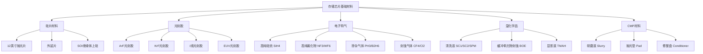
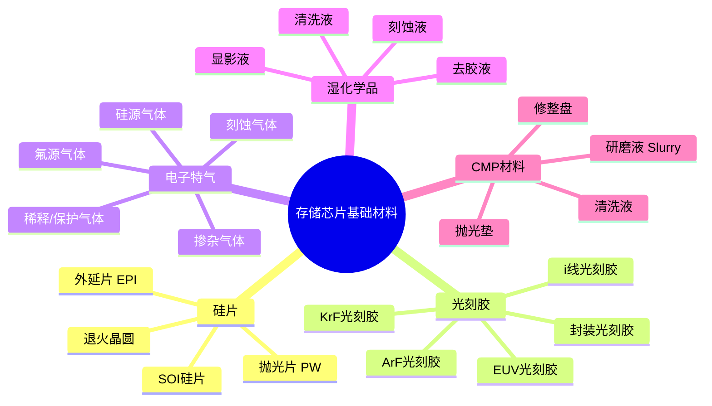
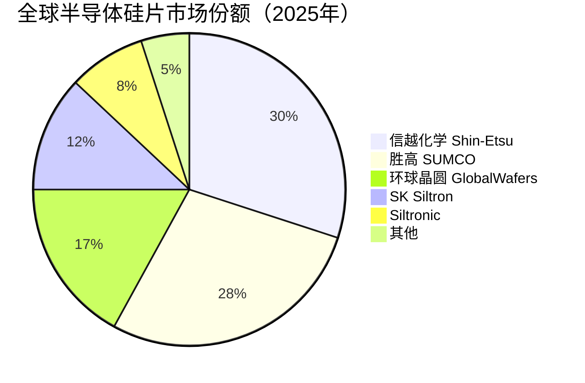

# 存储芯片基础材料

> 存储芯片基础材料是支撑DRAM、NAND Flash等存储芯片制造的上游核心材料，包括硅片、光刻胶、电子特气、湿化学品和CMP材料等。

## 概述

存储芯片基础材料是半导体材料在存储领域的具体应用，涵盖从晶圆制造到芯片成品的全流程材料需求。根据SEMI数据，全球半导体材料市场规模约700亿美元，其中存储芯片消耗占比约30%-35%，即约210-245亿美元。存储芯片由于产能需求大、工艺步骤多，对基础材料的消耗量和品质要求均高于一般逻辑芯片。

基础材料在存储产业链中处于最上游位置，具有技术壁垒高、认证周期长、客户粘性强的特点。每一类材料都需要经过存储芯片厂商长达1-2年的严苛认证才能进入供应链，一旦通过认证便形成稳定的供应关系。这使得基础材料市场呈现高度集中化特征，日本企业在硅片、光刻胶、电子特气等多个领域占据主导地位，美国企业在CMP材料领域领先，中国市场占有率整体偏低但提升空间巨大。

在3D NAND向232层乃至300层以上演进、DRAM向1a/1b nm节点推进的过程中，基础材料面临更高的技术要求。更大的堆叠层数意味着更多的工艺循环和材料消耗；更小的制程节点要求光刻胶、电子特气等材料具备更高的纯度和更精确的工艺控制能力。AI基建浪潮带动的存储产能扩张和制程升级，为基础材料市场带来量价齐升的增长机遇。

## 技术原理

存储芯片基础材料贯穿整个前道制造流程，每种材料在特定工艺步骤中发挥关键作用。硅片是所有芯片的衬底基板，其晶体质量直接影响器件性能；光刻胶用于光刻工艺中形成图案转移的掩膜；电子特气用于薄膜沉积、刻蚀和掺杂工艺；湿化学品用于晶圆清洗和湿法刻蚀；CMP材料用于化学机械平坦化。

硅片是存储芯片的基础衬底。存储芯片主要使用12英寸（300mm）硅片，要求达到9N-11N（99.9999999%-99.999999999%）超高纯度。硅单晶通过直拉法（CZ法）生长，经切磨抛等工序制成镜面级抛光片。3D NAND由于层数增加导致工艺热预算升高，对硅片的氧含量和晶体缺陷控制要求更加严格。

光刻胶是光刻工艺中实现图形转移的关键材料。存储芯片制造中，ArF光刻胶用于关键层图形定义，i线光刻胶用于非关键层。随着3D NAND层数增加，光刻步骤从约60-70步增加到100步以上，光刻胶消耗量大幅增加。EUV光刻在DRAM先进制程中逐步引入，对EUV光刻胶（金属氧化物型、聚分子型）提出新需求。

## 分类与技术路线

基础材料按工艺功能分为五大类。硅片是最基础的衬底材料，全球市场约120-130亿美元，日本信越化学和胜高SUMCO两家占据约60%市场份额。光刻胶市场规模约45-50亿美元，JSR、东京应化、信越化学、住友化学等日本企业占据约80%份额。电子特气市场规模约55-60亿美元，空气化工、林德、法液空等国际气体巨头主导。湿化学品市场规模约30-35亿美元，巴斯夫、英特格、Stella等企业领先。CMP材料市场规模约30-35亿美元，卡博特、陶氏、 Versum等企业占据主要份额。

## 市场格局

全球半导体材料市场高度集中，日本企业在多个关键领域占据主导。2025年全球半导体材料市场随存储扩产持续增长，硅片领域，信越化学（日本）和胜高SUMCO（日本）合计份额约60%；光刻胶领域，JSR、东京应化、信越化学、住友化学四家日本企业合计份额约80%，其中**日本企业合计92%，EUV光刻胶日本100%**；电子特气领域，美国空气化工、德国林德、法国法液空等欧美巨头合计份额约70%。

中国基础材料国产化率整体偏低，但在AI存储扩产拉动下加速提升，设备国产化率从11.3%升至25%。硅片领域，沪硅产业、中环领先等企业已实现12英寸硅片量产，但市占率仍不足5%。光刻胶领域，南大光电、上海新阳等在ArF光刻胶实现突破，但量产规模仍小。电子特气国产化率相对较高，华特气体、金宏气体等在部分特气品种实现替代。CMP材料方面，安集科技在研磨液领域取得突破，鼎龙股份在抛光垫领域实现国产替代。

## 代表企业

| 企业 | 国家/地区 | 主要产品/技术 | 市场地位 |
|------|----------|-------------|---------|
| 信越化学 Shin-Etsu | 日本 | 硅片、光刻胶、电子特气 | 全球最大硅片厂商 |
| 胜高 SUMCO | 日本 | 12英寸硅片 | 全球第二大硅片厂商 |
| JSR | 日本 | ArF/EUV光刻胶 | 全球领先光刻胶厂商 |
| 东京应化 TOK | 日本 | 光刻胶、材料 | 全球最大光刻胶厂商 |
| 空气化工 Air Products | 美国 | 电子特气 | 全球电子特气龙头 |
| 林德 Linde | 德国 | 电子特气、大宗气体 | 全球工业气体巨头 |
| 卡博特 Cabot | 美国 | CMP研磨液 | 全球CMP材料龙头 |
| 陶氏化学 Dow | 美国 | CMP材料、光刻胶 | 多领域材料领先 |
| 沪硅产业 ZING | 中国 | 12英寸硅片 | 中国硅片龙头 |
| 安集科技 Anji | 中国 | CMP研磨液 | 国产CMP研磨液领先者 |
| 南大光电 Nata | 中国 | ArF光刻胶、前驱体 | 国产光刻胶先行者 |
| 华特气体 Huate | 中国 | 电子特气 | 国产电子特气领先者 |

## 发展趋势

### 市场规模预测

| 年份 | 市场规模 | 同比增长 | 备注 |
|------|---------|---------|------|
| 2024 | ~700亿美元（半导体材料） | — | 基准年，存储消耗占30%-35% |
| 2025 | ~770亿美元 | +约10% | AI存储扩产拉动，设备销售1255亿美元创纪录 |
| 2026E | ~870亿美元 | +约13% | HBM4开发，3D NAND 300层+量产 |
| 2027E | ~960亿美元 | +约10% | 产能释放，材料需求持续增长 |

> 存储芯片消耗占半导体材料约30%-35%，即约230-270亿美元。光刻胶日本企业合计92%，EUV光刻胶日本100%。

**1. 材料纯度和精度要求持续提升。** 随着存储芯片制程节点缩小和堆叠层数增加，对各类基础材料的纯度、均匀性、缺陷控制要求不断提高。硅片缺陷控制从纳米级向亚纳米级演进，光刻胶分辨率要求提升至EUV级别。

**2. 3D NAND堆叠驱动材料消耗量增长。** 每增加一层堆叠，对应的光刻、刻蚀、沉积、CMP等工艺步骤相应增加，各类材料消耗量成比例增长。232层相比128层，单晶圆材料消耗量增加约30%-50%。

**3. 国产替代进程加速。** 在中美科技博弈背景下，中国存储厂商加速导入国产材料。长江存储、长鑫存储等国产存储芯片企业对国产材料的认证和导入力度加大，基础材料国产化率从5%-10%向20%-30%提升。

**4. 新型材料体系涌现。** EUV光刻胶（金属氧化物型）、高K电介质前驱体、新型CMP研磨液等针对先进制程的新材料不断涌现，为材料企业带来新增长点。

**5. 材料供应链本地化趋势。** 存储芯片厂为降低供应链风险，推动材料供应链本地化。各区域市场出现区域性材料供应商，但核心技术和高端产品仍由国际巨头主导。

## AI基建拉动分析

AI基础设施建设带动存储芯片产能大幅扩张和制程升级，为基础材料市场带来显著的量价齐升机遇。HBM是AI存储需求的核心，HBM3E相比HBM2E的DRAM芯片面积更大、堆叠层数更多，单颗HBM芯片的材料消耗量是普通DRAM的2-3倍。同时，AI数据中心建设拉动企业级SSD需求，直接带动3D NAND产能扩张和材料消耗增长。

从技术升级角度，AI存储向更高密度、更高带宽演进，对基础材料提出更高技术要求。HBM采用TSV堆叠封装，需要新型键合材料和中介层材料；3D NAND向300层以上推进，要求更高纯度的刻蚀气体和更精密的CMP研磨液。这些技术升级使材料供应商的产品附加值提升。

从投资价值看，基础材料环节具有"一旦认证，长期稳定"的客户粘性优势。AI存储浪潮中率先通过认证、切入供应链的材料供应商将获得持续增长红利。中国基础材料企业在国产替代大趋势下，受益于长江存储、长鑫存储等国产存储芯片厂商的材料导入，增长空间尤为广阔。

---
[← 返回总目录](../README.md)
