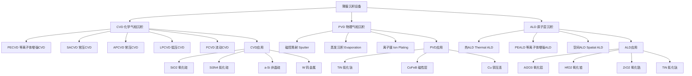
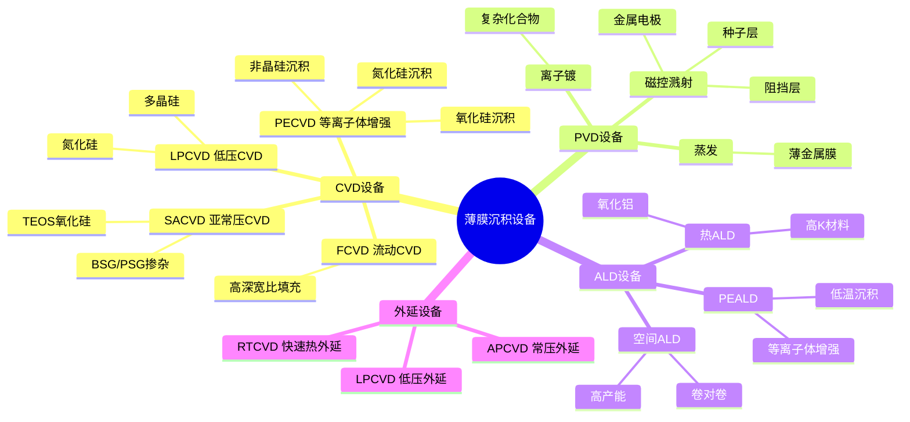
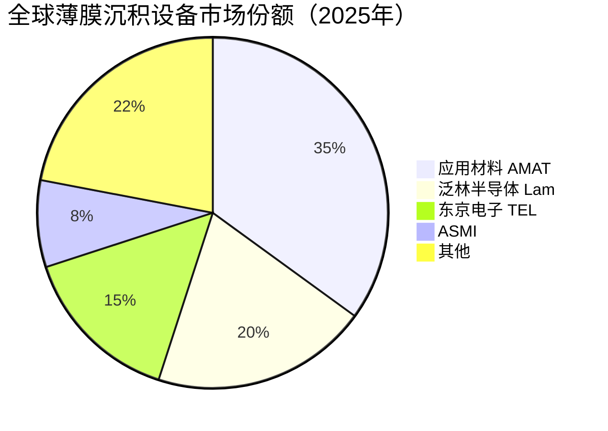

# 薄膜沉积设备

> 薄膜沉积设备是存储芯片制造中在晶圆表面生长各种功能薄膜材料的关键设备，包括ALD（原子层沉积）、CVD（化学气相沉积）和PVD（物理气相沉积）三大技术路线。

## 概述

薄膜沉积是存储芯片制造中工艺步骤最多的环节之一。3D NAND的ONIONI结构需要交替沉积氧化硅和氮化硅层，232层需要约116对交替层，每层都需要精密的薄膜沉积。DRAM的电容器件需要高K电介质薄膜，字线和位线需要钨或铜金属薄膜。3D NAND和DRAM对薄膜沉积设备的需求量很大，设备投资约占整条产线的20%-25%。

薄膜沉积设备按原理分为化学气相沉积（CVD）、物理气相沉积（PVD）和原子层沉积（ALD）三大类。CVD利用气相前驱体的化学反应在晶圆表面沉积薄膜，沉积速率快但均匀性和台阶覆盖性一般；PVD利用物理方法（溅射、蒸发）将靶材材料沉积到晶圆上，适合金属薄膜但台阶覆盖性差；ALD利用自限制表面反应逐原子层沉积，精度极高但速率慢。

ALD技术在3D NAND制造中具有不可替代的地位。3D NAND的ONO（Oxide-Nitride-Oxide）存储层需要在深孔内壁均匀沉积，只有ALD能实现高深宽比结构内的共形沉积。随着3D NAND层数增加和孔径缩小，ALD的工艺步骤和设备需求大幅增长。全球薄膜沉积设备市场由应用材料（AMAT）、泛林半导体（Lam）、东京电子（TEL）等国际设备商主导。

## 技术原理

薄膜沉积的核心原理是在晶圆表面通过化学或物理方式生长薄膜材料。不同沉积技术各有优缺点和适用场景，在存储芯片制造中根据薄膜类型和工艺要求选择。

**CVD（化学气相沉积）** 是最常用的薄膜沉积技术。气相前驱体在晶圆表面发生化学反应（热解或氧化还原），生成固态薄膜。PECVD（等离子体增强CVD）利用等离子体降低反应温度，适合低温工艺。LPCVD（低压CVD）在低压下沉积，均匀性和台阶覆盖性好，用于3D NAND的氧化硅和氮化硅层沉积。SACVD（亚常压CVD）用于高台阶覆盖要求的层间介质填充。

**PVD（物理气相沉积）** 主要指磁控溅射技术。在真空腔中，Ar离子轰击靶材，靶材原子溅射到晶圆上形成薄膜。PVD适合金属薄膜沉积（如TiN、Ta、Cu、CoFeB等），在存储芯片中用于字线金属化、磁性材料层、电极材料等。PVD的台阶覆盖性较差，不适合深孔内壁沉积。

**ALD（原子层沉积）** 是最精密的薄膜沉积技术。ALD利用自限制表面化学反应，通过交替通入两种前驱体，每次循环精确沉积一层原子。ALD的优势在于优异的共形性（在高深宽比结构内壁均匀沉积）和精确的厚度控制（原子级），但沉积速率慢。ALD在3D NAND的ONO层、DRAM高K电容、MRAM隧道结等关键薄膜工艺中广泛应用。

## 分类与技术路线

## 市场格局

2025年全球半导体设备总销售额达**1255亿美元**（新纪录），薄膜沉积设备市场规模约200-220亿美元/年，其中CVD设备约120-130亿美元，PVD设备约50-60亿美元，ALD设备约30-40亿美元。应用材料2025年营收约**270亿美元**（全球半导体设备#2），在CVD和PVD领域均处于领先地位。泛林半导体在ALD领域具有优势（#3，份额提升210基点），东京电子在CVD领域也有一定份额（#4）。ASMI（ASM International）在ALD设备领域是重要供应商。

中国薄膜沉积设备国产化进展不一，中国设备国产化率从11.3%升至25%。北方华创在CVD和PVD领域取得突破，其CVD设备已进入28nm以上成熟制程和存储产线，PVD设备在铜互连和先进封装领域有应用。拓荆科技在PECVD领域是国内龙头，产品已进入长江存储3D NAND产线。中微公司在ALD领域积极布局，已推出ALD产品进入客户验证。微导纳米在ALD领域也有布局。

## 代表企业

| 企业 | 国家/地区 | 主要产品/技术 | 市场地位 |
|------|----------|-------------|---------|
| 应用材料 AMAT | 美国 | CVD、PVD、ALD设备 | 全球薄膜沉积设备龙头 |
| 泛林半导体 Lam | 美国 | ALD、CVD设备 | ALD技术领先者 |
| 东京电子 TEL | 日本 | CVD、PECVD设备 | 日系薄膜设备龙头 |
| ASM International | 荷兰 | ALD设备 | ALD设备专精者 |
| 北方华创 Naura | 中国 | CVD、PVD设备 | 国产CVD/PVD代表 |
| 拓荆科技 Piotech | 中国 | PECVD设备 | 国产PECVD龙头 |
| 中微公司 AMEC | 中国 | ALD、CCP设备 | 国产ALD积极布局者 |
| 微导科技 Leadmicro | 中国 | ALD设备 | 国产ALD设备商 |
| Ulvac | 日本 | PVD、CVD设备 | 日系真空设备商 |
| BESI | 荷兰 | 混合键合设备 | 先进封装设备商 |

## 发展趋势

### 市场规模预测

| 年份 | 市场规模 | 同比增长 | 备注 |
|------|---------|---------|------|
| 2024 | ~1140亿美元（半导体设备） | — | 基准年 |
| 2025 | 1255亿美元 | +约10% | 新纪录，AMAT~270亿$(#2)，ALD需求大幅增长 |
| 2026E | ~1380亿美元 | +约10% | 3D NAND 300层+，HBM4混合键合沉积需求 |
| 2027E | ~1500亿美元 | +约9% | 产能释放，ALD设备需求确定性高 |

> 薄膜沉积设备是存储设备投资中价值量第二大环节（仅次于刻蚀），约占整条产线设备投资20%-25%。

**1. ALD设备需求大幅增长。** 3D NAND层数增加和DRAM先进制程推进，对ALD工艺步骤的需求大幅增长。从128层到232层，ALD步骤从约50步增加到80步以上，单晶圆ALD设备需求量显著增加。

**2. 高K材料沉积技术升级。** DRAM电容高K材料从ZrO₂向HfO₂基材料演进，ALD沉积高K薄膜的工艺优化是重点。新型高K前驱体材料的开发和工艺集成是竞争焦点。

**3. 混合键合（Hybrid Bonding）相关沉积。** 3D NAND和HBM中混合键合技术需要高平整度介质层表面，对CMP后薄膜沉积和键合工艺提出新要求。

**4. 高产能ALD设备开发。** 传统ALD速率慢是产能瓶颈，空间ALD（Spatial ALD）和批式ALD技术提升产能。设备厂商在高产能ALD方案上持续创新。

**5. 国产薄膜设备加速导入。** 拓荆科技PECVD设备在长江存储3D NAND产线取得突破，北方华创CVD/PVD设备在存储和逻辑产线持续渗透。国产薄膜设备在成熟制程和存储领域的替代率稳步提升。

## AI基建拉动分析

AI基建浪潮对薄膜沉积设备市场的拉动是多维度的。3D NAND是AI数据中心SSD的核心介质，AI数据增长推动3D NAND产能扩张和层数提升，直接带动CVD和ALD设备需求增长。232层3D NAND相比128层，薄膜沉积步骤增加约40%-50%，设备需求量相应增加。

HBM对薄膜沉积设备的需求拉动更为显著。HBM采用3D堆叠DRAM架构，需要TSV硅通孔工艺和微凸点键合工艺，涉及多种金属薄膜和介质层薄膜沉积。HBM3E和HBM4的堆叠层数从8-Hi增加到12-Hi和16-Hi，薄膜沉积步骤成比例增加。特别是混合键合技术的引入，对ALD和CVD设备提出了新的工艺要求。

从投资角度看，薄膜沉积设备是存储设备投资中价值量第二大的环节（仅次于刻蚀）。应用材料作为全球薄膜沉积设备龙头，是AI存储设备投资的核心标的。国产薄膜设备企业拓荆科技、北方华创在国产替代大趋势下，具有长期增长潜力。特别是ALD设备领域，随着3D NAND层数持续增加，ALD设备需求增长确定性高，中微公司和微导纳米在ALD领域的布局值得关注。

---
[← 返回总目录](../README.md)
