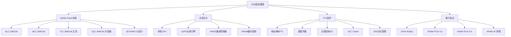
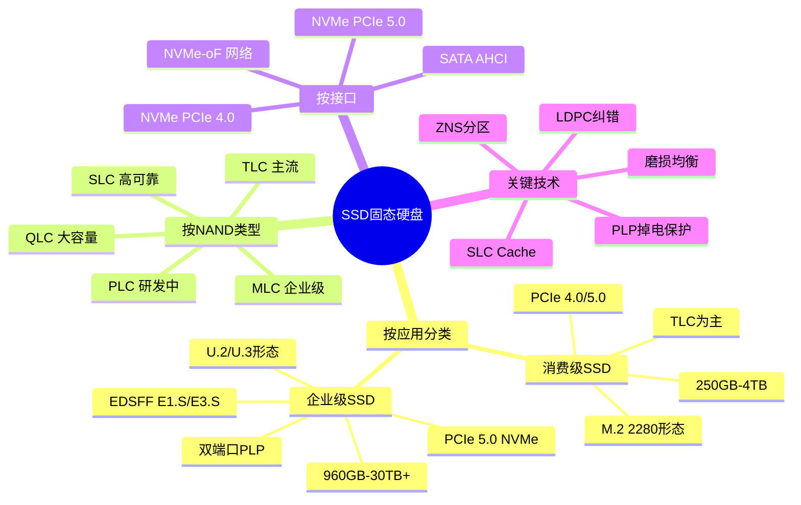
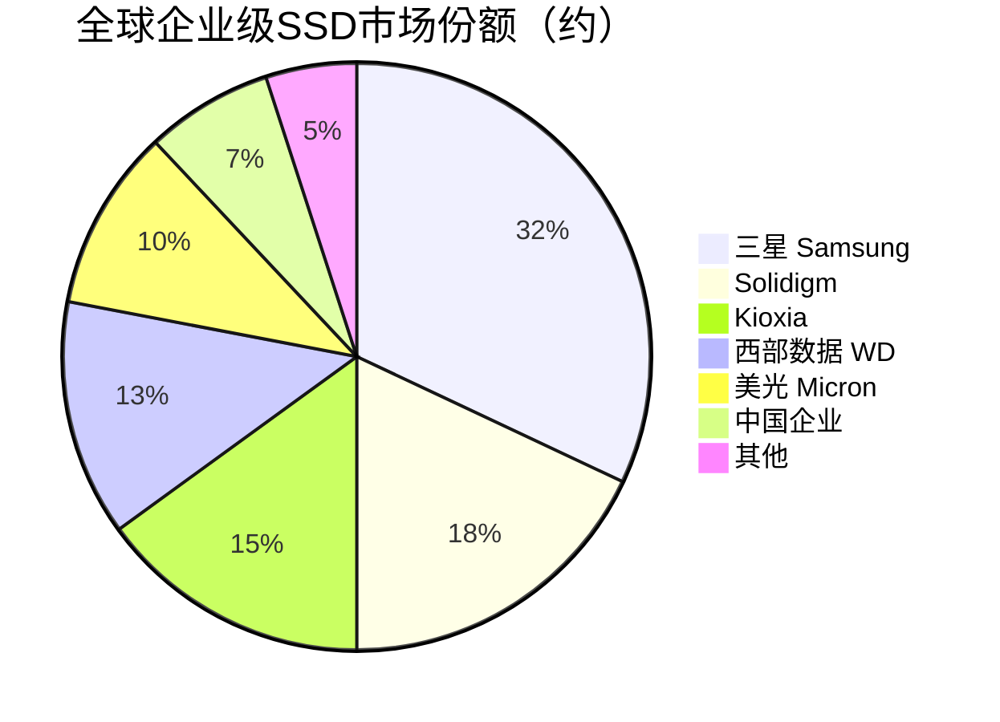

# SSD固态硬盘

> 基于NAND Flash闪存芯片的非易失性存储设备，是消费级和企业级存储的主流介质。

## 概述

SSD（Solid State Drive）固态硬盘是存储产业链下游最重要的产品之一，以NAND Flash为核心存储介质，通过存储主控芯片管理数据读写。相比HDD，SSD具有零机械延迟、高IOPS、低功耗、抗震动等显著优势，已在消费级PC、数据中心、企业级存储和嵌入式领域大规模替代HDD。

SSD按接口分为SATA SSD（6Gbps，消费级入门）和NVMe SSD（PCIe 4.0/5.0，16-64Gbps，高性能主流）。企业级NVMe SSD支持双端口、端到端数据保护、PLP（掉电保护）和NVMe-oF（NVMe over Fabrics），在AI训练、数据库、虚拟化等场景中广泛应用。消费级SSD以M.2形态为主，PCIe 4.0/5.0 NVMe SSD已成为PC和笔记本标配。

NAND Flash技术从SLC→MLC→TLC→QLC演进，存储密度不断提升但可靠性递减。3D NAND层数从64层向232层乃至300+层发展，单颗芯片容量已达1Tb以上。SSD主控芯片的LDPC纠错、SLC Cache、ZNS（Zoned Namespace）等技术持续演进，弥补QLC NAND的可靠性短板。

AI基建浪潮推动了企业级SSD的爆发增长——AI训练数据集、检查点、模型快照和推理日志的高性能存储需求，推动PCIe 5.0 NVMe SSD和超大容量企业级SSD快速放量。三星、Solidigm、Kioxia、西部数据、长江存储等NAND原厂是企业级SSD市场的主力供应商。

## 技术原理

SSD的核心组成包括**NAND Flash芯片**（存储数据）、**主控芯片**（管理数据读写和FTL）、**DRAM缓存**（存储FTL映射表，部分产品为DRAM-less）和**固件**（运行在主控上的软件）。NAND Flash以页（Page，4-16KB）为读写单位、以块（Block，数百页）为擦除单位，具有"先擦后写"和"有限擦写次数"的特性。

**FTL（Flash Translation Layer）**是SSD固件的核心，维护逻辑地址（LBA）到物理地址（PBA）的映射表，实现磨损均衡、垃圾回收和地址映射。当主机写入数据时，FTL将数据写入新页并标记旧页为无效；当空闲空间不足时，GC（垃圾回收）将有效数据搬移到新块并擦除旧块。

**SLC Cache**利用部分TLC/QLC区块以SLC模式写入（每Cell存1bit），提供高速写入缓冲区，在缓存写满后回写到TLC/QLC区域。**磨损均衡**算法确保所有块的擦写次数均匀分布，延长SSD寿命。**LDPC纠错**通过低密度奇偶校验码纠正NAND读取错误，TLC/QLC需要更强的软判决纠错能力。

**ZNS（Zoned Namespace）**将SSD空间划分为多个Zone，要求主机顺序写入每个Zone，减轻GC压力并提高QoS，适合数据库和AI训练场景。**NVMe-oF**通过RDMA/TCP/Fibre Channel网络扩展NVMe协议，实现存储网络化。

## 分类与技术路线

SSD按应用分为**消费级SSD**和**企业级SSD**。消费级SSD以M.2 2280形态为主，PCIe 4.0/5.0 NVMe接口，容量250GB-4TB，主打性价比和读写速度；企业级SSD以U.2/U.3、EDSFF（E1.S/E3.S）形态为主，PCIe 4.0/5.0 NVMe接口，容量960GB-30TB+，强调IOPS、延迟一致性（QoS）、DWPD（每日全盘写入次数）和端到端数据保护。

按NAND类型分为**SLC SSD**（高可靠、低容量、已退出消费主流）、**MLC SSD**（企业级/工业级）、**TLC SSD**（消费和企业主流）、**QLC SSD**（大容量、低成本，企业级QLC SSD用于读密集型工作负载）。PLC（5bit/Cell）正在研发中。

按接口分为**SATA SSD**（6Gbps，AHCI协议，逐步淘汰）、**NVMe SSD**（PCIe 4.0 16GT/s、PCIe 5.0 32GT/s，NVMe协议，主流）和**NVMe-oF SSD**（网络化NVMe，支持RDMA/FC/TCP）。企业级SSD还支持双端口冗余、PLP掉电保护和NVMe MI管理接口。

## 市场格局

全球SSD市场规模约400-500亿美元，其中企业级SSD约150-200亿美元，消费级SSD约200-250亿美元。企业级SSD市场由NAND原厂主导——三星约占30-35%份额，Solidigm（原Intel NAND业务，现属SK海力士）约15-20%，Kioxia约15%，西部数据约10-15%，美光约10%。中国企业级SSD方面，忆联（UnionMemory）、忆企（Memblaze）、大普微、得瑞领新等正在快速成长。

消费级SSD市场竞争激烈，三星、西部数据/SanDisk、Kioxia、英睿达（美光）、Solidigm等原厂品牌与金士顿、威刚、江波龙等模组品牌共存。国产消费级SSD在长江存储NAND支撑下快速发展，致钛（Zhitai，长江存储自有品牌）、朗科、江波龙等推出基于国产NAND的消费级SSD。

AI服务器的增长直接推动企业级SSD需求——AI训练集群需要高速NVMe SSD存储训练数据和检查点，单台AI服务器可配备4-8块企业级NVMe SSD。

## 代表企业

| 企业 | 国家/地区 | 主要产品/技术 | 市场地位 |
|------|----------|-------------|---------|
| 三星电子 | 韩国 | PM9/PM17系列企业级SSD、990 Pro消费级 | 全球SSD龙头 |
| Solidigm | 美国/韩国 | D7/D5系列企业级SSD、P44 Pro消费级 | 前Intel NAND业务，企业级SSD主力 |
| Kioxia | 日本 | CM系列企业级NVMe SSD | 3D NAND先驱，SSD主要供应商 |
| 西部数据 | 美国 | Ultrastar DC系列企业级SSD | 全球存储巨头 |
| 美光科技 | 美国 | 7450/9400系列企业级SSD | IDM原厂SSD供应商 |
| 长江存储/致钛 | 中国 | PC005/PC411消费级SSD | 中国NAND原厂及SSD品牌 |
| 忆联 | 中国 | UH7/UP系列企业级SSD | 中国企业级SSD领先厂商 |
| 江波龙 | 中国 | 消费级SSD、嵌入式存储 | 中国存储模组领先企业 |

## 发展趋势

1. **PCIe 5.0企业级SSD量产**：PCIe 5.0 NVMe SSD提供14GB/s+读取带宽和250万+ IOPS，2024-2025年大规模量产，满足AI训练对存储带宽的需求。

2. **QLC大容量化**：企业级QLC SSD单盘容量向30TB+发展，读取密集型AI推理和数据湖场景推动QLC SSD渗透。

3. **EDSFF形态普及**：E1.S和E3.S形态提供更好的散热、密度和可维护性，在数据中心逐步替代U.2。

4. **ZNS与计算存储**：ZNS分区命名空间减轻GC抖动提升QoS，计算存储（Computational Storage）在SSD内集成数据压缩、过滤等计算功能。

5. **国产替代加速**：基于长江存储NAND的国产SSD在消费级和企业级市场快速替代进口产品，致钛、忆联等品牌份额提升。

## AI基建拉动分析

AI基建是企业级SSD市场最强劲的增长驱动力。AI训练过程中，训练数据集的高速加载和模型检查点的快速写入对存储带宽和IOPS提出极高要求，PCIe 5.0 NVMe SSD成为AI服务器标配。单台AI训练服务器通常配备4-8块企业级NVMe SSD（每块3.84-15.36TB），SSD存储总价值占服务器成本的5-10%。AI推理服务器同样需要高速SSD缓存模型和数据，推动NVMe SSD放量。从产品结构看，AI服务器倾向使用高端PCIe 5.0 SSD和大容量QLC SSD，ASP显著高于普通企业级SSD。预计AI基建浪潮将在2025-2027年为企业级SSD市场带来15-20%的年化额外增长，PCIe 5.0和大容量QLC SSD是最受益的细分品类。

---
[← 返回总目录](../README.md)
