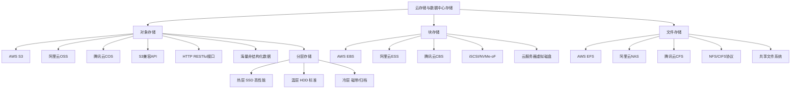
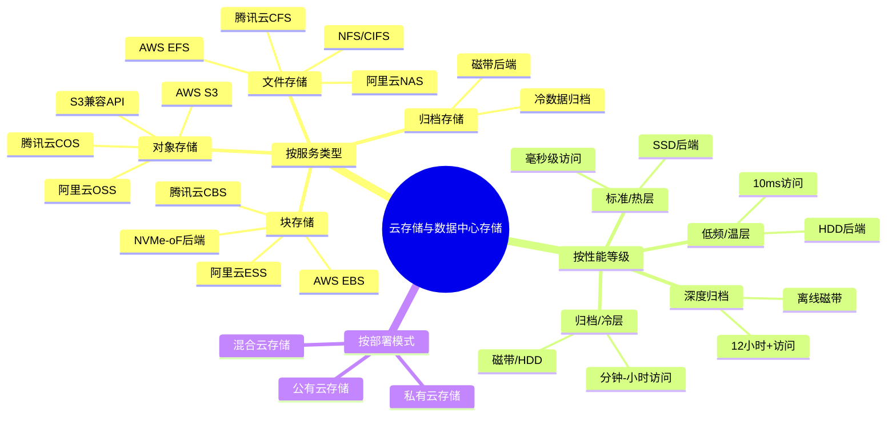
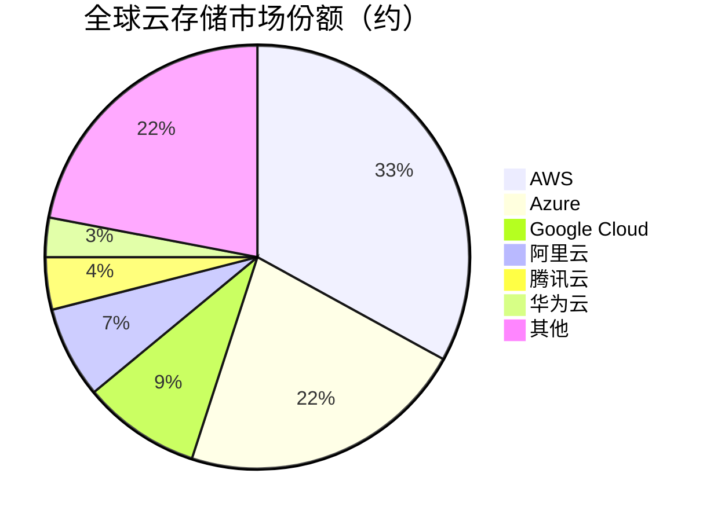

# 云存储与数据中心存储

> 云服务商和数据中心提供的大规模、多租户存储服务，涵盖对象存储、块存储和文件存储三大类型。

## 概述

云存储与数据中心存储是存储产业链下游面向云计算和大规模数据中心的核心存储服务形态。云存储通过虚拟化和分布式技术将底层存储资源池化，以服务形式（Storage-as-a-Service）向多租户提供弹性可扩展的存储能力，是云计算IaaS层的核心组成。

云存储按服务接口分为三大类型：**对象存储**（Object Storage，如AWS S3、阿里云OSS、腾讯云COS）——以HTTP RESTful API提供海量非结构化数据存储，是云原生存储的主流；**块存储**（Block Storage，如AWS EBS、阿里云ESS、腾讯云CBS）——为云服务器提供虚拟磁盘，支持随机读写和高性能数据库；**文件存储**（File Storage，如AWS EFS、阿里云NAS、腾讯云CFS）——提供NFS/CIFS兼容的共享文件系统，适合内容协作和HPC。

云存储的底层架构依赖大规模分布式存储系统——AWS使用自研的Dynamo和S3后端，阿里云基于自研的盘古分布式文件系统，腾讯云基于自研的TStack存储引擎。这些系统在普通服务器集群上运行，通过多副本和纠删码保证数据可靠性，通过横向扩展支持EB级存储容量。

AI训练和大数据分析推动云存储需求爆发——AI训练数据集存储、模型仓库、推理日志和特征存储均大量使用云存储服务。AWS S3、阿里云OSS、腾讯云COS等对象存储服务是AI数据湖的核心存储基础设施。

## 技术原理

**对象存储**将数据以对象（Object）形式存储，每个对象包含数据本身、元数据（Metadata）和全局唯一标识符（Key）。对象存储通过扁平化的命名空间（Bucket + Key）管理海量对象，无需层次化目录结构，天然支持超大规模扩展。数据冗余通过多副本（通常3副本跨可用区）或纠删码实现，一致性模型通常为"写后读一致性"（Read-after-Write Consistency）。对象存储支持版本控制（Versioning）、生命周期管理（Lifecycle）、跨区域复制（Cross-Region Replication）和分层存储（Storage Tiering）。

**块存储**为云服务器提供虚拟块设备，通过iSCSI或NVMe-oF协议连接。块存储后端通常采用分布式块存储系统（如Ceph RBD、AWS EBS后端），支持快照、克隆、扩容和跨可用区复制。高性能块存储使用NVMe SSD后端，提供万级IOPS和亚毫秒延迟；大容量块存储使用HDD后端，提供低成本存储。

**文件存储**提供NFS/CIFS兼容的共享文件系统，允许多台云服务器同时挂载访问。文件存储后端采用分布式文件系统（如CephFS、AWS EFS后端），支持弹性容量（按使用量计费）和POSIX兼容接口。

**分层存储**是云存储的重要特性——热数据存储在高性能SSD层（Standard/Hot tier），温数据存储在HDD层（Infrequent Access/Warm tier），冷数据归档到磁带或低成本HDD层（Archive/Cold tier）。AI训练数据通常存储在热/温层，训练完成后归档到冷层。

## 分类与技术路线

云存储按服务类型分为**对象存储**（S3兼容，海量非结构化数据）、**块存储**（云服务器虚拟磁盘，随机读写）、**文件存储**（NFS/CIFS共享文件系统）和**归档存储**（冷数据长期保存）。

按性能等级分为**标准/热层**（SSD后端，毫秒级访问，适合AI训练热数据）、**低频访问/温层**（HDD后端，10ms级访问，适合备份数据）、**归档/冷层**（磁带/低成本HDD后端，分钟-小时级访问，适合长期归档）和**深度归档**（磁带离线存储，12小时+访问延迟，成本最低）。

按部署模式分为**公有云存储**（AWS/阿里云/腾讯云等提供的多租户服务）和**私有云存储**（企业自建云存储，如基于Ceph/MinIO的私有对象存储）。混合云存储通过网关和数据同步技术连接公有云和私有云存储。

按数据访问模式分为**标准访问**（直接RESTful API）、**CDN加速**（通过CDN节点缓存热数据）和**数据传输服务**（如AWS Snowball、阿里云闪电立方，用于PB级数据离线传输到云端）。

## 市场格局

全球云存储市场规模约500-700亿美元，其中对象存储约150-200亿美元，块存储约200-250亿美元，文件存储约80-100亿美元，归档存储约50-70亿美元。云存储市场高度集中于头部云服务商——AWS约占30-35%份额，Azure约20-25%，Google Cloud约8-10%，阿里云约6-8%，腾讯云约3-4%。

**AWS S3**是全球最早也是最成熟的对象存储服务，2006年推出，定义了S3 API事实标准。AWS还提供EBS块存储、EFS文件存储和Glacier归档存储。**阿里云OSS**是中国最大的公有云对象存储服务，在国内市场份额领先，支持与AWS S3兼容的API。阿里云还提供ESS块存储、NAS文件存储和归档存储。**腾讯云COS**是中国第二大公有云对象存储，在游戏、视频和社交场景有优势。腾讯云还提供CBS块存储、CFS文件存储和归档存储。**华为云OBS**在中国政企市场有较强影响力。

## 代表企业

| 企业 | 国家/地区 | 主要产品/技术 | 市场地位 |
|------|----------|-------------|---------|
| AWS | 美国 | S3/EBS/EFS/Glacier云存储 | 全球云存储龙头 |
| 微软 Azure | 美国 | Blob/Disks/Files/Archive | 全球第二大云存储 |
| Google Cloud | 美国 | Cloud Storage/Persistent Disk | 全球第三大公有云 |
| 阿里云 | 中国 | OSS/ESS/NAS/归档存储 | 中国云存储龙头 |
| 腾讯云 | 中国 | COS/CBS/CFS/归档存储 | 中国第二大云存储 |
| 华为云 | 中国 | OBS/EVS/SFS | 中国政企云存储主力 |
| MinIO | 美国 | 开源S3兼容对象存储 | 私有云对象存储领先 |
| Backblaze | 美国 | B2云存储 | 低成本云存储服务商 |

## 发展趋势

1. **AI数据湖存储**：AI训练数据集和特征存储推动对象存储增长，S3 Select和OSS Select等数据查询功能优化AI数据访问效率。

2. **NVMe-oF云块存储**：云块存储后端从SATA/SAS SSD向NVMe SSD升级，通过NVMe-oF提供百万级IOPS，满足数据库和AI训练需求。

3. **智能分层与生命周期管理**：基于AI的自动分层将热/温/冷数据自动迁移到最优存储层，降低存储成本，AWS S3 Intelligent Tiering等服务普及。

4. **多云与混合云存储**：多云存储网关和数据同步工具使企业可跨云管理存储，避免厂商锁定，Restic/Velero等开源备份工具支持多云。

5. **边缘存储与CDN集成**：边缘计算节点集成存储能力，将热数据缓存到边缘，降低访问延迟，支持IoT和实时AI推理场景。

## AI基建拉动分析

AI基建是云存储市场最核心的增长驱动力。AI训练数据集（图像、文本、音频、视频等）通常存储在对象存储中，一个大型AI训练项目的训练数据可达PB级，直接拉动对象存储容量需求。AI模型仓库（如Hugging Face模型存储）也大量使用对象存储。训练过程中的检查点通常写入块存储（NVMe SSD）以保证快速恢复，推理日志和用户交互数据写入对象存储供后续分析。

云服务商的AI服务（AWS SageMaker、阿里云PAI、腾讯云TI等）深度集成云存储——训练数据从S3/OSS读取，模型保存到S3/OSS，推理结果写回存储。AI即服务（AIaaS）模式使企业无需自建AI基础设施即可使用AI能力，进一步放大云存储需求。预计AI基建浪潮将在2025-2028年为云存储市场带来15-20%的年化额外增长，对象存储和高性能块存储是最受益的品类，AWS、阿里云、腾讯云等头部云服务商是最大受益者。

---
[← 返回总目录](../README.md)
