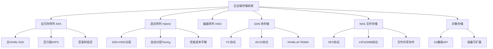
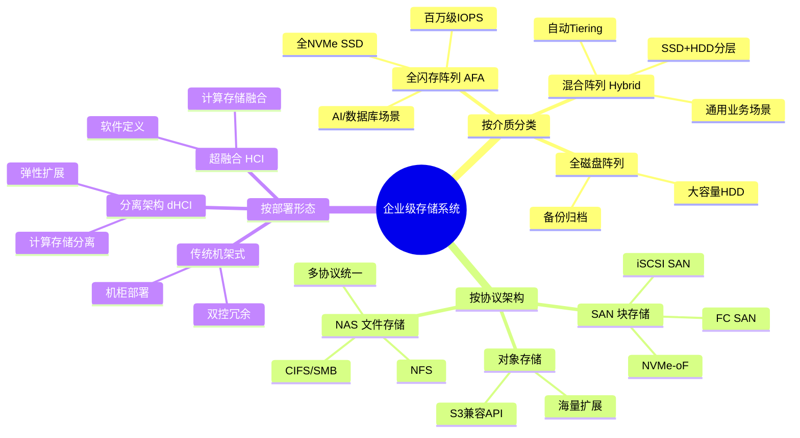
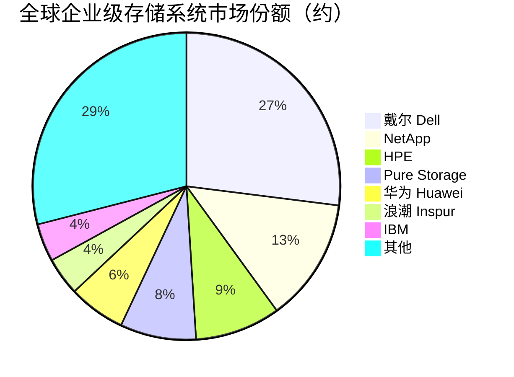

# 企业级存储系统

> 面向企业数据中心的高性能、高可靠存储系统，包括全闪存阵列、混合阵列和SAN/NAS存储架构。

## 概述

企业级存储系统是存储产业链下游面向企业数据中心的核心产品形态，将多块SSD/HDD通过存储控制器、背板和网络接口组合成统一的存储资源池，为企业关键业务应用提供高性能、高可用、可扩展的存储服务。企业级存储系统是金融、电信、政府、医疗和大型企业IT基础设施的核心组成。

全闪存阵列（AFA, All-Flash Array）以SSD为唯一存储介质，提供极高IOPS和超低延迟，适合数据库、虚拟化和AI训练等高性能场景。混合阵列（Hybrid Array）结合SSD和HDD，通过自动分层技术（Auto-Tiering）在性能和成本间平衡。传统存储阵列则主要使用HDD，面向大容量和归档场景。

按存储协议架构分为SAN（Storage Area Network，块存储）、NAS（Network Attached Storage，文件存储）和对象存储系统。SAN通过FC（Fibre Channel）或iSCSI协议提供块设备，适合数据库等低延迟场景；NAS通过NFS/CIFS协议提供文件共享，适合办公和内容协作；对象存储通过S3兼容API提供海量可扩展存储，适合云原生应用和归档。

戴尔科技（Dell Technologies）、NetApp、HPE、Pure Storage、华为、浪潮等是企业级存储系统市场的主要玩家。AI和数据密集型应用推动全闪存阵列和企业级NVMe-oF存储快速增长。

## 技术原理

企业级存储系统的核心架构包括**存储控制器**（Storage Controller）、**存储介质**（SSD/HDD）、**高速背板/交换结构**（Fabric）、**缓存**（Cache）和**管理软件**。存储控制器运行存储OS，管理数据布局、冗余、快照、复制和分层等高级功能，是整个系统的大脑。

**RAID（冗余磁盘阵列）**是企业级存储的基础数据保护技术，通过数据条带化（Striping）和奇偶校验（Parity）实现性能和容错的平衡。传统RAID 5/6已演进为Erasure Coding（纠删码），在大规模分布式存储中提供更灵活的容错能力。企业级存储系统通常采用双控制器Active-Active冗余架构，确保单点故障不影响业务连续性。

**自动分层存储**（Auto-Tiering）在混合阵列中自动将热数据迁移到SSD层、冷数据下沉到HDD层，优化性能和成本。**快照**（Snapshot）和**克隆**（Clone）提供高效的数据保护和测试/开发数据拷贝能力。**远程复制**（Replication）支持同步/异步数据复制到远端站点，实现灾难恢复。

**NVMe-oF（NVMe over Fabrics）**通过RDMA（RoCE/InfiniBand）、FC或TCP网络扩展NVMe协议，使多台服务器可共享NVMe存储资源，提供与DAS（直连存储）接近的性能。NVMe-oF是下一代企业级存储的核心网络协议。

## 分类与技术路线

企业级存储按存储介质分为**全闪存阵列（AFA）**——全SSD配置，极致性能，是增长最快的品类；**混合阵列（Hybrid）**——SSD+HDD分层，平衡性能和成本；**全磁盘阵列（HDD-based）**——以HDD为主，面向大容量和备份归档，市场份额逐步萎缩。

按存储协议架构分为**SAN（块存储）**——FC SAN、iSCSI SAN、NVMe-oF SAN，提供块设备访问；**NAS（文件存储）**——支持NFS、CIFS/SMB、S3等多协议，面向文件共享和内容管理；**统一存储（Unified Storage）**——同时支持块、文件和对象协议，提供一体化存储服务。

按部署形态分为**传统机架式存储**（如Dell PowerMax、华为OceanStor）、**超融合基础架构（HCI）**（如Nutanix、vSAN）和**HCI分离架构（dHCI）**（计算和存储分离部署）。NVMe-oF存储系统通过高速网络连接多台服务器和存储节点，实现存储资源的弹性共享和池化。

## 市场格局

全球企业级存储系统市场规模约250-300亿美元，其中全闪存阵列约100-120亿美元且增长最快（年增长15-20%），混合阵列约80-100亿美元（缓慢萎缩），传统磁盘阵列约50-70亿美元（持续萎缩）。

市场份额方面，戴尔科技是全球企业级存储龙头，约占25-28%份额（Dell PowerMax/PowerStore/Unity系列）；NetApp约12-15%（ONTAP系列，NAS领域强势）；HPE约8-10%（Alletra/Nimble系列）；Pure Storage约7-8%（全闪存先驱）；华为约5-7%（OceanStor系列，中国市场强势）；浪潮约3-5%（中国第二大存储厂商）。

在中国市场，华为是中国企业级存储的绝对龙头，市场份额约30-35%；浪潮/浪潮信息约10-12%；新华三（H3C）约8-10%；戴尔/EMC在中国约8-10%；NetApp约5%。国产化替代趋势推动中国本土存储厂商份额持续提升。

## 代表企业

| 企业 | 国家/地区 | 主要产品/技术 | 市场地位 |
|------|----------|-------------|---------|
| 戴尔科技 | 美国 | PowerMax/PowerStore/Unity | 全球企业级存储龙头 |
| NetApp | 美国 | ONTAP系列、Cloud Volumes | NAS存储和云集成领先 |
| Pure Storage | 美国 | FlashArray/X、FlashBlade | 全闪存阵列先驱 |
| HPE | 美国 | Alletra/Nimble/MSA | 全球企业存储主要厂商 |
| 华为 | 中国 | OceanStor系列全闪存/混合 | 中国企业级存储龙头 |
| 浪潮信息 | 中国 | AS系列存储、HF系列HCI | 中国第二大存储厂商 |
| 新华三 H3C | 中国 | UniStor系列存储 | 中国存储市场重要玩家 |
| IBM | 美国 | FlashSystem、Storwize | 企业级存储老牌厂商 |

## 发展趋势

1. **NVMe-oF全面普及**：NVMe-oF存储通过RDMA网络提供百万级IOPS和亚毫秒延迟，正成为企业级存储的新标准，FC-NVMe和NVMe/TCP快速发展。

2. **全闪存加速替代**：全闪存阵列凭借性能和可靠性优势加速替代混合阵列和磁盘阵列，QLC SSD降低全闪存成本门槛。

3. **AI驱动存储智能化**：AI技术用于存储系统智能运维（AIOps）、故障预测、自动分层优化和容量规划，提升存储管理效率。

4. **容器与云原生存储**：CSI（Container Storage Interface）和容器原生存储（如Portworx、Longhorn）支持Kubernetes有状态应用，推动存储云原生化。

5. **国产化替代深化**：中国政府、金融等关键行业推进存储系统国产化替代，华为、浪潮、新华三等本土厂商份额持续提升。

## AI基建拉动分析

AI训练和推理对企业级存储系统提出了前所未有的性能和容量要求。AI训练集群需要超高速存储来加载训练数据和保存检查点——NVMe-oF全闪存阵列可提供百万级IOPS和数十GB/s带宽，满足GPU集群的数据供给需求。AI推理服务需要低延迟存储来缓存模型和推理数据，全闪存阵列的亚毫秒延迟确保推理QoS。企业级存储的AI运维（AIOps）也提升存储管理效率，降低TCO。虽然超大规模AI训练集群更多使用DAS直连NVMe SSD，但企业级AI应用（金融AI、医疗AI等）仍大量使用企业级存储系统。预计AI基建将在2025-2028年为企业级存储市场带来8-12%的年化额外增长，全闪存NVMe-oF阵列是最受益的品类。

---
[← 返回总目录](../README.md)
