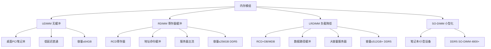
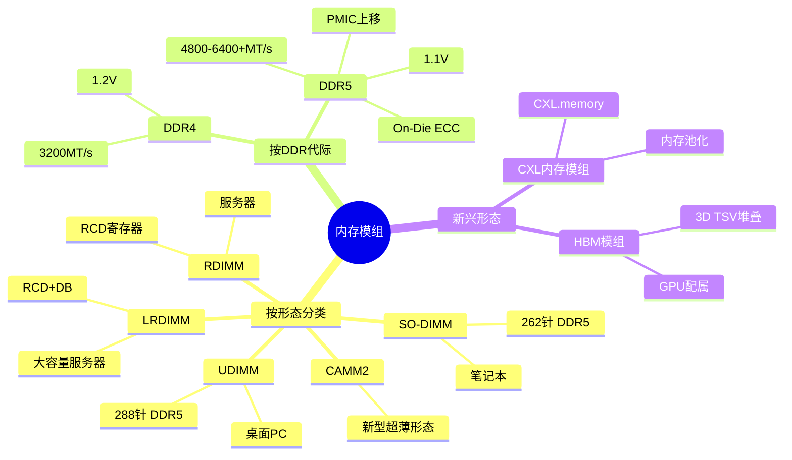
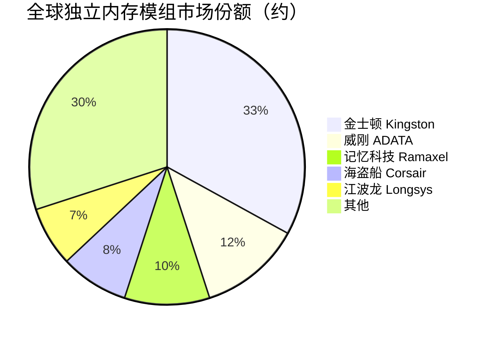

# 内存模组

> 将DRAM芯片组装在PCB板上形成的内存条产品，是服务器、PC和嵌入式系统的主存储器载体。

## 概述

内存模组（Memory Module）是存储产业链下游最核心的产品形态之一，将DRAM裸芯片通过封装和组装形成标准化的内存条，直接供给服务器、PC、笔记本和嵌入式系统使用。内存模组是连接存储芯片制造和终端应用的关键桥梁，其设计和制造质量直接影响系统性能、稳定性和兼容性。

在服务器领域，RDIMM（Registered DIMM）和LRDIMM（Load-Reduced DIMM）是主流形态，通过RCD寄存器和DB数据缓冲器减轻内存控制器负载，支持大容量和高可靠性。DDR5时代，服务器内存模组单条容量可达256GB甚至512GB，速率从4800MT/s起步向6400MT/s及以上演进。在PC和笔记本领域，UDIMM（Unbuffered DIMM）和SO-DIMM是主流形态，DDR5 UDIMM速率从4800MT/s起。

内存模组市场由模组厂商（如金士顿、威刚、记忆科技）和IDM原厂（如三星、SK海力士、美光）共同构成。IDM原厂以原厂模组形式供应OEM客户，模组厂商则从原厂采购DRAM裸芯片进行组装销售。AI服务器的爆发增长推动服务器内存模组需求激增，单台AI服务器内存配置可达1-2TB以上，是普通服务器的4-8倍。

## 技术原理

内存模组的核心组成包括DRAM芯片、PCB板、SPD（Serial Presence Detect）芯片、接口芯片（RCD/DB/SPD Hub）和去耦电容等被动元件。DRAM芯片通过BGA封装焊接或TSV堆叠在PCB上，PCB采用多层设计（通常8-14层）确保高速信号的完整性。

**UDIMM（Unbuffered DIMM）**：最简单的内存模组形态，DRAM芯片直接连接到CPU内存控制器的地址/数据总线上，无任何缓冲芯片。延迟最低但驱动能力有限，适合桌面PC和笔记本，单通道容量通常不超过64GB。

**RDIMM（Registered DIMM）**：在地址/命令/时钟路径上加入RCD（Register Clock Driver）寄存器芯片，缓冲重驱动信号，减轻内存控制器负载，支持更多Rank和更大容量。数据路径仍为直通，保持较低延迟。RDIMM是服务器主流选择，DDR5 RDIMM单条容量可达256GB。

**LRDIMM（Load-Reduced DIMM）**：在RDIMM基础上，在数据路径上再加入DB（Data Buffer）芯片，进一步减轻数据总线负载，支持最大容量。DDR5 LRDIMM使用MDB（Multiplexed Data Buffer）替代传统DB，配合RCD和SPD Hub，单条容量可达512GB+。LRDIMM延迟略高于RDIMM，但容量优势明显。

**ECC（Error Correcting Code）**：服务器内存模组支持ECC功能，通过额外的ECC芯片（每8颗数据芯片配1颗ECC芯片）实现单比特纠错和双比特检测，保障数据可靠性。

## 分类与技术路线

内存模组按形态分为**UDIMM**（桌面PC，288针DDR5）、**SO-DIMM**（笔记本/小型设备，262针DDR5）、**RDIMM**（服务器，288针）、**LRDIMM**（大容量服务器）、**ECC UDIMM**（工作站）和**Mini-DIMM/CAMM2**（新型紧凑形态）。

按DDR代际分为DDR4和DDR5模组。DDR5相比DDR4在速率（4800MT/s+ vs 3200MT/s）、容量（单芯片密度翻倍）、电源管理（PMIC上移到模组）、通道架构（单DIMM双通道）等方面全面升级。DDR5还引入了On-Die ECC、DCA（DRAM Command Address）等新特性。

按容量分为8GB/16GB/32GB/64GB（消费级）和32GB/64GB/128GB/256GB/512GB（服务器级）。AI服务器倾向使用大容量高频率模组，如256GB DDR5-5600 RDIMM/LRDIMM。

新兴形态包括**CXL内存扩展模组**（CXL.memory协议，用于内存池化和扩展）和**HBM模组**（GPU/AI加速器专用，通过Interposer与GPU连接）。CAMM2是Intel提出的超薄内存形态，有望在笔记本中逐步替代SO-DIMM。

## 市场格局

全球内存模组市场规模约400-500亿美元，其中服务器内存模组约占50-60%，PC/消费级模组约占30-40%，其余为嵌入式和其他。IDM原厂（三星、SK海力士、美光）以原厂模组形式直接供应OEM/ODM客户，约占模组市场的50-55%；独立模组厂商从原厂采购DRAM芯片进行组装销售，约占45-50%。

独立模组市场中，金士顿是全球模组龙头，市场份额约30-35%；威刚、记忆科技、海盗船、芝奇等也是重要玩家。中国市场方面，记忆科技（Ramaxel）是国内服务器内存模组龙头，江波龙、朗科、金泰克等在消费级模组市场有较强影响力。

AI服务器的大规模部署推动服务器内存模组需求爆发——单台AI训练服务器的内存容量是普通服务器的4-8倍，且对高频率和大容量有更高要求，DDR5 RDIMM/LRDIMM渗透率快速提升。

## 代表企业

| 企业 | 国家/地区 | 主要产品/技术 | 市场地位 |
|------|----------|-------------|---------|
| 金士顿 | 美国/中国台湾 | DDR5全系列模组、服务器内存 | 全球独立模组龙头 |
| 三星电子 | 韩国 | 原厂DDR5 RDIMM/LRDIMM、HBM | IDM原厂模组龙头 |
| SK海力士 | 韩国 | 原厂DDR5模组、HBM3E | IDM原厂，HBM模组领先 |
| 美光科技 | 美国 | 原厂DDR5模组、HBM3E | IDM原厂模组主力 |
| 威刚科技 | 中国台湾 | DDR5 UDIMM/SO-DIMM/RDIMM | 全球第二大独立模组厂商 |
| 记忆科技 | 中国 | 服务器RDIMM/LRDIMM | 中国服务器内存模组龙头 |
| 江波龙 | 中国 | 消费级内存模组、嵌入式存储 | 中国存储模组领先企业 |
| 海盗船 | 美国 | 高性能游戏内存模组 | 高端消费级内存知名品牌 |

## 发展趋势

1. **DDR5加速渗透**：DDR5在服务器和PC端渗透率快速提升，2025年有望超过DDR4成为主流，速率向6400MT/s及更高推进。

2. **AI驱动大容量高频率**：AI服务器推动256GB/512GB大容量RDIMM/LRDIMM需求，高频率DDR5-5600/6400模组成为AI服务器标配。

3. **CXL内存池化**：CXL 2.0/3.0内存扩展协议推动内存池化和解耦架构，CXL内存模组成为新增长点，澜起科技等已推出CXL内存扩展芯片。

4. **PMIC集成化**：DDR5将电源管理芯片（PMIC）从主板移至模组上，提高供电精度和简化主板设计，但也增加了模组成本和复杂度。

5. **国产化替代**：中国服务器和PC市场推进内存模组国产化，记忆科技、江波龙等企业配合国内DRAM芯片发展加速替代。

## AI基建拉动分析

AI基建是当前服务器内存模组市场最核心的增长驱动力。AI训练服务器需要超大容量内存（1-2TB+）来加载模型参数和训练数据，DDR5 RDIMM/LRDIMM需求量是普通服务器的4-8倍。AI推理服务器同样需要大容量内存用于模型加载和KV Cache，进一步放大内存模组需求。DDR5的高频率和大容量特性与AI负载的需求高度匹配，推动DDR5在服务器端加速替代DDR4。CXL内存扩展技术为AI推理的内存池化提供了新方案，有望在2025-2027年实现规模化部署。从量价角度看，AI服务器内存模组不仅用量大，且倾向于高容量高频产品，ASP显著高于普通模组，为模组厂商带来明显的业绩弹性。

---
[← 返回总目录](../README.md)
