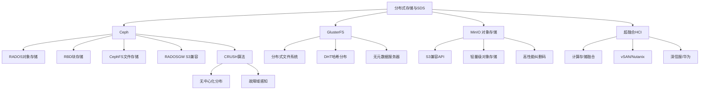
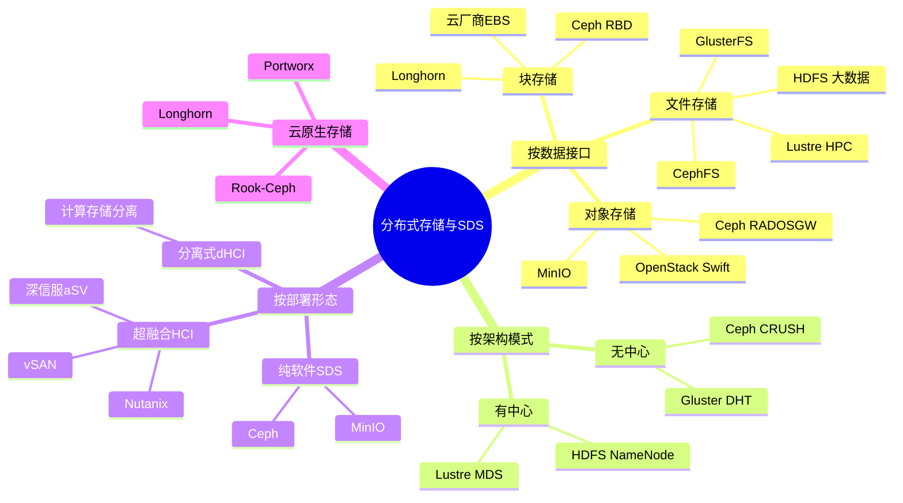
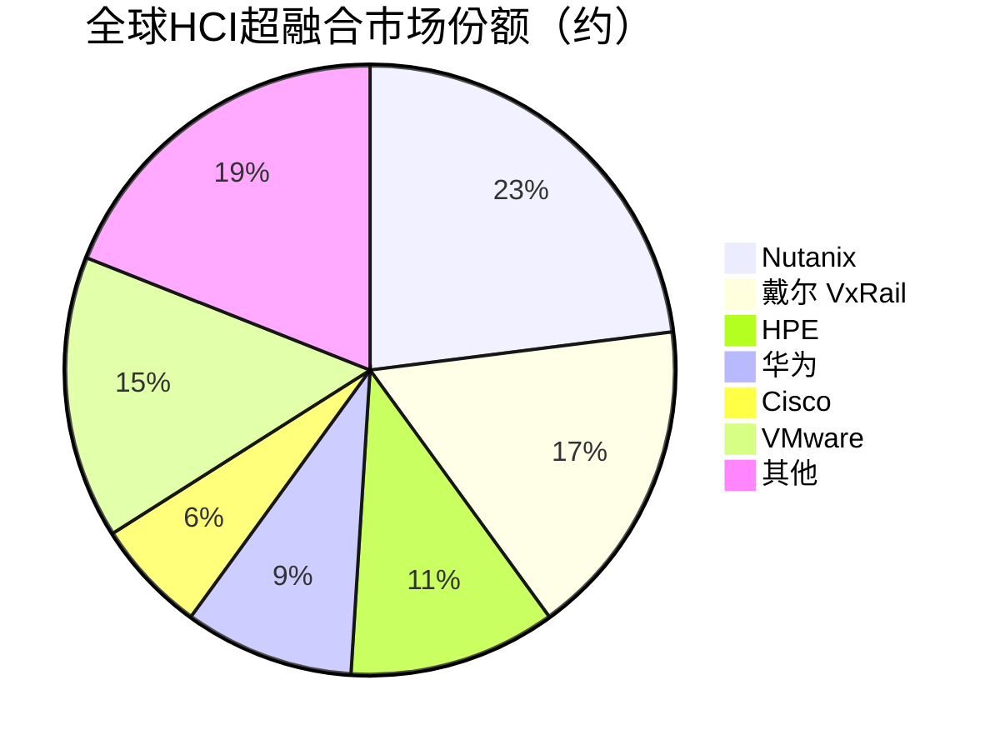

# 分布式存储与软件定义存储

> 通过软件将多台服务器的存储资源池化为统一存储服务的架构，包括Ceph、Gluster等开源系统和超融合基础架构。

## 概述

分布式存储与软件定义存储（SDS, Software-Defined Storage）是存储产业链下游的一项重要技术变革，通过将存储控制逻辑从硬件中解耦到软件层，利用普通x86/ARM服务器和通用网络构建大规模可扩展的存储系统。相比传统企业级存储阵列，分布式存储具有成本更低、扩展性更强、无厂商锁定等优势，已成为云计算和大数据时代的主流存储架构。

Ceph是当前最广泛使用的开源分布式存储系统，由Sage Weil在2006年创建，现归Linux基金会管理。Ceph统一提供对象（RADOSGW）、块（RBD）和文件（CephFS）三种存储接口，采用CRUSH算法实现无中心化的数据分布。GlusterFS是另一种流行的开源分布式文件系统，由Red Hat维护，以简化部署和管理著称。其他重要的分布式存储系统包括Lustre（HPC领域）、MinIO（S3兼容对象存储）、Longhorn（容器原生存储）等。

超融合基础架构（HCI, Hyper-Converged Infrastructure）是软件定义存储的重要应用形态，将计算、存储和网络虚拟化融合到单一软件栈中运行在标准服务器上。Nutanix、VMware vSAN、深信服aSV、华为FusionCube等是HCI市场的主要玩家。分布式存储是云服务商底层存储基础设施的核心技术——AWS EBS、阿里云ESS、腾讯云CBS等产品均基于分布式存储架构。

## 技术原理

分布式存储的核心是通过**数据分片（Sharding/Striping）**和**多副本/纠删码（Replication/Erasure Coding）**将数据分散存储在多台服务器上，实现数据的并行访问和容错。数据分布通常采用一致性哈希（Consistent Hashing）或CRUSH算法，避免数据全量迁移。

**Ceph架构**由Monitor（MON，集群元数据和成员管理）、OSD（Object Storage Daemon，存储节点守护进程）、MDS（Metadata Server，CephFS元数据）和Manager（MGR，监控和管理）组成。Ceph的核心是RADOS（Reliable Autonomic Distributed Object Store），所有数据以对象形式存储在OSD上。CRUSH算法根据集群拓扑（OSD映射、故障域）计算对象到OSD的映射，无需查表，支持高效的扩缩容。

**数据冗余**通过多副本（通常3副本）或纠删码（如4+2、8+4）实现。多副本延迟低但存储效率低（33%），纠删码存储效率高（50-80%）但写入延迟较高。Ceph支持按Pool配置不同的冗余策略，热数据用副本、冷数据用纠删码。

**一致性协议**方面，Ceph使用Primary-Replicate模型——客户端写入Primary OSD，Primary同步到Replica OSD后返回ACK。分布式存储还需处理脑裂（Split-Brain）、网络分区、节点故障等复杂场景，通过Paxos/Raft等共识算法保证元数据一致性。

**软件定义存储（SDS）**将存储控制平面从硬件中抽象出来，通过API管理存储资源。SDS不依赖特定硬件，可在任何标准服务器上运行，实现存储的软硬件解耦和灵活部署。

## 分类与技术路线

分布式存储按数据接口分为**分布式对象存储**（S3兼容，如Ceph RADOSGW、MinIO）、**分布式块存储**（如Ceph RBD、AWS EBS、Longhorn）和**分布式文件系统**（如CephFS、GlusterFS、Lustre、HDFS）。

按架构模式分为**有中心架构**（如HDFS NameNode、Lustre MDS）和**无中心架构**（如Ceph CRUSH、Gluster DHT）。无中心架构扩展性更好但有客户端计算开销，有中心架构元数据管理简单但存在单点瓶颈。

按部署形态分为**纯软件分布式存储**（如Ceph、MinIO，可部署在任何服务器上）和**超融合基础架构HCI**（如Nutanix、vSAN，计算存储一体化）。HCI将分布式存储与虚拟化计算融合，简化部署但灵活性受限。分离式HCI（dHCI）将计算和存储节点分开部署，提供更好的弹性扩展能力。

按应用场景分为**云原生存储**（支持CSI/Kubernetes，如Rook-Ceph、Longhorn、Portworx）、**高性能计算存储**（如Lustre、BeeGFS，面向HPC）和**大数据存储**（如HDFS，面向Hadoop生态）。

## 市场格局

全球软件定义存储和超融合市场规模约150-200亿美元，其中HCI约80-100亿美元，纯软件SDS约50-70亿美元。HCI市场中，Nutanix约占20-25%份额，戴尔（VxRail）约15-18%，HPE约10-12%，华为约8-10%，Cisco约5-7%。

开源分布式存储方面，Ceph是全球最广泛部署的分布式存储系统，被Red Hat、SUSE、Ubuntu等主流Linux发行版集成，大量公有云和私有云使用Ceph作为底层存储。MinIO作为轻量级S3兼容对象存储，在云原生场景中快速普及。在中国，基于Ceph的存储产品被阿里云、腾讯云、华为云等公有云和大量私有云采用。

中国分布式存储市场中，XSKY（星辰天合）、杉岩数据、易华录等基于Ceph等开源技术开发商业化分布式存储产品；深信服、新华三、华为等提供HCI和SDS解决方案。政府、金融和电信行业是中国分布式存储的主要客户，国产化替代推动本土厂商份额提升。

## 代表企业

| 企业 | 国家/地区 | 主要产品/技术 | 市场地位 |
|------|----------|-------------|---------|
| Nutanix | 美国 | AHV HCI、Files对象存储 | 全球HCI龙头 |
| Red Hat | 美国 | Ceph存储（商业化支持） | Ceph商业化主导者 |
| VMware/Broadcom | 美国 | vSAN HCI、vSphere | 虚拟化和HCI领先 |
| MinIO | 美国 | MinIO对象存储 | 轻量级S3存储先驱 |
| XSKY星辰天合 | 中国 | XEOS分布式存储 | 中国分布式存储领先 |
| 杉岩数据 | 中国 | 杉岩MosaBlock对象/块存储 | 中国SDS创新企业 |
| 深信服 | 中国 | aSV HCI、EDS分布式存储 | 中国HCI主要厂商 |
| 华为 | 中国 | FusionCube HCI、OceanStor | 中国HCI和存储龙头 |

## 发展趋势

1. **云原生存储成熟**：CSI接口标准化和Kubernetes Operator模式推动分布式存储的云原生化，Rook-Ceph、Longhorn等容器原生存储快速普及。

2. **高性能NVMe-oF集成**：分布式存储集成NVMe-oF协议，通过RDMA网络提供分布式全闪存存储，性能接近本地NVMe SSD。

3. **纠删码优化**：纠删码算法优化降低写入放大和延迟，使纠删码不仅用于冷数据，也适用于温数据场景，提高存储效率。

4. **多协议统一存储**：单一分布式存储系统同时提供对象、块和文件接口，Ceph等统一存储方案获得更广泛采用。

5. **AI运维与智能分层**：AI技术用于分布式存储的故障预测、自动扩容和数据分层优化，降低运维复杂度。

## AI基建拉动分析

AI基建对分布式存储的拉动主要体现在两个方面。首先，AI训练和推理产生的海量数据需要可弹性扩展的存储基础设施——分布式存储的横向扩展能力天然适合AI数据的增长特征，Ceph和MinIO等系统在AI数据湖和模型仓库场景中广泛应用。其次，AI大模型的训练数据预处理和特征存储通常部署在分布式文件系统上，如HDFS/CephFS承载大规模训练数据集。在AI推理场景中，分布式块存储为容器化AI服务提供持久化存储。然而，AI训练的热数据更多使用DAS直连NVMe SSD以获得最大性能，分布式存储主要承载温数据和冷数据。预计AI基建将在2025-2028年为分布式存储市场带来10-15%的年化额外增长，对象存储和高性能分布式文件系统是最受益的细分领域。

---
[← 返回总目录](../README.md)
